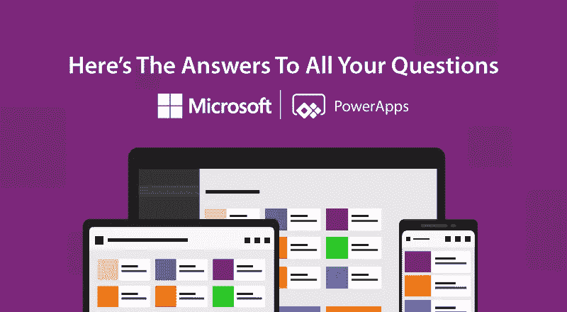

# 微软 PowerApps

> 原文：<https://medium.com/hackernoon/microsoft-powerapps-heres-the-answers-to-all-your-questions-c03ab49f6484>

Photo by [Johannes Marliem](https://www.flickr.com/photos/100626730@N07/)

2014 年 2 月 4 日，塞特亚·纳德拉被宣布为继比尔·盖茨和史蒂夫·鲍尔默之后的第三位微软首席执行官。在他的领导下，微软成为第四大科技巨头，并通过采用云技术和开源社区来弥补其失去的市场。

> “我们的 Power 平台涵盖 Power BI、PowerApps 和 Flow，使组织中的任何人都可以开始构建智能应用或工作流。这是业内唯一的同类解决方案，将无代码/低代码应用程序开发、机器人流程自动化和自助服务分析整合到一个全面的平台中。它支持跨 Microsoft 365 和 Dynamics 365 以及领先的第三方 SaaS 业务应用程序的可扩展性。”
> ——微软首席执行官塞特亚·纳德拉在一份新闻声明中

早些时候，他说这个世界是云优先，移动优先。他帮助微软达到了今天领先的云服务提供商的位置。

祝贺你，塞特亚·纳德拉。微软找回了自己的最佳状态。

> *信息技术是您如何开展业务以及您的业务模式本身如何发展的核心。*

虽然每个组织都在关注所谓的“数字战略”，但科技巨头正在为企业提供更可持续和创新的技术解决方案。在本帖中，我们将探索微软的 Power 平台。

## 什么是微软 Power 平台？

Microsoft Power Platform 将 3 个不同的实体整合到一个平台中。

*   **power apps**——更少的代码，为网络、Android & iOS 设备提供出色的应用
*   **Power BI** —实时、交互式数据可视化 BI 工具
*   **Microsoft Flow** —强大的工作流自动化，无需代码，易于集成

**对于微软这样的科技公司，核心关注点包括:**

*   产品/服务必须有用户友好的用户界面
*   为了保持竞争力，产品必须提供出色的结果
*   易于使用可能是软件/服务受欢迎的一个关键因素

微软通过这个强大的平台提供了同样的东西。多年来，微软的创新产品/服务被全球数百万人使用。

这一次，微软瞄准了“ ***任何人都可以使用它*** ”的策略，设计了一个创新的平台，让应用程序的构建变得前所未有的简单。

在这 3 个工具中，PowerApps 引起了我们的注意，我们想详细研究一下。

# 将开发成本和工作量减少 70%

**PowerApps 旨在供您的业务应用程序在内部使用。**

以下是 2018 年 6 月微软委托 Forrester Total Economic Impact 进行的 PowerApps 和 Microsoft Flow 研究的一些事实。

**注意**:该研究基于采访的客户，适用于一个拥有 2000 名员工、能够访问 PowerApps 和 Microsoft Flow 的复合组织。

*   应用程序管理和维护工作量减少 38%
*   应用程序开发成本和工作量减少 70%
*   业务流程效率平均提高 15%

## PowerApps 简介

PowerApps 充当**平台即服务**。它是在 Azure 中构建的，是 Office 365 的一部分。

PowerApps 的目的是为**业务用户**简化应用开发流程。PowerApps 允许开发人员使用具有拖放功能的 Dynamic 365 和 Office 365 构建 web 或移动应用程序。

简而言之，PowerApps 是一个应用、服务、连接器和数据平台的集合，可以帮助开发人员和非开发人员创建、管理和共享业务应用。

此外，PowerApps 平台配备了内置的企业级数据存储功能，称为**通用数据服务(CDS)** ，可更轻松地存储和管理各种内部和在线数据源，包括 Dynamic 365、SharePoint、Excel、Office 365、SQL Server 等。

## 你能用 PowerApps 做什么？

使用 PowerApps，您可以创建两种类型的应用程序:

*   **Canvas Apps** : Canvas apps 专为定制体验而打造，使用空白画布和您选择的合适数据源。可以为 web 和移动应用程序构建画布应用程序。
*   **模型驱动的应用**:这些应用是以组件为中心的，不需要代码。您可以添加组件并创建可在包括 web 和移动设备在内的各种设备和平台上运行的响应性应用程序。

简单来说，PowerApps 有助于:

*   将应用程序连接到数据源，如 Salesforce、Dropbox、Google Drive、Sharepoint 等
*   创建可以执行 CRUD 操作的接口
*   从现成模板创建基本应用
*   与组织中的团队共享自定义业务应用
*   定制您现有的业务应用

## PowerApps 是如何工作的？

基本上，PowerApps 通过提供许多模板、连接器和第三方应用程序来方便业务用户创建应用程序。

PowerApps 的重要特性是它的数据连接器，这使得它在开发人员中很受欢迎。它允许您快速执行 CRUD 操作，并支持大多数本地数据源。

## 运行 PowerApps 需要什么？

正如我们所讨论的，有两种类型的应用程序可以用 PowerApps 创建，这里是关于 PowerApps 的所有问题的答案。

创建应用程序后，您可以在 PowerApps 平台的帮助下与您的团队或组织成员共享该应用程序。

*   为了运行 Canvas App，需要从 App Store 或 Google Play 安装 PowerApps
*   对于模型驱动的应用程序，请从 App Store 或 Google Play 安装 Dynamic 365

许多组织正在利用 PowerApps 和 Microsoft Flow 来实现工作流自动化，并简单地降低开发成本和时间。由于 PowerApps 提供了一系列连接器和流程，因此可以实现工作流的自动化，从而使应用程序开发更简单、更快速。

## PowerApps 不能做什么？与竞争对手有何不同？

PowerApps 旨在用于组织内部。

它增强了可扩展性、健壮性和更快的性能，并简化了业务应用程序开发。PowerApps 与 Microsoft Flow 和 Power BI 一起被证明是小型企业的最佳解决方案，因为它可以随着您的业务增长而扩展。

PowerApps 不能与所有人共享，这意味着它不能公开使用。

此外，它还提供了“无代码”功能，因此不能添加任何额外的 JavaScript 或 HTML。这个特性总体上提高了开发速度，但同时也限制了开发人员只能使用内置的模板和连接器。

它附带了选择性的 Microsoft Office 365 计划，Dynamics 365 企业应用程序和企业计划包括 PowerApps Plan 2，可用于创建和运行自定义应用程序。

作为面向商业用户的低代码开发平台，已经为许多企业证明了它的潜力。

> “PowerApps 使我们能够利用现有的技能组合在内部构建一个销售应用程序。使我们能够立即节省数十万美元。”— **埃里克·麦金尼，云服务经理，通用汽车& J IT 百事可乐**
> 
> “PowerApps 让我们能够更快地解决复杂的问题。我们可以利用我们的志愿者网络，以一种以前根本不可能的方式重新设计业务流程。”— **尼克·吉尔，美国红十字会的培训专家**

## 谁在使用 PowerApps 来实现应用开发的现代化？

*   标准银行
*   TransAlta
*   莱昂纳多全球解决方案
*   自动玻璃
*   SNCF
*   综合电力服务
*   （英国保护名胜古迹的私人组织）国民托管组织
*   驾驶时间

(来源:【https://powerapps.microsoft.com/en-us/customer-stories/ )

## 想要为您的组织利用它吗？

如果您已经是微软企业用户，Power Platform 可以显著减少时间和工作量，并实现快速、安全、灵活和高效的应用程序开发方法。

在我们探索 Power Platform 及其对企业的优势时，请在此空间查看更多关于 PowerApps 的帖子。您可以通过下面的评论分享您的反馈，并帮助 Microsoft PowerApps 阅读这篇文章。

注:这篇文章之前发表在我们的博客上: [*这里*](https://www.spec-india.com/blog/microsoft-powerapps-heres-the-answers-to-all-your-questions/)