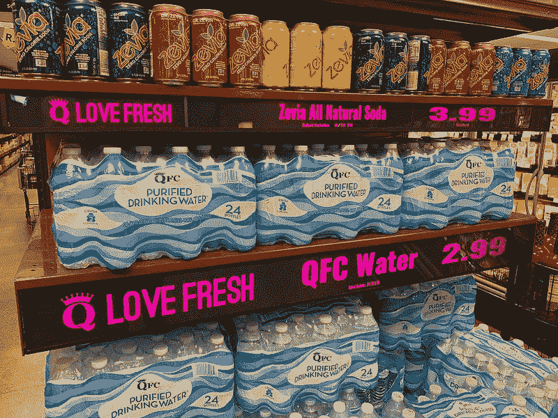
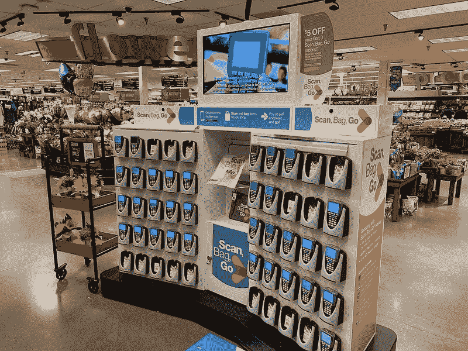
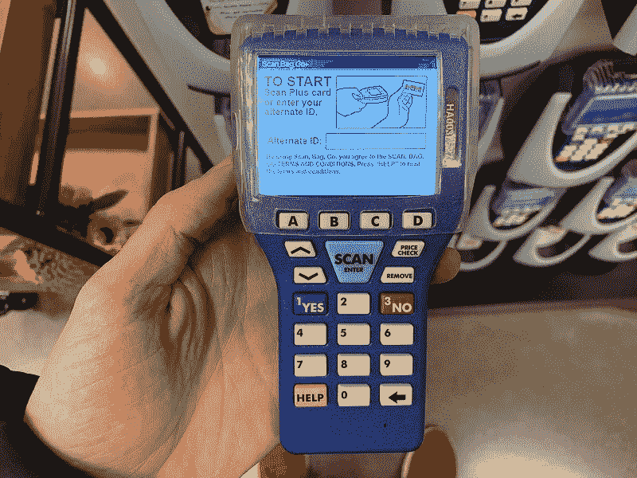
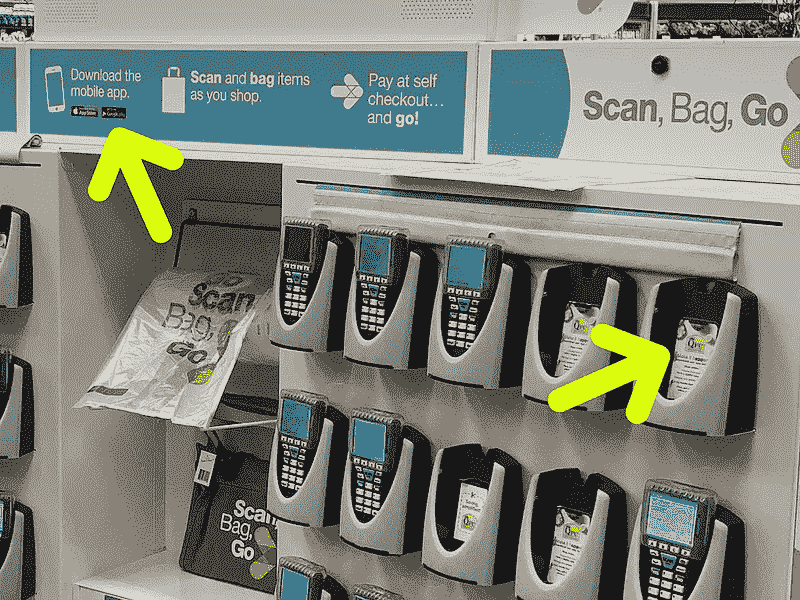
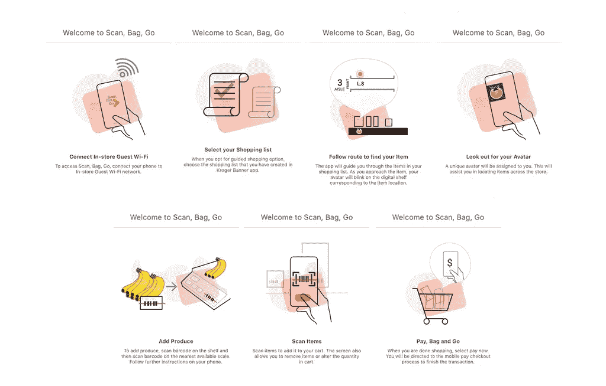
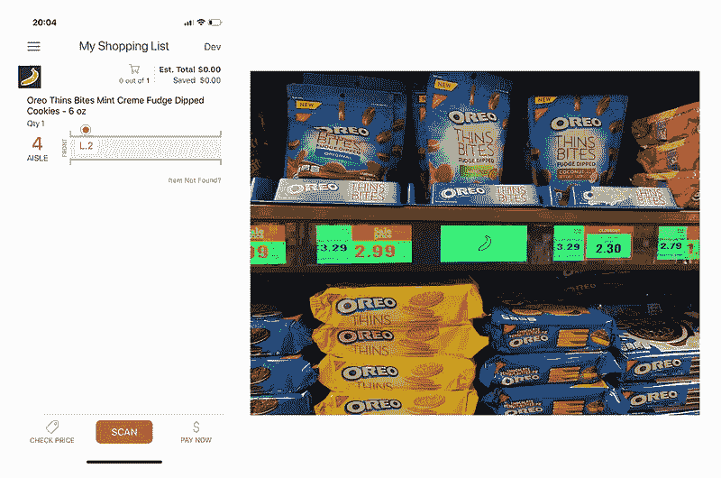
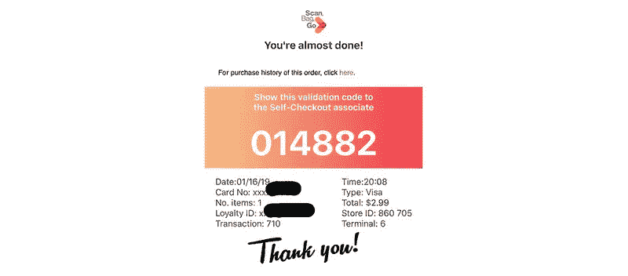

# 微软的数字货架是亚马逊 Go 的(混乱)竞争对手

> 原文：<https://medium.com/hackernoon/microsofts-digital-shelf-is-a-messy-competitor-of-amazon-go-c01823aaecd0>

大约一年前，亚马逊在西雅图推出了第一家没有结账队伍、没有收银员、几乎没有人机交互的商店:Amazon Go。我在商店开张的第一天就回顾了它，并写下了我的经历和我在第一次光顾时做的许多测试。在我的评论中，我称之为“零售业的未来”。

自 1 月份那个寒冷的西雅图之夜以来，亚马逊在美国又开了几家 Go 商店，甚至开始试验一种[更小的全无人值守版本](https://www.cnn.com/2018/12/12/tech/amazon-go-small-format/index.html)。其他行业参与者也在取得进展，当微软和克罗格宣布他们正在测试一个未来的杂货店时，我知道我必须尝试一下。

*Kroger’s new digital shelf, powered by Microsoft’s technology.*

克罗格是美国最大的连锁超市，该公司仅次于 QFC。在与微软的声明中，他们把新的购物体验描述为混合云计算和“数字货架”技术的结果。常规货架被转换成数字显示屏，引导顾客，在常规价格旁边显示个性化内容；安装在天花板上的设备监控每个货架上的可用库存，并在需要时自动提醒工人；冷藏肉柜被改装成包括传感器，可以通知工人温度不足。

这一切听起来很棒，但我最大的问题仍然没有答案:新零售体验给顾客带来的最终价值是什么？是不是更快？付钱的时候是不是毫不费力？为了得到答案，我开车去了一家考试商店。

因为我听说只有一半的超市升级了，所以我进入 QFC，希望看到一些引导顾客进行测试的标志。相反，我看到了这个:

*How customers are introduced to the digital shelf experience when entering the store.*

我的第一反应是观看显示在所有这些手持设备上的小视频。它们允许顾客在将商品放入购物车时进行扫描，这样当他们到达收银台时，结账体验就变成了付款。让我困惑的是,‘扫描、打包、出发’系统是[在 2017 年末](https://www.businessinsider.com/kroger-customers-check-out-without-registers-or-cashiers-2017-12)宣布的，2018 年发布。他们更新设备了吗？这是最近公告的一部分吗？视频没说。

我拿了其中一台设备来测试它，甚至用它做了一个小购买来测试体验。经过令人沮丧的设置，让扫描仪识别我的 QFC 账户后，我很快就确认，该设备无法像在与微软的声明中承诺的那样，引导我通过商店。我错过了什么？

*The Scan, Bag, Go scanner is limited in its functionality and it feels outdated.*

我回到“扫描、打包、出发”站，试图找出答案。然后我注意到有贴纸邀请客户下载两种不同的应用程序:ScanBagGo 应用程序和 QFC 应用程序(每个设备支架上都有贴纸)。哪个应用程序是正确的？我两个都需要吗？我试着问了我周围的一些工人，但他们都建议我在客服站开放时回来。他们也不知道。

*Two different apps, two different calls to action for the customer.*

我决定继续尝试，从 QFC 的应用开始，因为它的标签上说这个应用会引导我的购物体验。下载后，我用它来制作我的购物清单，猜测这是引导式体验的先决条件。我又错了——制作购物清单并没有透露任何新功能，也没有提示我下载任何其他应用程序。

我已经没有选择了(也没有耐心了)，所以我也下载了 ScanBagGo 应用程序，做了最后一次尝试。当我打开它时，我收到一条消息，说我需要连接到商店的客人 Wi-Fi。只有在同意之后，我才最终能够看到应用程序内的指南购物体验，其中涉及到数字货架。

*A composition of all the steps in the ScanBagGo in-app tutorial.*

我很高兴我已经用 QFC 程序准备好了我的购物清单，因为这确实是导购功能的先决条件。无论如何，我发现令人困惑和奇怪的事实是，ScanBagGo 应用程序不允许你上榜，而且你必须使用两个不同的应用程序才能成功完成这个过程。

于是，我终于解开了谜题，准备去体验克罗格和微软所设想的未来。通过商店的 Wi-Fi，ScanBagGo 应用程序告诉我去特定的过道。在去那里的路上，我一直在想，一个不懂技术的客户不可能获得满意的体验。谁会有足够的耐心去经历那种折磨，只是为了被引导着逛商店？果然，应用程序和数字货架(否则价格会显示在那里)都显示了一个香蕉表情符号，让我知道我已经到达了目的地。

*Left: my phone indicating the location of my sweet target. Right: the digital shelf, showing the same emoji displayed by the app.*

我停下来思考刚刚发生的事情。有了这个引导购物系统，我再也不会在超市里迷路，寻找我需要的东西，但这值得吗？我意识到我还没有付钱，所以我推迟了任何判断，直到我看到是否有任何好处。我使用了一个非常标准的支付表格，在那里我介绍了我的信用卡信息，几秒钟后我收到了一个令人鼓舞的确认信息，说我“差不多完成了”。

我按照要求做了，并把屏幕展示给自助结账区的一名工作人员，但必须等待他们完成对其他顾客的服务。当他们伸手去拿另一个设备时，我很惊讶，他们应该在那里输入我的验证码。令我沮丧的是，这款设备已经没电了，所以他们不得不去寻找另一款，而其他一些顾客则在等待验证他们的年龄。几分钟后，工作人员回来告诉我去，他没有找到另一个带电池的设备，并相信我已经支付。其他等着的顾客看着我，好像我没有真正付钱。我带着一年前第一次去 Amazon Go 商店时的感觉离开了 QFC 商店，就好像我偷了什么东西，好像我没有付款一样。只是这一次，不是为了一个好的理由。

最后，我准备做一个评估。我感觉比其他购物日更好吗？“数字货架”体验是否比简单地走进去，找到我的商品，然后在自助结账台付款更方便？这真的是零售业的未来吗？

Kroger 对未来零售体验的尝试对我来说太短暂了。它确实解决了一些亚马逊 Go 商店尚未能解决的可扩展性问题，如处理农产品或按重量计算的商品，但最终，Kroger 的解决方案没有为主流公众做好准备。当然，这项测试目前只在两家商店进行:雷蒙德市贝拉博特加的 QFC 和辛辛那提附近的一家商店。改善对客户的指导肯定会减少我的一些痛苦，但这就足够了吗？

任何未来零售体验的目标都应该是消除障碍，简化系统，并最大限度地减轻终端消费者的负担。购物不应该需要复杂的指导方针，因为如果顾客自己不能理解，你已经失去他们了。

全面披露:去年，当我还在微软工作的时候，我写了一篇关于 Amazon Go 的评论。今天，我在亚马逊工作，但关于克罗格与微软合作的这篇评论的观点是我自己的，并不代表亚马逊的任何观点。

**看了我对 Amazon Go 的评测:**[我体验了零售的未来:Amazon Go](https://geekonrecord.com/2018/01/23/i-experienced-the-future-of-retail-amazon-go/)

你喜欢这篇文章吗？ [**订阅**](https://geekonrecord.com/subscribe/) **通过邮件获取新帖。**

*原载于 2019 年 2 月 4 日*[*【geekonrecord.com】*](https://geekonrecord.com/2019/02/04/microsofts-digital-shelf-is-a-messy-competitor-of-amazon-go/)*。*