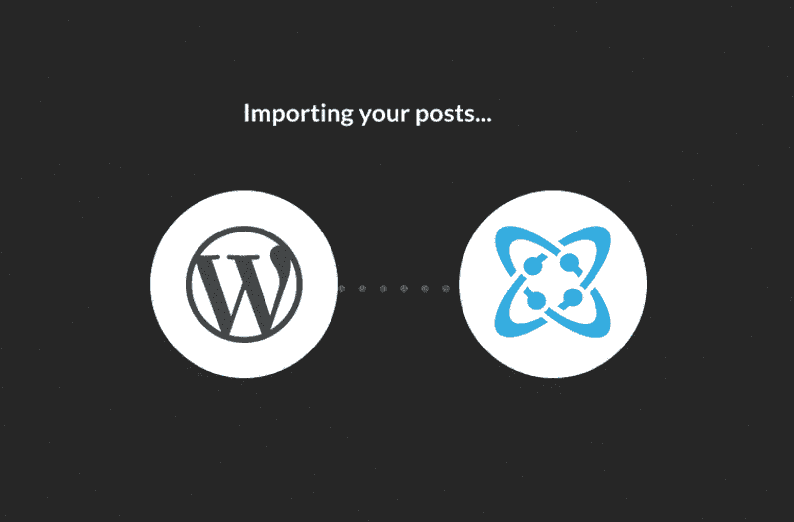
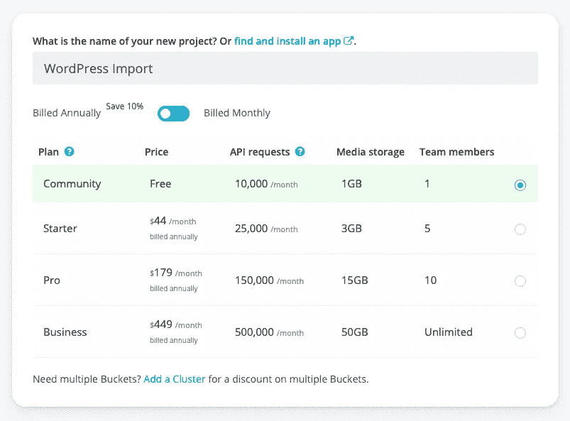
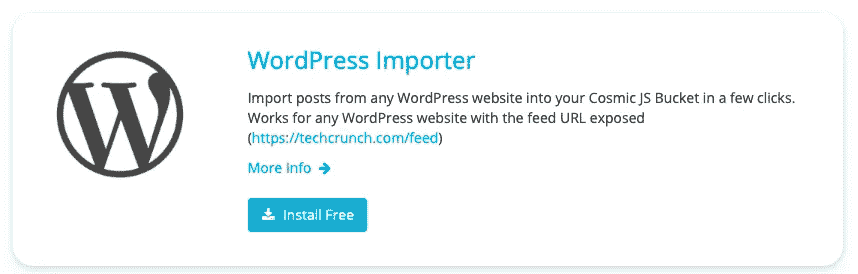
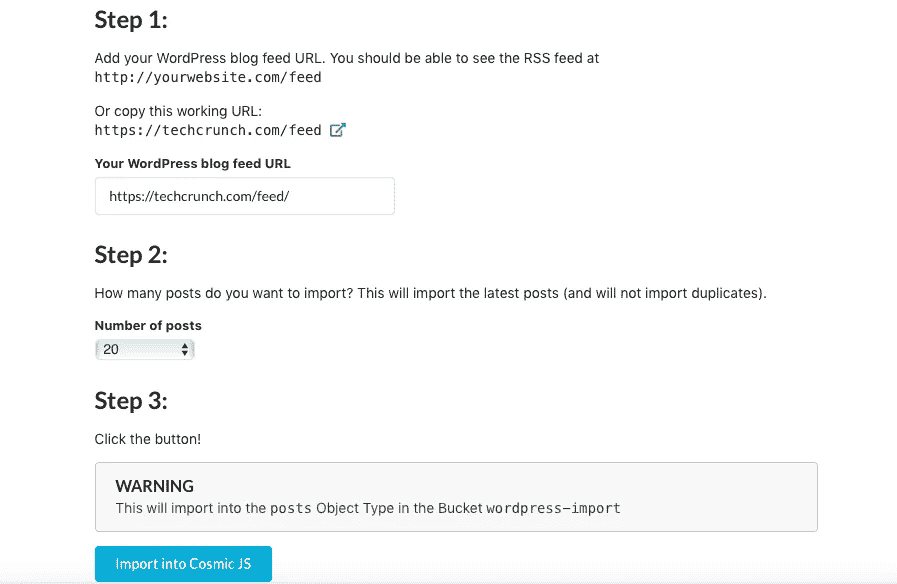
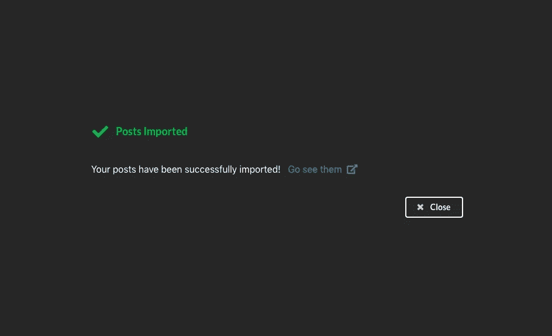
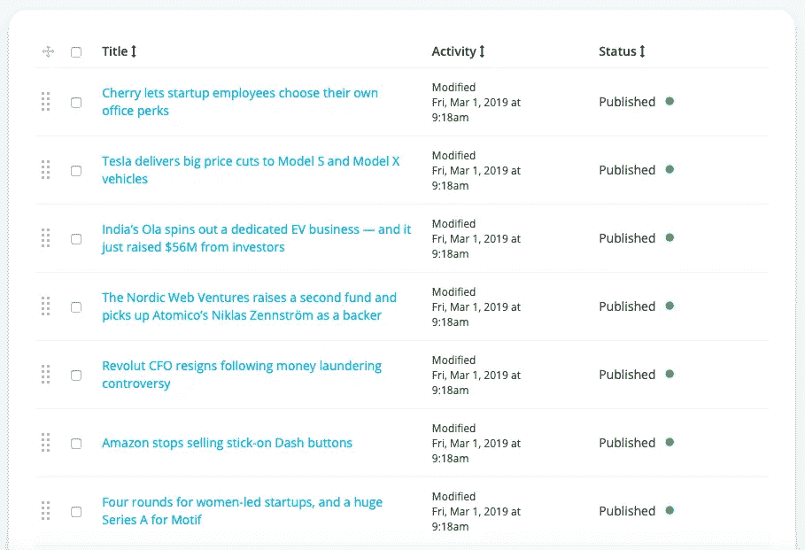
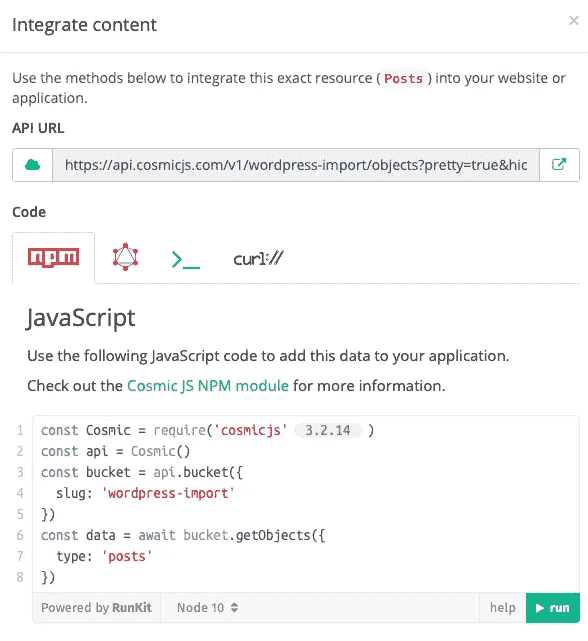

# 将内容从 WordPress 迁移到 Cosmic JS

> 原文：<https://medium.com/hackernoon/migrating-content-from-wordpress-to-cosmic-js-cb23ea9254ab>

世界上超过 30%的网站由 WordPress 驱动，然而参与 2017 年堆栈溢出开发者调查的 64%的开发者表示他们害怕使用 WordPress。主要原因包括安全性、膨胀、糟糕的用户体验以及 WordPress 是为过时的网络架构而构建的。如果你目前正在使用 WordPress，你可能会有同样的感受，并且知道技术膨胀和缓慢的页面加载速度会降低整体用户体验。

[Cosmic JS](https://cosmicjs.com) 是 WordPress 的替代产品，提供了一个创建和管理内容的网络仪表板，以及将内容集成到任何新的或现有的网站或应用程序的 API 工具和资源。在这篇博客中，我将演示如何将 WordPress 的帖子导入到 Cosmic JS 中，以便集成到一个新的现代应用程序中。我们可以通过简单地创建一个新的 Bucket，安装 [WordPress 导入器扩展](https://cosmicjs.com/extensions/wordpress-importer)并运行它来完成这个任务。

# TL；博士:

[WordPress 导入程序扩展](https://cosmicjs.com/extensions/wordpress-importer)
[性能案例研究:从 WordPress 到 JAMstack](https://cosmicjs.com/articles/from-wordpress-to-jamstack-how-to-make-your-website-10x-faster)

## 创建一个桶

## 导航到设置>扩展> WordPress 导入程序扩展

## 安装 WordPress 导入程序扩展

## 添加您的 WordPress 博客订阅源 URL

如上图所示，在字段中添加你的 WordPress 博客订阅源 URL。

## 导入 WordPress 内容

## 帖子导入成功屏幕

## 迁移了 Cosmic JS 仪表板中的 WordPress 帖子

您的博客文章现在被导入并在 Cosmic JS Bucket 仪表板中建模，包括标题、发布日期、作者、内容等等。

## 使用 NPM 模块、GraphQL、Bash 或 Curl 整合内容

既然我们的 WordPress 帖子已经导入到了 Cosmic JS 中，我们就可以检查我们的内容模型，并使用 JavaScript、GraphQL、Bash 或 Curl 的代码片段资源准备我们的内容，以便集成到新的应用程序中。你可以很容易地从[Cosmic JS Apps market place](https://cosmicjs.com/apps)安装一个内容就绪的应用程序，并导入你的 WordPress 文章来与 Netlify 一起部署，以测量页面加载速度的增加。

# 结论

将开发者和内容创建者从 WordPress 中解放出来是一个很大的目标，WordPress Importer 扩展是一个很好的工具，有助于说明当使用 Cosmic JS 管理时，你的内容变得多么灵活、可移植和可扩展。如果你对将你的 WordPress 内容迁移到 Cosmic JS 有任何意见或问题，[在 Twitter 上联系我们](https://twitter.com/cosmic_js)和[加入 Slack 上的对话](https://cosmicjs.com/community)。