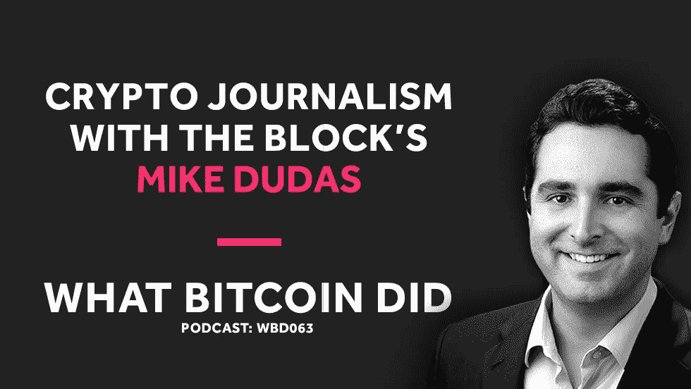

# 《秘密新闻》的迈克·杜达斯

> 原文：<https://medium.com/hackernoon/mike-dudas-from-the-block-on-crypto-journalism-aad23e516e09>

## 音频采访转录— WBD063

***注:*** *以下是我采访 Block 创始人兼 CEO 迈克·杜达斯(Mike Dudas)的笔录。我从翻译中使用 Rev.com，他们删除了嗯，错误和半句。我已经检查了转录，但如果您发现任何错误，请随时发送* [*邮件给我*](http://hello@whatbitcoindid.com) *。可以* [*在这里*](https://www.whatbitcoindid.com/podcast/mike-dudas-from-the-block-on-crypto-journalism) *听原声录音。*

*你可以在这里订阅播客* [*听所有剧集*](https://www.whatbitcoindid.com/podcast/) *。*

在本期节目中，我将与 Block 的创始人兼首席执行官迈克·杜达斯进行对话。我们讨论了秘密新闻，街区的强硬手段，与秘密媒体的利益冲突，Ripplecoin 社区和处理心理健康问题。

联系比特币做了什么:
听:[**iTunes**](https://itunes.apple.com/gb/podcast/what-bitcoin-did-podcast-bitcoin-crypto-trading-strategy/id1317356120?mt=2)|[**Spotify**](https://open.spotify.com/show/0mWUJuONiilW5JSBBFZ0s7?si=5qcbjpjYSRyKpi8wycEZUw)|[**Stitcher**](https://www.stitcher.com/podcast/what-bitcoin-did)|[**SoundCloud**|](https://soundcloud.com/what-bitcoin-did)[**YouTube**](https://www.youtube.com/whatbitcoindid)|[**TuneIn**](https://tunein.com/radio/What-Bitcoin-Did-p1079869/)关注: [**网站**](https://www.whatbitcoindid.com/)

# **采访记录**

**面试日期:2018 年 12 月 18 日星期二**

> **"这些类型的市场吸引了最糟糕的人."**
> 
> **—迈克·杜达斯**

**[**彼得·麦科马克**](https://twitter.com/PeterMcCormack) **:** 听着，我跟了 Block 有一段时间了。关注你的工作，绝对热爱它，但充分认识到你与其他扔手榴弹的加密出版物非常不同，而是故事，大报道。跟我说说，有什么策略，你想对她做什么？**

**[**迈克·杜达斯**](https://twitter.com/mdudas) **:** 通过 Block，我们真的试图将干净、清晰、客观、基于事实的分析、新闻和研究带入一个生态系统，其中 95%以上的项目基本上都是噗。如果没有，在接下来的几个月，几年内。每个人都很清楚，每个人都在说，六到八个月前，当这个想法第一次出现时，整个“资产类别”都被高估了。没有人这样报道。**

**你有投币台和其他实际上运行位连接广告。太疯狂了。主流媒体当时对这项技术还不够了解。治理得很好。任何足以准确报道此事的事情。他们只是报道价格。包括美国消费者新闻与商业频道，包括彭博，在很短的时间内完成。**

**我们觉得，我在 Braintree、Google Wallet、Venmo、PayPal 的金融科技部门工作多年，我确实觉得区块链和加密资产是一个重大的进步，改变了我们对金钱、技术和价值以及数字资产的看法。**

**我认为这不像传统的金融科技，它往往会被大银行和现有系统所吸收。我认为它可以存在于两个系统之外。这真的让我很兴奋。与此同时，我对该领域缺乏专业报道感到失望，并觉得我们可以作为一个媒体和信息来源发挥作用，具有很高的可信度，帮助突出好的方面和坏的方面，然后真正区分小麦和谷壳。**

**[**彼得·麦科马克**](https://twitter.com/PeterMcCormack) **:** 对。好吧。你发现了机会。你经历了什么让它成为现实？**

**[**迈克·杜达斯**](https://twitter.com/mdudas) **:** 基本上是人的生意。顺便说一下，这整个生态系统的大部分是人的生态系统。我们在创造软件，我们在创造协议。在我们的业务中，即媒体信息研究和分析业务中，或者在正在创建的这些技术业务中，我们没有创造，它主要是由软件驱动的。这和人有很大关系。最重要的事情是能够招募到世界上最优秀的人，而这个生态系统中最优秀的人并不是拥有 20 年经验的人，因为除了少数在 90 年代是秘密无政府主义者的人之外，没有人拥有这种经验。**

**它的意思是，让那些好奇的人，那些知识渊博的人，那些精力充沛的人，以及那些对此充满热情的人。我们的团队，我们有一个内部松弛组，我们出于各种原因使用，但我们花费，你会看到一条消息，一天 24 小时 22 小时都在那里，来自团队中的某个人。能量是显而易见的。**

**招募最好的人才是关键，最好的研究人员、最好的分析师和最好的技术专家。我们对现在的状况感到非常兴奋。我们有一个非常好的团队。自从我们在 9 月份实际推出该产品以来，产量是巨大的，读者群随之而来，关注度也随之而来。**

**[**彼得·麦科马克**](https://twitter.com/PeterMcCormack) **:** 你说你认为 95%的人会变成 buff。你为什么会这么想？**

**[**麦克杜达斯**](https://twitter.com/mdudas) **:** 大概更多。如果我们在硬币市值上达到 5000 点。有各种各样的原因。有些人真的诈骗别人，你有各种各样的骗局。有各种各样的人筹集资金，因为向公众出售代币很容易。通常以不受监管的方式。然后，根本没有能力建造他们所说的东西。这可能是，让我们只是，我在这里编造数字，但这是一个很大，很大，很大的项目。**

**还有一些人相信他们能做一些事情，但是他们没能做到，并且不得不放弃。然后你得到了精华。当像 Consensys 这样的公司在巅峰时期雇佣了大约 1000 人，现在解雇了成百上千的人，还有更多的人，你知道资金远远超过了技术的能力。我认为很多得到资助的东西会，它与第一次互联网泡沫有很多相似之处，但在 10 年后，一个想法可能会有意义。**

**今天，它没有。这很大程度上与酷有关，你可以做这种技术事情，但在区块链上做它的代价是它变得绝对不可用，对消费者或企业来说，因为界面太糟糕了。这完全是另一部分产品。然后，产品实际上是好的和有趣的，只是它们中的许多没有被使用。你看看面向消费者的 DAP，这是以太坊在 ICO 基金和 ERC 20 代币之外的一个大用例。DAP，无论是商业用途还是消费者用途，都还没有出现。Eos 的推出是为了减少摩擦和增强可伸缩性，但是，我们说的是…**

**对于这些项目中的一些来说，现在的大问题是区块链是必要的。对许多人来说，事实并非如此。**

**[**彼得·麦科马克**](https://twitter.com/PeterMcCormack) **:** 对。好吧。你还提到了 Coindesk。看起来像许多其他的加密出版物和网站，他们以不同的方式报道。你认为他们中的一些人，也许这是…我认为可能有两个原因。第一，在他们可能参与的更大的群体中存在利益冲突。其次，是他们建立的模型，因为我认为这些公司中的许多都依赖这些加密项目作为收入来源。我们已经看到，有些人确实会接受正面故事的报酬。你认为这就是为什么他们没有覆盖它，而你显然有一个不同的模型？**

**[**迈克杜达斯**](https://twitter.com/mdudas) **:** 耶。这样很容易分组。先说主流媒体。主流媒体对此进行了报道，因为它获得了不成比例的点击量和关注度，而且很有趣，这是一类金钱，也是一类技术。他们专注于一般目的的观众，通常不会给出他们正在看的特定的东西，必要的治疗深度。《经济学人》在这一点上是最有罪的。当他们把他们的通用记者放在上面时，彭博偶尔是有罪的。**

**当他们把他们的密码记者放在上面时，他们实际上做得相当不错。《财富》有一些像杰夫·罗伯茨这样的好人。有一些不错的主流媒体报道。总的来说，我认为它不够深入。**

**然后你会发现，我认为你最感兴趣和关注的领域是投币台、ccn 和投币电报。让我们把它们作为三个最大的纯加密媒体实体。CNN 和 Coin Telegraph 是绝对的早期商业内幕，只要把每一件事都写出来，汇总，不要太担心它是否完全事实准确，或者有深度，或者事情拼写正确。然后，让我们通过，就像你刚才说的，ICO 广告来赚钱，你可以说出任何产品。你随时进入他们的主页或文章页面，都会看到一些质量很低的广告。**

**就是这个型号。非常低成本的内容，非常低质量的广告，只是量，量，量，然后他们就像你说的那样，接受赞助的帖子，他们确实表示，有时不是最透明的方式。**

**然后，你有真正的高质量媒体，这是一个有趣的新类别，我将回到硬币台，但你有一个高质量的媒体，一些新的人喜欢解密媒体，我非常尊重他，我也非常尊重 Breaker。这两个项目都是由 Consensys 直接资助的。虽然有一堵中国墙，而且这个团队有很好的编辑操守，但这种关系很难运作，读者心里会产生一些疑虑。再说一次，迄今为止我所看到的是高质量的报道。谁知道故事是否被扼杀或发生其他事情，谁知道他们的长期收入模式是什么，或者它只是由 Consensys 资助，就像华盛顿邮报可能因贝佐斯而赔钱一样。**

**断路器是另一个。我不知道长期的收入模式是什么。很难真正评论他们未来的计划，但今天，你会看着他们说，嘿，这将是一个真正困难的挑战，用这些模式建立业务，除非他们得到项目的资助。断路器是由一个项目资助的，奇异数字电视，我敢肯定，ICO 有一个金库，并可以继续投入资金。他们作为顾问和纽约杂志有联系。**

**这是我看到的唯一两家做着与我们相似的高质量工作的公司，但融资模式和商业模式存在问题。最后，我们将到达投币台。Coin Desk 是数字货币集团的全资子公司。Barry Silbert 是整个生态系统中最强大、最有联系的人之一，他的触角伸向了如此多不同的业务、如此多不同的项目，他的实体是 100%的所有者。**

**现在，Coin Desk 有一些出色的编辑人才，包括纯粹的编辑和他们的记者。他们也有，而且他们有很棒的分析师和研究员。这是一个组合。他们推出了一些非常好的作品，也推出了一些质量较低的作品，但总的来说，他们做得很好。问题是，他们的模式不是新闻、分析和研究，而是会议。对于你最初的问题，他们从这些付费演讲的系列会议中获取利润。**

**出席是付费的，发言也是付费的。我们说的是每年数千万美元的累计总收入，这些赞助，这些演讲点，以及参加会议。新闻是为了激起人们的兴趣。**

**我们看到了这种情况，然后我们看了看我们自己，我们说，看，必须有人进入这个市场，就像信息在一般技术方面一样，就像 CB Insights 在分析和更广泛的技术方面一样，他们做这种独立的新闻，加上人们会付费的独立研究。这就是我们在街区做的事。虽然今天我们所有的工作都是免费分享的，但我们将在 Q1 推出一款付费产品。**

**[**彼得·麦科马克**](https://twitter.com/PeterMcCormack) **:** 你想谈谈那个产品吗，能告诉我多少？**

**[**迈克杜达斯**](https://twitter.com/mdudas) **:** 耶。我会给你它的大概轮廓。在一些不同的事情上会很沉重。第一，我们将深入研究。如果你已经看到了一些关于企业区块链或稳定硬币的 Lumascape 风格的图表，我们将深入研究这些领域。对于想投资、想在这些领域工作、想了解技术的人来说，这是可行的。我们的分析将更深入地考察具体的交易所，考察交易量和潜在的违规行为。这些是各种各样的话题。**

**同样，这些事情会影响人们的交易方式。更深入地观察产品，更深入地观察人。做信息所做的事情，在这些事情中，他们突出了 X Y 或 Z 组织或协议或基金会 X Y 或 Z 的所有重要人物。比如 Crunchbase。约翰·比格斯现在是我们的编辑，他很棒。他是 Crunchbase 的创始人。约翰在我们推出这款付费产品时给了我们指导，他在过去几周加入我们之前，已经在 crypto 工作了一年多，这对我们的努力来说是一剂强心针。**

**我们有一个服务于世界最前沿的人，他发起了一个信息、研究和人员服务，帮助指导我们的编辑团队这样做。**

**[**彼得·麦科马克**](https://twitter.com/PeterMcCormack) **:** 对。一切都取决于团队。你已经确定了，你必须找到最好的人才。**

**[**迈克杜达斯**](https://twitter.com/mdudas) **:** 耶。是团队。我忽略了新闻业。我们将继续发布新闻，我们认为调查性新闻非常重要，比如弗兰克·恰帕罗上周在区块链码头写的那篇很棒的文章，因为我们希望分享普通公众，甚至该项目的潜在投资者都知道的事情。我们知道一个事实，我们已经在某些情况下在某些事情上展示了光明，人们然后，当局然后说嘿，这是我们需要调查的事情，我们认为这对生态系统非常重要，因为我们有资源，我们相信当我们推出我们的付费产品时，我们将为人们创造这样的价值，我们也将有一个商业模式。**

**支持，我之前说过的，将在这个行业中把小麦从谷壳中分离出来。**

**[**Peter McCormack**](https://twitter.com/PeterMcCormack)**:**对于那些颇具争议的报道，新闻调查方面，你要对发表一篇文章的风险考虑多少，然后，当你，或者你只是站起来说看，我们是记者，我们报道事实，新闻自由，等等，它会如何反映。你对此有什么看法？**

**我们对这些文章的投入，是百分之百的支持。在调查性新闻报道中，有一点是很清楚的，你可以在更高、更引人注目的案件中看到这一点，比如华尔街日报事件，那就是否认、否认、否认。然后，洋葱被剥开。永远都是成本收益分析。**

**当你说嘿，我们是应该把这八层都剥掉，还是只留下已经剥掉的那两层，然后继续关注客户在找什么？如果我们已经做了一些调查性的新闻报道，接下来的一个月我们还会有一些额外的报道，我们将基本上写下这些报道，并分享合理数量的信息，我们认为这些信息对于讲述公众需要知道并且我们能够证明的故事是必不可少的。这并不影响我们做其他事情的能力。**

**我们不能将 100%的资源投入到调查性新闻报道中，即使我们真的得到了，我不是在开玩笑，在我们整个团队中，我们得到了十几个值得每天关注的关于相当重大的潜在欺诈和诈骗的提示。这真的很疯狂，我真的从来没有见过这样的生态系统，在与其他垂直行业的记者交谈后，我告诉他们一些我们得到的提示，并不是所有的都是保密的，这意味着人们确实自由地分享它们，他们说，哇，这太疯狂了。生态系统中有很多疯狂的事情在发生。**

**彼得·麦科马克 **:** 你认为我们是如何走到这一步的？哪里有这么多。**

**[**迈克杜达斯**](https://twitter.com/mdudas) **:** 耶。这只是一个疯狂的时期。数百亿美元的资本涌入，由全球许多未经认证的投资者以相对不受监管的方式投入。它只是，它打开了一个疯狂的潘多拉魔盒。更不用说仍在运营的实际公司，我不会具体指出任何公司，因为我们仍在进行一些调查。**

**你看，我们昨天有一篇文章，1%的交易量，这只是我们写的一小部分，我们基本上是在重复一项更详细的研究所说的，但前 25 名支付者中 1%的交易量支付者是合法的交易量，超过 90%是不正当交易或非法交易量。太疯狂了。**

**我认为这是太多的钱，没有足够的监管，太多的司法管辖区，无论是州，联邦，多个国家。显然，这些类型的市场吸引了最糟糕的人。有洗钱的能力，有退出骗局的能力。我认为人们仍然是，很多你会看到的骗子，我不是在谈论我们已经报道过的任何人或我们已经报道过的任何事情，因为我没有暗示我们已经报道过的任何人是骗子。**

**只是在生态系统中，我读到的人们经常做的事情，我看到其他人报道的事情，或者 SEC 实际上正在与人们解决的事情，都是愚蠢的事情。很明显你会因为这样做而被抓住。你们到底在干什么，伙计们？**

**[**彼得·麦科马克**](https://twitter.com/PeterMcCormack) **:** 感觉就像因此；你的生意将会随着市场的变化而改变。显然现在有太多要报道的了。我们将有一个完整的广阔的市场，一个不能出货、不会出货、出货但在用户中质量太低的项目的彻底洗牌。所有这些项目都将被清除，但与此同时，如果我们与互联网时代相比，将会有另一轮遵循监管框架的明智想法投资。**

**我想随着时间的推移，你将会，你将要报道的事情类型将会逐渐减少骗局和发生的坏事，然后你将会开始关注所有正在发生的好事？**

**[**麦克杜达斯**](https://twitter.com/mdudas) **:** 一点不错。这确实是我们的梦想。我不知道市场会下跌 85%,从我作出决定并在 1 月份写下我的第一天中型帖子的那天起，当时我们上涨了 17，400 比特币，现在我们在哪里，3500？我的妻子明确地反复告诉我，我应该在高峰期卖出更多。你要报道该报道的。我们不经常写价格，但我们确实写了一些有问题的项目，而且这些项目比那些有亮点的项目要多。也就是说，本周我们的技术顾问 Arjun Balaji 将在闪电网络上发表一篇很棒的文章。**

**我们在等 Miles Snider 写一篇文章，一篇关于 Eos 的正面文章。在这个生态系统中有如此多的好的发展，我们想要报道。我预计钟摆会在 2019 年摆回来，但不会完全摆回来。换句话说，将会有一些项目资金告罄，这些项目被并入其他项目。**

**然后还有会继续的。最好的例子，也是最让我着迷的，显然是瑞波和 XRP。也就是说，瑞普公司和 XRP 是一个协议，这是毫无疑问的联系。毫无疑问，毫无疑问。我们花了时间，我们的首席分析师 Larry Cermak 写了这方面的文章。感恩节期间，我在推特上发起了一场关于这件事的风暴，它得到了公开事实的支持。这个故事将会流传下去。我们不会…**

**我们的覆盖面，我们的覆盖面将会改变的方式是，我们不会一遍又一遍地重复涟漪安全的事情。我们不是来打死马的。我们来这里不是为了追逐特定的人或项目，或者证明我们已经证明的观点。如果有新的消息，我真的希望看到 Ripple 我很乐意看到他们的产品被采用。我曾在与他们类似的公司工作过，他们推出了谷歌钱包，从零开始，现在是谷歌支付，并被全球接受。**

**我在 Venmo 上工作过，当时它有 30，000 个月活跃用户。令人惊讶的是，看到产品的推出和规模，帮助布伦特里增长，在巴顿成立一家公司，从零收入到超过一半的总收入达到 1 亿美元。**

**我是一名企业家，我希望看到这些人成功。关于 Ripple 的事情，回到那个例子，只是一些关于与实际加密货币协议的关系的拐弯抹角和变化的叙述。如果该公司只是自己存在，而不是试图将代币强行纳入商业模式，以支撑财政部，这已经成为他们实际的商业模式，这意味着出售 XRP，我会支持。如果 Ripple 能超越 Swift，我会支持他们。**

**正如 transfer-wide 首席执行官所说，我真的还没有看到这一天，他说。**

**[**彼得·麦科马克**](https://twitter.com/PeterMcCormack) **:** 耶。此外，Swift 不会让他们的业务模式从他们的基础上被夺走。**

**[**麦克杜达斯**](https://twitter.com/mdudas) **:** 当然不是。我认为它们更像金融科技，而不是比特币，比特币可能是一种价值储存手段，可以抵御审查，是可编程的货币。我们可以改天再谈。**

**[**Peter McCormack**](https://twitter.com/PeterMcCormack)**:**你对 XRP 周围的社区有什么看法？在这方面，我注意到的一件事是，我非常怀疑机器人的活动。我不知道这是否是中央控制的，或者只是一些非常渴望 XRP 的粉丝。我注意到的一件事是，大量的 XRP 人在他们的名字中有 XRP，在 Twitter 上有 XRP 的标志，他们每次发布公告时都在敲硬币，他们不讨论 XRP 以外的任何密码，如果你真的在他们的留言板上深入他们的小社区，他们都只是在这个奇怪的社区中分享彼此的内容。**

**[**迈克杜达斯**](https://twitter.com/mdudas) **:** 耶。看，这又一次让我震惊，我不是记者，我也不是《街区》的编辑。我觉得我可以这么说，这让我觉得很可疑。也就是说，我已经注意到，像杰夫·戈德堡这样的许多人，他几乎痴迷地在 Twitter 上公开谈论这个问题，作为我认识多年的人，在加密之前，在他做这些事情之前，但似乎…他提出的证据至少在这些事情的协调方面令人惊讶。**

**我个人没有任何证据表明这与 Ripple 或 Ripple Core 有关，或者 Ripple 向其中任何一个人支付了费用，我永远不会进行暗示或指控。但是，它让你怀疑是否有人是。我不知道发生了什么，我只能说。你不会在任何其他秘密“社区”看到这样的行为你看到人们谈论技术。**

**那个特定的军队和团体相对于其他任何一个的论点的一般复杂程度，我不能给出一个数字。它要低得多，也不那么复杂。在这一点上已经不值得参与了。我刚刚在我的个人帐户上制定了一个策略，只是阻止他们。**

**[**彼得·麦科马克**](https://twitter.com/PeterMcCormack) **:** 是啊，你知道吗，你把什么是屏蔽和什么是个人观点分开了吗，推特账户往往是个人的？**

**[**迈克杜达斯**](https://twitter.com/mdudas) **:** 真的很难。我永远不会让事情发展到 100%的人都同意我的底线的地步。顺便说一句，我认为街区的覆盖面确实如此。我们甚至在内部争论，我们应该在个人账户上说多少，应该在大宗账户上说多少。那么，我们应该覆盖什么？我们有很多关于我们应该报道什么和如何报道的内部辩论，并且有不同的观点。**

**基本上，我认为规则是，我在不断学习，因为我在历史上一直从事更多的企业技术，顺便说一下，这就是为什么这个夏天为这个业务筹集 200 万美元是如此有趣，这个业务我以前从未做过，但我们的投资者相信这个使命，知道我自 2013 年以来一直在 crypto 工作，并对此充满热情，我是一个伟大的招聘人员，可以招募这个世界级的团队来做这件事。我的个性，我是谁，我的热情是这个成功的重要因素。我们团队的其他人也是如此。拉里，弗兰克，史蒂文，约翰·比格斯。**

**我得到了很长一段时间以来人们对我说的最高的赞扬之一，或者说最亲切的话之一，又是约翰·比格斯，早期的技术危机，他提出了 Crunchbase，并与迈克尔·埃林顿密切合作，他说，嘿，杜达斯，伙计，你让我想起了早期的迈克尔·埃林顿。大火。还说了一些其他的话。我对此很兴奋。我认为迈克尔能够，而且他仍然在很大程度上参与这个游戏，在加密领域，但是他能够，我认为，以多种方式，以积极的方式，在积极的方向上，推动这个行业，给它更多的能见度，让它为主流报道做好准备。我也想为 crypto 做这件事。**

**我想成为主流出版物。我认为技术危机，他们最终被收购，并没有意识到他们真正的财务潜力。我认为我们可以从那里发生的一些事情中吸取教训，做得更好。**

**[**彼得·麦考马克**](https://twitter.com/PeterMcCormack) **:** 那就说说团队吧。这是最令人印象深刻的事情之一。你招募了这支全明星队。每次有新人加入，你都会说，是的，我已经读过你的内容了。告诉我团队的情况，谁是关键人物，他们在团队中的角色是什么，告诉我差距在哪里，你希望在未来得到谁，什么样的人。**

**[**迈克·杜达斯**](https://twitter.com/mdudas) **:** 关键的那帮家伙，我的联合创始人兼 CTO 杰克·麦格劳(Jake McGraw)，简直不可思议。10 年前，我和他在第一家初创公司共事，那是在 2008 年和 2009 年，是一家广告技术初创公司。**

**我这里的关键原则是，某人将会很好共事的绝对最佳信号是你了解他们，并且以前和他们共事过。或者，你知道他们的工作。杰克·麦格劳是我的联合创始人，他很了不起。约翰·比格斯，作为我们的编辑，我们与我们的创始编辑分道扬镳，约翰是不可思议的。他有着丰富的经验、技能和人际关系，当你知道我是一个非常情绪化和暴躁的人时，他能保持冷静。他带来了度量。**

**坦率地说，我们最大的资产是从事这项工作的人。是拉里·瑟马克，我们的首席分析师。这是史蒂文·江，我们的首席研究员。是弗兰克·恰帕罗，他是我们的资深记者，从《商业内幕》来到我们这里。我见过伊莎贝尔·伍德福德，她刚刚加入我们，曾在路透社工作，现居伦敦。**

**这四个人所做的工作让这家公司变得与众不同。令人着迷的是，他们每个人都不到 25 岁，但对这个领域了解更多，无论是技术，无论是人，无论是我所在的公司……我的工作是对很多事情有一个略低于主题水平的了解，然后帮助协调我们报道的内容，走出去，销售和营销，筹集资金，领导团队。这些人是世界级的专家。他们太棒了，他们帮助吸引了 Arjun Balaji，我认为他是前五名之一。我们一直是朋友。当他同意作为技术顾问加入时，我高兴得跳了起来。他给了我们相当多的时间，并将出版一些作品。**

**关键是，伟大的人才会吸引伟大的人才。我们现在收到了更多的投稿、想法和建议。最后但同样重要的是，我雇佣了一个叫迈克·麦卡弗里的人，他在花旗银行做了 18 个月的投资银行家，他是由两个投资者彭博·贝塔推荐给我们的。我喜欢彭博是我们公司的投资者。Blockchange Ventures 的肯·塞夫是一位出色的投资者。多种基金，只是一个很好的人，前首席执行官，和一个伟大的顾问给我们。**

**他们都推荐迈克为办公室主任，我们随后提升他为运营和财务总监以及办公室主任。这家伙 24 岁快 40 岁了。他带来的成熟。**

**你需要这些英雄。我学到的最重要的一点是，我不会在推特上招聘。对不起，我不在 LinkedIn 上招聘，我们甚至不需要发布工作，因为我们的网络，我们看到的人，人才，基本上是在你做伟大的事情时来找你的。这才是最令人兴奋的。这些最优秀的人以令人难以置信的方式迎接挑战。**

**我们只是在寻找更多这样的东西。坦率地说，这给了我们相对于其他人的所谓“套利机会”。我们以股权和合理价值的现金的形式补偿每一个全职员工。基本上就像，你有超越的优势。这是我们不需要过度支付的东西，我敢打赌其他一些出版物必须这样做。我们可以付钱给这些人，给他们好处。这是不公平的优势。**

**最后，我们有 Stephen Palley，他是这个领域最好的律师之一，代表我们工作。事实上，我和他建立了友谊，他真的是团队不可思议的财富，因为我们所知道的，所做的，确实需要在出版前进行法律审查。**

**[**彼得·麦科马克**](https://twitter.com/PeterMcCormack) **:** 耶。这是一个伟大的团队。我是他们中每一个人的粉丝，你刚刚提到的每一个人。我觉得他们都很棒。作为一个局外人，在我看来，有一件事我可能是错的，但感觉你真的没有任何巨大的等级结构。如果是的话，你可能有一个相当扁平的结构，你给你的团队很大的自由。**

**[**麦克杜达斯**](https://twitter.com/mdudas) **:** 一点不错。实际上，我没有回答你问题的最后一部分，即差距是什么。正如我提到的，我们正在推出付费产品。最重要的是，我昨天刚刚公开发布了这个消息，从现在到明年 2 月我们发布时，我们将雇佣更多的研究人员和分析师。我们正在与一些非常非常令人兴奋的世界级人物交谈。我们将雇用更多的全职员工，并欢迎任何有兴趣的人在我们的网站上申请，以及投稿。**

**这只是人们将获得的曝光，他们喜欢它，他们可以在我们的网站上获得它，我们现在看到成千上万的月访问量，以及通过我们的时事通讯，这是由一个疯狂的人单独阅读的。显然，不能透露姓名。这些是财富 500 强公司的首席执行官，这些是协议的领导者，家喻户晓的名字，投资者，等等。**

**[**彼得·麦科马克**](https://twitter.com/PeterMcCormack) **:** 我注意到的另一件事，也是我非常喜欢的，是网站的设计。它非常简单，非常干净，非常容易使用。实际上，这是一份真正的工作。对于一个有网页设计背景的人来说，我通常不喜欢出版商的网站。通常，它们要么很丑，要么像 Mashable 一样，试图做一些不同的事情，这是我不喜欢的。**

**你的网站真的很容易使用。这是一个非常好的按时间顺序，层次结构的故事，你可以通过比特币，以太坊来过滤。非常非常简单。我想那是一个关键的决定，对吗？**

**[**迈克杜达斯**](https://twitter.com/mdudas) **:** 绝对。最初的想法是加密简化。简化加密，这是一个口号，无论你是在展示特别复杂的想法，还是在学习区块链 101，这个口号都适用。我们真的很幸运，非常幸运，这可以归结为人际关系。你把自己放在一个幸运的位置上，但是我的共同创始人，克里斯·马特恩，我以前公司 Button 的，我也在 Venmo 工作过的人，推荐了一个叫 Charming Robot 的不可思议的公司，他们是世界级的设计师。他们与 Skim 合作，他们帮助推出 Skift，这是 Rafat Ali 的旅游出版物。他们与许多其他伟大的人合作过，他们都支持我们。**

**我认识首席执行官丹·马卡龙和首席运营官的埃里克·鲍伊有一段时间了，他们干得非常出色。这是即将成为我们首席技术官的前杰克。我们想建立网站，在 WordPress 上发布。你会看到很多更新，但就简洁的加密简化设计而言，他们做得非常好。在基于片段或基于块的设计中，我们希望与众不同，看起来与众不同。他们也帮忙起了名字。这当然是我洗澡时想到的事情，并且在凌晨 3 点一直在想。**

**现在我们必须弄清楚如何获得域名。**

**[**彼得·麦科马克**](https://twitter.com/PeterMcCormack) **:** 人家有了？**

**[**迈克·杜达斯**](https://twitter.com/mdudas)**:**Block.co。我认为 Block.com 是雪佛兰。我不认为他们会卖。**

**[**彼得·麦科马克**](https://twitter.com/PeterMcCormack) **:** 对。好吧。听着，一切都很顺利。读者人数上升了。我看到你公布了统计数据。他们令人印象深刻。你有一个很棒的团队。你的产品来了。一切似乎都很顺利。迈克，你面临的主要挑战是什么？是什么让你夜不能寐？**

**[**迈克杜达斯**](https://twitter.com/mdudas) **:** 耶。作为一名首席执行官，你总是要把乐观和偏执混合起来。我最乐观的是我们谈论过的团队，以及对我们所做的事情的接受。同时也有风险。我们很大程度上是预收。我们确实有收入。顺便说一下，我们将开始运作赞助。来自关键合作伙伴，这些将是赞助商的帖子，清晰地描述，来自我们非常尊重的品牌。高质量的品牌，而不是像 ICOs 这样我们不会相信的东西，在一月。**

**嘿，我们的观众会有什么反应呢？会是一个问题。希望一切顺利。我们认为很好。那么，我们会得到正确的组合吗？正如我提到的，在接下来的几个月里，在研究分析方面，我们还需要招聘更多的人。我们相信我们有产品，当我们推出付费产品时，人们会喜欢。我忘记的最后一件事是，我们将每天或每隔几天就有一个彭博风格的马特·莱文或瑞安·塞尔基斯风格的专栏。那会在付费墙后面。**

**那个产品会引起共鸣吗？我们认为会的。我的基本想法是，我现在不打算说出价格点，但基本上，在价格点上，我们的目标是，如果我们每年帮助您做出一个好的决定，您就已经超过了为订阅支付的费用。那是我们想去的酒吧。我们希望每个人都能从我们这里读到的内容中获得 10 倍的利润。**

**然后，接下来的事情是，市场是否复苏。市场本身并不一定要复苏，但你需要一些波动，让人们保持兴趣。我不担心，因为我是一个真正的加密信徒。我认为有一个合理的，合乎逻辑的问题。我认为我们已经过了那一点，仅仅基于我在经济衰退中看到的开发商活动。明年市场会发生变化。我们将进入市场筹集新一轮资金，我希望以这个速度盈利。我计划筹集 A 轮融资，我计划在 Q1 或 Q2 上市的后期进行。基于，一个非常强大的管理团队和一个非常强大的编辑团队，以及一个将开始产生一些非常好的收入的产品。由我、我们的首席技术官杰克和我们的主编约翰·比格斯带领。**

**我认为这将是一个真正引人注目的垂直、中间信息，对投资者的价值主张。但是，风险总是存在的，至于你能否筹集到。我以前做过。我想我们会做到的。**

**那么，最后的事情就是，我们能不能维持，我们能不能留住我们的人。随着他们的明星越来越多，我们能让他们参与进来吗？我认为我们团结一致对大家都有好处。这是人的生意。我认为我们都让彼此变得更好，作为一名领导者，我的工作就是让他们都保持这样的状态。**

**攀登很难，伙计。你知道，你已经看到了。我确实经历过。我在巴顿，在我的上一个公司，现在有 100 多人，就像每一个，当你从我们现在的位置，10 到 25 是一个巨大的跳跃。25 岁到 40 岁，之后，一旦超过 40 岁，就只是不断进化，人来人往。**

**我认为我们是一种不同的业务，我们不一定需要那么大。保持核心完整非常关键，而且总是最大的风险。**

**[**彼得·麦科马克**](https://twitter.com/PeterMcCormack) **:** 耶。我去过的最多的是一个 35 人的全职团队，和一个 5 人的临时团队。比如说 40 岁。我注意到的是，实际上我有过两次这样的经历，大约 15 个人，超过这个数字，它开始改变，因为你不能在那里手拉手，每个人一起做决定，统一战线改变了。我经历的最大变化是，当我们过了 30 岁，就好像，我必须放手。我的工作变成了管理公司的人。此外，公司内部也有派系和团体形式。政治已经变得很难对抗。不过，这是自然而然的事。**

**我相信你已经准备好了，迈克？**

**[**迈克杜达斯**](https://twitter.com/mdudas) **:** 耶。我们是。这将是一个挑战。我们已经和 10 个人在 5 个时区了。我们在亚洲招聘会很有趣，例如，我们在那里有一个记者的职位，我们现在有来自那里的投稿人，约瑟夫·杨，他是一个非凡的投稿人，他为我们写了几篇文章。我们必须谨慎地成长。**

**分布式移动公司，这是一个新事物。我们正在寻找那些可能还没有这样做的人，或者发展太快的人。你可以看到康森斯在削减开支。Consensys 已经做了，我不是要挑他们的毛病，他们已经为以太坊生态系统和整个加密生态系统做了一些不可思议的事情。但是，增长太快，然后不得不收回，这可能会伤害人们。顺便说一下，我认为这对生态系统的其他部分是积极的。我们正在和康瑟斯的人谈话。我认为这种天赋会有着落的地方。**

**[**彼得·麦科马克**](https://twitter.com/PeterMcCormack) **:** 耶。我想，我可以想象在几年后，我们将回顾 2018 年，并满怀希望地说，我很高兴这一切发生了。这是需要的，这是必须的。我们需要它来解决所有问题，这样人们就会再次关注基本面。**

**[**迈克·杜达斯**](https://twitter.com/mdudas) **:** 这就是我们所说的，作为一家公司，我们会在不同的领域犯错误。无论是资源规划，招聘，你说吧。只要你能做一个复古，吸取那些教训，并从中成长，我从以前的业务中得到了这个经验，不赘述。嘿，如果我一直纠结于我今年年初损失了 80%的名义比特币，我会把自己逼疯的。我不知道。我认为这是一笔游戏资金，我通过实际建立一项业务来进行对冲，我认为从长远来看，这项业务将非常有价值。**

**[**彼得·麦科马克**](https://twitter.com/PeterMcCormack) **:** 你看，你看到我的推特了吧？**

**[**迈克杜达斯**](https://twitter.com/mdudas) **:** 耶。**

**[**彼得·麦科马克**](https://twitter.com/PeterMcCormack) **:** 耶。不，没关系。**

**迈克·杜达斯:你有很多事情要做。五年后你会看着这个说，见鬼，我真的认为，因为我看到了你，你带来的能量…现在，轮到我说你的好话了。我看到了你在所有努力中带来的能量。顺便说一下，就像我知道你不完全同意我公开说的话一样，我也不总是同意你的观点，但我非常尊重你的精力、信念、诚实和开放，因为我也一样，非常诚实和开放。这是有风险的，它暴露了你，暴露了你对其他人的脆弱性，他们以后会指向你。**

**底线是，你是一个实干家。你现在正在做三、四、五件事，你会成功的，因为我认为你有很好的判断力。人们对你做的事情感兴趣。你有好主意。你考虑得很周到。据我所知，你在正确的时间进入了正确的市场。**

**[**彼得·麦科马克**](https://twitter.com/PeterMcCormack) **:** 耶。那里有很多运气。这是你的观点，你说你对冲，你希望…我希望我卖了。我今天接到《卫报》的电话，因为他们想谈谈发生的事情。他们认为我很沮丧和痛苦，我说，你知道吗，我没有。他们问我有没有后悔，我说，后悔是愚蠢的，因为我当时做的每一个决定，我都认为是正确的。后悔是没有意义的，但和你一样，我回避了。我当时想，这不会永远持续下去的。我要建立一个播客，我有可持续的收入，我没有破产。我没有失去我的房子或任何东西。**

**实际上，我认为我们会回头看，如果有人转身对我说，你可以拥有所有的钱，但你不会有播客，我不会接受它，因为我会做什么？**

**[**Mike Dudas**](https://twitter.com/mdudas)**:**你现在有了这个平台，它正在成长，这也是我对 Block 的感觉。是的，底线是，如果你能采取积极的方法，远离抑郁症，我是一个人，我已经公开说过，在我生命的各个阶段，我每天都在与抑郁症作斗争，临床上…我忘记了确切的描述，但社交焦虑症。这是一个挑战，它影响了我与人交往的方式。基本上，我日复一日地工作，这样我就能克服它，成为一个外向的人，这对我的事业很关键。**

**如果你适应力强，即使每天都很艰难，充满挑战，接受这些挫折，当然，作为一个初创公司的 CEO，你可以想象，我们也遇到过挫折。你透露了过去一年你所经历的挫折，并带着这种精神走出了困境。然后看看你幸运的事情。是的，我最近发了这条微博，但是我有一个美好的家庭，一个儿子和一个女儿，四岁半的女儿，一岁的儿子。了不起的妻子。我的父母太棒了。兄弟，我妻子的家人。太牛逼了。**

**对这一切我感到非常幸运。这是我不发微博时最重要的事情。**

**[**彼得·麦科马克**](https://twitter.com/PeterMcCormack) **:** 虽然焦虑，但也挺坎坷的吧？**

**[**迈克杜达斯**](https://twitter.com/mdudas) **:** 正是。是啊。我在 20 岁出头的时候开始发育，直到 25 岁左右才知道它是什么。当我不知道它是什么的时候，它是最严重的。我真的会，如果我站在观众面前，我真的会出一身冷汗，然后预期的焦虑会变得非常伤脑筋。然后你开始回避。我一直是一个喜欢社交、外向的人，你可能会问，这到底是怎么回事？通常，这种性格的人会遇到这种情况。**

**这些年来，我设法做到了。我已经快 40 岁了。我从岁就开始管理它，从 26 岁开始管理得很好，已经 14 年了。不好玩。日常战斗。许多其他人都有，也就是你所说的精神疾病，比如说精神疾病，在我健康的其他方面。我很幸运。**

**[**彼得·麦科马克**](https://twitter.com/PeterMcCormack) **:** 耶。五年来我一直焦虑不安，惊恐发作，室性心动过速。**

**[**迈克杜达斯**](https://twitter.com/mdudas) **:** 耶。我读到过。这就是为什么我觉得和你聊天很舒服。我的还没到那一步，但有一段时间我真的会，飞行是痛苦的，因为我把它和物质联系在一起，然后物质的东西会再次显现。这不是心率，而是出汗，我会有一些奇怪的事情，比如腿抽筋，以及各种奇怪的事情。**

**大脑在积极方面是一个强大的东西，在消极方面也可能是一个强大的东西。我发现，当我和其他人谈论那些真正令人兴奋、有趣、处于边缘的事情时，他们中的许多人分享他们管理的这些独特的事情，这促使他们变得更好，并让他们处于极端和边缘。**

**我觉得这很令人欣慰，而且我知道还有很多其他人。再说一次，我已经…我职业生涯中最成功的部分是在我努力做到这一点的时候，这驱使我去证明，见鬼，我要赢，再赢一次。**

**[**彼得·麦科马克**](https://twitter.com/PeterMcCormack) **:** 老兄，我懂了。我去过那里。经历过最艰难的时光和美好的时光，我知道那是什么感觉。**

**听着，看，这真的是好东西。再说明年吧。2019.告诉我你的预测，迈克。你认为会发生什么？**

**[**迈克·杜达斯**](https://twitter.com/mdudas) **:** 我认为这个行业将会回到一个真正积极的建设者心态的行业，跨越所有的关键领域。我们已经看到了在机构方面建立的基础设施，就富达和其他方面而言，建立了机构产品。我认为我们将开始看到一些非常非常早的面向消费者的新应用。像星巴克这样的大公司的支持，像富达。我来自一个我认为这很重要的世界，尽管我知道许多早期的人和自由主义者会说，某些类型的最大化主义者会说，或者秘密无政府主义者，而不是最大化主义者，会说，嘿，这不好，他们在盗用我们的技术和金钱。**

**我认为大规模采用是必要的。你将会看到这些技术被更广泛的采用和使用。你会看到更多没有标签的建筑。你不会看到人们吹嘘建筑。你将会看到一些很酷的产品发布。我认为人们会追随世界闪电实验室，并意识到实际上，交付产品，然后展示节点如何周复一周地增长，并让人们谈论它，像 Casa 这样交付产品的人，像 Ledger 这样的人，像 Nomics 这样的人，他们今天刚刚宣布加薪，这些都是值得追随的人。像天平公司的里克·伯顿这样坚持不懈的人，昨天刚刚提到他找到了下一轮的线索。**

**看着那些建筑工人我很兴奋。AMOC 礼宾部的朱利安。协议本身。即使是被推迟的项目，我也对远不止比特币、以太坊这样的项目感兴趣。我很兴奋听到 Definity 说嘿，这是未来。甚至今天的 Hashgraph 也在谈论未来的事情。**

**我认为我们将会看到更多的事情变成现实。然后我们会看到一些事情到了紧要关头，一些不起作用的事情。我们将会看到更多的监管执法，一些项目将会解决并消失，我认为这是一件健康的事情。你会看到项目像 Basis 一样做出谨慎的决定，当他们意识到他们提议的不可行时就停止。**

**我认为这支队伍以非常专业的方式结束了比赛，他们应该为自己感到骄傲。然后，我们将开始看到，我认为…我认为会有一个高姿态只是解体。不知道是什么项目，但是我觉得……比特币现金在对自己做。只是一个大规模的高价值项目，并没有交付。我不会指名道姓，我心里有一些，价值陨石坑，甚至比它已经有。**

**我将以这样一个概念结束，我认为你们将在 2019 年看到分离。也许我希望并投射到这里。在高质量项目价格之间，你会看到一些下降，许多代币下降到-99%的历史最高水平。是的，我知道，在这些短期内很难说话，我也不会做出任何投资建议或价格预测，但无论比特币在今年年底的什么时候，我认为 12 个月后，它都不会比这低很多。或者，我就这么说吧。**

**两到三年后，我认为它会比现在更高。**

**[**彼得·麦科马克**](https://twitter.com/PeterMcCormack) **:** 耶。我支持你。**

**[**Mike Dudas**](https://twitter.com/mdudas)**:**在每一个指标上，现金率，活跃度，在网络上，交易，消费者使用，以及价格。**

**[**彼得·麦科马克**](https://twitter.com/PeterMcCormack) **:** 我不知道你怎么样，我其实在某些方面，我比任何时候都兴奋。**

**[**麦克杜达斯**](https://twitter.com/mdudas) **:** 天哪，耶。那是我应该说的。我不认为你会看到人流的停止。我确实认为你会看到更多的人进入这个生态系统。顺便说一下，其中一个原因是因为我实际上认为，考虑加密很重要，我只是将这个词用作俚语，但加密是在更大的全球经济背景下使用的。我认为，在更大的全球经济中，我们将开始看到一些真正的麻烦，这将导致裁员，你将看到更多的人，技术人员在寻找事情做。谷歌和亚马逊继续扩张，他们将吸取大量人才。他们正在纽约建校园。**

**还有很多其他公司也要放人血。如果你看到其中一些人进入这个生态系统和这个资产类别，我不会感到惊讶。你会发现我想得更多…**

**我不确定的一件事，我想看到的一件事，只是为了让人们停止谈论它，这该死的 ETF 是否会获得批准。我肯定 Gabor 已经谈过这个了。他有没有在你的节目上，谈论这件事？**

**[**彼得·麦科马克**](https://twitter.com/PeterMcCormack) **:** 耶。几周前他还在。你知道吗，他发了一条很有趣的微博。我不记得确切的措辞，但我会找到它并把它放在演出笔记中。他说了一些类似的话，硬币基地能够向散户投资者发行一个又一个狗屎硬币，而他们正在为机构投资者建立一个受监管的产品，但他们无法获得批准。**

**[**迈克·杜达斯**](https://twitter.com/mdudas) **:** 很好，很高兴你提出来。请一定要在即将到来的节目中采访我的同事拉里，因为他和我实际上在这一点上是完全一致的。我想到比特币 ETF，应该会被批准。如果你看看其他已经获得批准的资产，当你看到市场操纵和这些市场时，我会说，Gabor 也会说，比特币市场没有比现在更多的东西，至少没有被指控的东西。他们还会考虑很多其他因素。**

**那么下一个问题是，嘿，那条推文有责任吗？我认为，我真的很喜欢他，我是那种会发一些人们不一定认为合适的微博的人。我觉得很有趣。我想他只是叫错了公司。现在，充分披露，硬币基地是块投资者，非常小，不到 0.3%的公司。我在心里为他们留了一个位置，他们让我进入了 crypto。我在 crypto 的第一次见面是在 Braintree，遇见了 Coin Base。**

**我认为这是一个非常可信、非常安全的交易。他们仍然只列出了，什么，最多 10，12 枚硬币。我要说的是，挑一个愚蠢的人。我认为，将一个代币上市交易，与让它成为一个 ETF 是非常非常不同的，它可供未经认证的投资者使用，也可以通过传统渠道获得。**

**一旦你获得比特币交易所交易基金的批准，它就可以开始出现，不是为那些在比特币基础上寻找它的人，而是为那些可能在传统账户中看到它的人。这是一个很大的区别。这只是一个奇怪的类比。**

**[**彼得·麦科马克**](https://twitter.com/PeterMcCormack) **:** 好的。你对明年的街区有什么预测？**

**[**迈克·杜达斯**](https://twitter.com/mdudas) **:** 我对 Block 的预测是，当你从现在起五年后看我们时，我们将成为加密生态系统中的绝对标准，就人们想到媒体、信息时想到的品牌而言，你能想到的。就像彭博对于传统金融市场一样，人们会认为区块就是加密。我不认为我们会把它说成是密码，我相信它会是数字资产。它将包括像令牌化证券这样的东西，它将包括一些人们今天归类为金融科技的东西。我认为 FinTech 作为一个词开始消失，我们将开始更多地谈论数字资产和类似的东西。**

**我很想把我们打造成卓越的媒体和信息品牌。顺便说一下，多媒体，所以我们将扩展到这个世界上的其他媒体。最后，我认为媒体和信息公司在创建社区方面做得不好。我认为特别是在加密生态系统中，就像 Twitch 在视频游戏中所做的那样，我认为人们喜欢 Telegram，他们喜欢加密生态系统中的 Slack 来相互交流，他们以这种方式学习。**

**在接下来的几年里，我们将建立一个沟通和社区的元素。LinkedIn 不会存在于这个生态系统中。我们可以代替他们。说起来容易，我们有一个非常有趣的计划，关于我们将如何到达那里。**

**[**彼得·麦科马克**](https://twitter.com/PeterMcCormack) **:** 哦。太神奇了。谁会赢得超级联赛？**

**[**迈克杜达斯**](https://twitter.com/mdudas) **:** 利物浦。我会说最后是三分。**

**彼得·麦科马克 **:** 我觉得会很接近。我只能说这么多。我认为比赛会很紧张，会很接近。**

**[**迈克杜达斯**](https://twitter.com/mdudas) **:** 耶。我不像你一样是你的终身粉丝。我是六年粉丝。**

**[**彼得·麦科马克**](https://twitter.com/PeterMcCormack) **:** 耶。够了。如果你来这里，迈克，我会给我们买票，带我们去看比赛。**

**[**迈克杜达斯**](https://twitter.com/mdudas) **:** 耶。我们最后一次尝试了，我最后去看了利物浦对皇宫，那绝对是一场爆炸。**

**彼得·麦科马克 **:** 那是在皇宫吗？**

**[**麦克杜达斯**](https://twitter.com/mdudas) **:** 那是什么？**

**彼得·麦科马克 **:** 那是在皇宫吗？**

**[**迈克杜达斯**](https://twitter.com/mdudas) **:** 耶。我没有穿任何装备。**

**彼得·麦科马克 **:** 这是一个很好的理由。那块地很棒。这是一个嘈杂的地方。**

**[**迈克·杜达斯**](https://twitter.com/mdudas) **:** 天啊。我确实为 2-0 的哨声欢呼，我周围的人，季票持有者，不高兴地告诉我小声点。我是一个美国球迷。我想，当一个球队赢了的时候，你是不允许为他们鼓掌的，除非你在游客区，支持者区。**

**[**彼得·麦科马克**](https://twitter.com/PeterMcCormack) **:** 耶。我认识董事长，因为他曾经是我的客户。我们过去为水晶宫做网络工作和数字工作。我认识了帕里什，他邀请我去看比赛，我们三个都错过了赢得联赛冠军的机会，那是一场多么精彩的比赛。**

**好吧。听着，听着，迈克，这很棒。我就知道会这样。告诉我，告诉大家怎么跟街区怎么跟你，你想听谁的。**

**[**迈克杜达斯**](https://twitter.com/mdudas) **:** 当然。你可以在 www.theblockcrypto.com 找到我们。我们在 Twitter 上被@theblock__ 了，我们必须解决这个问题。我是推特上的@dudas。我喜欢参与，我有开放的 DMs，我们有开放的街区 DMs。请与我们交流。我们正在寻找世界级的研究人员与我们合作。世界级的分析师和记者，他们对加密生态系统有着浓厚的兴趣。**

**我们总是，总是，总是在寻找窍门。如果你有一个有趣的故事，你想自己作为一个贡献者来写，或者你想匿名或以你的身份与我们分享一个提示，请不要犹豫，与我们联系。**

**彼得·麦科马克 **:** 好吧，伙计。太酷了。非常感谢，迈克。**

**[**迈克杜达斯**](https://twitter.com/mdudas) **:** 好的。谢谢你，兄弟。**

**联系比特币做了什么:
听:[**iTunes**](https://itunes.apple.com/gb/podcast/what-bitcoin-did-podcast-bitcoin-crypto-trading-strategy/id1317356120?mt=2)|[**Spotify**](https://open.spotify.com/show/0mWUJuONiilW5JSBBFZ0s7?si=5qcbjpjYSRyKpi8wycEZUw)|[**Stitcher**](https://www.stitcher.com/podcast/what-bitcoin-did)|[**SoundCloud**|](https://soundcloud.com/what-bitcoin-did)[**YouTube**](https://www.youtube.com/whatbitcoindid)|[**TuneIn**](https://tunein.com/radio/What-Bitcoin-Did-p1079869/)关注: [**网站**](https://www.whatbitcoindid.com/)**