# 30 个最佳 HTML5/CSS3 极简网站模板和示例

> 原文：<https://medium.com/hackernoon/minimalist-design-30-best-minimalist-website-templates-examples-c6e5e35ffef9>

## **30 个最佳 HTML5/CSS3 极简网站模板、实例、设计原则解析，帮助你打造干净、简洁、美观的网页设计。**

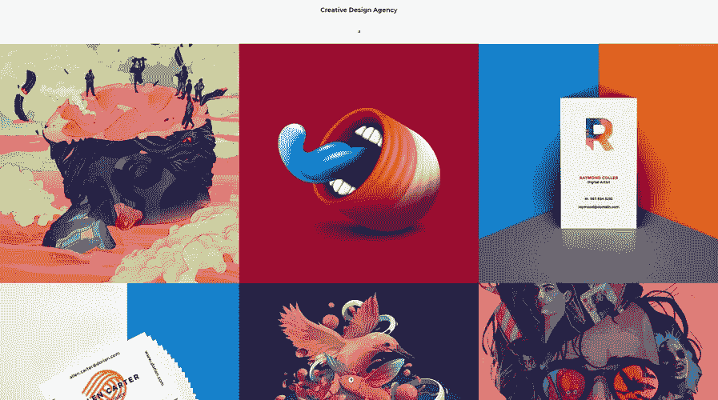

就设计、布局和内容而言，**一个好的极简网站加载速度更快，**比一个复杂的网站需要更少的服务器资源，更有效地优化用户体验。这是极简网页设计成为大趋势的主要原因。

然而，创建一个有效的极简网站并不容易。

如果你是极简主义网站设计的超级粉丝，或者想设计一个出色的极简主义网站，下面是 30 个最好的 HTML5/CSS3 极简主义网站模板、例子和设计原则，供你参考。

**目录:**

*   30 个最佳 HTML5/CSS3 极简网站模板和示例
*   2019 年打造美丽简约网站的 5 条最佳原则

# 少即是多:30 个最好的 HTML5/CSS 极简网站模板&例子

一个将极简主义运用到极致的网站，总是默默的向我们展示一个设计真理:“少即是多”。但是，作为一名网页/应用程序设计师，你如何做到这一点呢？我们希望这个包含 30 个最好的免费 HTML5/CSS 极简网页模板和例子的设计集能给你一些启发:

# 1.豪雅 HTML5/CSS3 极简网站模板动画

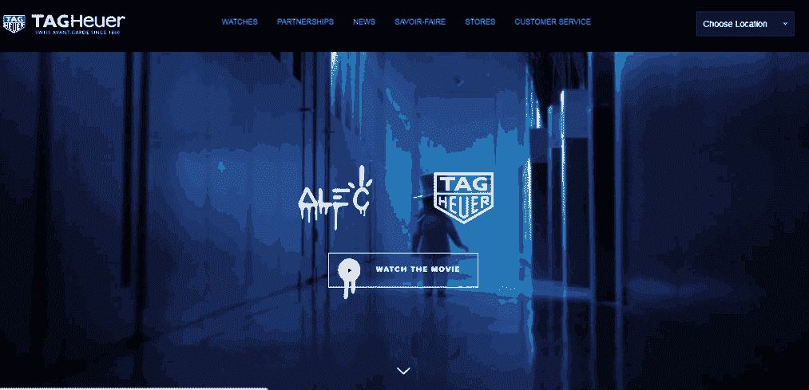

**设计师** : Bonhomme

**网页类别**:观看网站

**评分**:**★★★★**

**亮点**:可爱动画；全屏视频背景

这是一个专为时尚酷炫的手表品牌打造的极简主义网站，这个简单的动画网站示例在其登录页面上使用全屏视频背景来吸引用户。

它用可爱的动画展示其时尚的手表，使整个设计非常有趣。

深色背景突出了列出的产品，并有助于该网站的豪华，优雅的空气。有助于为网站营造奢华、优雅和时尚的氛围。

[在线预览](https://www.awwwards.com/sites/tag-heuer-alec-monopoly)

**相关文章** : [8 个最佳 CSS 动画网站& HTML 动画](https://www.mockplus.com/blog/post/best-animated-websites)

# 2.Kolaps 机构交互式极简网站模板

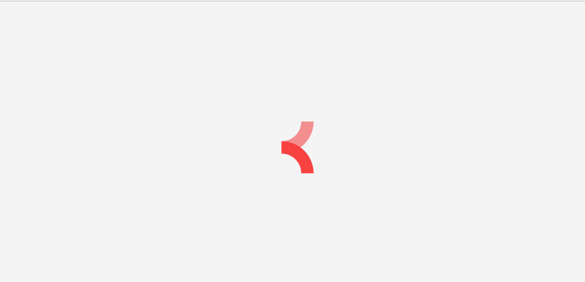

**设计师** : Kolaps 机构

**网页类别**:设计机构网站

**评分** : **★★★★**

**亮点**:互动网站设计；小动画

为一个位于巴塞罗纳的 UI/UX 设计机构设计的网站，这个模板有一个干净的交互式登陆页面。

聚集在背景中的抽象鸟类动画给沉闷的静态网站带来了生命，创造了一个引人注目和充满活力的网站设计。

此外，这些鸟会随着鼠标光标的移动而相应地聚集和分散，这的确是非常有趣的动画用法。

[在线预览](https://www.awwwards.com/sites/kolaps-agency)

# 3.Eclipse HTML5/CSS3 响应式极简网站模板

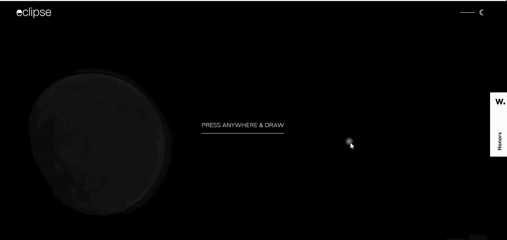

**设计师**:月蚀

**网页类别**:设计机构网站

**评分**:**★★★★**

**亮点**:丰富的悬停效果；黑色&白色配色

这个反应灵敏的极简主义网站示例具有丰富的鼠标悬停效果，以展示其设计项目和机构信息。

基本的黑白配色方案为网站增添了创造性的神秘气氛。

[在线预览](https://www.awwwards.com/sites/eclipse)

**相关文章** : [12 个打造酷黑&白色网站的最佳范例和技巧](https://www.mockplus.com/blog/post/black-and-white-website-design)

# 4.Felix Lesouef 极简作品集网站模板

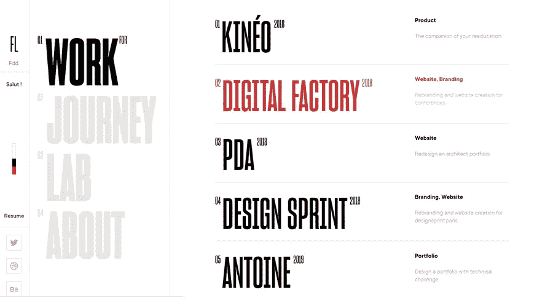

设计师:菲利克斯·勒苏夫

**网页类别**:设计师作品集网站

**评分** : **★★★★**

**高亮显示**:只有文本的清晰视觉层次

当设计一个网站时，即使只使用文本，仍然有可能创造出具有清晰直观的视觉层次结构的有美感的东西。这可以通过改变文本的颜色、大小、字体和排版来实现。

这个极简主义作品集网站遵循了这一理念，取得了惊人的成果。

[在线预览](https://www.awwwards.com/sites/felix-lesouef-portfolio)

**相关文章** : [在网站设计中创造视觉层次的最佳技巧和范例](https://www.mockplus.com/blog/post/ui-visual-hierarchy)

# 5.带有 CSS3/HTML5/JQuery 的拟人化极简网站

设计师:克里斯·卡鲁泽斯

**网络类别**:数字咨询网站

**评分** : **★★★**

**亮点**:交互式人脸设计

这个 CSS3/HTML5/JQuery 网站在它的登陆页面上有一个交互式的人脸设计。她的眼睛随着鼠标光标移动，赋予了体验不同的维度。

这令人印象深刻，虽然一些设计师认为这也使网站有点令人毛骨悚然。

你怎么想呢?

[在线预览](https://www.awwwards.com/sites/anthropomorph)

# 6.集会互动极简网站示例

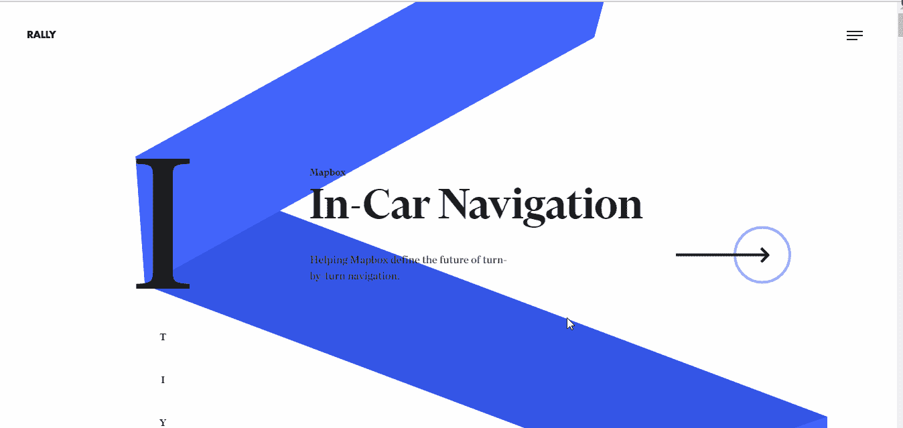

**网页类别**:数码产品工作室网站

**评分** : **★★★★**

**亮点**:优秀的字母导航条

这个交互式极简网站的例子有一个简单的导航栏，仅由大写字母组成。即使没有额外的解释，用户也可以轻松地在这些字母之间切换，以阅读不同的项目信息。

此外，背景颜色会随着页面的切换而同步变化，从而为用户带来友好的体验。

[在线预览](https://rallyinteractive.com/)

# 7.初学者声纳最小摄影网站模板

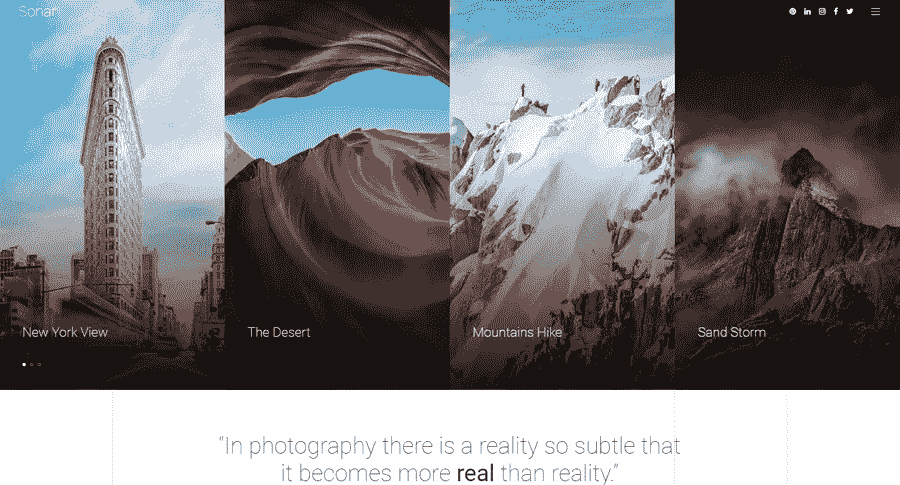

**网页类别**:摄影网站

**评分** : **★★★**

[使用 Mockplus 构建更快、更智能、更简单的原型](https://www.mockplus.com/?hmsr=blogm)

[免费开始](https://www.mockplus.com/?hmsr=blogm)

**高亮显示**:水平滚动图库

对于一个摄影网站来说，漂亮而有特色的照片是吸引用户最有效的武器。该模板利用了这一点，在其登录页面上使用水平滚动的图片库来展示其创造性的照片作品。

如果你是摄影新手，这个简单的网站模板是一个完美的选择。

[在线预览](https://colorlib.com/wp/template/sonar/)

**相关文章** : [22 最佳免费 Adobe Photoshop 初学者教程](https://www.mockplus.com/blog/post/photoshop-tutorials-for-beginners)

# 8.免费自助极简组合网站模板

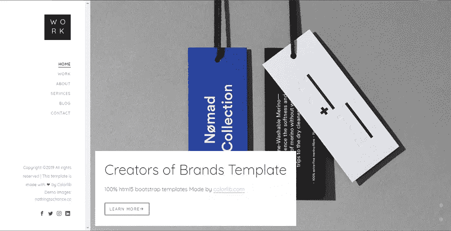

**网页类别**:作品集网站

**评分** : **★★★**

**亮点**:易用的侧面导航栏；单页设计

这个自举网站模板有一个非常清楚，坚持和方便的侧导航栏，使整个网站设计干净，易于使用。单页设计也有助于提升 UX。

[在线预览](https://colorlib.com/wp/template/work/)

**相关文章** : [打造完美网站的 10 个最佳单页设计模板](https://www.mockplus.com/blog/post/one-page-design)

# 9.Hlebozavod 9 HTML5/CSS3 极简网站模板

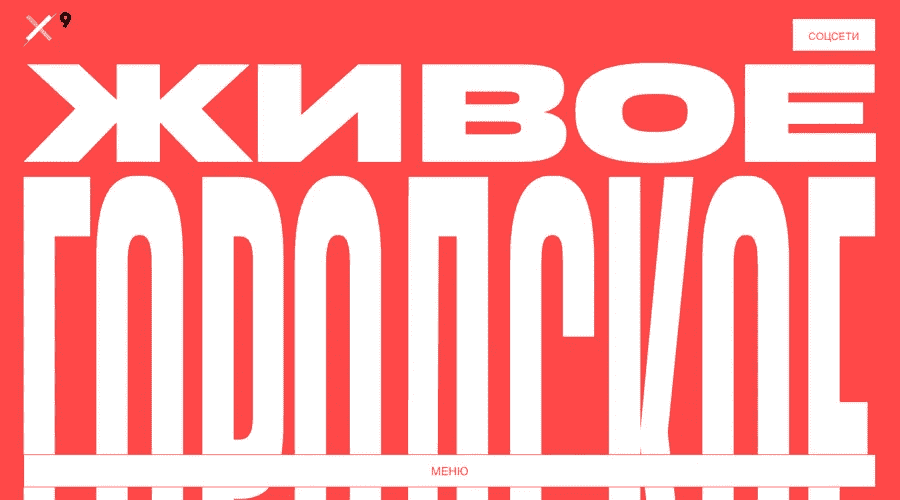

**设计师**:白俄罗斯人

**网站类别**:文化&教育网站

**评分** : **★★★★**

**亮点**:大字体设计

对于设计师来说，使用大字体设计已经成为创建一个简单而醒目的极简网站的最简单的方法之一。

这个网站模板遵循了这一理念，并使用非常大和大胆的字体在其登录页面上给用户留下深刻印象。

对于设计师来说，为他们的企业创建一个时尚而引人注目的网站是一个很好的例子。

[在线预览](https://www.awwwards.com/sites/hlebozavod-9)

**相关文章** : [最佳版式设计网站&创建醒目网页的教程](https://www.mockplus.com/blog/post/typography-design)

# 10.Pofo HTML5 /CSS3 极简网站模板

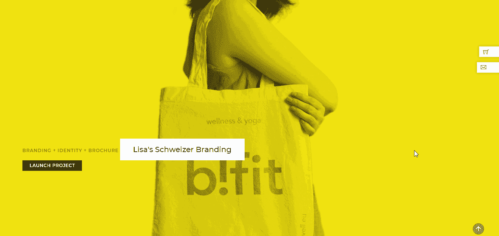

**网页类别**:作品集网站

**评分** : **★★★★**

**亮点**:绚丽明亮的色彩组合

除了干净、无装饰的网络界面，这个 HTML5/CSS 响应组合网站还具有醒目的亮色组合。

在滚动页面的同时，背景颜色随着页面内容同步变化，相当可观。

[在线预览](https://themeforest.net/item/pofo-creative-agency-corporate-and-portfolio-multipurpose-template/20645944?ref=cirvitis)

# 11.美人蕉 HTML5 引导极简网站模板

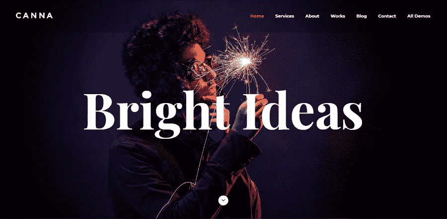

**网页类别**:商业网站

**评分** : **★★★★**

这个灵活的 bootstrap 网站模板具有高质量的照片库和动画文本。它为用户提供了 12 个主页选项和 6 种预定义的配色方案。用户可以根据需要自由选择任何人。

[在线预览](https://themeforest.net/item/canna-creative-multipurpose-html-template/19994959?ref=cirvitis)

# 12.我可怜的大脑极简网站的例子

**网页类别**:作品集网站

**评分** : **★★★★**

**高亮显示**:清除网格布局

这个简单的网站例子创造性地设计了一个非常干净的网格布局，创建了一个直观和易于掌握的网站。

[在线预览](http://www.mypoorbrain.com/)

# 13.Flwr 干净简单的网站模板

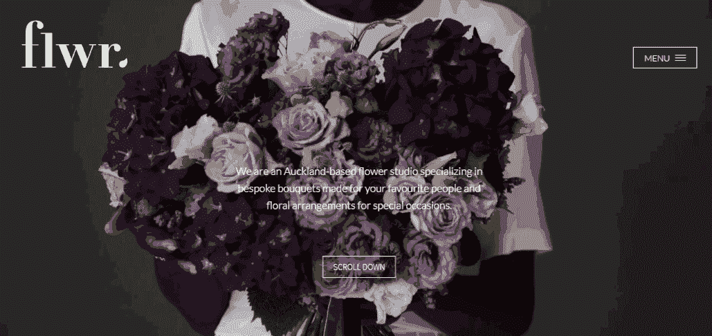

**网站类别**:花卉工作室网站

**评分** : **★★★★**

**亮点**:甜美视频背景

这个干净简单的花艺工作室例子用一个甜美的视频背景打动了每一个访问这个网站的人。

背景视频展示了工作室制作的花束，与特色人群相结合，以一定的活泼性感染用户，使他们开心并“忘记”离开。

这就是一个好的鲜花网站应该有的魔力吧？

[在线预览](https://www.awwwards.com/sites/flwr)

# 14.Zuka 清洁最小自举 4 网站模板

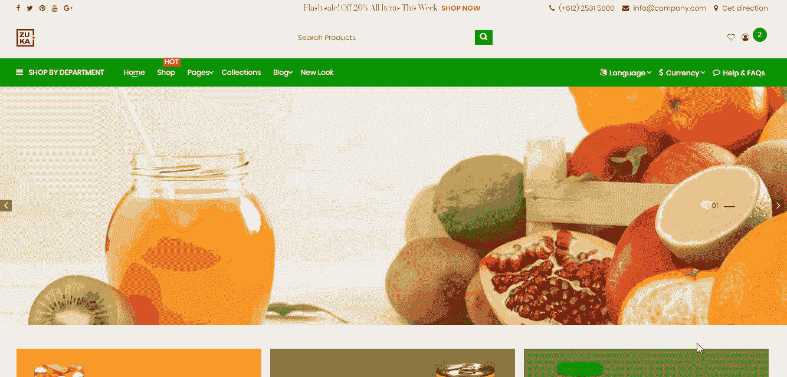

**网站类别**:电子商务网站

**评分** : **★★★★**

**亮点**:创意页面过渡效果

这个简洁的网站模板是一个完美的例子，让你学习如何为你的电子商务网站设计一个独特的页面过渡效果。

[在线预览](https://themeforest.net/item/zuka-clean-minimal-ecommerce-bootstrap-4-template/23086741?ref=cirvitis)

**相关文章** : [20 个免费网页过渡实例给你灵感](https://www.mockplus.com/resource/post/20-free-page-transition-examples-for-your-inspiration)

# 15.保罗·普伦丁响应最小摄影网站模板

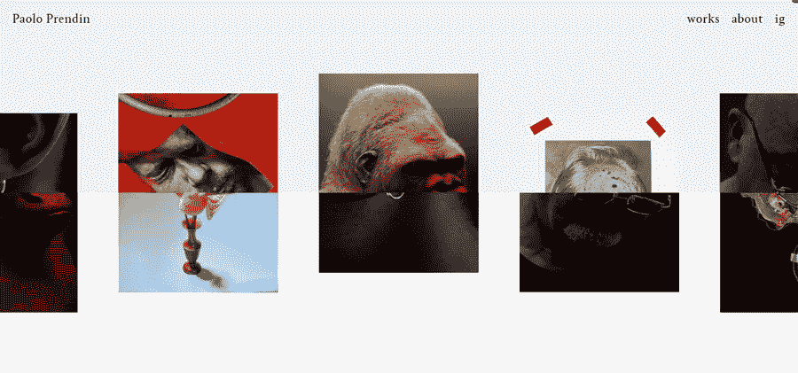

**网站类别**:摄影网站

**评分**:**★★★★**

**亮点**:展示网站照片的创意方式

与一些使用全屏照片库来展示所有照片作品的摄影网站不同，这个网站示例使用了一种独特而有创意的方式来展示其网络照片。

用户可以轻松滚动鼠标，一次查看更多照片。

[在线预览](https://www.awwwards.com/sites/paolo-prendin)

# 16.Skylith 干净的 HTML 组合网站模板

**网站类别**:作品集网站

**评分**:**★★★★**

**亮点**:精美插画设计风格

这个 HTML 组合网站模板使用了华丽的外观插图设计。如果你想要一个真正美丽而简单的商业网站，这个模板是不会错的。

[在线预览](https://themeforest.net/item/skylith-viral-creative-multipurpose-html-template/21214857?ref=cirvitis)

# 17.DC 沙龙产品 CSS3 极简网站模板

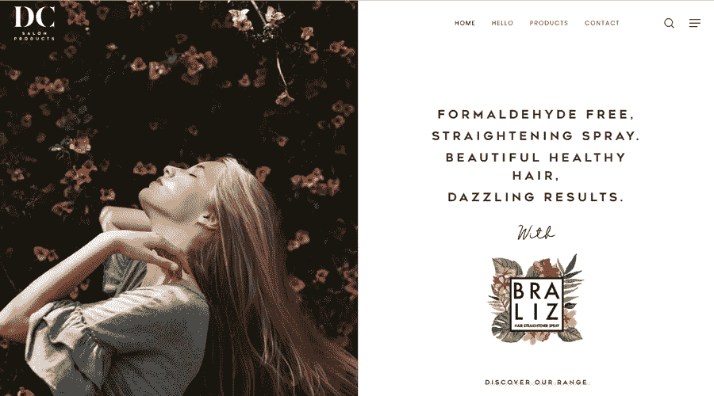

**设计师**:创作设计

**网站类别**:时尚网站

**评分** : **★★★★**

**亮点**:两栏布局设计

本 CSS3 沙龙网站模板采用两栏布局设计，打造直观现代的网站。

一个专栏是用来展示网站产品和服务的照片。另一个可用于显示文本、CTA 按钮和更全面设计所需的其他元素。

[在线预览](https://www.awwwards.com/sites/dc-salon-products)

# 18.Aoko 创意 HTML 极简网站模板

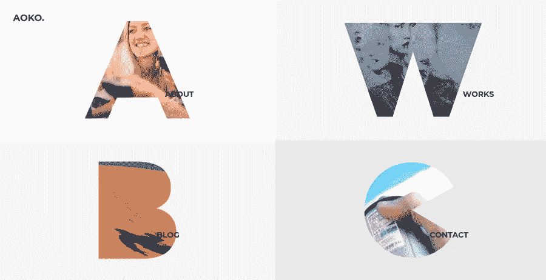

**网站类别**:设计机构网站

**评分** : **★★★★**

**亮点:**创意字母叠加设计

这个干净的 HTML 网站使用四个大字母覆盖在视频背景上，展示其不同的页面类别，创建了一个现代、时尚和令人惊叹的网站。

[在线预览](http://preview.themeforest.net/item/aoko-creative-html-template/full_screen_preview/21169471)

# 19.马古康普茶极简电子商务网站模板

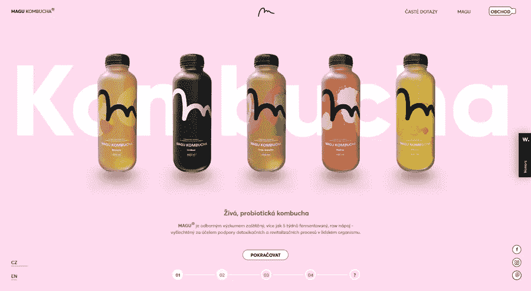

设计师:汤姆·加西

**网站类别**:美食&饮品网站

**评分** : **★★★★**

当以用户为中心创建一个简单、流畅的网站时，直接展示产品总是有意义的。这个电子商务网站模板遵循这一理念，使其非常用户友好和实用。

[在线预览](https://www.awwwards.com/sites/magu-kombucha)

# 20.我的 360 镜子 CSS3/HTML5 极简网站模板

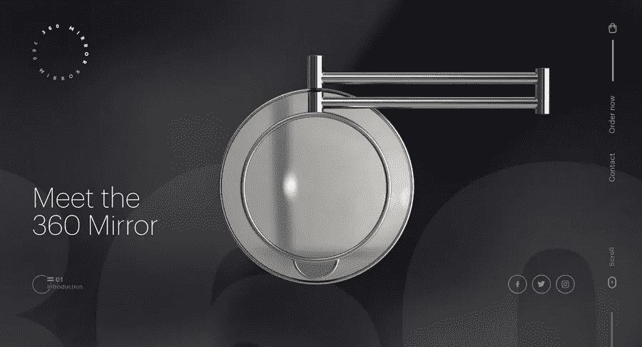

**网站类别**:商业网站

**评分**:**★★★★**

这个极简主义的网站有一种高端、现代的感觉，这是通过使用 3D 技术来展示其镜子产品实现的。

[在线预览](https://www.awwwards.com/sites/my-360deg-mirror)

# 更多创意极简网站模板和例子

# 21.Medisorb 极简网站模板

[在线预览](https://www.awwwards.com/sites/medisorb)

# 22.Bachood 设计极简网站示例

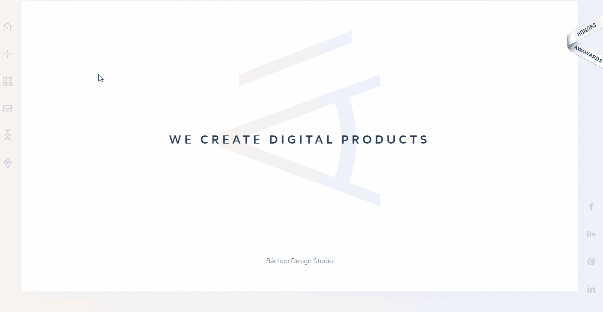

[在线预览](https://bachoodesign.com/)

# 23.Mahabis 极简 CSS 网站示例

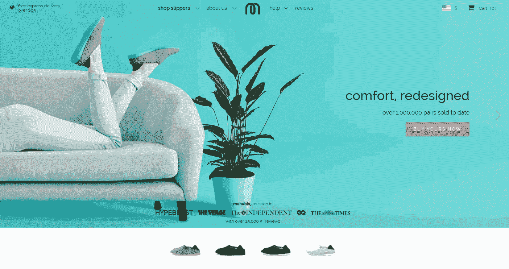

[在线预览](https://mahabis.com/)

# 24.无所求的响应干净的网站模板

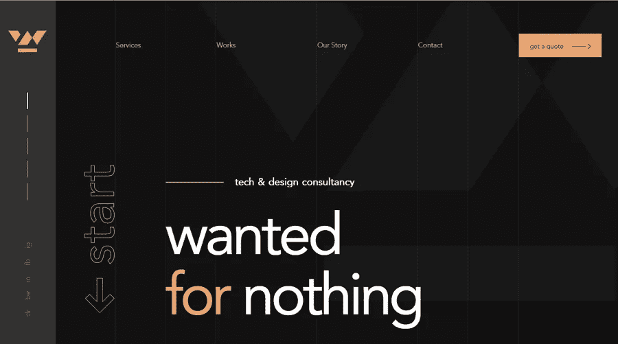

[在线预览](https://www.awwwards.com/sites/wanted-for-nothing)

# 25.Van Cleef 响应式极简主义网站模板

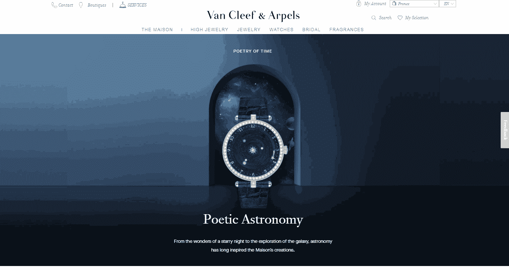

[在线预览](https://www.awwwards.com/sites/vca-poetic-astronomy)

# 26.Greensight CSS3 Responsive Clean 网站模板

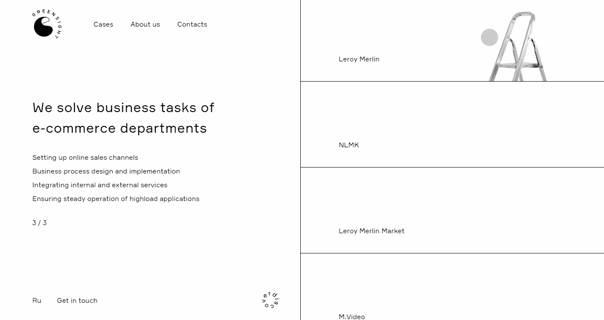

[在线预览](https://www.awwwards.com/sites/greensight)

# 27.牛排店清洁网站模板

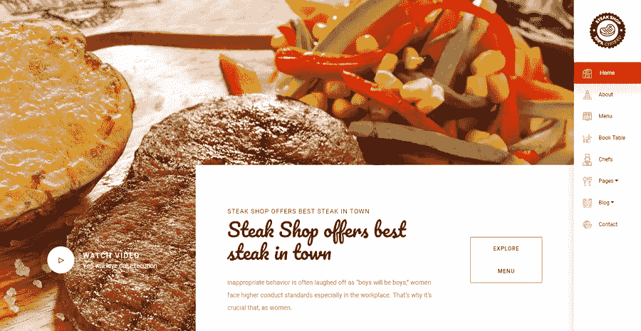

[在线预览](https://colorlib.com/wp/template/steakshop/)

# 28.Cenus 现代简约主义网站模板

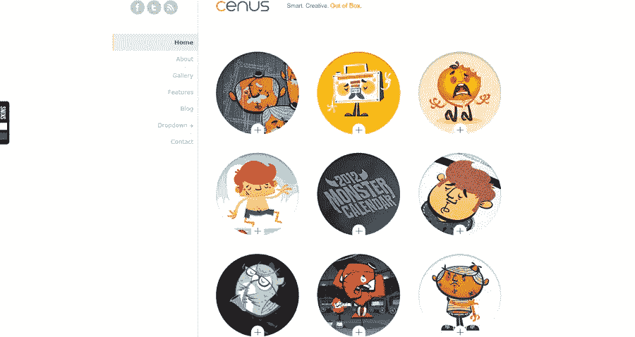

[在线预览](https://themeforest.net/item/cenus-modern-minimalist-website-template/480470)

# 29.Olivier Ouendeno 响应式投资组合网站模板

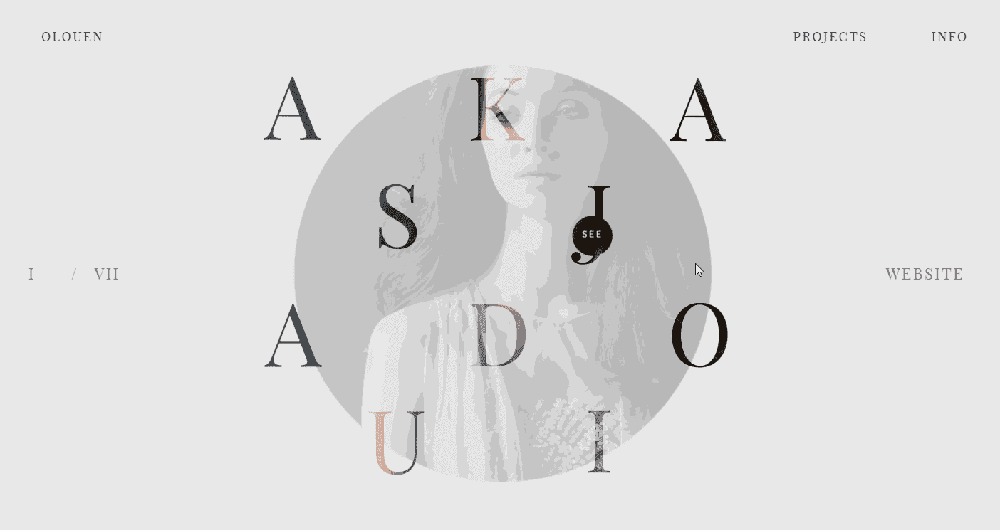

[在线预览](https://www.awwwards.com/sites/olivier-ouendeno-portfolio)

# 30.滋养吃 CSS3 极简网站模板

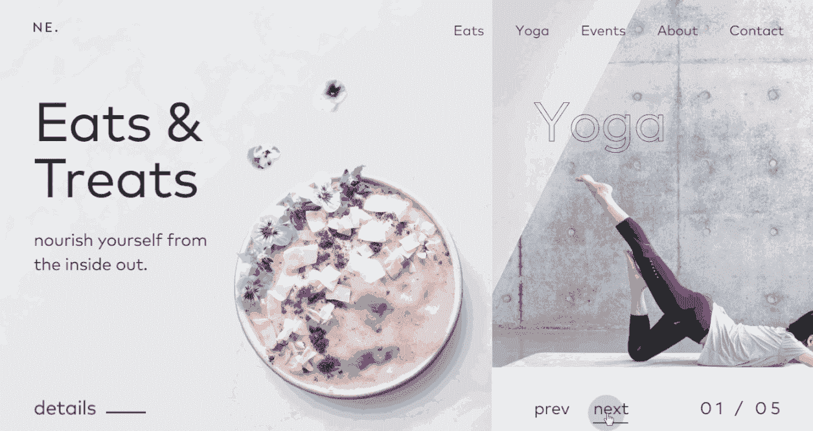

[在线预览](https://www.awwwards.com/sites/nourisheats-by-joanna-l)

我们希望你会发现这些干净简单的网站模板(适合初学者和专家)对你的下一个极简项目有用。

# 2019 年打造美丽极简网站的 5 个最佳原则

尽管极简主义网站设计是一种少的艺术，但这并不意味着设计师应该简单地去除尽可能多的网站/页面元素。为了创建一个漂亮、简单而又实用的网站，他们还应该遵循极简主义网页设计的最佳原则:

# 1)使用大量的空白空间

充足的白色空间总是有助于突出网站内容，吸引用户对产品/服务的注意。

# 2)选择好的配色方案

一个好的色彩组合不仅可以让一个极简的网站变得漂亮，而且有助于一个清晰的布局，这是抓住和保持用户注意力所必需的。

# 3)用独特的字体和排版丰富你的网站

独特的字体和排版很容易帮助创建一个优雅或个性化的极简网站。如果你做得好，即使你只使用字体和排版，你仍然可以创建一个优秀的网站，让用户无法抗拒。

# 4)用图片简化你的网站

在设计一个极简的作品集/摄影/艺术网站时，图片有助于简化你的设计过程，给用户留下深刻印象。

# 5)用正确的原型和协作工具迭代你的极简网页设计

当从事一个极简主义网站设计项目(或任何类型的设计)时，选择正确的原型和协作工具是至关重要的。这样做会简化你的流程，基本上让你的生活更轻松。

比如在测试和迭代你的极简网页设计思路的同时， [**Mockplus**](https://www.mockplus.com/) 就派上用场了。它是一个实用的原型制作工具，可以让你轻松高效地制作原型、测试、迭代、分享和展示你的设计。

在与设计师和开发人员团队合作时， [**Mockplus iDoc**](https://idoc.mockplus.com/?hmsr=snowm) 是一款方便的协作工具，可让您和您的产品团队上传、评论、测试、迭代和交付带有自动资产、规格和代码片段的设计。

 [## Mockplus iDoc |在线设计协作工具和设计移交

### iDoc 是面向 UI 设计师和前端开发者的在线设计协作工具。它连接您的设计…

idoc.mockplus.com](https://idoc.mockplus.com/?hmsr=snowm) 

# 总结:

网站设计中的极简主义总是意味着使用更少的元素来创建一个更简单、更干净、更实用的网站。

我们希望这 30 个最好的免费极简主义网站模板、例子和设计原则的集合能启发你为你的商店或产品建立一个有吸引力和有效的网站。

**相关文章** : [最佳设计秘诀&制作极简网页的范例](https://www.mockplus.com/blog/post/minimalist-web-design)

 [## Html5 -黑客正午

### 阅读黑客正午关于 Html5 的文章。黑客如何开始他们的下午？

hackernoon.com](https://hackernoon.com/tagged/HTML5)  [## CSS -黑客正午

### 阅读黑客正午关于 CSS 的文章。黑客如何开始他们的下午？

hackernoon.com](https://hackernoon.com/tagged/css)