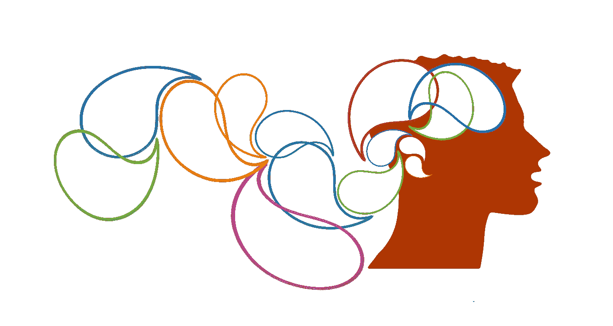
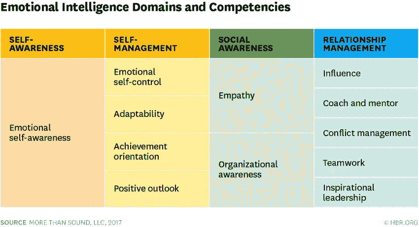

# 用情绪智力减轻看门人和冒名顶替综合征

> 原文：<https://medium.com/hackernoon/mitigating-gatekeeping-and-impostor-syndrome-with-emotional-intelligence-1c837ba88d0b>

你有时会觉得你永远不会知道足够成为一个真正的软件工程师吗？你有没有和经验丰富的工程师交流过，他们让你觉得你在这个行业里不会成功？

软件开发是一项内在的智力努力——它需要你学习许多惯例，能够遵循严格的逻辑规则，并持续地交付一个功能产品。因此，有很多外部和内部的判断强加给软件工程师。对于那些试图成为或刚刚开始进入这个领域的人来说，负面的外部判断通常以守门人的形式出现，而负面的内部判断通常以 T2 冒名顶替综合症的形式出现。

在本文中，我探讨了这两种现象及其对新工程师的有害影响。除了讨论这些现象，我还会讨论一个管理(并从中受益)你在职业生涯中将面临的这些和其他形式的逆境的关键技巧:运用*情商*。

**注意:**虽然这篇文章是针对新工程师和初级工程师的，但应该注意的是，所有级别的工程师都会经历守门和冒名顶替综合症。

# 什么是守门？

看门人是一个口语术语，用来表示贬低或拒绝某人关于某个主题的知识的行为，从而阻止他或她的参与。在软件开发的背景下，你会看到这种情况以多种形式出现。以下是一些你或你认识的人可能非常熟悉的例子:

*   如果你不懂[X]语言，你就不是一个真正的开发者！
*   我不能相信你想象自己是一个开发者问这样的问题！
*   如果你没有学位，我怀疑你能否胜任工程师的工作。

这些都是显而易见的例子，但是守门通常是相当微妙的。例如，在一个帮助论坛上否决一个问题可能会阻碍以后的提问，并且会让一个新来的人很尴尬。

> 这些都是显而易见的例子，但是守门通常是相当微妙的。

如果至少有一个潜在的工程师仅仅因为寻求帮助时的糟糕经历而被拒之门外，我不会感到惊讶！

# 守门的盛行

不幸的是，把关在发展世界中非常普遍。April Wensel 在她的文章[中痛苦地描述了她的经历，科技有一个有毒的音调问题——让我们来解决它！](https://compassionatecoding.com/blog/2016/8/25/tech-has-a-toxic-tone-problemlets-fix-it):“这些年来，我听到同事们称其他工程师或面试候选人为“白痴”，他们“不能从纸袋中找出编程的方法”。“我见过初级工程师提问时的眼球转动。我听过对训练营毕业生或自学程序员的评判性评论。”

在这个行业如此消极的情况下，难怪我们开始严重怀疑自己的能力——这通常被称为骗子综合症。

# 什么是冒名顶替综合症？

冒名顶替综合征可以被认为是自我守门:一种“心理模式，在这种模式中，个人怀疑自己的成就，并对被暴露为‘骗子’有一种持续的内在恐惧。”"([维基百科](https://en.wikipedia.org/wiki/Impostor_syndrome))。从我的经验来看，冒名顶替综合症也相当普遍(肯定足以拥有自己的维基百科页面！).如果你是一名患有冒名顶替综合症的工程师，以下自我怀疑的想法可能很熟悉:

*   当然，我让应用程序工作，但主要是通过使用我在网上找到的代码。
*   在我理解[X]之前，我不能被认为是一个好的开发人员。
*   简知道的比我多得多，我永远也赶不上她。

在第一个场景中，你已经开发了一个应用程序，这一成就归功于你搜索答案的能力(注意:我们都搜索答案)。在第二种情况下，你发现了一个需要改进的地方，但不一定承认你已经拥有的所有优势。在最后一种情况下，你将自己与他人进行比较，尽管出于各种原因这不是一个好主意(例如，此人可能有更多的经验，你可能高估了此人的知识，此人也有自己的不足之处，对此她可能会有自知之明)。

# 冒名顶替综合症的流行

冒名顶替综合症在科技行业非常普遍。我自己和我的许多同事都经常经历这种情况。虽然这只是我的经验证据，但这种普遍现象已经得到了证实:一项调查发现[超过 57%的科技专业人士受到冒名顶替综合症的影响](https://jaxenter.com/impostor-syndrome-survey-149402.html)。

# 守门和冒名顶替综合征的综合效应

人们只能想象看门人和冒名顶替综合症的综合心理效应。我们中的许多人都有冒充综合征形式的自我怀疑。这种自我怀疑只会得到加强，其影响会因外部把关刺激而加剧。此外，如果一个初级工程师想学会减少冒名顶替综合症，他们可能会因为害怕有毒门卫而不敢向高级工程师提问。

我们需要做得更好。但是…

# 外界的批评都是不好的吗？

外界的批评都是不好的吗？显然不是——在理想情况下，我们都有导师帮助我们在职业生涯中学习。导师给你正面的批评；强调你可以改进的地方，并提供资源帮助你成长。虽然批评很少以这种形式出现，但如果我们能收获好东西，外部批评显然是有用的！

# 所有的自我怀疑都是不好的吗？

所有的自我怀疑都是不好的吗？这一点不那么明显，但答案仍然是否定的。在你职业生涯的开始，自我怀疑对学习至关重要。在这个阶段，你不是一个冒名顶替者，但你是一个初学者，没关系！如果你没有自我怀疑，你就没有动力去改进。这可能导致过度膨胀的自我和职业停滞。

# 情绪智力是解决守门人和冒名顶替综合征难题的关键

到目前为止，我们已经确定守门是负面的外部反馈，冒名顶替综合症是负面的内部反馈。我们还发现，各种外部和内部反馈都有积极的效用。我现在提议将情商作为一种工具，在你的软件工程职业生涯中收到这种反馈时，帮助你生存和发展。

# 什么是情商？

情商是指识别和管理自己的情绪，以及他人情绪的能力([心理学今](https://www.psychologytoday.com/us/basics/emotional-intelligence))。简而言之，情商可以帮助你解读内部和外部反馈，而不是毫无疑问地接受它告诉你的东西。作为一个题外话，你可以想象这将如何在生活的各个方面有所帮助，而不仅仅局限于你的软件工程生涯！

情商可以帮助你辨别有用和无用的外部反馈(例如，导师给你的建设性批评可能是有用的反馈，你应该保留，网上告诉你你不够聪明，不能成为开发人员的巨魔是无用的，扔掉它)。

# 怎样才能发展情商？

作为软件工程师，我们最好的品质之一往往是反复练习和尝试解决问题直到我们成功的能力。我建议我们考虑用同样的方式发展情商:通过实践。为了考虑我们如何做到这一点，首先我将分解情商的不同组成部分(根据一个流行的模型)，然后我将从每个组成部分的角度考虑一个场景。

> 作为软件工程师，我们最好的品质之一往往是反复练习和尝试解决问题直到我们成功的能力。我建议我们考虑用同样的方式发展情商:通过实践。

情商可以分为四个领域，每个领域都有不同数量的能力。

Emotional Intelligence Domains and Competencies. Source: [Harvard Business Review](https://hbr.org/2017/02/emotional-intelligence-has-12-elements-which-do-you-need-to-work-on).

情商的领域和能力是:

*   自我意识:情绪上的自我意识
*   自我管理:情绪自控、适应性、成就取向、积极观
*   社会意识:同理心，组织意识
*   关系管理:影响力，教练和导师，冲突管理，团队合作，和鼓舞人心的领导

让我们定义每项能力，然后将它们应用到一个场景中。

**注意:**虽然关系管理领域极其重要，但对于本练习来说，它可能有点过于面向管理，在本文的剩余部分，我将重点关注其他领域。

**情绪自我意识:**了解自己情绪的能力，了解情绪如何影响自己的表现。

**情绪自控:**管理破坏性情绪和冲动的能力。

适应能力:适应新环境的能力。

**成就取向:**个人如何对目标做出反应，追求卓越。

**积极的观点:**看到人、环境和事件积极一面的能力。

**同理心:**从他人的角度看待事物的能力。

**组织意识:**理解一个团队/团体的情绪和理解一个组织动态的能力。

既然我们已经设计了这些能力，让我们考虑一个可以实践它们的应用的场景。

# 场景:沮丧的同事

*你是一家公司的初级开发人员，从事一个比开发计划落后一个月的 web 应用程序的开发。你本身没有软件工程背景，但是作为 QA 团队的一员，你最终会编写大量自动化测试的代码。你的老板对你的工作印象深刻，他要求你以初级工程师的身份加入开发团队！你不明白为什么你的代码不能按预期运行，所以你问你的更资深的同事发生了什么。他沮丧地告诉你，任何有能力的 JavaScript 开发人员都理解异步性。*

呀！你的直觉可能会认为你有问题——你应该天生就了解 JavaScript 的这一方面。让我们有条不紊地应用上面讨论的每一项能力，而不是立即对这种负面输入做出反应。

**情绪自我意识:**我是一个敏感、不对抗的人。如果有人对我出言不逊，我会为此痛打自己一顿。因为这是我的倾向，我必须特别认识到我的本能，因为这一事件而痛打自己。

情绪自制力:面对这种情况，我可能会做出战斗或逃跑的反应。我可能会因为这位同事对我不好而对他大喊大叫，或者反过来说，辞职，因为我显然不够好。我不应该采取这些行动。“一切都会过去的”在这里也适用。

适应性:我的场景改变了吗？也许这是一种行为模式，我意识到我不能向这位同事寻求帮助。

**成就导向:**我的努力到现在都有回报了。我很有动力正确地完成工作，并得到了管理层的奖励。我主动完成任务，包括提问。与我的其他经历相比，我同事的负面反馈就相形见绌了。

**积极展望:**我同事的反应并不太好，但是——他给了我一个很好的建议！我需要研究 JavaScript 中的异步性。尽管表达很差，但他给了我一个开始回答问题的机会！

> 但是——他给了我一个很好的建议！我需要研究 JavaScript 中的异步性。尽管表达很差，但他给了我一个开始回答问题的机会！

**感同身受:**这位同事压力很大。他在这个项目上没有任何高层的支持。他很可能会把我出现在这个项目中看作是他没有得到他所需要的支持的又一个信号。他的反应是不恰当的，但我能理解他的想法。

**组织意识:**团队疲惫不堪。开发工作似乎被错误地引用了，现在我们已经落后于计划并且超负荷工作了。在这种环境下，人们会变得暴躁，这不是没有道理的。

# 实时进行所有这些分析真的可行吗？

不是主动的，不是。但是，虽然几乎不可能实时做到这一点，但可以考虑在需要时将其追溯应用到您遇到的场景。例如，如果有人在网上的问题论坛上贬低你，那就拿出情商能力的清单，花一点时间考虑每一项。如果你的工作场所有人质疑你在某个问题上的知识，那晚拿出情商能力的清单，从每个人的角度考虑他们之间的互动。

最终，这种练习会让你通过这些镜头实时看到互动。

# 结论:控制你能控制的

我们无法控制别人如何对待我们。守门是当今开发环境中不幸的一部分。希望行业可以做得更好，消除或大大减少把关，但在此之前，你应该努力控制你可以控制的东西:你对外部输入的反应和解释。骗子综合症的感觉也是如此。你不一定能控制这些不安全感和欺骗感，但是你可以努力去应对和解释它们。通过运用情商，你可以显著缓解这些现象。