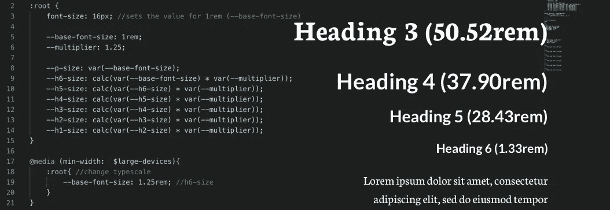

# 带普通 CSS 的模块化和动态类型秤

> 原文：<https://medium.com/hackernoon/modular-and-dynamic-type-scales-with-plain-css-41f86197bdf0>

字体缩放可能很难维护，但 CSS 自定义属性会有所帮助。



如果你曾经设计过字体标尺，你就会知道，像网格一样，它需要大量的计算。因此，如果结构不正确，类型标尺也会导致代码混乱和难以维护。

正如 [Mikolaj Dobrucki 在他的 *CSS 窍门*](https://css-tricks.com/responsive-designs-and-css-custom-properties-building-a-flexible-grid-system/) 文章中所展示的，定制属性的动态性使它们成为定义响应性和灵活性网格样式的绝佳选择。然而，Dobrucki 的文章并没有考虑到定制属性也是一个为您的响应式类型标度构建代码的好选择。

# 为什么不用 Sass？

我不想把它写成一篇关于何时使用定制属性而不是预处理变量的文章。如果你对这个话题感兴趣，可以看看迈克尔·里思穆勒在《粉碎杂志》上的文章。然而，我认为在这里谈一谈我为什么使用自定义属性是很重要的，原因是范围。

与 Sass 变量不同，自定义属性的作用域是动态的。正如 Riethmuller 在他的文章中解释的那样:

> *自定义属性的工作方式不同。就自定义属性而言，动态范围意味着它们受继承和级联的影响。该属性被绑定到一个选择器，如果值发生变化，就像任何其他 CSS 属性一样，这会影响所有匹配的 DOM 元素。*
> 
> [*CSS 自定义属性策略指南，Michael Riethmuller*](https://www.smashingmagazine.com/2018/05/css-custom-properties-strategy-guide/)

当您试图在媒体查询中更改 Sass 变量的值时，您不能。相反，您创建了一个同名的不同变量。因此，在它之前的代码不会被更改，您必须再次重新声明该样式。

例如，如果您想在不同的断点处更改颜色，这将不起作用。

```
$color-change: blue; .sass-color { 
  color: $color-change; 
} @media (max-width: 700px) { 
  $color-change: red; 
}
```

相反，您需要这样做:

```
$color-change: blue; 
.sass-color { 
  color: $color-change; 
} @media (max-width: 700px) { 
  $color-change: red; 
  .sass-color { 
    color: $color-change; 
  } 
}
```

另一方面，当您在媒体查询中更改自定义属性的颜色时，您实际上是在更改 CSS 属性，并且在它之前的内容会根据级联规则进行更改。

```
.css-color { 
  --color-change: green; 
  color: var(--color-change); 
} 
@media (max-width: 700px) { 
  .css-color { 
    --color-change: red; 
  } 
}
```

如果你是一个同样喜欢实验的视觉型的人(像我！)，您可以查看这支代码笔，并尝试使用一些变量和属性。

[Check out the dynamic CSS Custom Properties example in Code Pen](https://codepen.io/zoracreates/pen/qGNVxd)

# 那么类型标度代码会是什么样子呢？

因为自定义属性是相当新的，并且最佳实践仍在开发中，所以有一些好的方法来处理类型缩放。这是我的方法。

通过设置`:root`字体大小开始。这将决定`rem`测量的值，我将使用它来确保一致性。如果不设置该值，大多数浏览器会将其设置为 16px。

```
:root { 
  font-size: 12px; 
}
```

之后，我们可以设置字体缩放的基本字体大小和缩放值。这些将被用来决定你最小的字体有多大，以及字体大小增加的比例。我推荐使用像 Type-Scale.com 这样的工具来确定你的基本尺寸和刻度值。

```
:root { 
  font-size: 12px; 
  --base-font-size: 1rem; 
  --scale: 1.25; 
}
```

稍后，我们可以使用 Calc 和自定义属性来为文字缩放逻辑创建函数。

```
:root { 
  font-size: 12px; 
  --base-font-size: 1rem; 
  --scale: 1.25; 

  --p-size: var(--base-font-size); 
  --h6-size: calc(var(--base-font-size) * var(--scale)); 
  --h5-size: calc(var(--h6-size) * var(--scale)); 
  --h4-size: calc(var(--h5-size) * var(--scale)); 
  --h3-size: calc(var(--h4-size) * var(--scale)); 
  --h2-size: calc(var(--h3-size) * var(--scale)); 
  --h1-size: calc(var(--h2-size) * var(--scale)); }
```

如果您想为小型和大型设备使用不同的字体大小，您可以简单地更改媒体查询中的`--scale`和/或`--base-font-size`的值。Joseph Mueller 在他的 [*Medium* 文章“探索反应型量表”](/sketch-app-sources/exploring-responsive-type-scales-cf1da541be54)中，就如何创建一个因设备而异的量表提出了一些建议。

```
@media (min-width: 900px){ 
  :root{
    --base-font-size: 1.25rem; 
    --scale: 1.33; 
  } 
}
```

最后声明文本元素的大小和样式。

```
body, p, ul, ol { 
  font-size: var(--p-size); 
  line-height: 1.5; 
  font-family: Helvetica; 
} h6, h5, h4, h3, h2, h1 { 
  font-weight: bold; 
  margin: var(--base-font-size) 0; 
  font-family: Georgia; 
} h6 { 
  font-size: var(--h6-size); 
} h5 { font-size: var(--h5-size); 
} h4 { 
  font-size: var(--h4-size); 
}h3 { 
  font-size: var(--h3-size); 
} h2 { 
  font-size: var(--h2-size); 
}h1 { 
  font-size: var(--h1-size); 
}
```

看看我的代码笔，看看这看起来像什么放在一起。

[Check out the type scale code in Code Pen!](https://codepen.io/zoracreates/pen/VOVJVK)

# 这种代码结构的优点

你们中的一些人可能认为这看起来有点过于复杂，但是根据你的项目，这样设置你的代码可以让你以后不那么头疼。这里有几个优点需要考虑:

**易于维护和更换**。比如我想稍后改变我的字体大小。我可以简单地改变`--base-font value`或`--scale`的值，而不是改变每一个字体大小来适应我的新比例，这将产生一个全新的内聚类型比例。

**自我记录。现在，如果你在团队中工作，我不建议跳过更多的正式文档。然而，通过以这种方式构造类型规模，您只需要引用`:root`声明块来查看类型大小之间的关系。**

**从声明中分离响应逻辑。通过以这种方式构建代码，你可以在上面为不同的设备设置逻辑，然后声明样式。造型时不需要担心媒体的询问。因此，即使你的代码更长，也可能更容易扫描和阅读。**

**可重复使用的响应式尺码。**假设我有一个非标题文本项，比如一个按钮内的文本，我希望它的大小与我的`h6`一样。我可以简单地重用`--h6-size`自定义属性。

```
button { 
  font-size: var(--h6-size); 
}
```

# 结论

虽然他们可能需要一些时间来适应，CSS 自定义属性提供了一种全新的方式来组织你的 CSS，使其更具可读性，模块化和可维护性。自定义属性的世界是相当新的，最佳实践仍在开发中，但我相信响应式排版是一个让他们参与进来的好地方。您认为使用自定义属性设置文字刻度有什么优点或缺点？

*原载于 2019 年 6 月 5 日*[*【https://www.zoracabrera.com】*](https://www.zoracabrera.com/blog/index.php/2019/06/05/modular-and-dynamic-type-scales-with-plain-css/)*。*