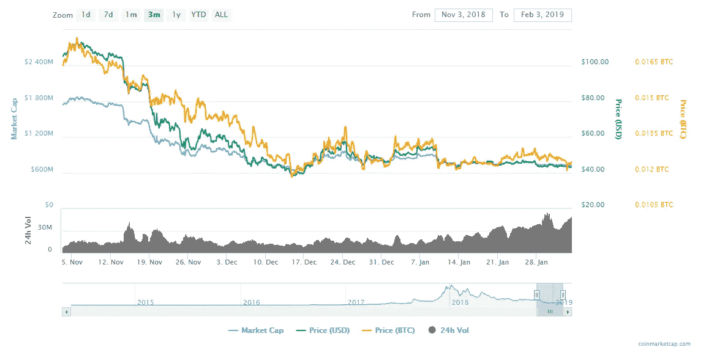
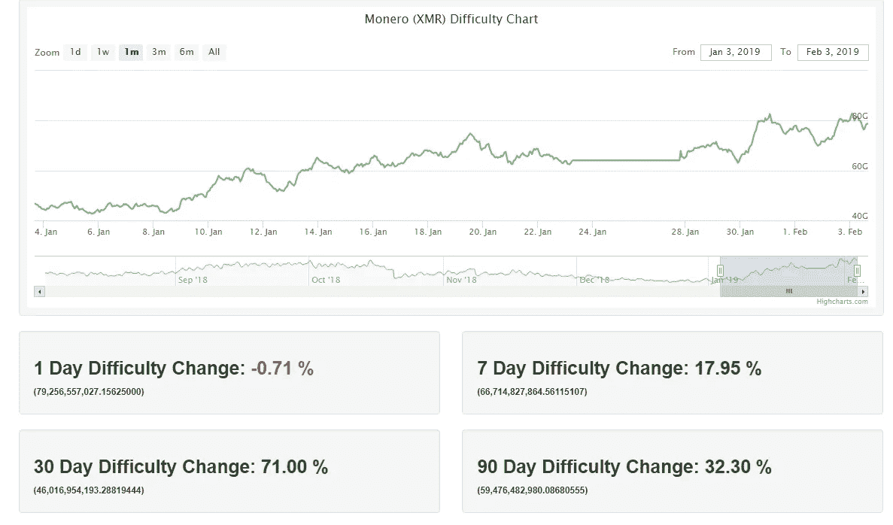

# Monero 网络可能显示出即将发动攻击的迹象

> 原文：<https://medium.com/hackernoon/monero-network-potentially-under-attack-8cdb4054fba8>

当区块链世界全神贯注于其他有新闻价值的故事时，从现在推迟的以太坊 hardfork 到 exchange hacks，Monero 矿工一直在紧张地注视着一个非常不寻常的现象在他们面前展开。Monero 曾经是我的一个非常有利可图的隐私币，在迄今为止最长的比特币熊市期间，像所有 PoW 币一样遭受了损失。但是那些关注网络的人正在挠头，因为利润在下降，而 hashrate 在上升。

# Monero 对 ASIC 矿商来说并不陌生

众所周知，Monero 是一个非常反 ASIC 的项目。事实上，仅在 2018 年，该项目就分叉了两次，以对抗 ASIC 矿工的崛起——一次是在 4 月，另一次是在 10 月，以更新的 Cryptonight V8 算法。这些分支导致了超过 5 个不同的 Monero 链，都承诺更好和更安全的功能…但正如所料，主要的 Monero 链最终占了上风。

Price has declined for three months straight, yet there is more hashpower pouring into the network.

# 盈利能力下降，hashrate 继续攀升至历史最高水平

在撰写本文时，Monero 徘徊在 40 美元大关上方，与其 720 美元的历史高点形成鲜明对比。尽管整个 ProgPOW 与 no Prog pow 的讨论仍在继续，以太坊对大多数矿商来说仍是微利的。另一方面，Monero 矿业目前并不盈利。客观来看，以太坊的 8 GPU AMD rx 580 采矿钻机每千瓦/小时 6 美分，每天盈利约 2 美元。即使有正确的低估设置，Monero 每天也会亏损 0.5 美元。像 Grin 和 BEAM 这样的 mimble coins 的盈利水平是该行业很长一段时间以来从未见过的。因此，7 . 2 亿美元的问题出现了:Monero 的哈希动力来自哪里？我们可以排除小型业余爱好者矿工，慢慢开始恢复 2018 年亏损的中型设施，以及已经转向 Mimblewimble coins 和/或仍在开采以太坊的大型企业 GPU 采矿业务。任何人现在开采 Monero 矿都是没有意义的，而且毫无疑问，hashrate 不降反升更令人费解。

# 可能的原因——这些神秘的矿工是谁？

1.  我将从最令人不安的可能原因开始:一个实体正在以巨大的损失将困难推高到前所未有的高水平，以排挤中小型 GPU 矿工。随着 GPU 矿工离开网络，这个实体(或一组恶意实体)正在悄悄地积累足够的哈希能力来执行 51%的攻击，类似于上个月发生的 ETC 攻击。
2.  一个实体已经为 Cryptonight V8 算法开发了一个高效且强大的 ASIC 挖掘器，推动了反 ASIC 硬币和 ASIC 生产商之间永无止境的猫鼠追逐。这个实体可以秘密采矿，直到它的时间倾倒在市场上的 ASICs。
3.  巨大的僵尸网络终于升级到了 Cryptonight V8，并且传播速度比以往任何时候都快。用外行人的话来说，僵尸网络是被黑客和脚本小子感染的计算机主机，根据病毒的复杂程度，它可以在你不知情的情况下完全控制你的计算机。这对于 Cryptonight V7 来说是一个巨大的问题，因为有报道称[多达 50 万台服务器](https://www.coindesk.com/botnet-infects-half-million-servers-mine-thousands-monero)被渗透进来秘密开采 Monero。当 Monero 切换到 Cryptonight V8 时，它基本上使所有被感染的计算机对 Monero 采矿公司毫无用处。很有可能这些被感染的电脑已经被缓慢但肯定地升级到了我的 CN v8。由于被感染的电脑使用了受害者的电费，这对黑客来说无关紧要——对他们来说，这纯粹是一场数字游戏。感染尽可能多的电脑。

我们许多人都不知道说什么好。**在盈利能力下降的同时，哈希拉和难度增加的经济学根本没有意义。**我的直觉告诉我，这种现象的意图是恶意的，[月球数字资产](https://lunardigitalassets.com)将会非常密切地关注 Monero 网络。如果你知道发生了什么，请随时联系我。

**编辑**:在这个 Reddit 帖子中，似乎有一个关于这个话题[的非常长的讨论。我没有考虑过 FPGAs，但它可能是 hashrates 增加的罪魁祸首。简而言之，FPGAs 与 ASICs 非常相似，但它们更耗电，更难大规模生产。然而，与专用集成电路不同，它们是可重新编程的，学习曲线比设计专用集成电路芯片要低得多。感谢/u/exoticparticle 让我注意到这一点。接下来，我将向大家展示这段关于 FPGAs 的内容丰富的视频。](https://np.reddit.com/r/Monero/comments/agysnf/hashrate_discussion_thread/)