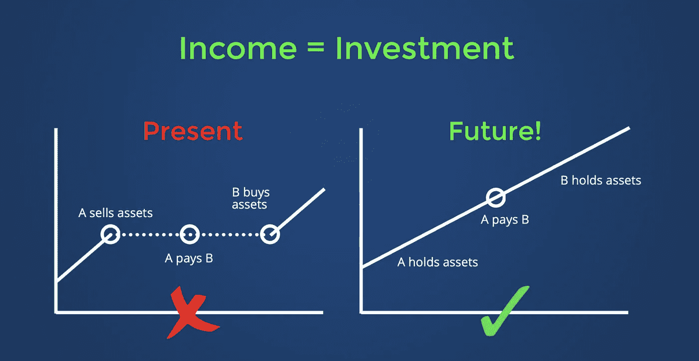

# 我们所知道的金钱——价值丧失和机会丧失的永无止境的循环

> 原文：<https://medium.com/hackernoon/money-as-we-know-it-a-never-ending-cycle-of-lost-value-and-lost-opportunity-56aaae6d9c58>

在 2018 年上半年，我在 [Portfolio.io](https://portfolio.io) 的同事 Bob Bogaert 和我写了一份白皮书。在这篇文章中，我们试图探索如何设计新的加密货币来应对通货膨胀，并获得主流用户群。本文借用了该白皮书中一些未发表的摘录。这是一个关于金钱的又爱又恨的故事，它在今天是如何运作的，以及我们希望它在未来如何运作。

## 我们所知道的钱

Photo by Vladislav Reshetnyak from Pexels

经济学家认为货币有四个核心功能——交易媒介、记账单位、延期支付标准和价值储存。虽然一些新的数字货币声称可以增强其中一项甚至所有核心功能，但没有一种货币将解决货币闲置作为其主要使命

如果你不得不把钱存进银行账户，仅仅是为了购物和履行持续的财务义务，你就不能同时把钱投资到其他地方，这会导致贬值和机会成本。你的存款越多，闲置的时间越长，花费就越大。此外，当你把钱转给另一个人或企业时，转移这笔费用是不可避免的。

最终，由于缺乏选择，我们大多数人都承认，货币既可以是有用的(主要作为交换媒介)，也可以是有生产力的(作为投资)，但不可能同时是有用的和有生产力的。

中央银行——作为货币政策的权威——将做好准备引入世界上第一批生产性货币。然而，它们不能被视为偏袒私营企业，买入它们的债券或股票，并用它们来为自己的货币估值。尽管类似的有限行动已经发生，比如美联储购买抵押贷款支持证券，或者日本银行购买交易所交易基金，但这些都是金融危机时期的临时措施，被正确地视为干预自由市场。这就把发行真正有生产力的货币的任务留给了多方利益相关者和私人机构。

简单来说，央行通过资产负债表机制来平衡负债。在这张资产负债表上，所有流通中的货币都显示在负债方。在资产方面，央行票据在很大程度上由政府、私人银行和公民所欠的债务(通过债券发行)支持，并预计在到期时以低利率偿还。通过从这一系统中汲取灵感，同时选择发行数字货币而不是纸币，同时用生产性资产(特别是低成本指数基金)取代非生产性资产(即债务)，我们有机会达到生产性货币的理论极限。

## 永无休止的循环

从我们记事起，法定货币就一直是价值丧失和机会丧失的永无止境的循环:

1.  个人和企业在菲亚特获得报酬；
2.  他们持有债券，而不是投资；
3.  他们用他们的菲亚特来结算交易，如此循环往复。

由于所有主要货币都受到通货膨胀的影响，家庭收到和交易的货币有一个内在的衰减机制。如果不投资，它就不保值。事实上，随着时间的推移，它的价值越来越低。

在 1925 年，300 美元可以买一辆全新的福特 T 型车，而对今天的许多人来说，这只能代表几天的生活费。如果同样的 300 美元投资于在美国股票市场上市的 500 强公司，到 2017 年，投资回报将超过 200 万美元。

虽然通过 Wealthfront 和 Robinhood 等应用程序进入股票市场从未如此容易，但此类服务的用户仍然必须在实现收入和可以投资收入之间经历延迟。总的来说，这些延迟——除了流动性没有其他目的而持有货币储备的时间——相当于一个巨大的机会成本。

## 新的愿景

下面的图表可以被命名为“收入=投资”，或者“现金=投资”，甚至“支票账户=投资组合”——这些都是准确的。

我相信未来收入/现金/支票账户等。和投资是一回事。我认为，当雇主或顾客付钱给某人时，新的收入应该自动为那个人工作，而不是像银行账户中的现金一样浪费掉。我还认为，一种新的数字或虚拟货币必须让用户能够选择自己的基础资产。

通过结合分布式账本技术(DLT)、被动财富管理和中央银行实践的最佳方面，这种货币可以彻底改变家庭交易——甚至配置——自己的钱的方式。

如果货币在 40 年前看起来像上面的“未来”图表，我的父母会过得更好，而不用做出任何额外的牺牲。

## 健全经济学的重要性

尽管它们具有零和性质和波动性，但大多数加密货币的主要弱点是它们的经济性。就比特币而言，公平分配的工具是交易所的可交易性和无需许可的开采能力。但在 2009 年以来的几年里，早期采用者看到了丰厚的回报，而所有其他跟随者必须忍受通胀的汇率。同样，后进入的矿工往往看到令人望而却步的固定成本，导致采矿作业的集中化和潜在的安全威胁。

没有资产支持的加密货币无法证明高价的合理性。他们会发现自己最终陷入了僵局，因为如果你用等值的美元资产换取这些加密货币，你既不会获得也不会失去任何价值。只是面额变了。您获得的好处只与新资产的加密安全性和未来投机相关，而不是任何现实生活中的生产力或附加值。

大多数被认为是区块链 2.0 的高市值货币并不比比特币好多少，但原因不同。最初，这些货币在创始人、团队成员和投资者之间分配代币。这是一个根本性的错误，因为历史上没有一种被广泛采用的货币能够立即分配给其发行者。想象一下，如果所有新铸造的百元美钞中有 5%到 20%直接流向美国财政部高管手中。这将令人愤慨，并遭到广泛抗议，但这正是大多数初始硬币销售(ICOs)过程中发生的事情。一些市值最高的加密货币的创始人、联合创始人和早期团队成员持有相当大比例的流通代币。

许多投资者认为其核心开发团队持有的令牌数量是预测特定项目信任度的一个积极变量。这是一种反常的激励结构，源于未能区分发行代币的适当做法和建立初创公司的更久经考验的环境，在这种环境中，核心团队持有的大量股权被正确地视为激励的适当组合。虽然持有大量硬币的团队成员通常被禁止在最初几年大量抛售，但大多数成员最终都获得了完全的权利来执行他们选择的任何市场行动。这就产生了一种内在风险，即加密货币的汇率取决于个人的行为或不行为。

## 不仅仅是投机投资的密码

写完上述摘录后，鲍勃和我继续推出了 [Portfolio.io](https://portfolio.io) ，这是一个为加密货币市场的新进入者(主要是 Z 世代和千禧一代用户)提供我们的研究告诉我们他们想要的东西的平台——一个有趣而简单的社交平台，用于构建加密货币的投资组合，无需管理钱包或处理复杂的交易。

要明确的是，我绝不会认为进行投机性投资(比如投资加密)是一件坏事！相反，我认为，如果你将总投资限制在净财富的 10%或更少，投资 crypto 将使生活更加精彩，你可能会因为承担如此大的风险而获得实质性的回报。

也就是说，让我们记住，推动加密货币和区块链的技术肯定有更高的要求。

对于那些旨在改变我们所知的货币性质，并将我们在发达国家已经享有的个人金融赋权全球化(或者如果你只是想让持有储蓄和投资的行为比现在方便 10 倍)的潜在加密货币开发者，我恳求你做以下事情:

1.  创建一种通过智能合约自动计量的货币，并通过防篡改的在线资产负债表公布这些智能合约中包含的数据。
2.  寻求仅通过传统模式创造收入(即，不要将您的货币的任何部分分配给团队成员或股东。只要你坚持第 1、2、4 点，代币销售是可行的。
3.  用美元和指数基金等基础资产来支持你持有的所有货币总量——这些资产越多产、越可靠，越好。
4.  想办法让用户自己选择底层资产。