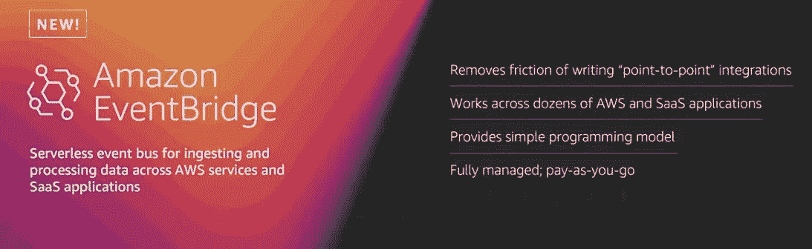
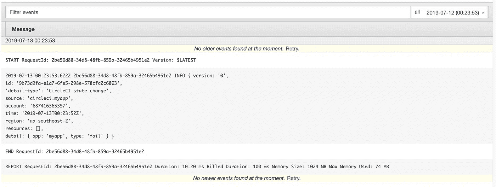
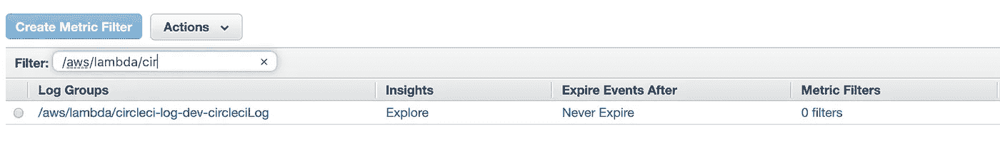
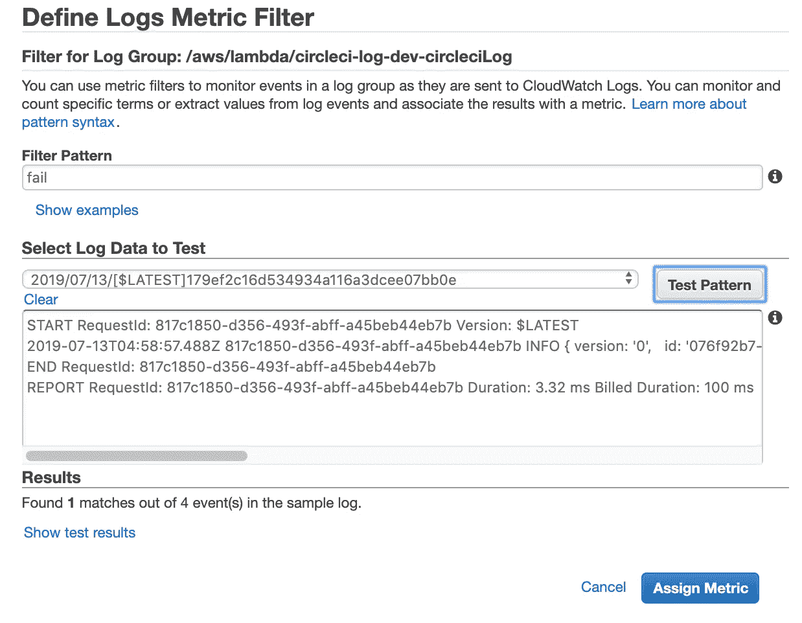

# 使用 Amazon EventBridge 监控 CI/CD 管道

> 原文：<https://medium.com/hackernoon/monitoring-ci-cd-pipelines-with-amazon-eventbridge-32177e2f2c3e>

> Amazon EventBridge 是一个无服务器事件总线，它可以使用来自您自己的应用程序、软件即服务(SaaS)应用程序和 AWS 服务的数据轻松地将应用程序连接在一起。



在这篇文章中，我将使用 CircleCI、CloudWatch 和 EventBridge 构建一个简单的解决方案来监控 React app 的 CI/CD 管道。

因此，综合所有因素，我采取了以下步骤:

*   创建 EventBridge 规则。
*   创建一个 Lambda 函数来记录 CircleCI 事件。
*   将作业状态发送到 EventBus 的配置 CircleCI。

# 先决条件

遵循本指南之前，必须完成以下工作:

*   设置 AWS 帐户
*   安装 [AWS CLI](https://aws.amazon.com/cli/)
*   使用用户凭据配置 AWS CLI
*   设置一个 [CircleCI 账户](https://circleci.com)

# 创建 AWS Lambda 函数

创建一个 Lambda 函数来记录 CircleCI 事件。在下一步中将此函数指定为 EventBridge 规则的目标。

lambda 函数应该是这样的:

```
module.exports.circleciLog = async event => {
  console.log(event);
  return null;
};
```

更多详情，查看我们的官方[教程](https://docs.aws.amazon.com/lambda/latest/dg/getting-started-create-function.html)这里。

# 使用自定义源创建 EventBridge 规则

您可以从 Amazon [EventBridge 控制台创建规则。](https://console.aws.amazon.com/events/home)在我们的例子中，我将使用 [AWS CLI](https://aws.amazon.com/cli/) :

以下命令创建了一个带有自定义源`circleci.myapp`的规则

```
**$**aws events put-rule --name "circleci.myapp" --event-pattern "{\"source\":[\"circleci.myapp\"]}"
```

接下来，获取上一步创建的 lambda 函数`circleci-log-dev-circleci`的 Arn，

```
**$**aws lambda get-function  --function-name circleci-log-dev-circleciLog --query Configuration.FunctionArn
```

复制 Arn，然后将目标添加到规则`circleci.myapp`中。

```
**$**aws events put-targets --rule circleci.myapp --targets "Id"="1","Arn"="*arn:aws:lambda:****REGION****:****ACCOUNTID****:function:circleci*-log-dev-circleciLog"
```

好了，完成了！让我们创建 CircleCI 配置并将项目推送到 Github。

# 配置 CircleCI

CircleCI 配置存储在位于`~/.circleci/config.yml`的单个 YAML 文件中，更多详情，请点击查看[。](https://circleci.com/docs/2.0/writing-yaml/)

在配置中，CircleCI 运行以下命令将自定义事件发送到 EventBridge，以便它们可以与规则匹配:

```
aws events put-events --entries '[{ "Source": "circleci.myapp", "DetailType": "CircleCI state change", "Detail": "{ \"app\": \"myapp\", \"type\": \"fail\" }"}]'
```

`config.yml`应该是这样的:

# 一切准备就绪，尝试一下吧！

*   将提交推送到远程存储库主分支。
*   打开亚马逊 CloudWatch 控制台。
*   在导航窗格中，选择**日志**，过滤`[/aws/lambda/circleci-log-dev-circleciLog](https://ap-southeast-2.console.aws.amazon.com/cloudwatch/home?region=ap-southeast-2#logStream:group=/aws/lambda/circleci-log-dev-circleciLog)`。

下面是日志的样子:



# 创建自定义 CloudWatch 指标来监控 Lambda 日志

这是一个可选的步骤，我发现它真的很有用，因为它允许我监视 Lambda 日志中的特定字符串，并在发现时发送警报。

*   转到您的 CloudWatch 控制台。
*   选中 lambda 日志组旁边的复选框，单击“创建度量过滤器”。



*   在过滤模式中输入类似“失败”的内容。单击“分配指标”。



*   输入此指标的名称(此名称稍后可用于设置警报)。
*   点击“创建过滤器”。
*   转到“警报”部分。
*   点击“创建警报”。
*   在指标类别列表的底部，找到“自定义指标”下拉列表，并选择“记录指标”。
*   找到并选择您的指标名称，单击“下一步”。
*   选择一个合理的时间段，然后选择“总和”作为统计值。
*   设置当指标在 1 个周期内" > 0 "时触发的警报。

差不多就是这样！希望你觉得这篇文章有用，你可以在我的 [**GitHub repo**](https://github.com/yai333/Monitoring-CI-CD-Pipelines-with-Amazon-EventBridge) 中找到完整的项目。