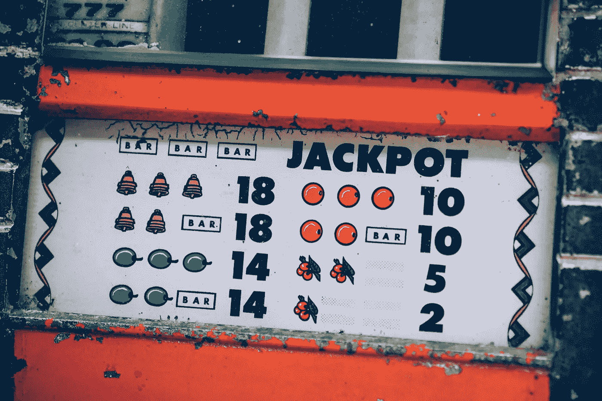
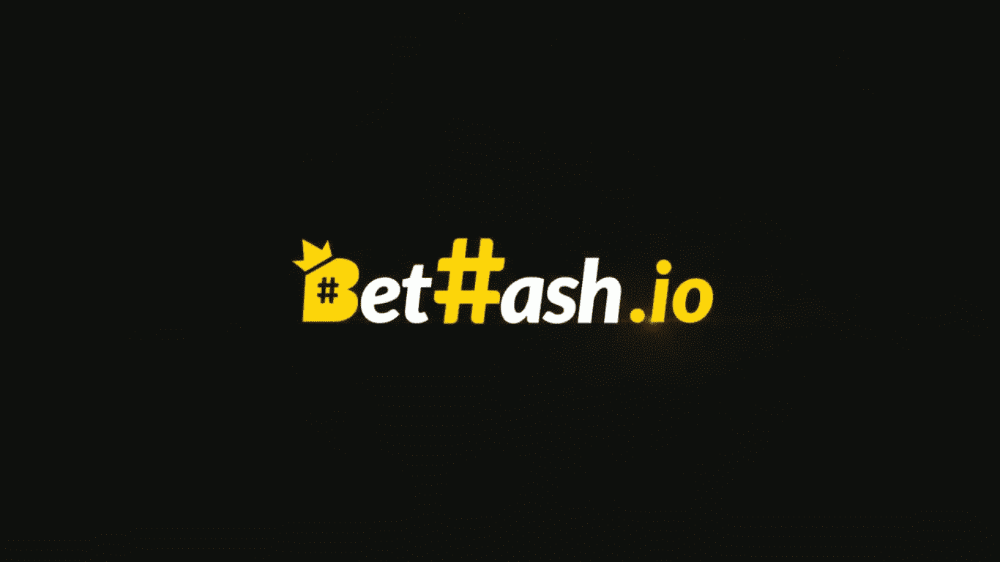

# 赌博的道德哲学及其在区块链上的出现

> 原文：<https://medium.com/hackernoon/moral-philosophy-of-gambling-and-its-appearance-on-blockchain-311c1f100f2a>

Photo by Fancycrave — Pexels

**简介**

赌博一直被认为是一种坏习惯。国家的法律，社会的宗教和道德，人们的思想，对赌博达成共识，并作为一种行为出现，以排除它。因为赌博的习惯就像一个没有上下界限的海湾。如果你看到这个悬崖的底部，可能意味着你不能再往上走了。

赌博是一种与酒精、毒品和社交媒体成瘾一样的坏习惯。那么一个赌徒眼中的赌博是什么呢？一种激情，一种不可或缺的习惯。一个赌徒只喜欢做这种事，而不考虑他或她作为赌博的结果会赢多少钱。就像同样的快乐，赌徒爱的是旅程本身，而不是旅程的终点。但是，如果人们的激情仅限于伤害他们，我们还有义务判断这种激情吗？

人们自由的领域是无穷无尽的，除非他们扰乱了他人的自由空间。因为自由，在一个人自己的身体里，在物质状态里，提供了对思想的完全处置权。这项权利永远不会被其他任何人攫取，也不需要提醒。

人类的心理太复杂了，连成千上万的科学家都无法理解。因为每个人都是独一无二的，每个人都有不同的想法。我们永远不会知道是什么让人们去追求他们的激情，我们永远不会明白。因为人是可以成为任何东西的一切。

“知道我什么都没忘记；但是有一段时间，我已经把这一切都抛到脑后了，甚至是记忆——直到我彻底改善了我的处境。然后…然后你会看到，我会从死亡中复活！ *―*赌徒陀思妥耶夫斯基**

****赌博行业及问题:****

*博彩业在世界上仍然占有非常重要的地位。这个大产业现在对世界经济有 5330 亿美元的贡献。特别是由于移动电话的广泛普及和网络赌博的增加，这个行业每年都在增长。不同体育分支的形成以及随着世界的全球化，人们可以在不同的地区进行赌博。不仅私人公司，国家也给他们的公民提供了赌博的机会。这是一个如此大的产业，甚至各州都想分一杯羹。*

*但是，在赌博时，私营公司和国家都忽略了一些问题。未能面对这些问题的平台希望向用户反映这方面的财务负担。我想谈谈其中的几个问题:*

*   *虽然我们生活在一个自由的世界，但我们仍然面临许多障碍。这些障碍之一是地区的局限性。想要赌博的人可能会因为他们居住的地区而被剥夺赌博的自由。由于国家采取的措施或公司强加的条件，被剥夺自由的用户被迫体验这种快乐。*
*   *`**Withdrawal restrictions:**`生活在这些地区的人可能很难取钱，即使他们以某种方式赌博。他们可能会遇到一个严密的官僚机构，以便从他们国家的银行取钱。生活在这一地区的人们向赌博网站汇款并从赌博网站收款一直是个问题。*
*   *`**Risk of Fraud:**`对于赌博的人来说，欺诈的风险是最重要的。所有在互联网上玩的游戏在某种程度上都有欺诈的风险。赌博网站不够透明并且存在安全漏洞，这一事实总是揭示了通过这些网站玩游戏时的欺诈风险。所有这些漏洞的存在，不透明的系统，给用户不好的体验。*
*   *`**Hidden fees:**`网上赌客最清楚的是他们支付的过高佣金。存入或提取资金时支付的这些佣金可能是:给公司和第三方公司。当你把钱存入赌场时，你首先要支付过多的佣金。在开始赌博之前，你要支付大量的佣金。这种情况在你存钱和取钱时都会发生。*
*   *`**Limits and slow processing speed of payout:**`延期付款和返还已赚的钱是电子博彩业的一个大问题。想要投资这些平台的人，首先要经过一个非常严格的流程。在提取所赚的钱以及减少存款方面也有很大的权力。赌场限制取款和支出，这可能会引发问题。*

****独一无二的解决方案:Bethash 分散 EOS 项目。****

**

*EOS 区块链是我最喜欢的数字加密单元之一。他们搬到自己的区块链，创造了一个独特的系统。为了能够在这个链条上交易，你必须首先有一个 EOS 账户。*

*EOS 帐户长度为 12 个字符，可以包含字母 a-z 和数字 1-5。这些帐户名称取代了大多数加密货币中使用的又长又笨拙的钱包地址。*

> *此外，每个 EOS 帐户都有权限。许可可以被看作是为了使事务通过而需要满足的要求。默认情况下，EOS 帐户有两个本机权限:*
> 
> **Owner* :显示账户的所有权，需要修改账户所有权。此权限的密钥最好(安全地)脱机保存，因为在 EOS 网络上做大多数事情都不需要它们。*
> 
> **活动*:用于转账、制作人投票等高级账户变更。*

*是不是有点复杂？没必要担心。如果你是 Bethash.io 的会员，只需存入价值 2 USDT 或以上的硬币，他们就会自动为你分配一个 EOS 账户。除了 EOS，玩家还可以用各种其他加密货币和代币下注，包括 Tether(USDT)，Tron(TRX)，以及最受欢迎的 EOS 代币，包括 TPT，DICE 等。*

**betash*使用的是去中心化的区块链网络，而不是我们所知道的互联网网络。这个网络更安全，更快，更不可及，所以你的赌博经验增加了。betash 将更多的奖励分配给用户，因为它将这些成本降到了最低。它更有效地利用技术来增加利润，并专注于为用户赚取更多收入。由*betash*开发的这种新的盈利模式通过避免不必要的开支来关注用户体验。*

*当你在网上赌博时，我们被迫向银行和其他转账平台支付高额佣金。因为贝萨什,区块链的自然佣金很低，这个项目为你提供了支付尽可能少的佣金的机会，当你存钱或取钱的时候，佣金几乎可以消失。*

****边玩边赚，下注系统:****

*Bethash 有两个本机标记:Hpoint 和 hash。对于每 10 美元的赌注，玩家将获得 1 点奖励，无论最佳结果如何。然后这些奖励可以用来通过玩游戏赚取更多的 Hpoint，或者可以用来换取 Hash 参与项目忠诚度奖励系统。*

*通过在平台上下注 Hash，您将自动从奖金池中赢得奖励！house edge 的%10 被分配给奖励计划的参与者。*

***项目的优点:***

**+得益于它的去中心化结构，你玩的游戏和下的赌注都无法被追踪。**

*因为它使用 EOS 基础设施，你可以将你的收入转换成许多不同的备用硬币或主要硬币，包括 EOS。*

*与其他不使用区块链的在线博彩网站相比，注册并下注要容易得多。*

**+交易和佣金费用很低。**

*你可以用你赚取的硬币分红来赚取被动收入。*

***项目缺点:***

**-我认为界面应该得到发展。**

**-手机 app 可设计，给用户更好的玩家体验。**

***总之***

*赌博可能会对你和你的环境产生不良后果。比如酗酒和吸毒。但如果你对玩这个游戏充满热情，如果你想在一个去中心化的环境中以安全、透明的方式体验这种刺激，而不伤害自己，那么我祝你享受这种刺激。*

> ***法律免责声明**:本文仅供一般指导，不构成法律投资建议。*
> 
> ***披露**:我不是任何加密货币或 Bethash 的成员。我没有得到报酬，也没有被 Bethash 雇佣。投资时所有的风险都是你的责任。*
> 
> ***免责声明:**请注意，这个帖子是推出来介绍 BetHash 的。进一步的信息可以通过加入 https://t.me/BetHash.我不是 BetHash 核心团队的一部分。*

***免责声明:**这不是广告，而是项目演示。下注是你的责任。*

*来源*

1.  *[https://steemit . com/区块链/@ kad jar/faireum-once-fair-always-fair](https://steemit.com/blockchain/@kadjar/faireum-once-fair-always-fair)(我是文章的所有者)*
2.  *[https://hacker noon . com/the-ultimate-guide-to-understanding-EOS-accounts-a44b 58 ba 5601](https://hackernoon.com/the-ultimate-guide-to-understanding-eos-accounts-a44b58ba5601)*
3.  *[https://bethash.io/](https://bethash.io/)*
4.  *[https://bitcointalk.org/index.php?topic=5129963.0](https://bitcointalk.org/index.php?topic=5129963.0)*