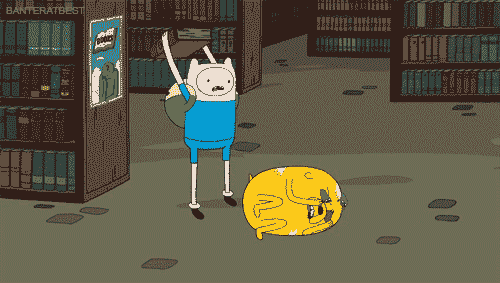
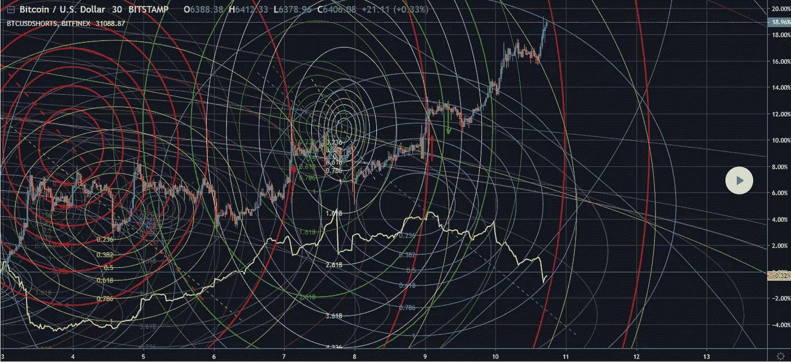
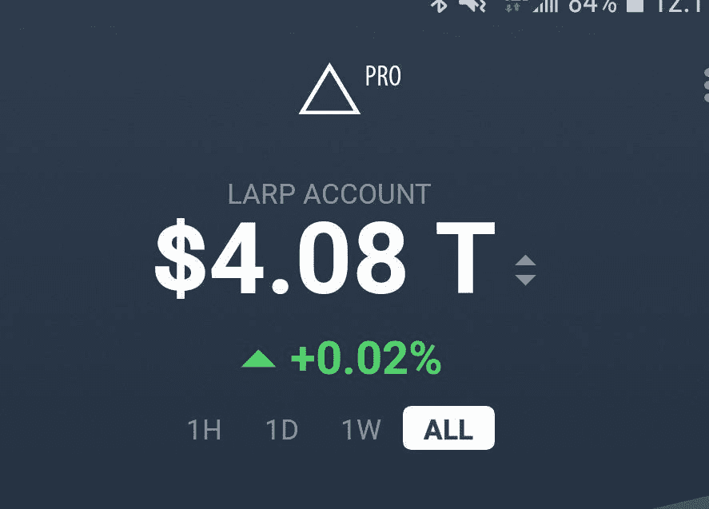
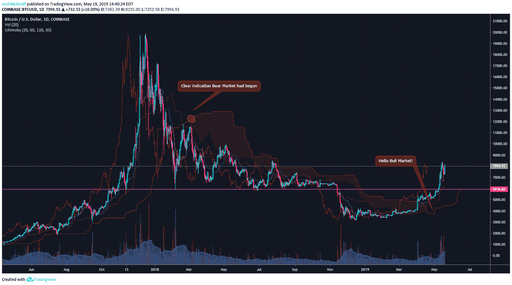
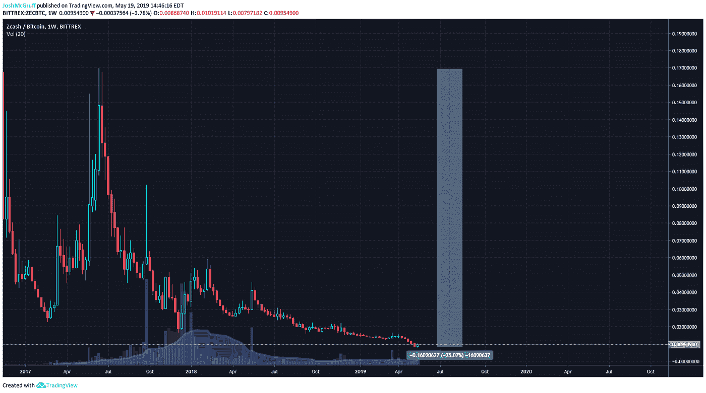
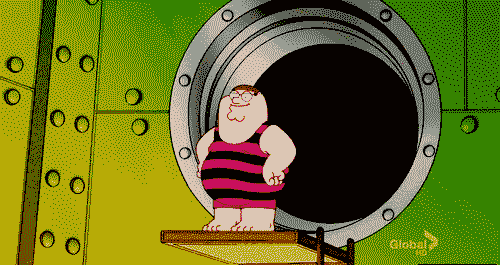
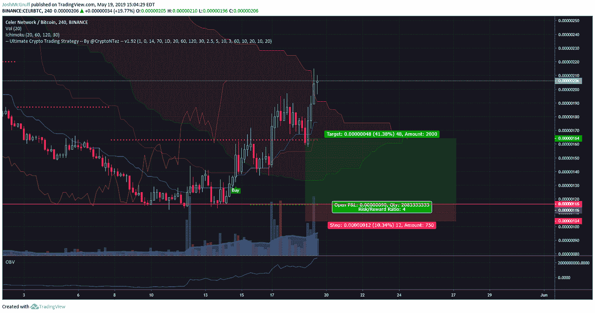
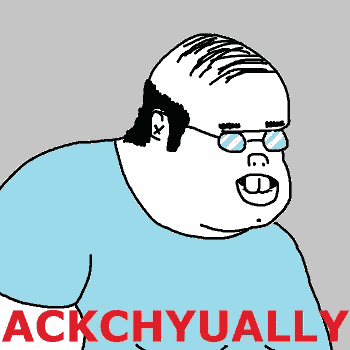
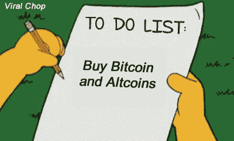

# 更多的事情，我希望我知道当我开始加密交易

> 原文：<https://medium.com/hackernoon/more-things-i-wish-i-knew-when-i-started-crypto-trading-91a8c3fe4cf>

很久以前，一个绿色的密码交易员用一个穿西装的 Doge 头像写了一篇文章，名为“[我希望在开始密码交易时就知道的事情](https://hackernoon.com/things-i-wish-i-knew-when-i-started-crypto-trading-3ec33b59c3a5)”。我现在变得更老了，更聪明了，也更有经验了。

虽然我仍然认为第一篇文章经得起时间的考验，但我看到了那篇文章中没有提到的其他内容，我认为值得一提。因此，我向你介绍*更多* *我希望我在开始加密交易时就知道的事情。*

Time to Learn!

(注意:我可能会重复上一篇文章中的一些观点，如果是这样，更多的是为了加强我目前的观点)

1.  **停止使用上百个指标**

我不会和你争论什么样的指标是最好的，但是我会讨论我使用的指标，在这一点上更进一步。总的来说，使用大量的指标会给你混淆的信号。更有甚者，你可能对它们都没有足够的经验，这也会降低准确率。新交易者倾向于尝试任何当前热门的指标，然后，当他们失败几次后，继续下一个指标，继续这个循环，直到他们完全成功。

Did someone spill a box of circles on this chart?

无论你决定用什么，研究一下，看一些教育视频，拿起一本书，掌握一些。掌握几个指标比试图成为万事通要好得多。当我真正开始专注于几个指标时，我不再收到混淆的信号，并学会信任它们，我的成功率也提高了。我个人最喜欢的是 Ichimoku，OBV 和 RSI。这几天真的没怎么用别的。

尝试，直到你找到你最适合和喜欢的，但是一旦你找到了，坚持下去，在用真钱之前回头测试你的策略！没有一个“神奇”的指标能给你 100%的成功率。

2.**骗子到处都是**

*我经常看到这种情况，但我仍然不明白，但人们会上当受骗。你知道那个送出 10 BTC 的人吗？他不是。他通过赠品培养追随者，这样他以后就可以用他的账户赚钱或做其他恶意的事情。你知道那个说送他 0.1 ETH，你会得到 10 ETH 的人吗？你再也看不到它了。不要把你的钱给任何承诺管理它的卡通形象。你不知道他们的经验水平，他们可以切断联系，在社交媒体上隐藏，然后带着你的钱跑路。没有人有 100%的成功率，这样说的人应该是一个巨大的危险信号。在这些市场中，成为优秀的交易者和赚钱没有捷径可走。这需要时间、经验、错误和技能的培养。*

*别再上这种当了。你是社会工程的受害者。任何听起来好得不像真的事情，都好得不像真的。记住，投资组合和 Delta“投资组合”很容易被欺骗*。继续，弹出应用程序打开，只需添加 1000 BTC 到您的帐户。看那个！你准备好去 LARP 了！**

****

**I am not really a trillionaire… yet.**

**3.**学习如何定义市场的趋势。****

**如果你剔除交易中的情绪因素(说起来容易做起来难)，就有可能发现始于 2018 年的熊市。我们的朋友，之前提到的一目，在更高的时间框架内发现了这一点。**

**总的来说，你需要缩小视野去发现那些更大的变化趋势。1D 图、3D 图和 1W 图是大趋势变化的好朋友。不久前，我写了关于使用 Heikin-Ashi 发现趋势的文章。如果您想了解更多关于使用 HA 的信息，请查看它。此外，如果您对 HA 感兴趣，可以使用一个简单的移动平均策略。**

****

**Ichimoku is easily my favorite indicator.**

**截至发稿时，BTC 的趋势是整个市场的驱动力。如果 BTC 处于看涨趋势，低价位将跟随这一趋势。熊市也是如此。如果你是另类交易者，特别要关注 BTC 的趋势。**

**为什么了解市场的整体趋势很重要？嗯，因为…**

**4.HODL 并不总是聪明的。**

**我回去编辑了我以前的“我希望我知道的事情”的文章，因为它说，一般来说，霍德林是好的。在经历了迄今为止最长的熊市之后，我才明白这是多么的错误。**

****

**“It’S OnLy a LoSs iF yOu SeLL”**

**霍德林在牛市中工作，因为一般来说，BTC 在上涨，一切都会跟着上涨。一旦 BTC 进入熊市，除非你是被动投资的人(只是买入并等待多年)，是时候弃船观望，直到下一轮牛市到来。**

****

**Well shit. At least I made it out alive.**

**5.你会赔钱的。**

**如果你刚开始交易，你会做一些愚蠢的事情。为此做好心理准备，认真地做好准备，在你知道自己在做什么之前，只交易你能承受完全亏损的东西。这可能要花上*年*你才会感到舒适。我还会告诉你成百上千的人可能对你说过的话，当你处于绿色时确保利润。贪婪是你的敌人。但是，可能和我一样，你将不得不接受这个教训。**

****

**大多数有经验的交易者仍然亏损多于盈利。他们保持盈利的原因是因为他们的盈利远远大于亏损。不要让你的失败者逃跑。切断诱饵，准备下一次交易。**

**计划好你的交易，使用 TradingView 内置的风险:回报工具。如果你只承担风险:奖励 2:1(或更高)的交易*你只需要达到这些交易的 40%就可以盈利*。显然，钉住更高的 R:R 交易将进一步降低这一比例。**

****

**6.**社交媒体上的每个人都认为自己比你强****

**如果你对自己的技术分析感到满意，并决定将它发布到公共场所，准备好被告知你有多愚蠢。**

****

**I mentally prepare for this anytime I post TA**

**如果你知道自己在做什么，就忽略那些喋喋不休的话。你不应该让别人影响你的交易，除非他们:**

**a)有某种合法来源的参考，说明你为什么做错了(就像人们使用具有 RSI 发散的烛台芯，RSI 不计算使用这些灯芯，我仍然看到人们一直这样做)。**

**b)他们是你尊敬的人，你*知道*他们知道自己在说什么。**

**如果是一个随机的 Twitter 混蛋，忽略他们，继续你的交易。如果我根据每只鹦鹉的叫声来调整我的交易，我会错过很多好的交易。不要让他们说服你放弃交易。我不是说我是完美的，但是我对我使用的工具很满意，不断地学习它们，并且有一个坚实的交易者群体，如果我有问题，我可以和他们合作。**

****所以，把东西包起来……****

**到现在为止，我从事加密已经有三年了，活跃的交易也有两年了。我仍然认为自己是绿色的，也许再过一年，我会回来写一些我在途中发现的教训。我很幸运，一路上有一些了不起的导师(看看你，尼古拉斯)真的帮我走出困境。**

**我希望你能从中发现一些有价值的东西，如果你不同意，那么，你可以在社交媒体上找到我，告诉我我有多蠢。**

**到目前为止，这是一段疯狂的旅程，但我玩得很开心，还认识了一些很棒的朋友。我期待在交易的战场上看到你们。你可以在以下地方找到我:**

****推特:**[@ JoshMcGruff](https://twitter.com/JoshMcGruff)
**insta gram:**[@ JoshMcGruff](https://www.instagram.com/joshmcgruff/?hl=en)
**trading view:**[https://www.tradingview.com/u/JoshMcGruff/](https://www.tradingview.com/u/JoshMcGruff/)**

**喜欢这个故事吗？学点什么？请我喝杯啤酒表示感谢！CashApp — $JoshMcGruff**

****