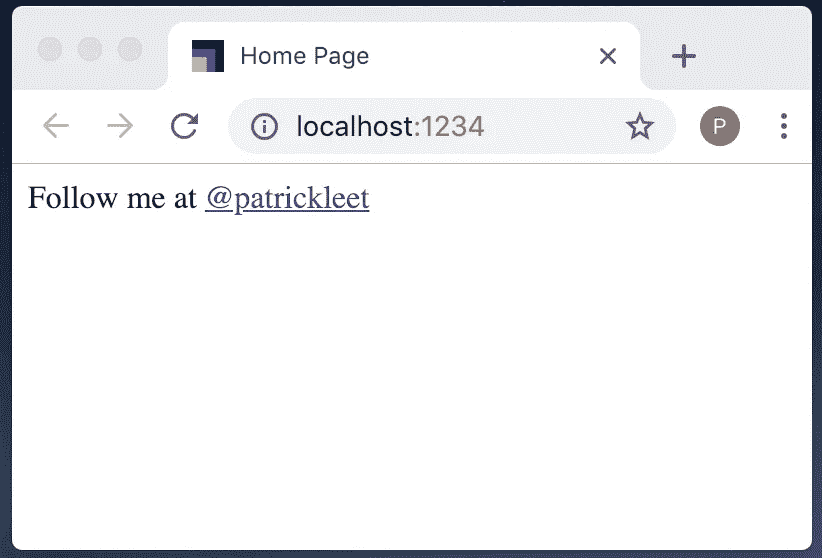
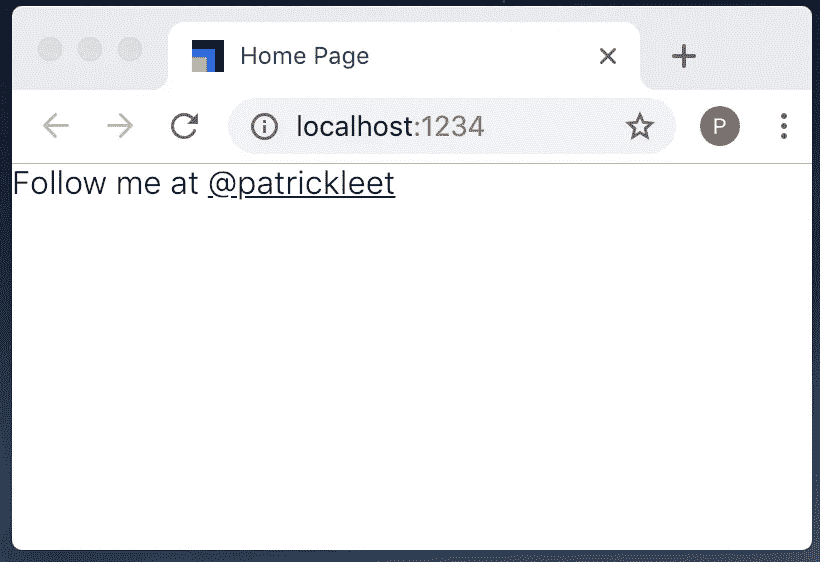
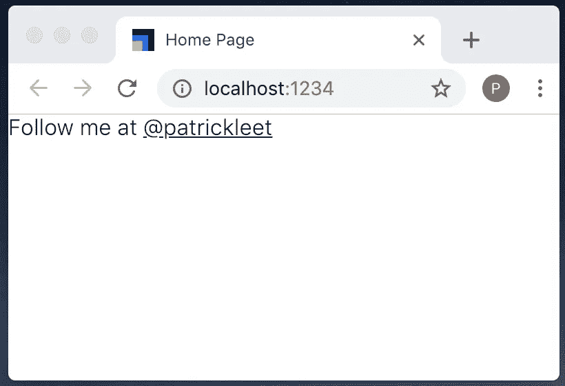
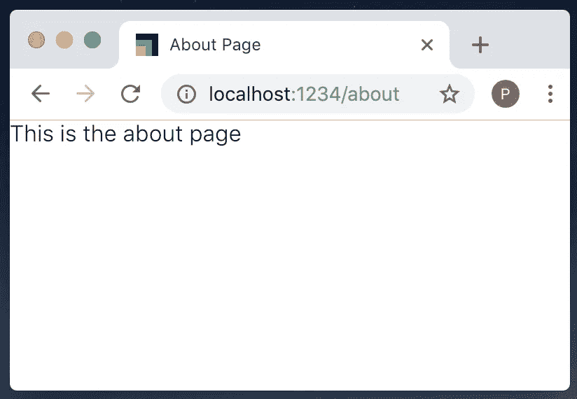
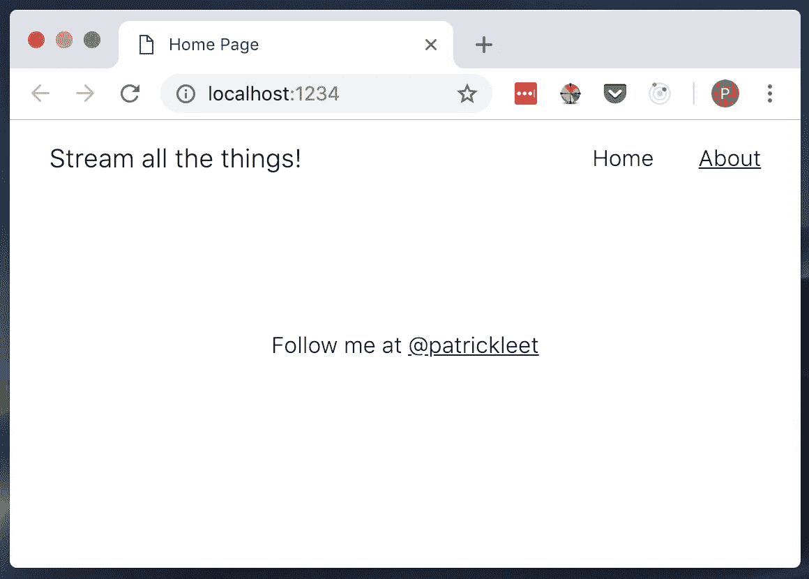

# 移过去 Next.js 和 Webpack！！

> 原文：<https://medium.com/hackernoon/move-over-next-js-and-webpack-ba367f07545>

## 简单的流式 SSR 与样式组件和包进行反应


Photo via my Adobe Stock Photo license.

O 当我第一次使用 Next.js 时，我喜欢它的一点是它让 Webpack 所需的大量样板文件几乎消失了。它还规定了简单的、符合逻辑的惯例，如果你遵循这些惯例，你会很容易成功。

我发现与以前创建服务器端呈现(SSR) React 应用程序的复杂性相比，这在简单性上是一个巨大的进步。

然而，去年早些时候，我意识到一个新工具可以解决我的相同问题，同时更接近核心的 React API。

我对 Next.js 最大的不满之一是它的自定义路由——尽管使用起来很简单——替代的 React 路由器真的很棒，并且有很棒的动画库，我喜欢创建看起来很漂亮的易用的东西！

因此，在 2018 年初，我放弃了 Next.js 和 Webpack，转而使用一些“更接近金属”的东西，并开始用 Parcel 构建 React 应用。

在这篇文章中，我想向你展示我是如何用 Parcel 构建应用程序来创建流服务器端渲染的带有样式化组件的 react 应用程序的。

如果你想知道我为什么如此兴奋，或者还没有尝试过 Parcel——Parcel 是 Javascript 领域中较新的模块捆绑器。

“我必须学习的另一个伟大的工具”你想。

那鸿包裹不会像那样滚动。它是零配置的。

它只是工作。

可以导入。css 文件，图像，以及任何你想要的东西，它完全像你所期望的那样工作。

这使得使用 React 生态系统中所有最新和最棒的应用程序变得非常容易，这些应用程序包括代码分割、流渲染，甚至是差异捆绑，从而可以轻松地获得最新的性能优化。

我想使用新的 React `lazy`和`Suspense`API 来实现代码分割，但是，它在服务器端仍然不受支持，所以我们将使用类似的替代方法。

在某些情况下，它可能仍然比 Next.js 稍微冗长一些，但是对于我的用例来说，我更喜欢额外的可定制性。我想，如果您已经有一段时间没有评估您的工具了，您会惊讶地发现事情变得如此简单。

这是为了让你能够跟进，并以一个漂亮的新样板结束。

我总是有一个个人目标，让东西尽可能轻。如果这不是 SSR，我会建议检查一下 [Hyperapp](https://github.com/jorgebucaran/hyperapp/) 而不是 React。我为一个 Shopify 插件开发了一个非常酷的 JS SDK，这个插件在整个夏天都在推荐机器学习。

那么我们还在等什么呢？我们开始吧！

# 1.设置

首先，使用以下目录结构创建一个新项目——一个文件，两个文件夹。

```
- app/
- server/
.gitignore
```

我们用`mkdir`做一个名为`stream-all-the-things`的目录。然后我们将 cd 放入那个目录，创建一个名为`app`的文件夹和一个名为`server`的文件夹。最后，我们将使用`touch`来创建我们的`.gitignore`文件。

这里有一个快速的小片段。请随意输入每一行，或者将整行内容复制并粘贴到您的终端中。

```
mkdir stream-all-the-things && cd stream-all-the-things
mkdir app
mkdir server
touch .gitignore
```

这是我们`.gitignore`的内容

```
node_modules
*.log
.cache
dist
```

接下来，让我们安装我们需要的依赖项。

```
npm initnpm i --save react react-dom react-router styled-components react-helmet-async react-imported-componentnpm i --save-dev parcel-bundler react-hot-loader
```

好吧，我来解释一下。虽然没什么你没见过的。

有你以前可能用过的基础依赖… `react`，`react-dom`，加上`react-router`。然后我们还有`styled-components`来利用[的流渲染支持](/styled-components/v3-1-0-such-perf-wow-many-streams-c45c434dbd03)。除了 styled-components 是一个支持流式渲染的 CSS-in-JS 库这一事实之外，我更喜欢 styled-components！它固执己见的方法有助于实施最佳实践，并且对 CSS 开发人员友好。

`react-helmet-async`是流行库`react-helmet`的异步版本，支持流 SSR。它允许您在导航时更改 HTML 文档头中的信息。例如，更新页面的`title`。

此外，我们有`parcel-bundler`负责捆绑，`cross-env` 负责将 Windows 的一些问题扼杀在萌芽状态，`nodemon`负责开发我们的服务器，`react-hot-loader`负责开发我们的客户端，`rimraf`负责清理。

# 2.宗地开发模式

看来我们的目标是如何发展的，先从发展模式说起吧。

在`package.json`的`scripts`部分添加一个`dev`脚本。

```
"scripts": {
  **"dev": "parcel app/index.html"**
}
```

对于 Parcel，您只需将应用程序的入口点作为开始开发的唯一参数。

现在让我们创建我们引用的那个`app/index.html`文件。

```
<!DOCTYPE html>
<html>
  <head>
    <meta charset="UTF-8">
    <meta content="text/html;charset=utf-8" http-equiv="Content-Type">
    <meta content="utf-8" http-equiv="encoding">
    <meta name="viewport" content="width=device-width, initial-scale=1, shrink-to-fit=no">      
  </head>

  <body>
    <div id="app"></div>
    <script id="js-entrypoint" src="./client.js"></script>
  </body>
</html>
```

在其中，另一个对我们还没有创建的文件的引用:`client.js`。

这是我们的客户端应用程序的入口点。换句话说，起点。这是我们最初的树将被渲染的地方。

让我们创建`app/client.js`，然后我将分解它。

```
import React from 'react'
import ReactDOM from 'react-dom'
import App from './App'
import { HelmetProvider } from 'react-helmet-async';const element = document.getElementById('app')
const app = (
  <HelmetProvider>
    <App />
  </HelmetProvider>
)ReactDOM.render(app, element)// Enable Hot Module Reloading
if (module.hot) {
  module.hot.accept();
}
```

最后，在我们测试任何东西之前，我们还需要`app/App.jsx`。

```
import React from 'react'
import Helmet from 'react-helmet-async'const App = () => (
  <React.Fragment> <Helmet>
      <title>Home Page</title>
    </Helmet> <div>
      Follow me at <a href="[https://medium.com/@patrickleet](/@patrickleet)">[@patrickleet](http://twitter.com/patrickleet)</a>
    </div>

  </React.Fragment>
)export default App
```

现在，您应该能够运行`npm run dev`来启动您的开发服务器，进行热代码重载！

```
➜  npm run dev> stream-all-the-things@1.0.0 dev Users/me/dev/patrickleet/stream-all-the-things
> parcel app/index.htmlServer running at [http://localhost:1234](http://localhost:1234)
✨  Built in 192ms.
```

我们去看看吧！



因为你不是我，试着更新页面到你自己的链接，注意你不必重新加载就能看到你的改变！

# 3.添加一些风格

我混合使用了全局样式和样式组件。

让我们添加一些基础重置和样式，并定义一些有用的 CSS 变量，这些变量将在数学上帮助我们即将到来的设计冒险。

创建文件`styles.js`:

```
import { createGlobalStyle } from 'styled-components'export const GlobalStyles = createGlobalStyle`
/* Base 10 typography scale courtesty of [@wesbos](http://twitter.com/wesbos) 1.6rem === 16px */
html {
  font-size: 10px;
}body {
  font-size: 1.6rem;
}/* Relative Type Scale */
/* [https://blog.envylabs.com/responsive-typographic-scales-in-css-b9f60431d1c4](https://blog.envylabs.com/responsive-typographic-scales-in-css-b9f60431d1c4) */
:root {
  --step-up-5: 2em;
  --step-up-4: 1.7511em;
  --step-up-3: 1.5157em;
  --step-up-2: 1.3195em;
  --step-up-1: 1.1487em;
  /* baseline: 1em */
  --step-down-1: 0.8706em;
  --step-down-2: 0.7579em;
  --step-down-3: 0.6599em;
  --step-down-4: 0.5745em;
  --step-down-5: 0.5em;
  /* Colors */
  --header: rgb(0,0,0);
}/* [https://css-tricks.com/snippets/css/system-font-stack/](https://css-tricks.com/snippets/css/system-font-stack/) */
/* Define the "system" font family */
/* Fastest loading font - the one native to their device */
[@font](http://twitter.com/font)-face {
  font-family: system;
  font-style: normal;
  font-weight: 300;
  src: local(".SFNSText-Light"), local(".HelveticaNeueDeskInterface-Light"), local(".LucidaGrandeUI"), local("Ubuntu Light"), local("Segoe UI Light"), local("Roboto-Light"), local("DroidSans"), local("Tahoma");
}/* Modern CSS Reset */
/* [https://alligator.io/css/minimal-css-reset/](https://alligator.io/css/minimal-css-reset/) */
body, h1, h2, h3, h4, h5, h6, p, ol, ul, input[type=text], input[type=email], button {
  margin: 0;
  padding: 0;
  font-weight: normal;
}body, h1, h2, h3, h4, h5, h6, p, ol, ul, input[type=text], input[type=email], button {
  font-family: "system"
}*, *:before, *:after {
  box-sizing: inherit;
}ol, ul {
  list-style: none;
}img {
  max-width: 100%;
  height: auto;
}/* Links */
a {
  text-decoration: underline;
  color: inherit;&.active {
    text-decoration: none;
  }
}`
```

在`app/App.jsx`进口`GlobalStyles`:

```
import { GlobalStyles } from './styles'
```

然后更改`App`来呈现`GlobalStyles`组件。



```
const App = () => (
  <div>
    <GlobalStyles />
    Follow me at <a href="[https://medium.com/@patrickleet](/@patrickleet)">[@patrickleet](http://twitter.com/patrickleet)</a>
  </div>
)
```

你的应用应该看起来不那么难看。

# 4.按指定路线发送

我们需要的下一件事是页面要简单。

让我们加入 React 路由器。

在您的客户端中，我们需要从 React 路由器导入`BrowserRouter`，然后简单地用它包装我们的应用程序。

在`app/client.js`

```
**import { BrowserRouter } from 'react-router-dom'**// ...const app = (
<HelmetProvider>
 **<BrowserRouter>**
      <GlobalStyles />
      <App />
 **</BrowserRouter>**
  </HelmetProvider>)
```

现在在`app/App.jsx`中，我们需要将当前内容提取到一个新的组件中，并通过路由器加载。让我们从创建一个新页面开始，使用与我们目前在`App.jsx`中几乎相同的内容。

创建`app/pages/Home.jsx`:

```
import React from 'react'
import Helmet from 'react-helmet-async'const Home = () => (
  <React.Fragment> <Helmet>
      <title>Home Page</title>
    </Helmet> <div>
      Follow me at <a href="[https://medium.com/@patrickleet](/@patrickleet)">[@patrickleet](http://twitter.com/patrickleet)</a>
    </div>

  </React.Fragment>
)export default Home
```

然后，将`App.jsx`修改为以下内容:

```
import React from 'react'
import { Switch, Route, Redirect } from 'react-router-dom'
import Home from './pages/Home'const App = () => (
  <React.Fragment>
    <GlobalStyles />
    <Switch>
      <Route exact path="/" component={Home} />
      <Redirect to="/" />
    </Switch>
  </React.Fragment>
)export default App
```

现在，当我们运行我们的应用程序时，它看起来应该和以前一样，只是这次它是基于路线的匹配通过我们的路由器呈现的`/`。



在我们继续之前，让我们添加第二条路线，但是这次使用“代码分割”。

让我们创建第二个页面，`app/pages/About.jsx`:

```
import React from 'react'
import Helmet from 'react-helmet-async'const About = () => (
  <React.Fragment> <Helmet>
      <title>About Page</title>
    </Helmet> <div>
      This is the about page
    </div>

  </React.Fragment>
)export default About
```

以及在`app/pages/Loading.jsx`处的加载部件:

```
import React from 'react'const Loading = () => (
  <div>
    Loading...
  </div>
)
export default Loading
```

最后是`app/pages/Error.jsx`处的误差分量:

```
import React from 'react'const Error = () => (
  <div>
    Error!
  </div>
)
export default Error
```

为了导入它，我想使用新的`React.lazy`和`Suspense`API，不幸的是，虽然它们可以在客户端工作，但一旦我们到达服务器端渲染，我们会发现 ReactDomServer 还不支持悬念。

相反，我们将依赖另一个名为`react-imported-component`的库，它将与客户端和服务器端呈现的应用程序一起工作。

下面是我们更新的`app/App.jsx`:

```
import React from 'react'
import { Switch, Route, Redirect } from 'react-router-dom';
**import importComponent from 'react-imported-component';**
import Home from './pages/Home.jsx'
**import LoadingComponent from './pages/Loading'
import ErrorComponent from './pages/Error'****const About = importComponent(() => import("./pages/About"), {
  LoadingComponent,
  ErrorComponent
});**const App = () => (
  <React.Fragment>
    <GlobalStyles /> <Switch>
      <Route exact path="/" component={Home} />
      **<Route exact path="/about" render={() => <About />} />**
      <Redirect to="/" />
    </Switch> </React.Fragment>
)export default App
```

现在我们应该能够导航到`/about`来查看我们的新页面。如果你快速看，你会看到`Loading...`出现在页面内容之前。



# 5.布局和导航

现在我们需要通过在地址栏中输入路线来导航，这并不理想。在我们进入服务器端渲染之前，让我们为页面添加一个通用布局和一个带有导航的标题。

让我们从一个标题开始，这样我们可以得到点击。

创造`app/components/Header.jsx`:

```
import React from 'react';
import styled from 'styled-components'
import { NavLink } from 'react-router-dom';const Header = styled.header`
  z-index: 100;
  position: fixed;
  top: 0;
  left: 0;
  right: 0; max-width: 90vw;
  margin: 0 auto;
  padding: 1em 0; display: flex;
  justify-content: space-between;
  align-items: center;
`const Brand = styled.h1`
  font-size: var(--step-up-1);
`const Menu = styled.ul`
  display: flex;
  justify-content: flex-end;
  align-items: center;
  width: 50vw;
`const MenuLink = styled.li`
  margin-left: 2em;
  text-decoration: none;
`export default () => (
  <Header>
    <Brand>Stream all the things!</Brand>
    <Menu>
      <MenuLink>
        <NavLink 
          to="/"
          exact activeClassName="active"
        >Home</NavLink>
      </MenuLink>
      <MenuLink>
        <NavLink 
          to="/about" 
          exact activeClassName="active"
        >About</NavLink>
      </MenuLink>
    </Menu>
  </Header>
)
```

我们需要导入它并将其放入我们的`App`。

下面是更新后的`App.jsx`:

```
import React from 'react'
import { Switch, Route, Redirect } from 'react-router-dom';
import importComponent from 'react-imported-component';
import { GlobalStyles } from './styles'
**import Header from './components/Header'** import Home from './pages/Home'
import LoadingComponent from './pages/Loading'
import ErrorComponent from './pages/Error'const About = importComponent(() => import("./pages/About"), {
  LoadingComponent,
  ErrorComponent
});const App = () => (
  <React.Fragment>
    <GlobalStyles />
 **<Header />** <Switch>
      <Route exact path="/" component={Home} />
      <Route exact path="/about" render={() => <About />} />
      <Redirect to="/" />
    </Switch> </React.Fragment>
)export default App
```

让我们也创建一个`Page`组件，我们的每个页面都可以使用它来实现一致的页面风格。

创建`app/components/Page.jsx`:

```
import styled from 'styled-components';const Page = styled.div`
  width: 100vw;
  height: 100vh;
  display: flex;
  justify-content: center;
  align-items: center;
  text-align: center;
`export default Page
```

然后，在我们的四个页面中，导入新的`Page`组件，并用它替换每个页面中的包装`React.Fragment`。

这里是`Home`页面:

```
import React from 'react'
import Helmet from 'react-helmet-async'
import Page from '../components/Page.jsx'const Home = () => (
  **<Page>** <Helmet>
      <title>Home Page</title>
    </Helmet> <div>
      Follow me at <a href="[https://medium.com/@patrickleet](/@patrickleet)">[@patrickleet](http://twitter.com/patrickleet)</a>
    </div>

  **</Page>**
)export default Home
```

对`About`页以及`Error`和`Loading`页进行同样的操作。

我们的应用程序开始变得更好看了！



很明显，有无数种可能的方式来设计这个应用程序，所以我将把让它变得更漂亮作为一个练习。

# 6.流式服务器端渲染

我们实现目标的下一步是添加流媒体服务器端渲染。如果你一直在关注，你会发现到目前为止，我们已经创建了一个静态的客户端应用程序。

从客户端到同构需要在服务器上创建一个新的入口点，它将加载与我们的客户端入口点相同的`App`组件。

我们还需要其他几个新的 npm 包:

```
npm i --save llog pino express through cheerio 
npm i --save-dev concurrently rimraf nodemon @babel/polyfill cross-env
```

让我们创建`server/index.js`:

```
import path from 'path'
import express from 'express'
import log from 'llog'
import ssr from './lib/ssr'const app = express()// Expose the public directory as /dist and point to the browser version
app.use('/dist/client', express.static(path.resolve(process.cwd(), 'dist', 'client')));// Anything unresolved is serving the application and let
// react-router do the routing!
app.get('/*', ssr)// Check for PORT environment variable, otherwise fallback on Parcel default port
const port = process.env.PORT || 1234;
app.listen(port, () => {
  log.info(`Listening on port ${port}...`);
});
```

好了，这里有几样东西需要打开:

1.  我们使用的是 express——它可以是任何其他服务器。我们真的没有做太多，所以应该不会太难转换到您选择的服务器。
2.  我们正在为`/dist/clients`目录设置一个静态文件服务器。我们目前没有建立生产资产，但当我们这样做时，我们可以把它们放在那里。
3.  每一条其他的路线都在走`ssr`。我们只做 React 路由器所做的事情，而不是在服务器上进行路由。

让我们创建`ssr`函数。这可能会比本教程的其余部分更复杂，但这只是需要做一次的事情，然后基本上就不用管了。

在我们继续之前，让我们看一下我们需要创建的脚本。

```
"scripts": {
  "**dev**": "npm run generate-imported-components && parcel app/index.html",
  "**dev:server**": "nodemon -e js,jsx,html --ignore dist --ignore app/imported.js --exec 'npm run build && npm run start'",
  "start": "node dist/server"
  "**build**": "rimraf dist && npm run generate-imported-components && npm run create-bundles",
  "**create-bundles**": "concurrently \"npm run create-bundle:client\" \"npm run create-bundle:server\"",
  "**create-bundle:client**": "cross-env BABEL_ENV=client parcel build app/index.html -d dist/client --public-url /dist/client",
  "**create-bundle:server**": "cross-env BABEL_ENV=server parcel build server/index.js -d dist/server --public-url /dist --target=node",
  "**generate-imported-components**": "imported-components app app/imported.js",
  "**start**": "node dist/server"
}
```

现在多了不少。我已经突出显示了这些名字，以便于阅读。在高层次上，我们添加了构建脚本来生成一个包含导入组件信息的文件，以及一个使用 parcel 并发构建客户机和服务器包的构建脚本。

我们现在还需要一个用于导入组件的`.babelrc`文件。也许在接下来的几个月里，这种情况会有所改变。

```
{
  "env": {
    "server": {
      "plugins": ["react-imported-component/babel", "babel-plugin-dynamic-import-node"]
    },
    "client": {
      "plugins": [
        ["react-imported-component/babel"]
      ]
    }
  }
}
```

解决了这个问题后，我们有两个主要部分要解决。

1.  创建 SSR 中间件
2.  为 SSR 重用客户机 HTML 数据，并从中解析生成的 src 名称

创建`server/lib/ssr.js`:

```
import React from 'react'
import { renderToNodeStream } from 'react-dom/server'
import { HelmetProvider } from 'react-helmet-async'
import { StaticRouter } from 'react-router-dom'
import { ServerStyleSheet } from 'styled-components'
import { printDrainHydrateMarks } from 'react-imported-component';
import log from 'llog'
import through from 'through'
import App from '../../app/App'
import { getHTMLFragments } from './client'
// import { getDataFromTree } from 'react-apollo';export default (req, res) => {
  const context = {};
  const helmetContext = {};const app = (
    <HelmetProvider context={helmetContext}>
      <StaticRouter
        location={req.originalUrl}
        context={context}
      >
        <App />
      </StaticRouter>
    </HelmetProvider>
  ); try {
    // If you were using Apollo, you could fetch data with this
    // await getDataFromTree(app); const sheet = new ServerStyleSheet()
    const stream = sheet.interleaveWithNodeStream(
      renderToNodeStream(sheet.collectStyles(app))
    ) if (context.url) {
      res.redirect(301, context.url);
    } else {
      const [
        startingHTMLFragment,
        endingHTMLFragment
      ] = getHTMLFragments({ drainHydrateMarks: printDrainHydrateMarks() })
      res.status(200)
      res.write(startingHTMLFragment)
      stream
        .pipe(
          through(
            function write(data) {
              this.queue(data)
            },
            function end() {
              this.queue(endingHTMLFragment)
              this.queue(null)
            }
          )
        )
        .pipe(res)
    }
  } catch (e) {
    log.error(e)
    res.status(500)
    res.end()
  }
};
```

使用`server/lib/client.js`,我们需要读入我们的`app/index.html`文件，并把它分成两个块，使上面的流更容易。

```
import fs from 'fs';
import path from 'path';
import cheerio from 'cheerio';export const htmlPath = path.join(process.cwd(), 'dist', 'client', 'index.html');
export const rawHTML = fs.readFileSync(htmlPath).toString();export const parseRawHTMLForData = (template, selector = "#js-entrypoint") => {
  const $template = cheerio.load(template);
  let src = $template(selector).attr('src') return {
    src
  }
}const clientData = parseRawHTMLForData(rawHTML)const appString = '<div id="app"\>'
const splitter = '###SPLIT###'
const [ 
  startingRawHTMLFragment, 
  endingRawHTMLFragment 
] = rawHTML
      .replace(appString, `${appString}${splitter}`)
      .split(splitter)export const getHTMLFragments = ({ drainHydrateMarks }) => {
  const startingHTMLFragment = `${startingRawHTMLFragment}${drainHydrateMarks}`
  return [startingHTMLFragment, endingRawHTMLFragment]
}
```

这将通过服务器呈现我们的应用程序，但是如果不对客户端进行一些小的更改，它不会成功地重新连接到客户端应用程序。

我们正在通过 SSR 功能提供“再水合标记”,但还没有使用它们。

在`app/client.js`做如下修改:

1.  导入`rehydrateMarks` **和** `importedComponents`

```
**import { rehydrateMarks } from 'react-imported-component';
import importedComponents from './imported'; // eslint-disable-line**
```

2.将`ReactDOM.render(app, element)`替换为:

```
// In production, we want to hydrate instead of render
// because of the server-rendering
if (process.env.NODE_ENV === 'production') {
  // rehydrate the bundle marks
  rehydrateMarks().then(() => {
    ReactDOM.hydrate(app, element);
  });
} else {
  ReactDOM.render(app, element);
}
```

搞定了。

现在，当您运行`npm run dev:server`或`npm run build && npm run start`时，您将使用服务器端渲染！

# 结论

我承认，仍有比 Next.js 更多的样板文件，但希望不是压倒性的，那里的内容是透明的和可以理解的。而且平心而论，Next.js 还在为我们多做几件事，比如预取组件。

然而，我仍然更喜欢这种方法，因为这没有什么神秘之处，webpack 配置完全消失了，并且很容易利用 react 路由器的动画库，我将把它作为一个练习。

希望您发现这很有用！

如果你做了，帮助我的最好方法是给我一些掌声和/或分享！

最佳，[李雅达·斯科特](https://twitter.com/pat_scott)

附:这里是 GitHub 上的[完整代码。](https://github.com/patrickleet/streaming-ssr-react-styled-components)

页（page 的缩写）附:本文是系列文章的一部分。看看下面的其他部分！

[](https://hackernoon.com/a-better-way-to-develop-node-js-with-docker-cd29d3a0093) [## 第 2 部分:用 Docker 开发 Node.js 的更好方法

### 并保持您的热代码重载

hackernoon.com](https://hackernoon.com/a-better-way-to-develop-node-js-with-docker-cd29d3a0093) [](https://hackernoon.com/enforcing-code-quality-for-node-js-c3b837d7ae17) [## 第 3 部分:加强 Node.js 的代码质量

### 使用林挺、格式化和带有代码覆盖的单元测试来实施质量标准

hackernoon.com](https://hackernoon.com/enforcing-code-quality-for-node-js-c3b837d7ae17) [](https://hackernoon.com/the-100-code-coverage-myth-900b83d20d3d) [## 第 4 部分:100%代码覆盖率的神话

### 现在互联网上有很多建议说 100%的覆盖率不是一个有价值的目标。是吗？

hackernoon.com](https://hackernoon.com/the-100-code-coverage-myth-900b83d20d3d) [](https://hackernoon.com/a-tale-of-two-docker-multi-stage-build-layers-85348a409c84) [## 第 5 部分:两层(Docker 多阶段构建)的故事

### Node.js 的生产就绪 docker 文件

hackernoon.com](https://hackernoon.com/a-tale-of-two-docker-multi-stage-build-layers-85348a409c84)