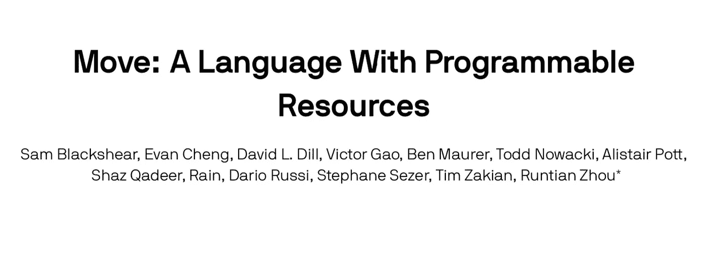

# “移动”编程语言:天秤座的亮点

> 原文：<https://medium.com/hackernoon/move-programming-language-the-highlight-of-libra-122a910d6e0f>

## 脸书会给智能合约带来曙光吗？

[Move Programming Language — Technical Paper](https://developers.libra.org/docs/move-paper)

作者:郭玉，SECBIT 实验室创始人。

每个人最近肯定都被脸书新闻轰炸过。

由脸书发起的加密货币项目 Libra 于 6 月 18 日正式发布，同时发布的还有其网站和[白皮书](https://libra.org/en-US/white-paper/)，为数十亿人提供全球货币&金融服务。

此外，它还有几个[技术白皮书](https://developers.libra.org/docs/the-libra-blockchain-paper.html)来解释新的编程语言‘Move’和共识协议——Libra bft。它的源代码已经公布在 GitHub 上，测试网已经上线。

Libra 被设计成一个许可的区块链，因为开发团队表示，在没有许可的(公共)区块链，没有成熟的解决方案可供数十亿人使用，向公共区块链的过渡将在五年内开始。

在 Libra 的出版物中，最吸引人的是全新的“Move”编程语言。在第一眼看到“移动”白皮书后，我们认为这是智能合同语言的未来。

来自柏林的开发者 left Eris Karapetsas[在 Twitter](https://twitter.com/LefterisJP/status/1140955676501524481) 上说:

> 他们的设计目标似乎重叠，甚至旨在取代以太坊？

CryptoPuzzleDream，PuzzleToLife.com 的创始人，[持有这样的观点](https://twitter.com/Puzzle_Dreamer/status/1140907193660846080):

> 我认为$FB 发布的“移动”编程语言可能比 Libra 更令人兴奋。

一个标准的极客詹姆斯·克拉克[说](https://twitter.com/james_clark/status/1140964371301953536):

> 我通常对任何与加密货币相关的东西都非常怀疑，但 Libra 的一个部分看起来可能很有趣:一种名为 Move 的字节码编程语言，其语义受线性逻辑的启发。

这正是我们刚刚想到的:

> **‘Move’是专为数字资产设计的智能合约平台语言。**

# “移动”的三种应用

1.  发行加密货币、代币和数字资产
2.  处理区块链交易
3.  管理验证器

# 自底向上的静态类型

Move 的静态类型化，本质上是一种逻辑约束，比以太坊智能合约语言要严格得多。现代编程语言如 Rust、Golang、Typescript、Haskell、Scala、OCaml 都选择了静态类型，因为它们的优点是许多简单的程序错误可以在编译而不是执行时被检测出来。

> 类型良好的程序永远不会被卡住。

这是编程语言中的一个技术术语，表示如果代码通过了类型检查，它将是高度可靠的。

然而，由于实用性要求，“Move”不是 100%静态类型的。它试图在编译期间而不是部署期间执行类型检查。有些类型检查任务在执行过程中不得不推迟，而类型安全是有保证的。

“移动”的一个优秀设计概念是它的虚拟机是静态类型的。上面一层是 IR(中间表示)，也是类型化的。“移动”的顶层将为坚持静态类型的金融应用程序提供更多的高级语言，以避免智能合同中的简单错误。

# 一流的资源

这个词看起来很学究气。那么意义是什么呢？所谓编程语言中的第一类，是指编码时预先编程的对象。

那么`Resources`指的是什么呢？这是另一个关于`value`的学术术语。`Value`可以被任意复制，而`Resources`只能被消费，不能被复制。`Resources`类似于每天饮用会减少的可乐。`Value`相反，是笔记本上的文字。你和其他人可以每天在你的脑海中阅读和复制它们，而单词不会消失。

传统的编程语言，包括以太坊智能合约语言，在`values`中记录的数字资产可能是不正确的数字。事实上，有很多错误的记录，例如，杰克转账给约翰，约翰得到 10 美元，而杰克的余额仍然存在。该领域的许多问题大大降低了人们对智能合约未来的信任。

相反,“移动”契约应用集成了传统线性逻辑的“资源类型”。数字资产由资源类型定义，因此它们可以符合线性逻辑的属性:

1.  无法复制数字资产
2.  数字资产不会消失

`First-class Resources`真正的原理是`digital assets are first-class citizens`。现在，我们可以推断“移动”是专为管理数字资产而设计的智能合同语言。从技术上讲，数字资产可以是合同中的变量，被存储、分配，并成为函数&流程的参数/返回值。“Move”的静态类型使编译器能够在编译期间和部署之前检查大多数资源错误，从而增强智能合约的安全性。

这里有一句话选自[白皮书](https://developers.libra.org/docs/move-paper)摘要:

> 一级资源是一个非常通用的概念，程序员不仅可以用它来实现安全的数字资产，还可以用它来编写正确的业务逻辑来包装资产和实施访问控制策略。

# 合同安全设计

“移动”合同设计与安全性恰当地结合在一起。首先，‘Move’根本不支持动态调度。下面是对动态分派的解释——一种灵活的语言机制:我们可以在代码中编写许多函数、进程或子程序，供主程序调用来执行不同的任务。

假设我们知道程序会调用哪个函数或者调用序列，那么这些调用就是静态的。相反，如果我们在程序执行之前不知道函数调用的细节，那么它将是动态的。显然，动态调度比静态调度灵活得多。

然而，灵活性意味着更多的错误。许多现代编程语言在某种程度上支持语言本身级别的动态调度，例如，在面向对象语言中由继承引起的动态绑定。

这些动态特性使得程序推理和形式验证更加困难，程序本身也更加危险。以太坊智能合约中有很多动态属性，比如 delegatecall，合约形式的参数和函数指针，而' Move '不支持任何动态分派或属性。所有合同执行路径都可以在编译期间确定，以便进行彻底的分析和验证。

在执行之前,“移动”契约将由字节码验证器对所有类型的错误进行验证。与此同时，字节码经历了执行和验证类型的解释。

“Move”对可变契约变量有严格的限制，并借鉴了 Rust 的一些设计概念。在任何时候，只有一个指针可以修改可变变量，以避免弄乱数据。在 Ethereum Solidity 中，你可以只为一个变量定义许多指针，一旦代码逻辑设计不正确，就会导致错误。

与 EVM 相比，Move 模块化系统支持循环递归依赖，所以不会有重入错误。

# 高级模块系统

根据[白皮书](https://developers.libra.org/docs/move-paper)，Move 模块系统是按照函数式编程语言(OCaml，Coq，SML)的风格设计的:

> 移动模块类似于其他区块链语言中的智能合约。但是，模块强制实施强数据抽象——类型在其声明模块内部是透明的，在模块外部是不透明的。

模块系统可以完美地封装数字资产概念。我们可以通过公共模块接口灵活地管理数字资产及其权限。

以太坊的 ERC20 令牌是契约的形式，而‘Move’的令牌是一个像资源一样自由传递的盒子，里面不显示细节。同时，模块系统抽象基于其静态类型，类型安全性可以通过智能契约虚拟机验证来保证。

“Move”模块系统为形式验证提供了坚实的基础，因为我们可以在模块内部定义不变量。不变量是数字资产状态的严格约束，为形式验证自动化提供有价值的信息。

此外，模块系统的黑盒抽象使得形式验证能够模块化，成本更低。基于‘Move’模块系统编写程序分析器和符号执行器会容易得多，因为抽象使得契约逻辑易于推理。

# 未来“移动”智能合约

虽然‘动’看起来粗糙不成熟，但这个方向令人振奋。从“移动”的语言中我们可以看出，脸书渴望建立一个宏大的数字资产平台，这个平台原本属于未来的以太坊。

我们为什么爱‘动’？这里有三个原因:

1.  整合编程语言研究成果和 EVM 智能合约语言经验
2.  优先考虑智能合同的安全性和正确性
3.  创新金融应用的智能合同语言设计，而不是遵循常规(不应用 WASM、LLVM 或修改 EVM)

> 区块链没有突出的传统计划。
> 
> 未来是关于创新的。

[***sec bit***](https://secbit.io)*由一群加密货币爱好者创立。我们正在研究智能合同安全、智能合同形式验证、加密协议、编译、合同分析、博弈论和加密经济学。*