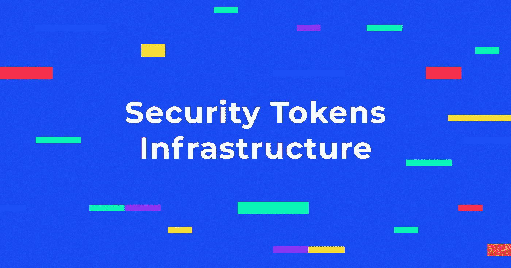
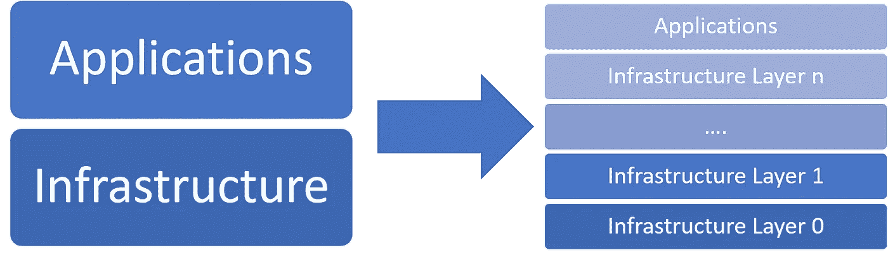
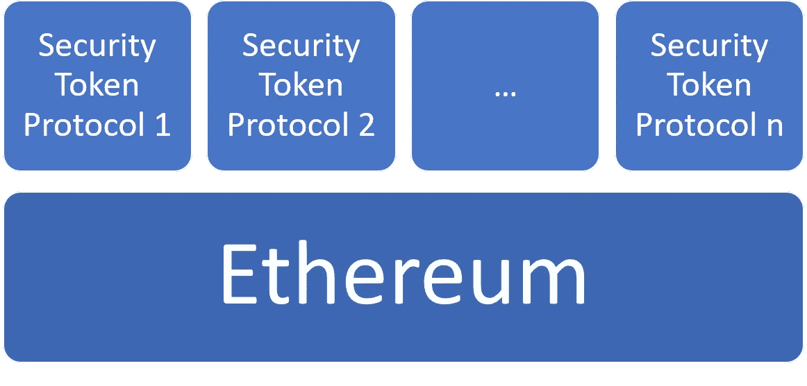
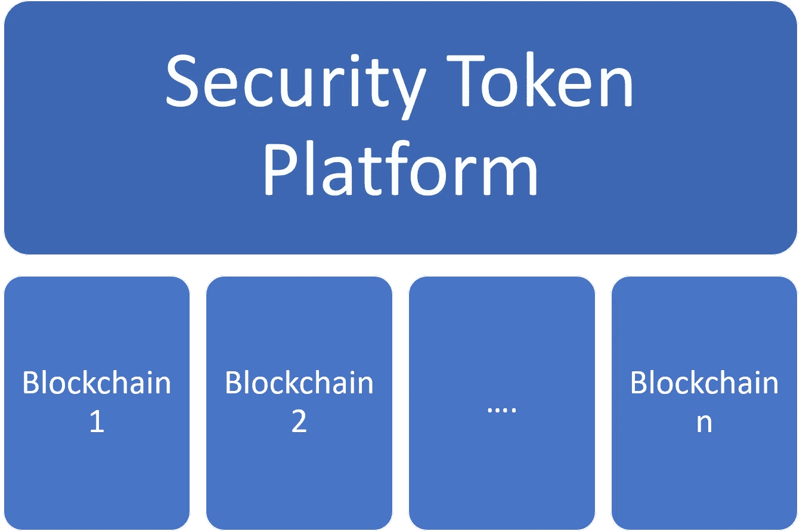
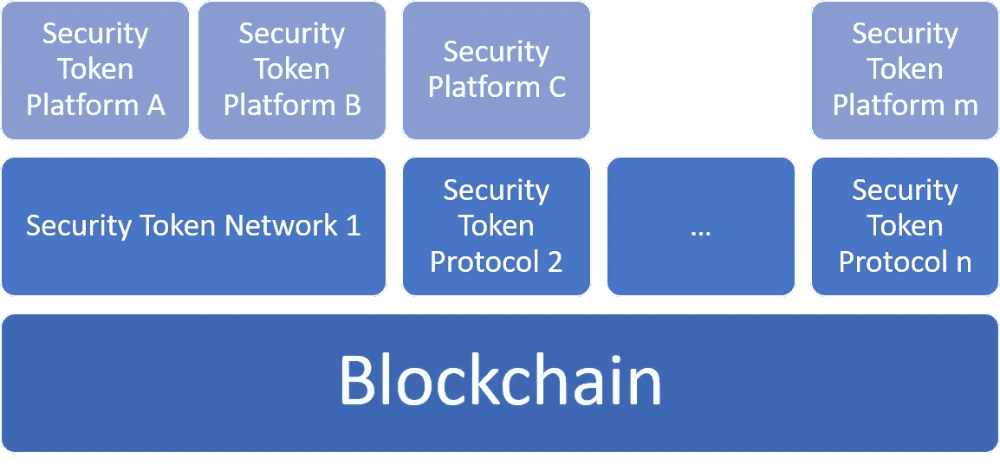
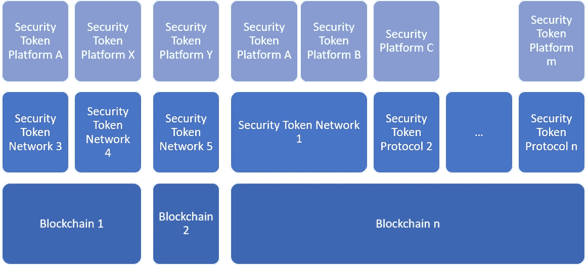
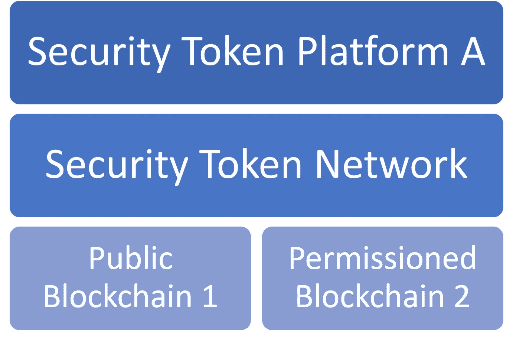
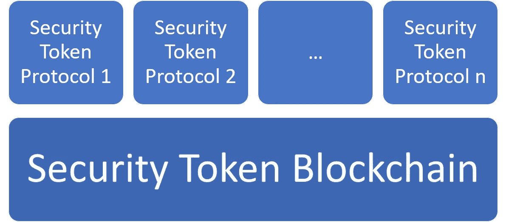

# 超越安全令牌的以太坊阶段

> 原文：<https://medium.com/hackernoon/moving-beyond-the-ethereum-phase-of-security-tokensthe-a6e056cc61bb>

## 安全令牌网络和区块链的下一次发展

安全令牌中的一个存在性争论是我经常提到的通才与专家的争论。你以前听过这样的争论:*我们会有一种还是多种加密货币？一个区块链还是多个？公开还是许可？*…这些问题的潜在答案是加密生态系统中不同思想流派的基础，它们渗透到该行业的所有子领域。在安全令牌的情况下，我们开始看到这些存在的加密辩论的版本:

*我们会让区块链专攻安全令牌吗？*

*安全令牌能在公开或许可的区块链上工作吗？*

我们应该建立专门的安全令牌网络吗？

*…。*

如此小的技术市场，如此分散的思想流派是极其罕见的。问题的一部分是，安全令牌市场已经不由自主地继承了母加密生态系统中的一些争论。在安全令牌的情况下，碎片化的争论扩展到生态系统的所有层。具体来说，数字证券市场正在进入一个阶段，在这个阶段，除了大量现有的安全令牌平台之外，我们很可能会看到一级区块链、二级网络的出现。

# 区块链、网络和代币

一个简单的技术市场的观点是一个两层的结构，有一个基础设施层和一个应用层。在该模型中，基础架构层为该领域中的应用程序提供通用构建块，而应用程序层支持领域专门化。事实上，技术市场要复杂得多，在我们实现应用层的任何相关专业化之前，需要几个层次的基础设施。

就安全令牌而言，当前的生态系统可以分为三个基本层:

**区块链:**为安全令牌提供共识、交易验证和所有权转移协议的基础设施。

**网络:**第 2 层基础设施块，抽象特定数字证券交易中相关方之间的交互。

**令牌&dapp:**利用其他基础架构层的特定安全令牌或应用程序。

虽然安全令牌最初主要是以太坊 ERC 20 令牌的变体，但在短短几个月内，我们已经看到 PolyMesh 和 Ownera 等雄心勃勃的项目宣传了对安全令牌区块链的需求，而 origination 等努力也为安全令牌网络的实施带来了一些动力。如果这种趋势持续下去，我们很可能会看到堆栈不同区域的碎片化程度越来越高。尽管我们还处于数字证券市场的早期阶段，但一些碎片化已经清晰可见，并在不久的将来为有趣的可能性打开了大门:

## 全民以太坊

安全令牌技术提供商最常采用的方法是利用以太坊作为主要的区块链运行时。以太坊为数字证券带来了许多优势，包括可编程性、丰富的协议和工具生态系统以及不断增长的开发者社区。然而，利用受监管证券的公共区块链会在隐私、访问控制和可扩展性等领域带来严峻挑战。

## 许多区块链、通用安全令牌平台

随着安全令牌的发展，我们看到以太坊的竞争对手对进入这个领域越来越感兴趣。Cardano、Algorand 或 Tezos 等公共区块链以及 Quorum 或 Hyperledger Fabric 等经许可的替代方案已慢慢启动了与数字证券相关的计划。在这种情况下，我们可以设想安全令牌平台支持特定于区块链的协议，但提供一致的工具和令牌生命周期管理堆栈。一致性可能是这种模式的一大优势。然而，在不牺牲功能性的情况下，您可以从不同的区块链中提取的东西是有限的，而功能性可能是这种方法的最大缺点。

## 一个区块链，多个网络

构建在一级区块链之上的安全令牌网络(如出处或所有者)的概念似乎越来越受欢迎，尽管我们仍需要在实践中看到相当大的规模。该模型似乎更适用于许可的区块链架构，如 Hyperledger Fabric 或 Quorum。如果我们假设将会有一个占主导地位的区块链，用于为不同数字证券产品的几个网络供电的安全令牌。安全令牌网络的领域专门化使其成为为安全令牌创建长尾网络效应的有趣方法。然而，安全令牌网络仍然依赖于底层区块链的动态，这从技术的角度来看引入了有趣的挑战。

## 许多区块链，许多网络

以前的模式可能会演变成这样一种情形，即我们在整个生态系统中拥有许多第 1 层区块链和第 2 层安全令牌网络。这种模式在一个更加分散的生态系统中继承了以前方法的挑战。

## 混合安全令牌网络

我对安全令牌网络的概念非常感兴趣，它在公共和许可的区块链之间紧密地运行。与云计算平台中的混合云模型类似，这种方法可以让安全令牌网络中的节点在以太坊这样的公共区块链中运行，或者在 Quorum 这样的许可替代方案中运行。这种模式的明显优势是将许可区块链的隐私和访问控制能力与公共区块链的广泛访问和可编程性相结合。

## 安全令牌区块链

让区块链专注于数字证券的想法既有趣又有问题。过去，我写过几篇关于支持和反对安全令牌区块链的文章。不管你站在哪一边，我们都同意安全令牌区块链可能会成为市场发展的一步。

# 获取资本的挑战

前面几节中概述的大多数拓扑仍然是高度理论化的实践，没有可行的市场途径。获得资本仍是证券代币市场下一阶段基础设施建设的最大障碍之一。从技术和走向市场的角度来看，安全令牌区块链和网络的实现是一项资本密集型工作。在风险资金开始流入安全令牌领域之前，基础设施建设将由少数几家能够更好地进入资本市场的公司主导。同样，如果数字证券领域的风险投资继续保持这种适度，早期的基础设施建设可能会获得显著的竞争优势，这将很难被破坏。

到目前为止，很明显我们正在超越安全令牌市场的以太坊阶段。市场的下一次迭代将带来生态系统中以太坊的竞争对手，以及第一套安全令牌网络和区块链的实施。然而，由于风险投资界的兴趣有限，这些努力可能仍然局限于少数资本雄厚的公司。