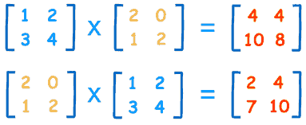
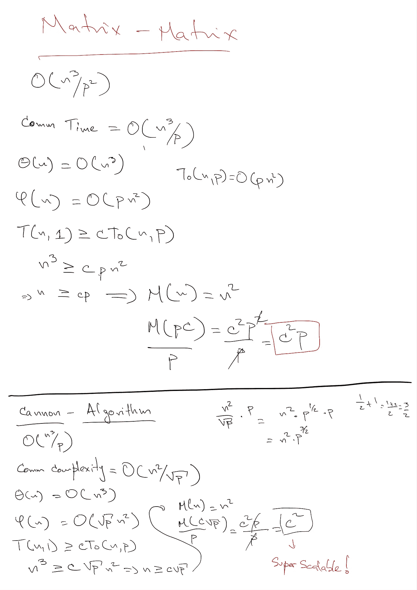

# MapR 数据平台上的 MPI 工作负载性能第 2 部分—矩阵乘法

> 原文：<https://medium.com/hackernoon/mpi-workloads-performance-on-mapr-data-platform-part-2-matrix-multiplication-e1020ea0e18a>



在本系列的 [***第一部分***](/@anicolaspp/mpi-workloads-performance-on-mapr-data-platform-part-1-c801f3d5fe08)*中，我们展示了如何在 MapR 数据平台上使用 MPI 在相当大的范围内成功地找到素数。此外，我们比较了我们在 MPI 中的`Sieve of Eratosthenes`实现和在 Spark 中的相同算法，以发现它们在查看一些有趣的实现细节时的行为。*

*在本系列的第二部分，我们将在 MPI 和 Apache Spark 中实现`Matrix Multiplication`。同样，我们将看看每个实现在 MapR 上运行时的行为。然而，我们的 MPI 实现将基于`Cannon Algorithm`,而在 Spark 中，我们将使用 MLlib 块矩阵函数进行矩阵相乘。*

## *卡农算法*

*并行计算中有隐含的含义。随着参与计算的处理器数量的增加，内存需求也会增加。这不是微不足道的，而是经过证明的。*

*卡农算法的可扩展性极强。这意味着通过增加处理器数量，我们可以保持较低的内存需求。下面是对使用`Matrix to Matrix`乘法的`Matrix Multiplication`与`Cannon Algorithm`使用的`Block Decomposition Matrix Multiplication`的可扩展性分析。*

**

*正如我们所见，在第一部分(`Matrix-Matrix`)，我们没有获得任何可伸缩性，因为内存依赖于`P`——处理器的数量。在第二部分(`Cannon-Algorithm`)中，内存需求与处理器的数量无关，更具体地说，它是一个常数，允许我们更好地扩展。*

## *用 MPI 实现 Cannon 算法*

*现在，我们将展示实现的主要部分，它是核心。然后，我们将链接整个源代码，供感兴趣的人查看。*

*首先，让我们看看我们将要使用的函数，这样我们可以更好地理解应用程序流。*

*注意，从/向文件读取和写入矩阵是并行和分布式的。每个处理器负责所讨论的矩阵中它自己的块(片)。*

*我们的应用程序如下所示。*

*正如我们所见，这不是一段简单的代码，但它呈现了`Cannon Algorithms`上的核心元素。完整的源代码可以在这个 [***Github 资源库***](https://github.com/anicolaspp/Parallel-Computing-MPI-Matrix-Multiplication) ***中找到。****

*在 Spark 中，同样的事情可以通过简单的构造来实现。下面的代码片段展示了这个过程。*

*正如我们所看到的，它非常简单，但是让我们看看它与我们的 MPI 版本相比有多快。*

## *使用 MPI*

**1000x1000 矩阵乘法**

```
*mpirun -np 16 multiply 1000x1000.in 1000x1000.in 1000x1000.outelapsed time: 2.082910 // around 2 seconds*
```

**10000x10000 矩阵乘法**

```
*mpirun -np 16 multiply 10000x10000.in 10000x10000.in 10000x10000.outelapsed time: 307200 // around 5 mins*
```

## *火花中*

**1000x1000 矩阵乘法**

```
*multiply("1000x1000.txt")(sc)res19: Long = 4118 // around 4 seconds*
```

**10000x10000 矩阵乘法**

```
*multiply("10000x10000.txt")(sc)res0: Long = 973943 // around 16 mins*
```

*正如我们所看到的，Spark 所花费的时间增长得非常快，但是 MPI 能够以很小的时间代价运行这个过程。同时，当乘以 10000x10000 矩阵时，我用完了 Spark 中的堆空间，为了运行这个操作，每个执行器的堆空间必须增加到 12g。*

*同样，这里有一个我们无法避免的权衡。与 MPI 的高性能相比，Spark 的简单性和可靠性更高，但很难编码和维护。*

*归根结底，关键是为工作选择正确的工具，MapR 数据平台能够在 Spark 或 MPI 上运行，不会出现任何问题。*

## *MPI 从文件中读取的注意事项*

*为了乘矩阵，我们的 MPI 应用程序必须从文件中读取相应的输入。这些文件存储在 MapR-FS 中，MapR-FS 支持不同的接口与之交互，如 HDFS、POSIX 等。我们用于 MPI 的`C`代码使用常规的`POSIX`调用来读取矩阵，因此每个进程只读取矩阵的一部分，我们称之为`blocks`。使用 Spark 时，Spark 尽可能使用数据局部性，这有助于加速处理过程，因为每个处理器都从它运行的节点本地读取数据。在 MPI 中，这依赖于 MapR `POSIX`客户端。*

# *结论*

*尽管 MPI 在与 MapR 分布式文件系统交互时存在一些限制，但与 Spark 为`Matrix Multiplication`提供的相比，整体处理时间还是相当可观的。另一方面，Spark 提供了在保持整个过程的可靠性和容错性的同时轻松完成这些操作的结构，这些都是 MPI 所缺乏的特性。*

> *简单使用和高性能之间的权衡已经存在多年，不能忽视，意识到这一点有助于我们在每种情况下做出决定。*