# 多层双向 LSTM/GRU 使文本摘要变得简单(教程 4)

> 原文：<https://medium.com/hackernoon/multilayer-bidirectional-lstm-gru-for-text-summarization-made-easy-tutorial-4-a63db108b44f>

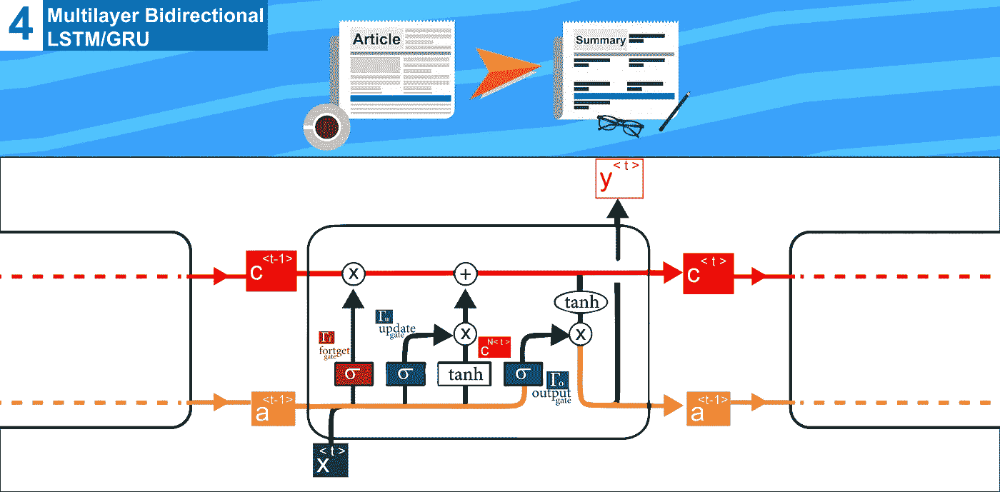

本教程是一系列教程中的第四个，它将帮助你使用 tensorflow 构建一个抽象的文本摘要器，今天我们将讨论对核心 RNN seq2seq 模型的一些有用的修改，我们在上一个教程中已经介绍过

这些修改是

1.  RNN 修改(GRU 和 LSTM)
2.  双向网络
3.  多层网络

## 关于系列

这是一系列教程，将帮助您使用 tensorflow 使用多种方法构建一个抽象的文本摘要器， ***您不需要下载数据，也不需要在您的设备*** 上本地运行代码，因为**数据**可以在 **google drive** 上找到，(您可以简单地将其复制到您的 google drive，在此了解更多，本系列的**代码**是用 Jupyter 笔记本编写的，可以在上面运行

到目前为止我们已经讨论过了(这个系列的代码可以在[这里](https://github.com/theamrzaki/text_summurization_abstractive_methods)找到)

0.[深度学习免费生态系统概述](https://hackernoon.com/begin-your-deep-learning-project-for-free-free-gpu-processing-free-storage-free-easy-upload-b4dba18abebc)(如何使用 google colab 和 google drive)

1.  [概述文本摘要任务和用于该任务的不同技术](https://hackernoon.com/text-summarizer-using-deep-learning-made-easy-490880df6cd)
2.  [使用的数据以及如何表示我们的任务](https://hackernoon.com/abstractive-text-summarization-tutorial-2-text-representation-made-very-easy-ef4511a1a46)
3.  [什么是 seq2seq 文本摘要，为什么](https://hackernoon.com/tutorial-3-what-is-seq2seq-for-text-summarization-and-why-68ebaa644db0)

所以让我们开始吧

EazyMind free Ai-As-a-service for text summarization

我在一个网站上添加了一个文本摘要模型 [eazymind](http://bit.ly/2VxhPqU) ，这样你就可以自己尝试生成你自己的摘要(看看你能构建什么)，它可以通过简单的 api 调用来调用，并且通过 [python 包](http://bit.ly/2Ef5XnS)，这样文本摘要就可以很容易地集成到你的应用程序中，而不需要设置 tensorflow 环境的麻烦，你可以免费注册，并享受免费使用这个 api 的乐趣。

# 快速回顾

我们的任务是文本摘要，我们称之为抽象，因为我们教神经网络生成单词，而不仅仅是复制单词。

将被使用的数据将是新闻和它们的标题，可以在我的 google drive 上找到，所以你只需将它复制到你的 google drive 上，而不需要下载它

我们将使用单词嵌入来表示数据，这只是简单地将每个单词转换成一个特定的向量，我们将为我们的单词创建一个字典([更多关于这个](https://hackernoon.com/abstractive-text-summarization-tutorial-2-text-representation-made-very-easy-ef4511a1a46))

对于这项任务，有[种不同的方法](https://hackernoon.com/begin-your-deep-learning-project-for-free-free-gpu-processing-free-storage-free-easy-upload-b4dba18abebc)，它们建立在基石概念的基础上，并且它们继续开发和建立，它们从一种叫做 RNN 的网络开始，这种网络被安排在一种叫做 seq2seq 的编码器/解码器架构中([更多关于这个](https://hackernoon.com/tutorial-3-what-is-seq2seq-for-text-summarization-and-why-68ebaa644db0))，这些不同方法的代码可以在这里[找到](https://github.com/theamrzaki/text_summurization_abstractive_methods)

> *本教程一直以* ***吴君如****[*的惊人之作为基础，他的课程对 RNN*](https://www.coursera.org/lecture/nlp-sequence-models/recurrent-neural-network-model-ftkzt) *已经真正有用了，推荐你去看一下**

*今天，我们将对编码器/解码器模型的核心组件进行一些修改，这些修改发生在 RNN 模块本身，以提高其在整个模型中的效率。*

# *1.RNN 修改(LSTM 和 GRU)*

*RNN 装置有两个主要问题*

1.  ***爆炸梯度:**发生在深层网络中(即:有许多层的网络*就像我们的例子)，当我们应用反向传播时，梯度会变得太大。实际上，使用**梯度削波**的概念，可以很容易地解决这个误差，这只是简单地设置一个特定的阈值，当梯度超过阈值时，我们会将其削波到某个值。**
2.  ****消失梯度:**这证明是一个更难解决的问题，这也发生在*由于大量的层*，但这是由于正常的 RNN 单元不能记住在序列早期出现的旧值**

> **这在处理 nlp 问题时非常重要，因为一些单词依赖于出现在句子早期的单词，如**

**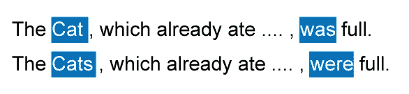**

**Here the word cat/cats which appeared early in the sentence would directly affect choosing either was/were later in the sentence.**

**为了解决这个问题，我们需要一个新的 RNN 架构，这里我们将讨论两种主要方法:**

1.  **GRU(门控循环单元)**
2.  **LSTM(长短期记忆)**

## **1.A) GRU(门控循环单元)**

**GRU 和 LSTM 都解决了普通 RNN 单元所遭受的消失梯度的问题，他们通过在他们的网络中实现一个存储单元来做到这一点，这使他们能够在序列中存储早期的数据，以便在序列中稍后使用。**

**在这里我们将讨论 GRU(门控循环单元)，我们从 RNN 的激活方程开始([更多关于这个](https://hackernoon.com/tutorial-3-what-is-seq2seq-for-text-summarization-and-why-68ebaa644db0))**

**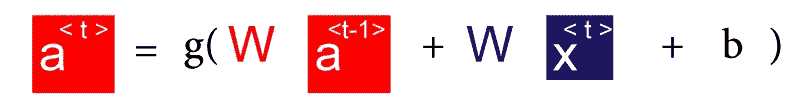**

**然后我们会对它进行一些简单的修改**

**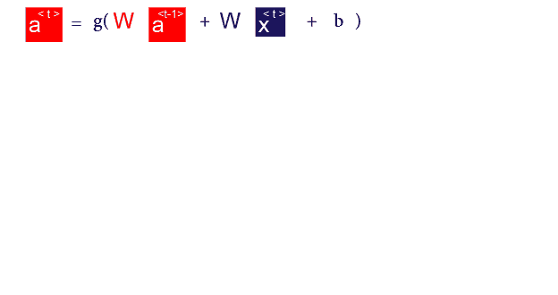**

**直到我们最终**

**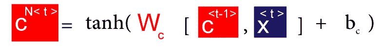**

****c** 这里表示为存储单元，这里它将是 GRU 单元的输出。**

****N** 子字母表示它是新提出的 c 值(我们稍后将使用它来生成 GRU 的实际 c 输出)。**

**因此，这里新的建议输出 c(候选)，将取决于旧的输出 c(旧的候选)，以及当时的当前输入**

**为了记住 C(候选)的值，我们使用另一个名为 F(门更新)的参数，这将控制我们是否更新 C 的值**

**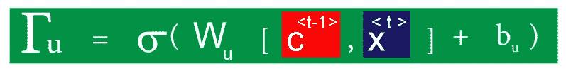**

**here we would use a sigmoid function , we would take into consideration **the old c** , and the **current input X****

**因此，为了更新 C 的值，我们将使用**

**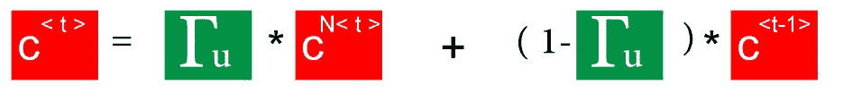****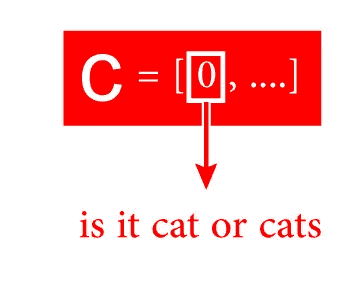**

**让我们假设 C 是一个向量，它的第一个元素将**记住句子中的重要特征，**这里我们假设这个特征是单词是猫还是猫**

**因此，首先 c 向量是空的，直到我们看到单词 **cat** ，然后 F 将被设置为 1 以记住它是一个单数单词，并且它**将保持**的值，直到它在句子的后面被使用(以生成‘was’而不是‘were’)**

**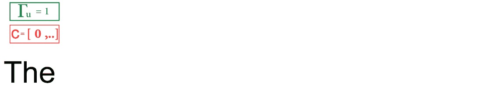**

**构建完整的 GRU 单元还需要做另一个修改，它发生在创建新的候选 C 所需的函数上。**

**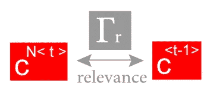**

**这里我们将有一个可学习的( **Fr** )参数来学习 **C new** 和 **C old** 之间的相关性**

**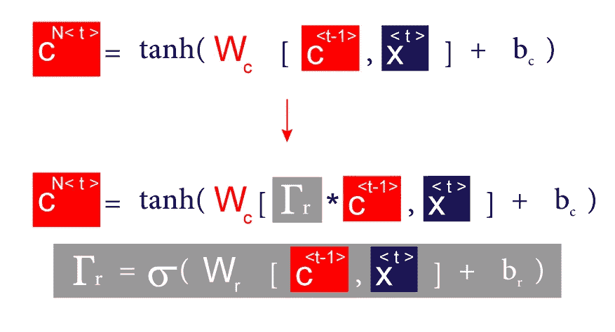**

**总而言之，我们有四个主要的方程来支配 GRU**

**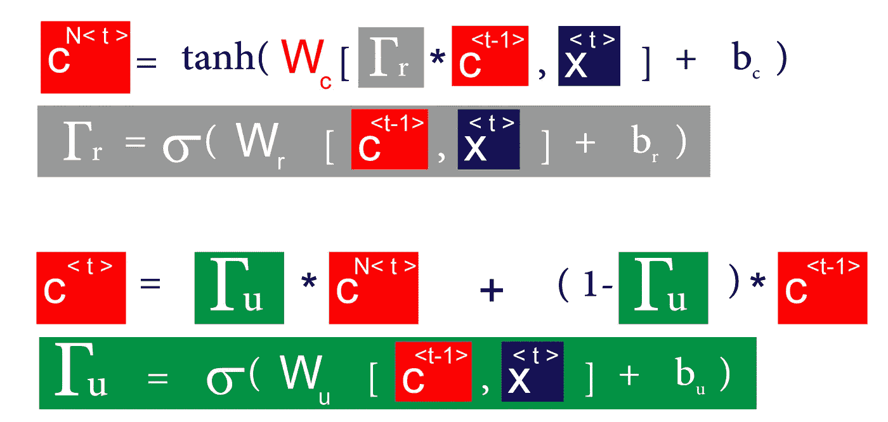**

## **1.LSTM(长短期记忆)**

**LSTM 是对 RNN 的另一个修改，它也是使用相同的内存概念构建的，以记住长序列的数据，它是在 GRU 之前提出的，所以 GRU 实际上是对 LSTM 的简化**

**在 LSTM 这里，**

1.  **我们使用激活值，不仅仅是 C(候选值)，**
2.  **我们也有来自单元的 2 个输出，一个新的激活，和一个新的候选值**

**所以为了计算新的候选人**

**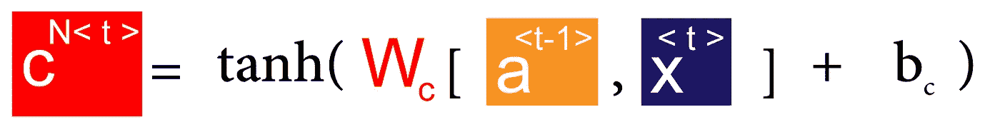**

**在 LSTM，我们通过三个不同的门来控制存储单元**

**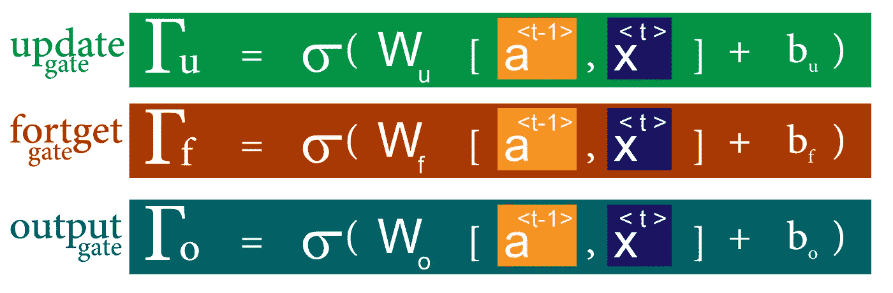**

**正如我们之前所说，我们有 2 个来自 LSTM 的输出，新的候选和新的激活，在它们中我们将使用先前的门**

**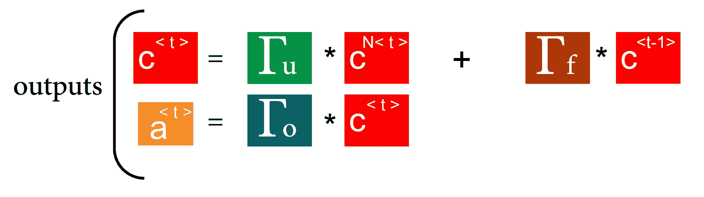**

**将所有这些结合在一起**

**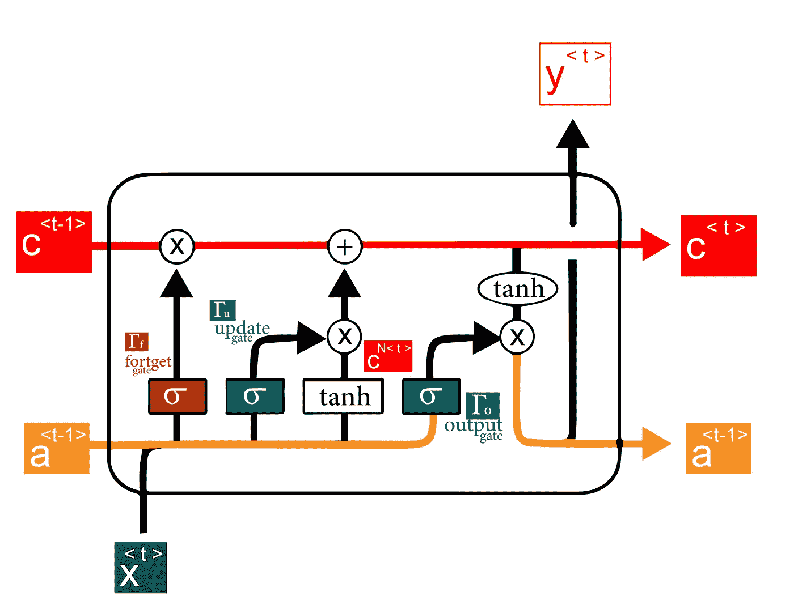**

**we could also output y prediction from LSTM (by passing them to softmax )**

**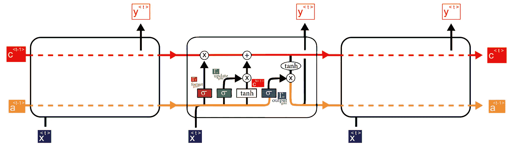**

**当我们将多个 LSTMs 连接在一起时，我们可以看到，如果网络正确地学习了门参数，我们可以将候选值(红色值)从序列的早期传递到序列的最末端，因此我们可以高精度地对长相关性进行建模**

# **2.双向网络**

**这是对普通 RNN 网络的一种改进，使它能够适应 nlp 问题中的一个重要需求，**

> **就像在 nlp 中一样，有时为了理解一个单词，我们不仅需要理解前面的单词，还需要理解后面的单词，就像这个例子一样**

**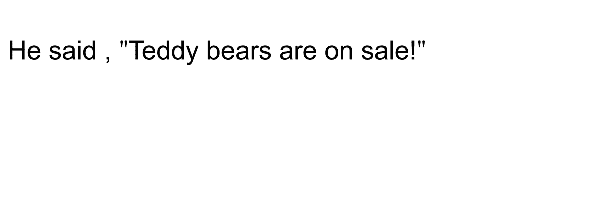**

**为了区分单词 **teddy** 的两种不同含义(一次是人名的一部分，另一次是单词 bear 的一部分),我们需要寻找下一个单词，这就是我们需要应用双向网络的原因**

**双向网络是一种通用架构，可以利用任何 RNN 模型(正常的 RNN、GRU、LSTM)**

**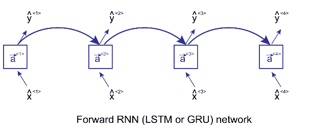**

**forward propagation for the 2 direction of cells**

**这里我们应用两次前向传播，一次用于前向单元，一次用于后向单元**

**两种激活(向前、向后)都将被考虑来计算时间 t 处的输出 y^**

**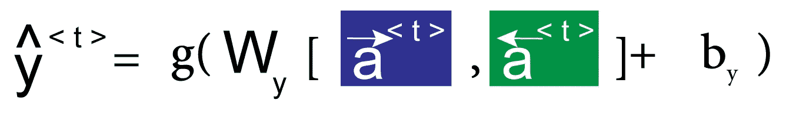**

# **3.多层网络**

**为了获得更好的结果，我们可以将多个 RNN(LSTM、GRU 或正常的 RNN)堆叠在一起，但我们必须考虑到它们需要时间。**

**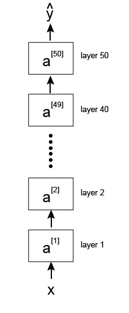**

**首先，这是一个普通的深度网络，我们可以看到它包含多个层(本例中为 50 层)，而当我们在 RNN 上应用相同的概念时，我们倾向于选择更少的层数，因为这就足够了，而且计算量很大**

**现在让我们看看如何将深度网络的概念应用于 RNN**

**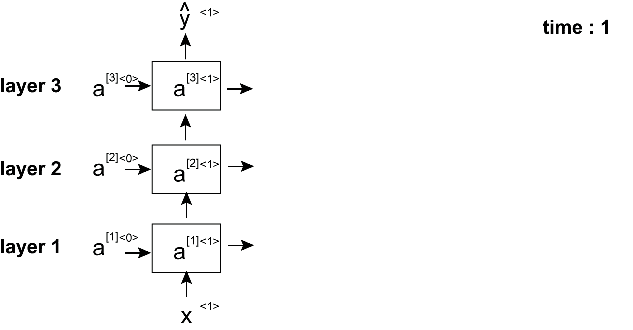**

**正如我们所看到的，由于我们正在研究 RNN 或其变体，我们必须考虑时间因素，因此每个垂直的单元格列代表一个层，而每个时间进程我们重复这个列**

**所以我们的符号是[layer]**

**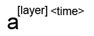**

**为了获得任何激活层的值，我们使用两者**

**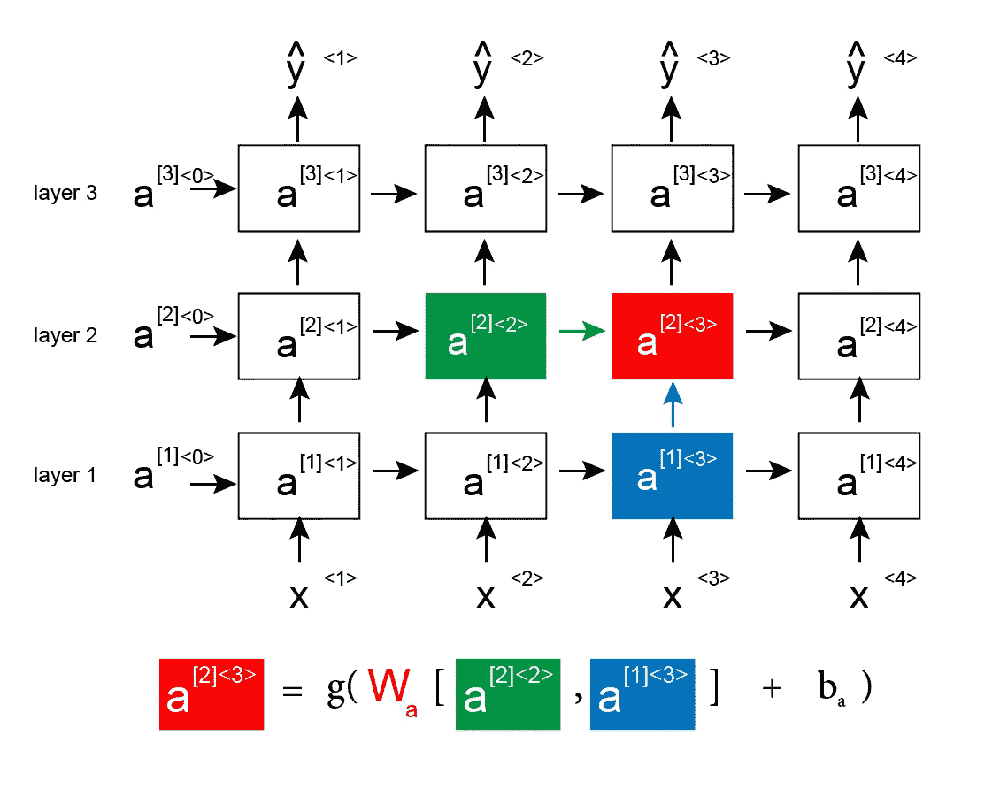**

1.  **来自同一层(层 2)的时间上(时间 2)的先前激活💚**绿色****
2.  **前一层(层 1)中同一时间(时间 3)的前一个单元格🔵**蓝色****

**下一次，如果上帝愿意，我们将讨论如何使用**

1.  **波束搜索**
2.  **注意力模型**

> ***我真心希望你喜欢阅读本教程，我希望我已经把这些概念讲清楚了，这一系列教程的所有代码都可以在这里找到***，你可以简单地使用 google colab 来运行它，请查看教程并告诉我你对它的看法，希望再次见到你****

# ***后续教程***

*   ***[波束搜索&注意让文本摘要变得简单(教程 5)](http://bit.ly/2G4XCo3)***
*   ***[在 Tensorflow 的 94 行中构建一个抽象的文本摘要器！！(教程 6)](http://bit.ly/2ZeEmvO)***
*   ***[用于文本摘要的抽象&提取方法的组合(教程 7)](http://bit.ly/2EhcRIZ)***