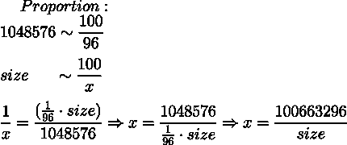
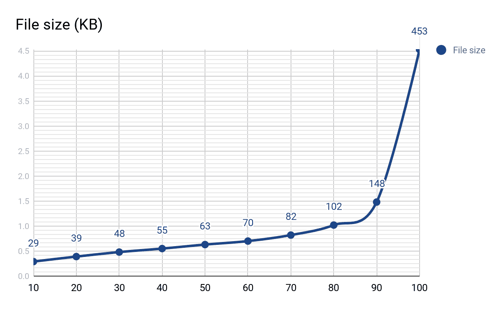

# 用 PhantomJS 构建横幅生成工具的多种方法

> 原文：<https://medium.com/hackernoon/multiple-ways-to-build-a-banner-generation-tool-with-phantomjs-616287a463f5>

*作者:* [*尤里·弗拉西克*](https://www.linkedin.com/in/yurii-vlasiuk-132511101/)

今天，我们想分享我们的经验，实现后端工具，从 HTML 模板生成图形横幅。WebbyLab 的客户对基于准备好的模板的广告横幅定制自动化感兴趣。基本上，你有一个 index.html 与领域，你可以插入不同的组件，如按钮，图像或文本。因此，我将讲述我们用来实现这种功能的方法。对于我们的项目，我们选择了幻想曲。你可能会说在 npm 库中有更多创新的解决方案。但是当我们开始的时候，这些库都还不稳定或者没有很好的文档记录(例如，[puppet er](https://github.com/GoogleChrome/puppeteer)——一个 Node.js 库，它提供了一个高级的 [API](https://hackernoon.com/tagged/api) 来控制基于 Chromium 的无头引擎；它最显著的特点之一是强大的截屏功能。该项目的规格要求有很大的稳定性。这就是为什么我们决定采用经过检验的、记录良好的幻想曲。任务是创建一个无头 Chrome 截图功能，如 David Schnurr 在[文章](/@dschnr/using-headless-chrome-as-an-automated-screenshot-tool-4b07dffba79a)中所述。

好了，介绍够了。让我们仔细看看我们决定使用的框架。[PhantomJS](http://phantomjs.org/)([https://github.com/ariya/phantomjs](https://github.com/ariya/phantomjs))是一个无头的 WebKit 浏览器，可以用 [JavaScript](https://hackernoon.com/tagged/javascript) API 编写脚本。

根据创建者列出的功能列表如下:

*   无头 web 测试；
*   页面自动化；
*   截屏；
*   网络监控。

我不会深入讨论每一个问题，而是集中讨论解决问题的任务和方法。该任务意味着实施以下功能:

*   基于 HTML 模板的图像生成(可以定制)；
*   图像压缩——以适应特定的尺寸限制；
*   缩放图像以提高 Retina 屏幕的质量。

# 准备

要设置 stage，首先需要使用 npm 下载并安装 PhantomJS。我已经设置了具有两条路径的 small express server 一条用于静态托管，另一条用于发送生成请求(完整的示例可以在我的 [Github](https://github.com/unsigned6/phantomjs-image-generator) 中找到)。

首先，我们必须为图像生成创建一个核心类。首先创建一个 Phantom 实例，并使用它来创建页面，这将在我们的后端提供图像渲染。

接下来，我们必须使用`viewportSize`属性和`clipRect`将属性设置为页面大小，以定义要呈现的矩形的坐标:

然后，我们需要打开将返回操作状态的页面:

```
const status = await page.open(config.templatePath);
```

也有可能在网页的上下文中评估 JavaScript 代码。为此，使用了`evaluate()`函数，它接受另一个函数作为参数。我们使用`evalFunction`在渲染到图像之前对模板进行修改。

```
await page.evaluate(evalFunction);
```

但是在开始的时候，我们会把它去掉，因为它是可选的，并且实际上对于获取图像是不需要的。

无头模式下截屏所需的最后一步是启动实际的渲染并退出我们的 PhantomJS 实例:

另外一个好的做法是检查映像是否创建成功，否则抛出“错误”。这允许处理 Phantom 无法打开模板的情况。

现在我们可以将所有的片段收集到图像生成类中。我们将这个类的操作分为三个部分:创建页面、设置页面大小和生成图像。以下是清单:

因此，从模板渲染图像的基本功能已经就绪，实际上，这已经是一个工作示例。如果您调用`generate()`方法并向其传递带有 templatePath(您要渲染到图像中的 HTML 模板的位置)和 destinationPath(输出图像文件的位置)键的页面大小和配置对象，这将创建 JPEG 格式的图像。此外，我们将使用附加选项来扩展这个示例。

# 错误处理和调试

方法`page.open()`返回操作的状态。一个好的做法是检查打开页面是否结束，否则抛出一个异常。这将允许处理 Phantom 无法打开模板的情况。

为了控制在无头模式下页面呈现期间发生的事情，我使用`onConsoleMessage`属性将日志记录添加到幻像页面实例中，以将页面消息输出到终端控制台。这个和平可以添加到我们的`ImageGenerator`类的`_createPage()`方法中。

# 模板定制

例如，我使用带有迷因的图像创建了一个简单的模板，这在 2017 年夏天很流行。下面是“index.html”的列表:

CSS 样式仅在定位和调整文本块大小时需要。所有与模板相关的文件都位于“static/templates”目录中。当您准备好模板后，就该用`evaluate`函数扩展类示例，并向模板添加您可能额外需要的任何 JS 脚本了。请记住，模板中的任何 JavaScript 代码都将由 Phantom 评估和执行，它不识别任何特定于 ES6 的特性(例如，没有字符串模板，只有连接)。我个人觉得不好玩。此外，Phantom 不支持一些在现代浏览器中广泛使用的 CSS 属性。例如，如果你热衷于使用 Flexbox，你可以在准备模板时忘记它——当用 Phantom 渲染它们时，所有不支持的功能都将被忽略甚至导致错误。

我认为在 eval 函数中定制页面文本最简单的方法是使用`getElementById`，然后替换所选节点中的`innerHtml`，或者改变`img`标签中的`src`属性。另外，我没有在`imageGenerator`类本身中声明这个函数，而是在调用`generate()`方法之前声明的。这提供了在不同情况下传递不同函数的灵活性。例如，您可以将这样的函数传递给`page.evaluate()`:

您可能已经注意到，您还应该标准化模板和内容 id 的格式，因为它们将被评估函数使用。这就是为什么最好保持所有模板的命名约定一致，以免为每个模板编写不同的求值函数。`page.evaluate()`的第二个参数用于将参数传递给`evaluateFunc`:

```
await page.evaluate(evaluateFunc, config);
```

# 图像压缩

我们使用 PhantomJS 的项目对输出图像有另一个要求。在项目开发的平台上有文件大小和图像尺寸(固定的高度和宽度)的限制。在满足限制的同时，图像应该尽可能地高质量。PhantomJS 为 PNG 和 JPEG 格式提供了选择质量(或压缩级别)的选项:

```
await page.render(config.destinationPath, { format: 'jpeg', quality: ‘96’ });
```

范围在 0 到 100 之间，默认值为 75。因此，我们必须在渲染之前计算出所需的压缩级别。在大多数情况下，我使用了一种通过解析内容组合的简单比例来计算值的方法。它给了我最大的图像尺寸和质量参数的经验值。使用这个值，可以计算系数(当然，我们不应该忘记压缩级别和输出文件大小是成反比的)。

在下面的例子中，96 是压缩级别，`size`是输出图像的高度和宽度的乘积(已知值)，而`x`是我们寻求的压缩级别:



接下来，我们用根据图像尺寸计算压缩级别的方法扩展了`imageGenerator`:

但这还不是全部。其他内容(例如不同的背景)也可能超过大小限制。此外，压缩后，文件大小不会线性减小，如下图所示(质量与文件大小的相关性):



最后，我们采用了另一种方法，这种方法仍然很简单，但是很有效。如果内容超出大小限制，我们开始迭代图像渲染，逐步降低质量，并从`generate`方法返回找到的质量值:

这两种方法的组合(预先计算的因子和迭代质量递减)在性能上提供了更好的结果，因为图像渲染是一种高负载操作。在实践中，在大多数情况下，静态系数可以立即达到可接受的结果，只有一些图片需要 2-3 次额外的迭代(我认为这是一个不错的结果)。

# 图像质量改善

另一个有趣的任务是提高最终图像的质量。由于限制，在幻像中渲染会产生压缩图像。这就是为什么在浏览器中打开的 HTML 模板看起来比固定尺寸的渲染图像更好，即使质量设置为 100。由于原始图像的维度更高，压缩后的图像看起来永远不会像原始图像那样清晰——是原始图像的两倍甚至更多倍。在下面的示例中很明显，左边是由 Phantom 生成的图像，分辨率为 1152*768，质量设置为 100，右边是在浏览器中打开的原始图像:


在左图中，你可以注意到像素颗粒，这在缩放时变得更加明显。

这就是为什么尽管图像尺寸限制，我们也包括了生成更大的图片，但文件大小限制相同的可能性。这是可能的，因为一些图片在正常尺寸下根本没有达到尺寸限制。顺便说一句，使用 Phantom，这可以简单地完成。为此，设置了`zoomFactor`属性，该属性指定图像应该缩放多少倍:

```
page.property('zoomFactor', 2);
```

高度和宽度都必须乘以该值，否则只会渲染缩放图像的裁剪部分。

为了使其可选，我们传递了一个标志来将缩放模式切换到`ImageGenerator`类的`generate`方法的参数:

# 事件

PhantomJS 中另一个可以用于模板呈现的强大机制是页面事件系统。在模板中定义了一些反应的情况下，这可能很有用——例如，在悬停或鼠标点击时。下面是如何在模板中的(10，10)坐标处启动鼠标单击事件:

```
await page.sendEvent('click', 10, 10, 'left');
```

其他支持的事件类型有“mouseup”、“mousedown”、“mousemove”、“双击”。代表事件鼠标位置的两个参数是可选的。最后一个表示应该“点击”哪个鼠标按钮，默认为左。

此外，Phantom 支持发送键盘事件，但我不会在本文中涉及它们。如果你感兴趣，你可以在图书馆的[文档](http://phantomjs.org/api/webpage/method/send-event.html)中了解更多。

*原载于*[](https://blog.webbylab.com/banner-generation-tool-phantomjs/)**。**