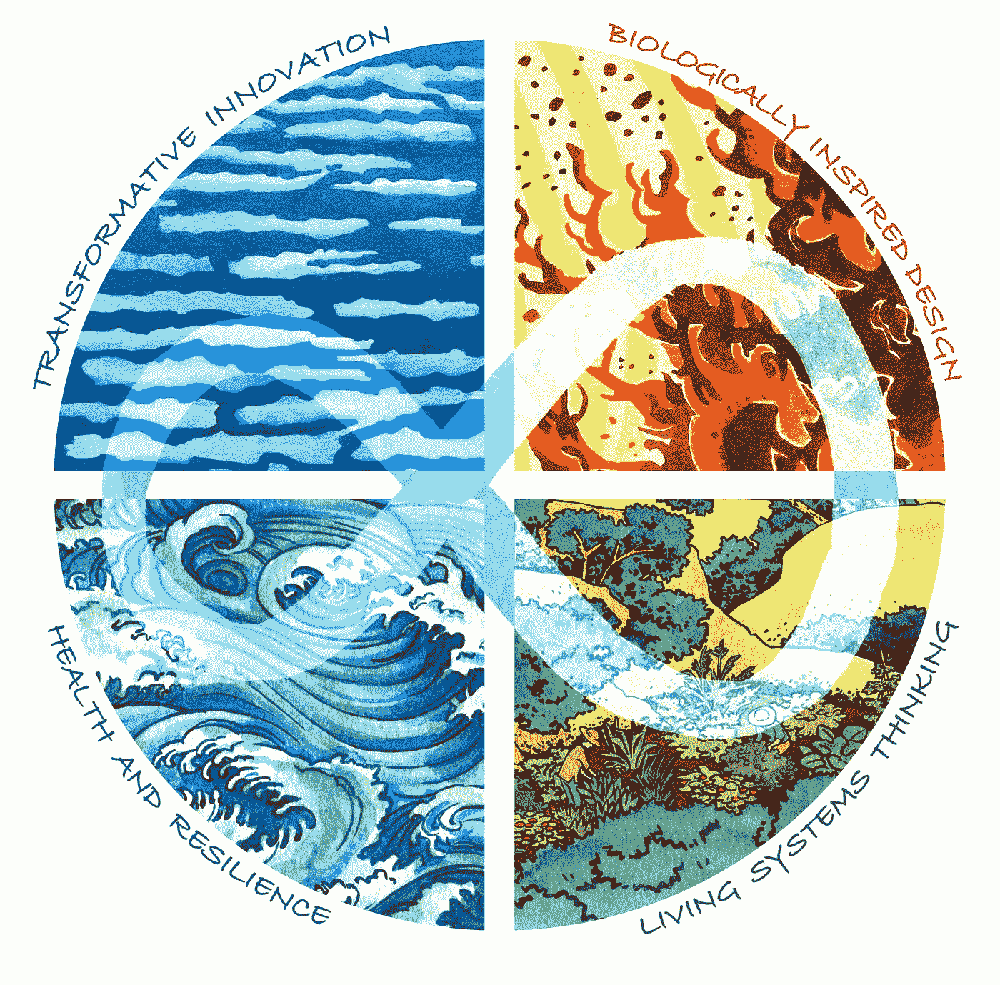

# 关于再生崛起与再生文化设计的思考

> 原文：<https://medium.com/hackernoon/musings-on-the-regeneration-rising-designing-regenerative-cultures-599032caa63>

## 收集了丹尼尔·沃尔的播客、网络研讨会、演讲和视频

Cover Image of Designing Regenerative Cultures by Daniel C. Wahl (Illustration: Flavia Gragiulo Rosa)

这是一项正在进行中的工作——从粘贴链接开始，希望很快提供每个链接的简要介绍。现在，我把它作为一个资源列表来分享:

 [## 故障和 Breakthrough.mp4

### Dropbox 是一项免费服务，可以让你将照片、文档和视频带到任何地方，并轻松分享。从不发电子邮件…

www.dropbox.com](https://www.dropbox.com/s/7k36legvcvpggww/Breakdown%20and%20Breakthrough.mp4?dl=0&fbclid=IwAR1KYmbygNkKQFSG3AiiQYVk5JzPCxHrvuIHnWxGJYVy_JqSmuRJ74aw0q0) 

…

 [## 与作家和教育家丹尼尔·克里斯蒂安·沃尔一起设计再生文化:099

### 在这次采访中，我有幸与丹尼尔·克里斯蒂安·沃尔进行了交谈，丹尼尔是一名国际顾问…

www.abundantedge.com](https://www.abundantedge.com/abundantedge/daniel-christian-wahl?fbclid=IwAR1ye6uhm55Gk9OUiVxFm88B77TIOKN4EVMU1FTKxaVtyU2N97eWNT2ln8w) 

…

…

 [## 丹尼尔·沃尔谈为弹性和可持续性设计再生文化| P2P 基金会

### http://empower radio . net/podcasts/all things connected _ 041217 _ danielwahl . MP3 本播客与我们频繁的对话…

blog.p2pfoundation.net](https://blog.p2pfoundation.net/daniel-wahl-designing-regenerative-cultures-resilience-sustainability/2017/04/18?fbclid=IwAR1ZQgp-8mvxqeACqprrbs-U6wKP8YCv6bLN_f7hy2QwO2lrNr8ehfs6vao) 

…同一个

 [## 与丹尼尔·克里斯蒂安·沃尔一起成为有意识的变革推动者

### 朱莉博士促进机会，使精神和意识更充分地融入生活，关系，和…

www.empoweradio.com](http://www.empoweradio.com/home/podcasts/on-demand/dr-julie-show/812088-Becoming-Conscious-Change-Agent-with-Daniel-Christian-Wahl.html) 

…

 [## 丹尼尔·克里斯蒂安·沃尔——那里的水味道很好

### “师法自然”和“师法自然”有什么不同？我们能克服“自然文化鸿沟”吗？什么…

rasa.ag](https://rasa.ag/daniel-christian-wahl-the-water-tastes-good-there/) 

…

…

…

…

…

…

…

…

仅出于历史目的:

…

…

自发的咆哮

…

 [## 电台采访:与丹尼尔·克里斯蒂安·沃尔一起设计再生文化

### “我们可以成为我们未来的设计师，我们可以与拥有共同愿景的人进行全面的共同创作，他们……

newstoryhub.com](http://newstoryhub.com/2017/06/radio-interview-designing-regenerative-cultures-with-daniel-christian-wahl/) 

…

 [## Bloom 播客:丹尼尔·克里斯蒂安·沃尔，设计再生文化- Bloom 网络

### 这一集是丹尼尔·克里斯蒂安·沃尔,《设计再生文化》的作者。丹尼尔住在马略卡岛，而且…

bloomnetwork.org](https://bloomnetwork.org/bloom-podcast-daniel-christian-wahl-designing-regenerative-cultures/) 

…

…

…

…

…

…

…

…

…

…

…

…

…