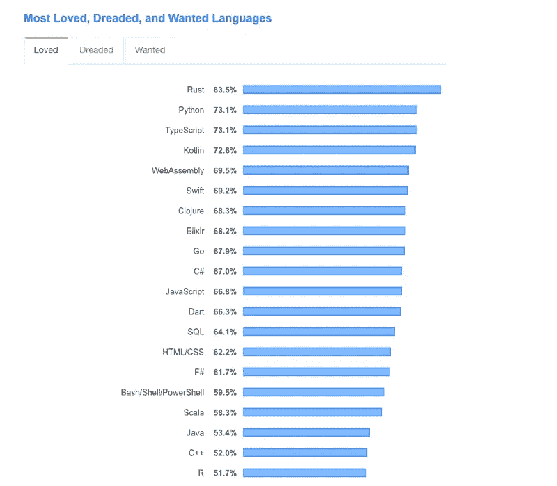
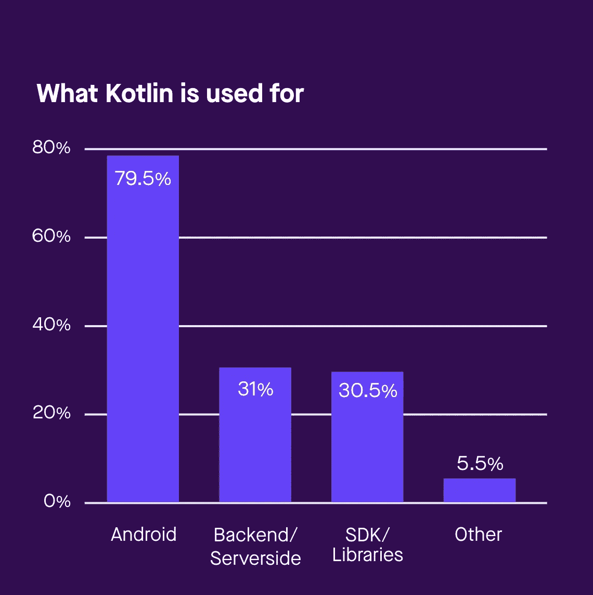
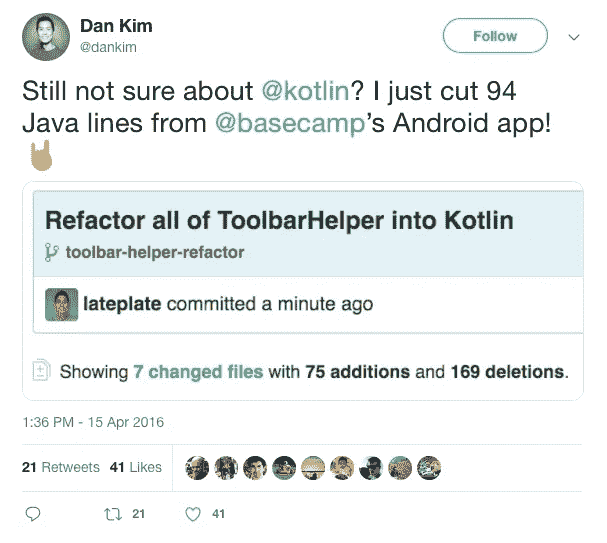
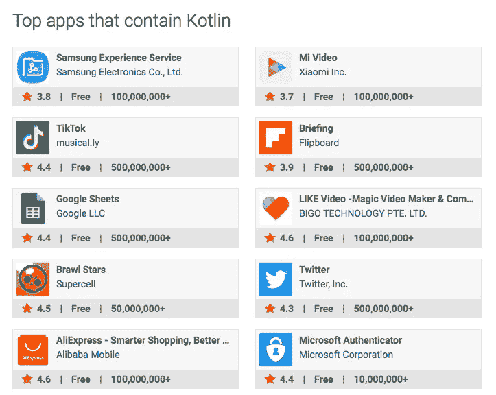
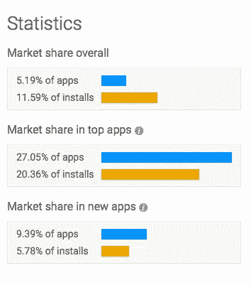

# 沉思:科技界在科特林看到了什么

> 原文：<https://medium.com/hackernoon/musings-what-the-tech-world-saw-in-kotlin-2b8be7b53bc9>

## 根据 Github 最新的 [Octoverse 报告，截至 2018 年 9 月，Kotlin 的贡献增长了 2.6 倍，已经成为 Android 开发的首选编程语言。理解是什么让它不可避免。](https://github.blog/2018-11-15-state-of-the-octoverse-top-programming-languages/)

[Kotlin](https://kotlinlang.org) 在 [Google I/O 2017 上获得了搜索引擎巨头的支持，变得很大。](https://www.zdnet.com/article/android-embraces-the-kotlin-programming-language/)它现在是除 Java 和 C++之外 Android 开发的官方编程语言，也是科技界最受欢迎的第四大语言。*(来源:*[*stack overflow*](https://insights.stackoverflow.com/survey/2019#most-loved-dreaded-and-wanted)*)*

作为最现代的静态类型的开源编程语言之一，Kotlin 可以在 Java 虚拟机(JVM)上无缝运行。它与 Java、JavaScript 和 C++有相似之处。所以作为一名开发人员，如果你了解这些语言，你可以在几个小时内开始使用 Kotlin。

最初，当 Kotlin 推出时，大多数有经验的开发人员都开始尝试。然而，由于它已经成为官方的 Android 语言，更多的学生和开发者正在转向 Kotlin 来构建应用程序。

[根据一位红和尚的报告——](https://www.techrepublic.com/article/why-kotlin-is-exploding-in-popularity-among-young-developers/)

*大约 80%的开发者使用 Kotlin 来开发 Android 应用。大约 31%的人将它用于后端/服务器端应用程序，而另外 31%的人说他们将它用于 SDK/库。*

Source: Pusher.com

# JetBrains——科特林背后的“大脑”

科特林一直在 2010 年左右。 [JetBrains](https://blog.jetbrains.com/kotlin/2011/08/why-jetbrains-needs-kotlin/) 开发它是为了解决他们自己内部开发&的生产力挑战。他们是一家软件开发公司，他们的核心专业领域是 ide。IDE 的基础是编程语言。Kotlin 的第一个版本于 2016 年初问世。从那以后，科特林见证了指数级的增长。

*为什么要建科特林？*

JetBrain 几乎 70%的产品都是用 Java 构建的。慢慢地，公司开始厌倦老式的编写代码的方式。使用 Java，即使是像“Hello World”这样的基本东西也需要任何开发人员编写三行代码，而现代语言只需三个字就可以完成。

这意味着更多的重复性工作。JetBrains 需要的是一种与 Java 兼容的新语言，这种语言可以转化为向现有应用程序添加新功能，而无需从头重写，而且代码更少。他们尝试了 Scala，但是没有他们希望的那么快。

他们就是这样建造科特林的。

# 开发者被 Kotlin 所吸引，因为它让他们更开心。

如果你对项目管理和团队沟通感兴趣，你可能会使用“大本营”。该公司是 Kotlin 的最早采用者之一。

早在 2016 年 5 月，Android 应用程序的三分之一代码都是基于科特林的 *(* [*)现在是 100%科特林*](/signal-v-noise/how-we-made-basecamp-3s-android-app-100-kotlin-35e4e1c0ef12) *)* 。代码越好，用户越开心(任何开发者的最终目标)，程序员也是如此。怎么回事，你可能会问？

Source: Signal v/s Noise

BaseCamp 的机器人专家丹·金(Dan Kim)发现，当他开始使用科特林编写代码时，他说了好几次“天哪”。

弹出适配器是他的第一个 Kotlin 类。他完成了 86 行。代码简洁、易读，更重要的是，他乐于编写代码。事实上，少即是多。

接下来，在转换一个现有的助手类时，他只减少了 94 行代码。

## 他刚刚爱上了一门编程语言，作为一名开发人员，我可以告诉你爱上一门语言有多难。

以下是他最喜欢的 Kotlin 功能，他们经常在 Basecamp 使用。

 [## 一些我最喜欢的 Kotlin 特性(我们在 Basecamp 中经常使用)

### Basecamp 的 Android 团队最近通过了一个相当重要的里程碑 Basecamp 3 Android 应用程序代码库现在超过 25%…

m.signalvnoise.com](https://m.signalvnoise.com/some-of-my-favorite-kotlin-features--that-we-use-a-lot-in-basecamp/) 

有趣的是，他还分享了 Kotlin 如何让他成为一名快乐的程序员。

作为开发人员，我们希望使用框架/语言来为业务问题提出创造性的解决方案，而不仅仅是编写一些样板代码。

**他是这样说的——**

> 写简洁、清晰、有表现力的代码让我很开心。专注于商业问题的创造性解决方案，而不是样板和仪式，让我感到快乐。感受到强烈的学习动力，这是 Java 时代所没有的，让我很开心。
> 
> 这一点非常重要。因为快乐不仅对灵魂有益。这对你的编程技能也很有帮助。
> 
> 你的语言越有能力，越友好，你就越快乐。你越快乐，你做出的代码选择就越好。您选择的代码越好，您养成的习惯就越好。而且你养成的习惯越好，你就会成为越好的程序员！
> 
> 这正是过去一年我和科特林发生的事情。正因为如此，我成为了一名更好的程序员。

点击阅读更多关于他对科特林的看法。

克里斯蒂娜·李(Christina Lee)是一名 Android 工程师，她是 Pinterest 网站上第一批尝试 Kotlin 的[视频大头针功能的少数人之一。](https://help.pinterest.com/en/article/video-on-pinterest)她说， ***“用它工作会让你脸上带着微笑。”***

任何使用 Java 多年的组织/公司都会很快发现自己陷入了泥潭——是继续使用 Java 还是尝试 Kotlin？因为 Java 可以做 Kotlin 能做的一切。今天，数以百万计的应用程序仍然是用 Java 开发的，并且运行良好。

*不同的是，科特林加快了开发速度。怎么会？*

用更简单易懂的代码。不再使用样板代码。

Kotlin 当然有更漂亮的语法，但它不再是关于特性和功能。这些特性确保您拥有一个更高效的开发环境。

*基于 Kotlin 的特性大约在。每月 1.5 亿用户。*

**与 Dan 的观点相似，Christina 认为—**

> Kotlin 并没有彻底背离 Java，因为两者都为 JVM 生成字节码。但是让它如此好用的是，它本质上是 Java 的一个版本，其中最佳编程实践已经内置到语言中，所以做正确的事情比做错误的事情要容易得多。这使得开发人员能够快速而自信地编码，并消除了使用 Java 时需要的大量机械工作。
> 
> 因为编码就像写作一样，是一种表达的艺术形式，拥有这样的工具可以让你清晰、快速、准确地表达你的想法，这是一种令人满意的现象，也是一种值得兴奋的现象。当您将这一点与业界领先的工具和语言的互操作性以及 JetBrains 团队所展示的全面而周到的语言领导力相结合时，很难不爱上它。

听听她的想法-

 [## 科特林和克里斯蒂娜·李在 Pinterest

### 我们采访了克里斯蒂娜·李(Christina Lee ),了解她在全国各地的跑步活动、Pinterest 对科特林的采用以及她的观点…

talkingkotlin.com](http://talkingkotlin.com/kotlin-at-pinterest-with-christina-lee/) 

Square 旗下的按需送餐应用 Caviar app 也是 100%基于 Kotlin 的。

Source — Via Google Play Store

当 Valeriy Ovechkin 作为软件工程师加入 Caviar 团队时，该应用程序是 100% Java 的。他开始将 Kotlin 作为一个“激情项目”进行试验，并向“Square”团队表示，这将使开发速度更快。

当在 Kotlin 中重写现有特性时，对最终用户没有重大影响。但是对于开发者来说，这是一个游戏改变者。

使用 Java，编码会很慢，结果有时会很笨拙。

渐渐地，Valeriy 开始用 Kotlin 编写新功能，因为它更容易学习，并使整个体验令人愉快。编写更少的代码行是让开发人员留下来的原因。

> “Kotlin 的有趣之处在于，它基本上利用了 Java 开发人员的现有技能，并找到了提供新功能和提供使 Java 开发人员更高效而又不过分的东西的正确权衡，”— Pivotal 工程师 Sébastien Deleuze

根据 Ovechkin 的说法,( Caviar Android 版本的)代码要小 15 %- 25%。这是因为——kot Lin 允许您编写简洁、少量的代码，从而更容易管理。开发人员可以专注于比常规任务更重要的问题。

从优步到 Atlassian，全球各地的大公司都在使用 Kotlin 来支持他们的应用程序、后端等。它的使用量在 2019 年只会增长。

Source: AppBrain

# 为什么 100%基于 Kotlin 的 Android 应用程序是您企业的最佳选择？

*   **低风险** —从小处着手，重写应用程序的现有功能，看看效果如何。把它作为一个辅助项目，看看你的用户是如何反应的。这意味着你的整个产品不需要一开始就投入太多。这是可能的，因为 *Kotlin 类导出了一个类似于 Java 代码的 Java API。*
*   **活跃的支持社区**——kot Lin 得到了谷歌的支持，并已成为开发 Android 应用的官方语言。有大量的资源、讲座和社区帮助可以解决你的任何问题。
*   **开源** —不需要购买 Kotlin。这是免费的。如果你懂 Java 和 C++，你可以快速开发你的 MVP，并在全面投资之前开始测试你的想法。你可以在有限的时间和预算内做出最好的 MVP。
*   高效团队**—当你的团队不得不编写更少的代码时，它会变得更有生产力。有效地利用他们的时间去解决更大、更好的问题，而不仅仅是编写常规的东西。这节省了他们的时间。这有助于他们更快更好地工作。**
*   ****易于维护** —代码更少，维护更少，噩梦更少。此外，有大量的 ide 可供开发人员使用，让他们选择自己喜欢的 SDK/工具包。**
*   ****兼容之前版本** —随便问一个安卓开发者，你就知道我说的痛点。科特林是 100%向后兼容的。**
*   ****不再有内存泄漏**——你最不希望你的应用程序性能受损。科特林有助于避免[内存泄漏。](https://proandroiddev.com/how-kotlin-helps-you-avoid-memory-leaks-e2680cf6e71e)**
*   ****与 Java 的互操作性** —从事 Java 的老项目？没关系。继续和科特林一起研究。**

# **结尾注释**

**我们强烈建议你开始为你的 android 应用程序使用 Kotlin。在溶质实验室，我们也从 Java 转移到 Kotlin 来为我们的客户构建产品，他们对结果非常满意。今天开始一小步，明天收获大收益。**

**干杯！**