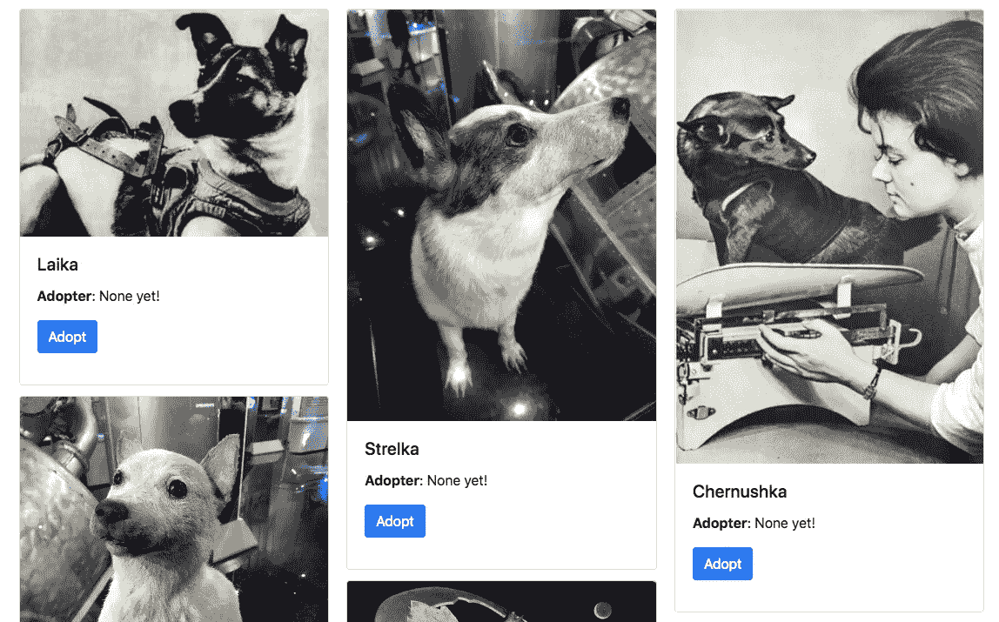
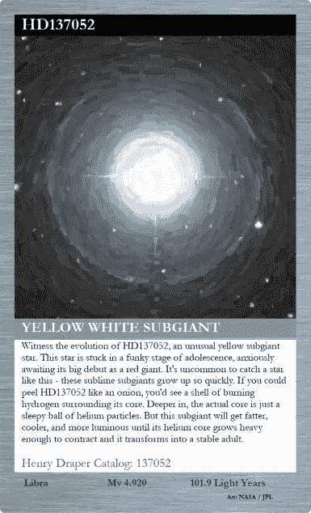
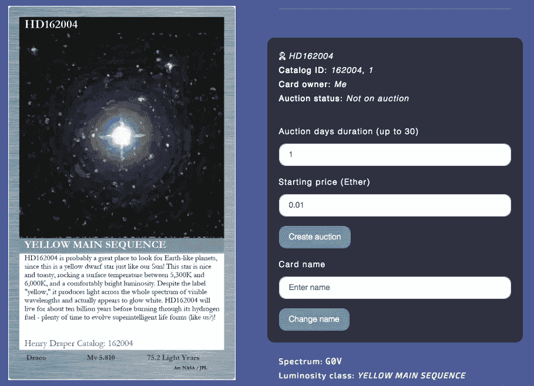
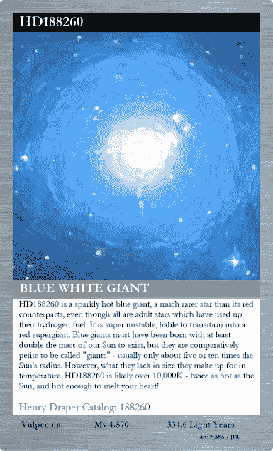
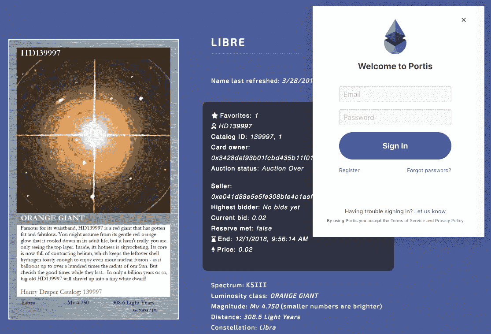

# Muttniks:一个向你展示我们如何构建 Astro Ledger 的开源 dapp

> 原文：<https://medium.com/hackernoon/muttniks-an-open-source-dapp-to-show-you-how-we-built-astro-ledger-8a063b788d0b>

A sneak peek into the [Muttniks](https://github.com/tlazenka/muttniks) kennel.

# 介绍

发射 dapp 可能没有发射火箭那么难…但也不是月球漫步。dapp，即“去中心化应用”的组合，是任何运行在去中心化基础设施上的应用，比如以太坊。为了您的编码乐趣，我们的团队很高兴向您展示 Muttniks，一个友好的以太坊空间 doggo“内核”(或狗窝)，您可以在您的航天器上舒适地构建它。Muttniks 是一个开源示例 dapp，旨在引导您完成我们激动人心的 Astro Ledger 之旅。就像在[astroledger.org](https://www.astroledger.org)中出现的真正的恒星和行星一样，你可以安全地收养、命名和交易以太坊太空狗(然后捐赠你的试验网 ETH 来建造更多的[莱卡](https://en.wikipedia.org/wiki/Laika)纪念碑)。下面是对 Astro Ledger 内部工作方式的一步一步的技术探索，您可以使用 Muttniks 在本地机器上重新创建它。

马特尼克是阿斯特罗·莱杰 CWM(首席魔兽·马特尼克)[托尼](https://github.com/tlazenka)的“宠物”项目。谢谢托尼！

This star’s Henry Draper catalog number is `HD137052`. [It has been named ‘Tlon](https://www.astroledger.org/#/card?externalId=137052&category=1)’.

# 跟踪明星和傻瓜

为了给真正的恒星命名，我们需要一种方法来唯一地识别它们。为此，我们使用了亨利·德雷珀的天空中最亮的恒星目录，以及来自天文学网络的 [HYG 数据库](http://www.astronexus.com/hyg)提供的元信息。

我们特别挑选的 Muttnik 没有这样的先前目录，所以我们伪随机地给每个 mutt Nik 分配一个数字，1-6。关于每个 Muttnik 的元信息(名称和图像)被加载到这个 [Flyway 迁移文件](https://github.com/tlazenka/muttniks/blob/develop/modules/flyway/src/main/resources/db/migration/V3__pets_1.sql)的数据库中。我们的 Astro Ledger 创意内容(由首席巧克力脱水机 [Aleeza](/@a.howitt) 带头)和图像链接同样被加载到数据库中，SQL 代码由离线 Python 脚本创建，这些脚本从 HYG 和其他来源加载数据。

当一个 Muttnik 被添加到一个数据库中时，我们使用一个 [Truffle 迁移脚本](https://github.com/tlazenka/muttniks/blob/develop/sol/migrations/3_muttniks_1.js)将同一个 Muttnik 添加到契约中，将其提交给用户。对于 Astro Ledger 恒星，这些相同的离线 Python 脚本创建相应的块菌迁移脚本来创建恒星，并以大约一美元的价格将它们用于空间捐赠支持拍卖。

# 合同和事件:创建和采用

Muttniks 存储在一个[“宠物”映射](https://github.com/tlazenka/muttniks/blob/3f981a7191f7b313aaea77e2156416d2c2e19446/sol/contracts/Adoption.sol#L12)中，其中每只宠物都有一个用于收养者的地址变量，初始化为`address(0)`，还有一个布尔变量`exists`，用于将该宠物与尚未创建的宠物区分开来。

函数`createAdoptee`被 *Muttnik 内核*所有者用来在契约中创建每个 Muttnik。这通常是用[松露迁移脚本](https://github.com/tlazenka/muttniks/blob/develop/sol/migrations/3_muttniks_1.js)批量完成的，但也可以被任何函数调用。通过`adopt`函数进行收养，该函数在将 Muttnik 的地址分配给收养者之前检查 Muttnik 是否尚未被收养。收养事件被发出，这样当区块链确认收养时，浏览器可以通知宇航员。

# 合同和事件:命名 Muttniks

处理 Muttnik(和 star)名称的显而易见的解决方案是将名称作为变量存储在契约中。为了找到这个名字，人们可以调用一个视图函数(对于零汽油)来返回这个名字。然而，在以太坊契约中存储数据从来都不是一个廉价的操作。因为 Astro Ledger 的目标是让任何人都能给星星起有意义的名字，所以我们使用*事件*来实现`assignName`功能。姓名作为事件日志中的 32 字节数据永久存储在区块链上，但由于以太坊虚拟机(EVM)无法访问它们，因此分配姓名的开销几乎可以忽略不计。这个基于哲学动机的决定让我们兴奋地发现，以太坊的许多现有软件并不完全支持事件日志，但我们走到了宇宙的边缘，以实现一个快速调出名字的解决方案，如下所述。

The owner of [HD162004](https://www.astroledger.org/#/card?externalId=162004&category=1) is well aware that changing a star’s name is not to be taken lightly…

# Web 堆栈

当首席橡胶品酒师乔纳森处理合同和明星数据库时，托尼开始用 Play 建立 Astro Ledger 网络堆栈！对于一个 web 框架( [ol' reliable](https://engineering.linkedin.com/play/play-framework-async-io-without-thread-pool-and-callback-hell) )，以及对于数据库的 Postgres(ol '[足以胜任一切](http://renesd.blogspot.com/2017/02/is-postgresql-good-enough.html))。起初，托尼选择了 [Twirl](https://www.playframework.com/documentation/2.7.x/ScalaTemplates) 来生成可用明星的 HTML 页面。他很快了解到，大多数预期的 Astro Ledger 用户群已经决定使用一个名为 MetaMask 的浏览器插件来与以太坊区块链对话，因此开始在网页中偷偷放入一些 JavaScript(包括一个名为 [web3js](https://github.com/ethereum/wiki/wiki/JavaScript-API) 的流行库)来支持这一点。生成网页的代码很快变成了 Scala、HTML 和 ES5 的有趣组合，其中所有的区块链交互都是使用 web3js 执行的。这很有效，并且在我们的测试环境中足够快。

虽然称以太坊主网络本身为“测试环境”可能还是公平的，但在我们的第一个产品 alpha 中部署我们的应用程序时，它甚至比托尼的 2014 Macbook Air 慢得多。对于我们在合同中用来搜索用户明星卡的 for 循环来说尤其如此，每当用户访问我们的页面时，这些 for 循环都会在用户的 web 浏览器中单独执行(注意，为了防止这种性能损失， [Muttniks Solidity 代码](https://github.com/tlazenka/muttniks/blob/develop/sol/contracts/Adoption.sol)没有使用 for 循环)。为了防止昂贵的、多余的契约调用，我们决定将这些查询中的一部分移到 Scala 端，每隔几分钟在我们的 Heroku 实例上执行一次，然后用户的 web 浏览器就可以访问这些查询，而无需调用任何契约代码。

[Jellybean](https://www.astroledger.org/#/card?externalId=188260&category=1) isn’t for sale, but it’s hot enough to melt your heart.

这对于查询用户的明星卡片非常有用，但是当我们需要查询他们给明星起的名字时，事情就变得有趣了。如前所述，我们没有像拍卖和信用卡所有权那样将这些名字放在合同存储中，而是选择使用以太坊事件来记录明星的名字:这是一种[更便宜的存储形式](https://media.consensys.net/technical-introduction-to-events-and-logs-in-ethereum-a074d65dd61e)。那么为什么不在我们的服务器上缓存*这些*？正如我们很快发现的， [web3j](https://web3j.io/) (一个类似于 web3j 的库，我们用它在 Scala 中查询区块链)[不支持 Infura 上的过滤器](https://web3j.readthedocs.io/en/latest/filters.html#filters-and-events)，in fura 是我们用来访问主要以太网的免费客户端。Web3js *确实支持在用户浏览器中查询事件，但这比查询所有权对浏览器的性能影响更差，因为它大约每秒钟都会轮询一次区块链以获取事件信息(web3js 1.0 [已经解决了这个问题](https://github.com/ethereum/web3.js/issues/326))。*

为了更好地处理事情，我们决定靠近源头。在早期的研究中，Tony 编写了一些 Clojure 代码来直接与 Infura 的 RPC 端点对话。当它在我们的服务器上运行时，我们基本上可以像 web3js 在其他人的浏览器上一样做同样的事情，但是在一个地方(7 美元/月)并且以更长的轮询间隔。所以，我们决定把它变成一个成熟的服务。加上 Redis，这给了我们自己的集中域名缓存，就像拍卖和信用卡所有权一样，可以在某人的浏览器中访问，比直接查询区块链本身要快得多。

# 单页

与此同时，首席橡胶品尝师乔纳森在特拉维夫品尝橡胶时，遇到了开发团队 [Portis](https://www.portis.io/) ，这是一款基于浏览器的智能合约钱包。Portis 将允许人们在普通的网络浏览器(即没有安装元掩码)上使用以太坊，包括 iOS 或 Android。然而，[由于 Portis 库只在浏览器内存中存储用户凭证](https://gitter.im/portis-project/Lobby?at=5b4b4f799a612333aa63b400)，我们最初在服务器端呈现网页的方法(点击链接会打开一个全新的页面)会迫使用户在我们网站的任何地方导航时反复登录。解决方案是迁移到一个[单页面应用](https://tinnedfruit.com/articles/create-your-own-dysfunctional-single-page-app.html),可以在用户的网络浏览器中一次性下载，提供完整的功能，用户无需刷新页面或再次登录。

Easily accessing astroledger.org with Portis, so we can add [Libre](https://www.astroledger.org/#/card?externalId=139997&category=1) to our star collection.

为了实现这一点，我们选择了 [React](https://reactjs.org/) ，因为它让我们能够轻松地使用另一个流行的库[毛毛雨-React](https://github.com/trufflesuite/drizzle-react) 以单页方式与 web3js 进行互操作。然而，毛毛雨库本身依赖于 web3js 1.0，在当时[它与 MetaMask](https://github.com/MetaMask/metamask-extension/issues/3642#issue-307084613) 并不完全兼容。我们最终放弃了毛毛雨，但继续使用 React。

# 马特尼克。

Muttniks 是 Astro Ledger 应用程序的精简版，可从以下网址获得:

[https://github.com/tlazenka/muttniks](https://github.com/tlazenka/muttniks)

要开始使用 Muttniks，请阅读[备忘单](https://github.com/tlazenka/muttniks#cheat-sheet)！总体结构可以从 [docker 组合文件](https://github.com/tlazenka/muttniks/blob/develop/docker-compose.yml)中收集，并通过深入每个服务的独立依赖项列表(注意，有些依赖项与 Muttniks 无关，但被 Astro Ledger 使用)。Docker compose 是一个方便的工具，可以让你打包所有这些有趣的小服务，这样你就可以轻松地一起启动它们。

# Docker 编写服务

`app`

位于 Postgres 之上的主要 Scala 应用程序。当应用程序启动时，如果需要，它会使用 [Flyway](https://flywaydb.org/) 运行数据库迁移，然后 [Slick 从结果模式中生成案例类](http://slick.lightbend.com/doc/2.1.0/code-generation.html)。用 [Akka](https://doc.akka.io/docs/akka/2.5/scheduler.html) 调度一个周期性任务，用 web3j 查询区块链并更新 Postgres 数据库。

`db` / `redis`

Postgres/Redis 数据库。

`jobs`

位于 Redis 之上的 Clojure 服务。启动时，它用 [Quartzite](http://clojurequartz.info/) 调度一个任务，定期查询本地以太坊区块链，并使用 [Carmine](https://github.com/ptaoussanis/carmine) 将结果缓存在 Redis 中。

`sbt` / `lein`

Centos 映像将 sbt/ivy2/m2 目录映射到您的本地计算机，以加速依赖项下载。

`truffle`

用于编译以太坊合同和运行测试的 Truffle 服务。

`ganache`

[此处使用的一个 Ganache 服务用于本地开发区块链。](https://truffleframework.com/ganache)

`react`

网站的 React 版本。

`web3j`

一个 web3j 映像，包括用于从 Truffle JSON 工件生成代码的[命令行工具](https://web3j.readthedocs.io/en/latest/command_line.html)。

`firefox`

这是一个带有 Firefox 浏览器和元掩码的服务，您可以使用 VNC 访问，但您不想在自己的浏览器中安装元掩码。

# 总结

如果你正在为为什么 Muttniks 需要出现在任何一个区块链上而努力…你在宇宙中并不孤单。然而，让我们暂停怀疑，说“不存在的苏联狗的命名特权的所有权早已去了天上的快乐狩猎场”的灰色地带需要以某种方式编纂…

This vegetating llama could be vegetating on blockchain… Photo by [Cheryl Strahl](https://www.flickr.com/photos/cheryl_strahl/)

# 你可以在区块链身上放任何可数的东西！

[HD16620](https://www.astroledger.org/#/card?externalId=16620&category=1) is just one of [many awesome stars](https://www.astroledger.org/#/onSale) needing a name…

我们真的很满意这个框架的运行方式，也很想听听 Muttniks 是如何帮助你在区块链安置生长茂盛的美洲驼，或者在区块链收养每一只远东豹，或者在区块链慢慢地猛击蜗牛……是的！！！如果您在实施过程中遇到任何困难，请通过无线电寻求帮助。Astro Ledger 团队很乐意与你合作——给 groundcontrol@astroledger.org 的 T2 发一封电子邮件。

如果你还没有得到足够的 Muttniks，不要忘了传送到 astroledger.org 的，试着说出一些区块链明星的名字！