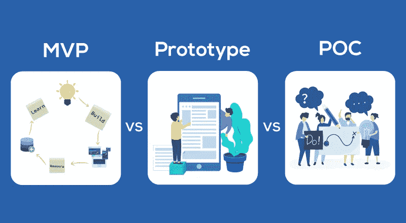
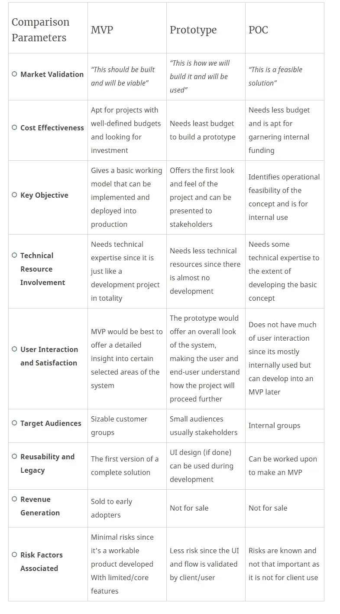
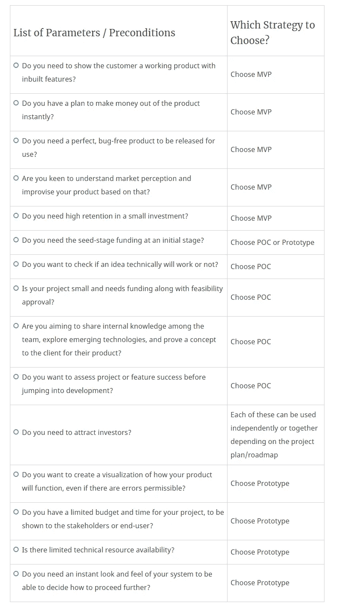

# MVP Vs 原型 Vs POC——复杂的战略选择变得简单

> 原文：<https://medium.com/hackernoon/mvp-vs-prototype-vs-poc-a-complex-choice-of-strategy-made-simple-f0875811b995>

在现有系统中实现新想法或新功能时，大多数组织(初创企业或企业)无法决定采用什么策略来开发他们的产品或评估想法及其可行性。任何组织期望的结果都是满意的客户，将想法正确地转化为实际的产品，以及更好的投资回报率。

组织追求的三个基本策略是概念证明(POC)、原型和最小可行产品(MVP)。选择 MVP、POC 和原型时的困境有时会导致错误的选择。这样做，一个组织可能会最终泄漏他们的财务，浪费他们的努力，时间，并可能影响整体业务增长。

根据项目计划/路线图，每一项都可以单独使用或一起使用。所有这三种方法都有各自的特点、目标、操作和优点。让我们先了解每一个，然后再进行相互比较。

# MVP、原型、概念验证—概述

## 概念证明(POC)

> “概念证明(PoC)是对某种方法或想法的实现，以证明其可行性，或者是原则上的证明，目的是验证某些概念或理论具有实际潜力”——维基百科

顾名思义，这可能是验证不确定想法或概念在实际实施中的可行性的最佳方法。它在产品实际开发之前和产品投放市场之前使用。

为了开发 POC，实现了一个小项目来验证某些概念是否可以实现(在业务模型和技术能力方面)。

POC 通常不向公众或客户展示。它可能根本不可用，因为它的主要焦点是验证基本思想在操作上是否可行。构建 POC 需要大量的开发时间和精力。基于最初的研究，它帮助你评估项目是否会在技术上完美地运行。概念验证就是测试这个概念是否能进一步发挥作用。如果没有，它还不如一开始就被改变/中止。

POC 通常用于描述系统的一个区域，因此某些项目可能需要多个 POC 来展示不同的组件。如果 POC 成功，项目将继续进行，否则可能会采用不同的路线，甚至可能会停止。在积极的 POC 情况下，有更高的机会获得利益相关方的初步认可，并获得进一步的财务帮助来构建原型。POC 可能是也可能不是可重用的、完全安全的和可扩展的，因为它用于验证想法及其可行性。

**概念验证的主要特点**

*   证明可行性并确认潜力
*   公开整个系统一小部分的实际实现
*   与全面项目相比，功能验证的成本和时间更少
*   在最初阶段就给创新的想法让路
*   在早期发现错误、缺陷和风险
*   对你的项目的可行性立即给出“是”或“否”

**什么时候需要 POC？**

当您不确定或不确定是否接受这个想法时，就需要 POC。可能是因为；你正试图实现原始和新鲜的想法，或者你正试图提供一些高成本效益的产品，这是以前高投资完成的。不管原因是什么，概念验证会让你清楚地了解你的想法是否可行。

## 原型

> *“原型是产品的早期样品、模型或发布，用于测试一个概念或流程，或者作为一个可以复制或借鉴的东西”——*[*维基百科*](https://en.wikipedia.org/wiki/Prototype)

原型着重于确定产品将如何完成，它的外观和用户流。这是项目的一个重要方面，因为它有助于理解基本的项目工作流，它们的可用性和要包含的特殊功能。它是系统的交互模型，便于用户以更好的方式可视化体验。虽然它可能不是一个独立的系统，但它确实给出了产品外观的清晰概念。可以指出研究和设计中的初始错误，以避免它们进一步渗透。

原型法是一种很受欢迎的方法，可以直观地向最终用户和商业用户展示你的产品是如何运行和验证的。它描述了流程，并给出了所需系统的设计和布局的完整概念。原型通常包括线框(纸，互动)，设计布局，模型，和用户流。它可以是工作原型、视觉原型、用户体验原型和功能原型。

**原型的主要特征**

*   产品的早期反馈
*   识别设计和开发阶段的错误
*   由于视觉效果，增加了用户的接受度
*   成本更低、利润更高、速度更快
*   把复杂的想法简化成容易理解的形式
*   业务用户验证应用程序/系统流程

## 最小可行产品(MVP)

> *“一个最小可行产品(MVP)是一个具有足够的功能来满足早期客户并为未来产品开发提供反馈的产品”——*[*维基百科*](https://en.wikipedia.org/wiki/Minimum_viable_product)

一个 MVP 是一个功能性的产品，它有足够的特性可以交付给最初的用户。从基本概念到现实，MVP 是一个独立的主要系统。它代表了您的系统的基本版本，迎合了一小群用户，并提供给他们进一步的使用和评论。

**《精益创业》一书的作者 Eric Ries 将 MVP 定义为“一个新产品的版本，该版本允许团队以最少的努力收集关于客户的最大量的有效知识”**

实施 MVP 有其自身的好处，如合理的定价、更快的上市时间、降低的风险、直接的价值、最小的开发成本和增强的灵活性。MVP 过程帮助你验证产品的可行性，团队对产品的假设，可用性和市场需求。它有助于构建具有最少功能的产品，并通过利用最终用户的反馈和提出最佳决策来迭代地帮助构建产品的更好版本。就阶段而言，随着成熟度的提高，产品不断发展并提供最大的投资回报。以下是基于这一模式尝到成功滋味的两个已知例子:

*   **Dropbox** 是最成功的组织之一，它以小规模创业，目标是建立一种所有人都能使用的服务。在与不同环境的整合方面，他们确实面临着自己的一系列挑战，但他们引起了史蒂夫·乔布斯的注意，并很快获得了大量资金、知名度和成功。
*   **优步**是当今全球使用最多的打车应用之一。开始时，他们没有今天可用的大部分功能。只提供了最基本的功能。渐渐地，他们一个接一个地建造了大量的特征，观察前一个的命运。这为他们提供了用户满意的应用实时效果，以及改善应用体验所需的反馈。

**MVP 的主要特点**

*   提高生产准备度
*   提供合适的功能子集，让用户满意
*   通过持续的反馈和改进为用户创造价值
*   完整产品的最小形式
*   提供有价值的见解，以客户为中心逐步发展
*   以小额投资获得高留存率
*   有助于防止浪费时间、金钱和精力
*   为增加可行性和价值铺平道路

**什么时候需要 MVP？**

一般来说，如果你想检查你的产品的需求，分析你的目标受众的行为和偏好，并想在短时间内以最少的功能发布产品，MVP 是正确的选择。

# 开发 MVP、原型或 POC 之前的主要考虑事项

在决定是否需要开发原型、POC 或 MVP 之前，有一些问题需要明确回答和理解。一旦很好地理解了这些问题的答案，从这三个中进行选择的决定肯定是正确的。

*   这个产品的目标受众是谁？附加值是什么？
*   你的验证标准是什么？
*   你想验证什么？
*   你的企业真正需要什么？
*   你的预算、时间和精力估计是多少？
*   就功能和生产准备情况而言，您的目标产出是什么？
*   你的项目术语被定义和讨论了吗？

# MVP Vs 原型 Vs POC —规模比较

# MVP、原型、POC-何时选择哪种方法？

在这三者之间做出选择变得相当棘手。这里列出了一些参数、先决条件和问题，可以帮助选择哪一个符合要求。

上述清单试图涵盖大多数可能的情况，但一些组织可能认为需要将上述内容结合起来。在这种情况下，可以制定一种机制，根据情况的需要，采取其中两项措施，并一个接一个地实施。

## 临别时

所有这三者——MVP、原型和 POC 都有其独特的特征，基于这些特征，组织可以选择最适合其场景的方案。上面的文章试图让读者清楚地知道什么时候选择什么，这三者之间的比较因素到底是什么。并且，希望它已经成功做到了这一点。

这篇文章最初发表在我们的博客上: [*这里*](https://www.spec-india.com/blog/mvp-vs-prototype-vs-poc-a-complex-choice-of-strategy-made-simple/)