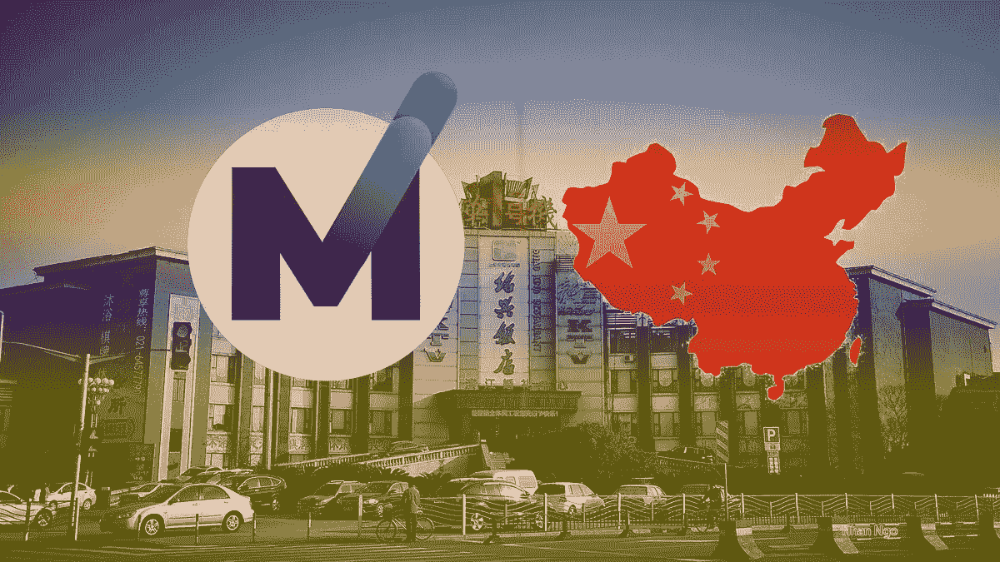
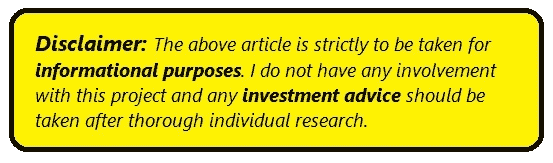

# MXC 和上海联合成立了业内首批真正的区块链合作伙伴关系

> 原文：<https://medium.com/hackernoon/mxc-and-shanghai-combine-in-one-of-the-first-real-blockchain-partnerships-of-the-industry-fc8fa281a4fb>

中国政府在数据和数据控制方面的严格措施是出了名的。那么，当它接受一家外国公司参与他们的数据收集时，这意味着什么呢？总部位于柏林的区块链公司 MXC 基金会是中国政府认为值得信赖的少数公司之一。

尽管他们最近对代币和区块链相关公司的立场，MXC 科技提供的服务必须得到中国政府的高度重视，以允许这种伙伴关系。作为中国促进创新和创业计划的一部分，中国政府与 MXC 基金会在上海建立了合作伙伴关系。此次合作将见证 MXC 基金会将杨浦区改造成一座智能城市。

MXC 的声明如下:

> **MXC 正在协助上海杨浦区******部署 MXProtocol enabled** [**低功耗广域网(LPWAN)**](https://www.mxc.org/newsroom/blog/benefits-and-limitations-of-lpwan?utm_campaign=Public%20Relations&utm_source=shanghai) **能够为上海杨浦的 LPWAN 物联网设备提供无线服务。通过网络收集的数据将使用** [**MXC 链间数据市场**](https://www.mxc.org/pillars/interchain-data-trade?utm_campaign=Public%20Relations&utm_source=shanghai) **，确保数据的可靠性，并提供城市自有数据的可操作分析。****

**通过与中国城市的合作，MXC 成为中国臭名昭著的不友好加密货币监管市场的第一个象征性项目。**

# ****改变了生活****

**MXC 基金会处理数据收集和数据的安全分发。对于上海杨浦的人们来说，这似乎并不多；然而，数据收集可能带来许多好处。首先，通过实施 MXC 的物联网设备，前往各个目的地可能会更加舒适。它们可以用来收集交通数据，然后用来优化汽车和人的运动。**

**鉴于无人驾驶汽车产量的上升，收集的数据可能会使无人驾驶体验更加准确。其他与汽车相关的优化包括指示商场和其他建筑中的可用停车位，以节省本来会浪费在定位停车位上的时间。**

**传感器也可以放置在水管理系统和排水系统中。通过这些传感器收集的数据可用于优化杨浦区的供水和改善杨浦区的排水管理。关于降雨量和收集百分比的数据可以用来帮助该地区收集雨水以备将来使用。其他优化可能以确定哪里最有可能浪费水以及如何改进的形式出现。排水系统的数据也可用于支持水资源管理。**

**杨浦区内的安全性也可以通过战略性地放置物联网设备来提高。摄像头、警报器和其他警报设备可以放置在潜在的不安全区域，以便将数据快速传输到执法部门，然后执法部门可以进行干预。这些传感器也有助于阻止犯罪，因为城市会知道传感器一直在收集数据。**

**战略性放置的传感器也可能对洋浦的快递公司有用。无人机送货的实施可以通过放置在送货中心的传感器来精确完成。**

**监测自然灾害也可以通过 MXC 的传感器来完成。这些可以帮助居民为地震或洪水做好充分准备，从而在这些事件发生时防止过度损失。因此，MXC 的智慧城市计划可能会改变上海杨浦区居民的生活。**

> ****“上海市和 MXC 正在智慧城市建设和物联网产业发展方面开展合作，”**上海市杨浦区政府主任沈心表示。**

# ****升值****

**数据传输将通过 MXC 的 MX 协议完成，这是一个安全的区块链平台，确保传感器数据传输的来源和安全性。现在，中国政府将公共数据委托给了 MXC。MXC 将要处理的数据可能从稍微相关的数据到可能影响人们生活的重要数据。出于这个原因，MXC 的价值预计会上升，因为他们将处理的数据具有潜在价值。**

**考虑到他们服务的性质，MXC 代币的价值目前低于人们的预期；随着世界各地与政府的合作越来越多，MXC 代币的价值可能会上升。它在上海的业务可能会引发该公司应得的价值上升。**

**智能城市计划也可能吸引投资者进入该公司。扩张将需要流动性，尤其是当新城市开始进入时。这也可能提高 MXC 代币的价值。**

**上海杨浦区将成为世界上首批智能城市之一。随着更多数据用途的创新和优化，MXC 的相关性和价值可能会上升。对于洋浦的人们来说，一个潜在的更好的生活正等待着他们。世界各地城市的未来很可能掌握在 MXC 手中。**

**MXC 将于 2019 年 4 月 1 日至 5 日在德国汉诺威工业博览会上展示他们的智慧城市概念。**

## **官方链接**

**[**网站**](https://mxc.news/2yL2n11) **|** [**电报**](https://mxc.news/2PCtF0J) **|** [**推特**](https://twitter.com/MXCfoundation)**

****

## **➕ ➕ ➕ ➕ ➕ ➕ ➕ ➕ ➕ ➕ ➕ ➕ ➕ ➕ ➕ ➕ ➕**

****如果你喜欢看我的文章，请一定要鼓掌，关注我的** [**中**](/@moarman) **！****