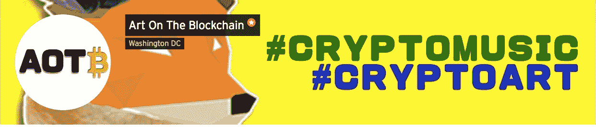
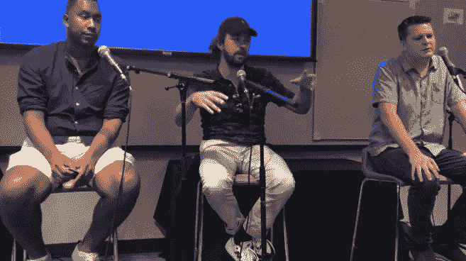
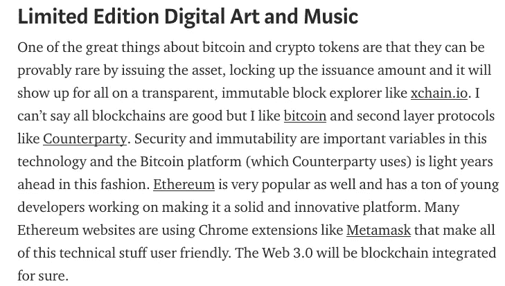
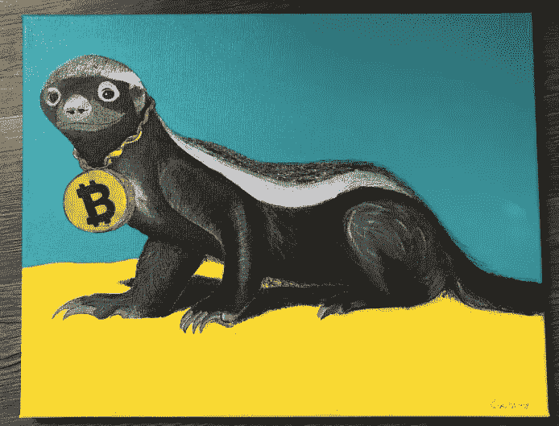
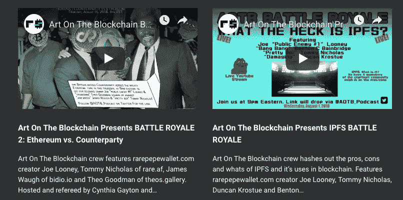
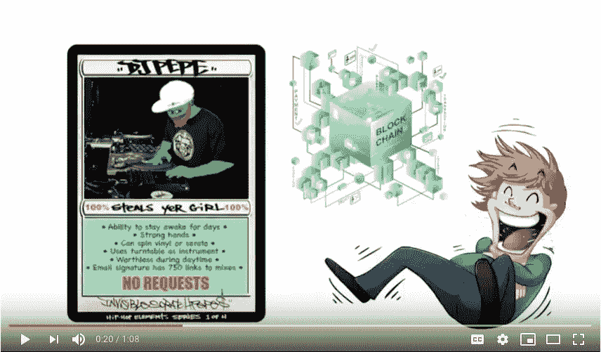
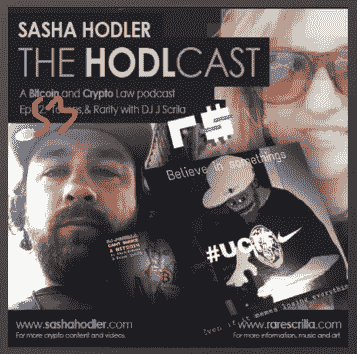
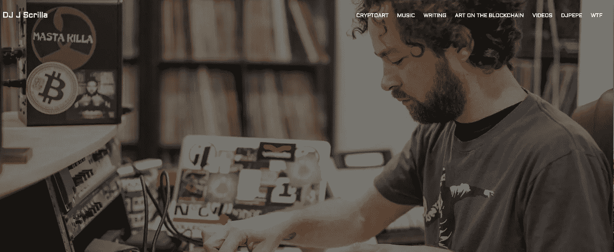

# 我的 2018 年密码艺术/音乐回顾

> 原文：<https://medium.com/hackernoon/my-2018-cryptoart-music-recap-12c8aa45a22d>

我决定在 2017 年底之前将全部精力放在这个领域。好像是十年前的事了。

::::信号警告::::

我认为重要的是要注意到，作为一名独立的创意者，我有自由发言的权利，我不必为了安抚风险投资者或老板而调整自己的想法。我是比特币制造者。我也玩以太坊，但主要是因为在过去的一年里，许多 cryptoArt 实验都转移到了那里，但我也很乐意帮助更多特定于比特币的艺术/音乐项目起步。(我也摆弄过 Waves、EOS 和 Tron，但还不足以将它们的协议整合到我的工作中。)

因此，我总结了我去年的贡献和内容，并希望在 2019 年扩大和继续学习更多内容。

# 区块链播客艺术(AOTB)

AOTB 是 Cynthia Gayton 和我为您带来的专注于艺术和音乐教育的播客。它们通常有 60-120 分钟长，我用我自己的原创音乐制作和编辑每一集，并努力让它符合我的 DJ 混音带的感觉。希望他们遇到的与你习惯的完全不同。9-26 集都是 2018 年录制的。这相当于平均每月有 1.5 个播客与 cryptoArt 领域的一些先锋人物进行对话。比我们 2017 年的 8 集大了一大块！

Artnome.com 的杰森·贝利

[隐涂鸦(艺术家)](https://soundcloud.com/artontheblockchain/episode-10-a-conversation-with-cryptograffiti)

[杰西卡·安吉尔(艺人)](https://soundcloud.com/artontheblockchain/aotb-11-a-conversation-with-jessica-angel-of-artprojectio)

[塔蒂亚娜·莫罗兹(歌手)](https://soundcloud.com/artontheblockchain/episode-12-a-conversation-with-tatiana-moroz)

比特科恩斯的丹·安德森

《开放集市》的布莱恩·霍夫曼

[食品法典委员会的杰斯·霍尔格雷夫](https://soundcloud.com/artontheblockchain/episode-14-a-conversation-with-jessica-houlgrave-of-codex)

来自稀有艺术实验室的乔恩

詹姆斯·沃&比迪奥的特雷弗

[福尔菲尔德的露丝·卡特洛](https://soundcloud.com/artontheblockchain/episode-17-a-conversation-wruth-catlow-from-furtherfieldorg-sam-hart-of-avantorg)

【Avant.com 的 萨姆·哈特

穆拉的波比·辛普森

[格雷森·考克斯，罗纳德·吉尔拉赫，布莱恩·格鲁伯&纳什现金赌场的霍利斯·威瑟斯彭](https://soundcloud.com/artontheblockchain/episode-16-live-from-ethereal-summit-in-ny)

[陆一英(艺人)](https://soundcloud.com/artontheblockchain/episode-16-live-from-ethereal-summit-in-ny)

[乔·基亚佩塔(艺人)](https://soundcloud.com/artontheblockchain/episode-16-live-from-ethereal-summit-in-ny)

曼努埃尔·帕洛，莫伊塞斯·萨纳布里亚&艺术 404 的埃迪·内格罗

[特拉维斯·勒罗伊·索思沃斯(艺人)](https://soundcloud.com/artontheblockchain/episode-16-live-from-ethereal-summit-in-ny)

[达达的比阿特丽斯·拉莫斯和耶胡迪特·马姆。纽约市](https://soundcloud.com/artontheblockchain/episode-19-a-conversation-wjudy-bea-of-dadanyc)

[马特·霍尔的春乐和隐朋克](https://soundcloud.com/artontheblockchain/episode-18-a-conversation-w-marcus-k-dowling-matt-hall)

罗布·迈尔斯(艺术家)

[DJ 3LAU(音乐人)](https://soundcloud.com/artontheblockchain/episode-21-ft-dj-3lau-discussing-blockchain-omf-festival)

[隐猫的麦克·弗拉维尔](https://soundcloud.com/artontheblockchain/episode-22-featuring-mack-flavelle-of-cryptokitties)

[独立广场的克里斯蒂安·莫斯](https://soundcloud.com/artontheblockchain/episode-23-a-conversation-w-christian-moss-of-indie-square-mandel-duck)

[霓虹区钱币艺术家](https://soundcloud.com/artontheblockchain/episode-24-a-conversation-w-coin-artist-of-neon-district)

[super rare . io 的约翰·珀金斯和乔恩·克莱恩](https://soundcloud.com/artontheblockchain/episode-25-featuring-john-jonathan-of-superrareco)

[奈楚尔(艺人)](https://soundcloud.com/artontheblockchain/episode-26-a-conversation-with-naturel)

除了这些长篇剧集之外，我们还在弗吉尼亚州阿灵顿的 WERA 进行了一个两周一次的 30 分钟现场直播节目。对于这个展览，我们关注新闻和参与 cryptoArt 的 DC 当地艺术家。我们对 Vesa、Coldie 等艺术家进行了简短的采访。虽然这个节目很有趣，但我们决定停止它，因为很难衡量它有多少人在听，我们只能重新发布到古老的 MixCloud 网站上。有时很难定位在隐密艺术稀疏的华盛顿州 DC！哈哈

[车管所 Mixcloud 站点的 AOTB](https://www.mixcloud.com/AOTB_DMV_Radio/)

# 加密音乐

我花了很多年做说唱音乐，今年不知何故陷入了视听迷因。这里是一些发布的样本。

DJ J-$crilla " [不能抽一个比特币](https://youtu.be/hPimmS0TyPs) " ft。克里斯·德罗斯，彼得·希夫

DJ J-$crilla " [我穿古驰(我叫克雷格·赖特)](https://youtu.be/0aGfEvde9b4)

MikeInSpace " [拉下插销](https://www.youtube.com/watch?v=im93P1-J0Ss) " ft。西奥·古德曼(DJ J-$crilla 制作)

" [Junseth 的世界](https://soundcloud.com/junsethsworld)"史上最烂播客主题曲

[春树音乐](https://choon.co/artists/scrilla/)上传

Ujo 音乐上传

2018 A3C Festival in ATL

# 教育家、演讲者和小组成员

随着 cryptoArt 的会议和小组在 2018 年顶部历史性的 RAREAF 会议之后起飞，我发现自己正在寻求教育人们。我参加了许多小组讨论，甚至是教学演出。2019 年，我的目标是通过在这个利基和令人兴奋的空间中进行教育、学习和讨论，在这条道路上继续前进。这里有一个列表。

稀有艺术节 RAREAF-2018 年 1 月 13 日，纽约市(专题小组成员)

数字资产-2018 年 3 月 31 日 WDC(DJ/扬声器)

加密艺术和加密音乐介绍-2018 年 4 月 21 日 ATL(演讲者/教育家)

罕见的数字艺术慈善加密拍卖@ POW DC-2018 年 5 月 9 日 W DC(演讲者/主持人)

创意技术周-5 月 10 日，纽约(专题小组成员/DJ)

以太峰会-5 月 11 日，纽约布鲁克林(媒体)

华盛顿地区律师协会将于 9 月 17 日至 10 月 2 日(每周一 7-9 点)在 WDC(教育工作者/主持人)举办 DJ J-$crilla & Cynthia Gayton 的“加密货币、加密艺术和音乐以及创意区块链介绍”

A3C 节-“音乐家和艺术家如何使用区块链”2018 年 10 月 5 日 ATL(小组成员/演讲人)

最罕见的表演-2018 年 10 月 25 日，纽约布鲁克林(DJ/媒体)

分散的艺术-分布式杰作的世界-2018 年 12 月 6 日 MIA(媒体)

a clip from Introduction To CryptoArt & CryptoMusic

# 著作

我一直喜欢写作，并且有一个崇高的目标，有一天要写一部小说。我于 2016 年开始在 cryptoArt 上写作，并于 2018 年在目录中增加了几件作品。多写点会在 2019 年的榜单上接近榜首。

[crypto art 简介& CryptoMusic](/@ScrillaVentura/introduction-to-cryptoart-cryptomusic-3752923792c7)

[如何开始用音乐赚取加密的一些注意事项](/@ScrillaVentura/i-recently-started-a-cryptomusic-telegram-channel-to-centralize-the-discussion-of-the-niche-yet-c9808b0316fd)

[不要去那个兔子洞，斯克里拉](/@ScrillaVentura/dont-go-down-that-rabbit-hole-scrilla-ecacf938db8c)

“Bitcoin Honey Badger” Acrylic on canvas

# 秘密主题艺术品和标记作品

2016/2017 年，我以稀有人物的形式制作了一批与交易对手(XCP/BTC)相关的艺术品。我主要制作嘻哈和秘密主题的 Pepes。正如这个空间中的一些人现在知道的，我有一个观点-罕见的佩佩交易集团点燃这个空间比其他任何东西都快。2018 年，随着 cryptoArt 的爆发，以太坊社区支持这场运动，数百个平台似乎涌现出来，你可以在 dappradar.com 实时见证。以太坊社区热衷于 NFTs(我个人不喜欢用“NFT”这个名字来描述这些收藏品，但这篇文章不是关于这个)加密收藏品和黑客马拉松。我开始尝试这些平台中的一些，但最终主要通过 SuperRare 发行我的以太坊艺术代币。我真的希望今年能尝试更多的稀有艺术实验室。我还继续使用我的交易对手平台，通过比特币区块链发行代币。

比特玉米在二月初涌现，我真的很喜欢这个社区。甚至通过社区认识了我的未婚妻(Tinder 是给婴儿潮一代的。)[万花筒 XCP](http://kaleidoscopexcp.com/) 是区块链空间中最具创新的黑暗角落之一，我真的很享受那里发生的一切。他们基本上是用密码破解东西或者让你思考。我还发行了我自己的，我认为是第一个类似的工作证明代币，以帮助促进我的音乐迷因营销“不能抽比特币”和“我穿古驰”这个记号化的实验当然是一个有趣的兔子洞，我期待今年能潜得更深！

[比特币蜜獾(即将印刷)](https://twitter.com/ScrillaVentura/status/1046037958078472194)

bittoens . com-[cntsmokecon](https://xchain.io/asset/CNTSMOKECORN)(一天内售罄)& [CORNTANGCLAN](https://xchain.io/asset/CORNTANGCLAN) (部分仍有)

[super rare . io](https://superrare.co/ScrillaVentura)——我穿 GUCCI(售出 1/1)、CANT SMOKE A BITCOIN(售出 4/5)、FACES(售出 1/1)、发条绿(售出 1/1)、MUH 包(未售出 1/1)

份额证明(XCP 代币)- [CANTSMOKEBTC](https://digirare.com/cards/CANTSMOKEBTC) 和 [IWEARGUCCI](https://xchain.io/asset/IWEARGUCCI) 独一无二的代币，它们都被空投给钱包持有者，证明有助于通过 twitter 推广该产品。它们基本上是使用比特币的游戏化徽章。

[dada . NYC](https://dada.nyc/portraits?pl=Rarescrilla#Rarescrilla)——我真的很喜欢这个独特的社交媒体艺术家网站上的数码手指画，尽管我还没有在上面标记任何作品。

[Digirare.com](https://digirare.com/artists/scrilla-ventura)-使用 XCP 监控统计数据和艺术家的酷网站

Instructional Videos from rarescrilla.com

# 教学/教育视频

我绝对希望在 2019 年扩大视频方面的业务。订阅我的 Youtube 和 BitTube 页面。

[区块链上的艺术呈现 IPFS 皇家战役](https://youtu.be/4hH6SM46z-w)

[区块链上的艺术呈现皇家战役 2:以太坊 vs 对手](https://youtu.be/-xpoyLfuizc)

[区块链:改变音乐产业的技术。1 住在 A3C](https://youtu.be/7OXoNfdiNz0)

[如何用比特币购买稀有佩佩](https://youtu.be/I_t_LBTA8aY)

Clip from the “DJPEPE in 60 Seconds” video

# DJPEPE

也许最难向我的朋友和家人解释的是，我是一个比特币青蛙迷因的管理者。这一切都始于 2016 年——观看我在 2017 年制作的 60 秒视频[这里](https://youtu.be/rBkCLYxsUCQ)。2018 年 1 月 13 日，当我不知怎么地变出了一个 6 英尺厚的纸板剪影，在一个行业专业人士的小组上发言时，它迅速升级。不管你是爱他还是恨他，以下是一些去年 DJPEPE 的精彩片段。#memetoo #UCIT

在 RAREAF 活动上拍卖的象征化纸板剪纸 DJPEPE

《巴黎评论》称 DJPEPE 是第一位区块链行为艺术家

[稀有艺术实验室采访](/@rareartlabs/rareaf-talks-dj-pepe-93f11afb4cce)

发行不能抽比特币，我在发行前几周穿 GUCCI 给 DJPEPE token 持有者。

[DJPEPE 成为区块链农民](https://bitcorns.com/farms/1bbbSqqR8ikdy7aFjzxbAg36mm1hrdhE8)

[压 500 贴](https://twitter.com/DJPEPE_/status/1088966354466553857)

30 件被标记的该死的衬衫被放归野外。如此罕见，如果你洗它，你会毁了它。事实上，你必须通过面试才能被考虑购买。

[出现在最稀有的书中](https://therarestbook.com/)

[宣布参选 2020 年总统](https://soundcloud.com/sashahodler/state-of-the-market-2-august-11-made-it-back-to-america-with-scrilla-hodlcast-episode-30)

[范艺术](https://twitter.com/DJPEPE_/status/980842819001683968)成了事。(继续来！)

Appearance 1/5 on the HODLCAST this past year.

# 压

莎莎·霍德勒——第十三集[第二十一集](https://soundcloud.com/sashahodler/car-ride-w-dj-j-shodlcast-ep021)[第三十集](https://soundcloud.com/sashahodler/state-of-the-market-2-august-11-made-it-back-to-america-with-scrilla-hodlcast-episode-30)[第五十三集](https://soundcloud.com/sashahodler/episode-53-with-scrillaventura-bch-fork-sec-djpepe-utxo) & [第六十集](https://soundcloud.com/sashahodler/the-predictioncast)

比特什- [第 3 集](https://soundcloud.com/unconfirmed-transactions/bitsesh-dj-j-scrilla)

[巴黎评论](https://www.theparisreview.org/blog/2018/01/23/much-pepe-scenes-first-rare-digital-art-auction/)

塔蒂亚娜秀- [采访 AOTB](https://youtu.be/sOy54YOdxGo) &采访 w/ [J $crilla](https://letstalkbitcoin.com/blog/post/the-tatiana-show-dj-j-scrilla-comedian-michael-salvi)

[稀有艺术实验室采访](/@rareartlabs/rareaf-talks-dj-pepe-93f11afb4cce)

[创意密码杂志](https://thecreativecrypto.com/choon-spotlight-i-wear-gucci-my-names-craig-wright-by-dj-j-scrilla/)

艺术家 DJ J $crilla 正在使用代币推广一个音乐视频 & [稀有艺术节在秘密市场崩溃后被取消](https://bitsonline.com/rare-art-festival-canceled-crypto-crash/)

[“用不可替代代币资助创意项目”](/@SuperRare_co/funding-creative-projects-with-non-fungible-tokens-64ba2c10f9e7)

[钢模](https://steemit.com/bitcoin/@creativecrypto/djjscrillasiwearguccimynamescraigwrightmusicvideo-6kxcrgu9du)

[新闻 BTC](https://www.newsbtc.com/2018/11/28/to-err-is-human-to-correct-divine/)

rarescrilla.com

# 推出 RareScrilla.com

 [## 主页| DJ J Scrilla

### 新断路器杂志大喊区块链上的新艺术。纳努又赢了一个！新的介绍也是“我穿古琦…

rarescrilla.com](https://rarescrilla.com/) 

我不是一个网站开发者，但我尽我所能保持它的活跃！我创作的数百首歌曲、我参与制作的数百个 T2 说唱视频、显然是加密的东西、我的艺术和我的 T4 混音带都在这个网站上。我感谢所有链接到它的[文章](https://breakermag.com/how-cryptopunks-creators-charmed-the-art-world-and-paved-the-way-for-blockchain-art/)——非常有帮助！

# 结论

我会继续沿着我 2014 年进入的兔子洞往下走。熊市是创新发生的地方，我也在这个 [DLT](https://en.wikipedia.org/wiki/Distributed_ledger) 上。UCIT

附注:这个领域没有专家。