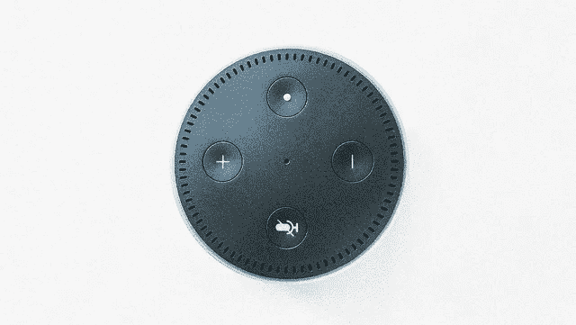

# 我 95 岁的奶奶第一次体验 Alexa

> 原文：<https://medium.com/hackernoon/my-95-year-old-grandmas-first-experience-with-alexa-11049d0d4148>

每次我回到西班牙的家，我都要花相当多的时间调试家里的设备。我妈的 Surface 卡在了某个大更新上，我爸的手机没有他想要的天气 app，等等。如今的技术比它应有的要复杂得多，老一代人通常不具备解决问题的能力。尽管如此，大多数科技公司都在朝着没有复杂用户界面的未来努力，这是一个由自然语言命令控制的未来，即使是 5 岁的孩子也能掌握。人工智能是这个未来的中心。

这个假期我带着一个特殊的目的回家，向我的家人介绍他们的第一个人工智能。当然，他们已经可以在笔记本电脑上使用数字助理，但他们总是认为使用键盘和鼠标启动应用程序或搜索东西比让 Cortana 来做更简单。我不怪他们，我平时也不跟电脑说话。我想给他们一些没有摩擦的东西，所以因为我在亚马逊工作，我决定买一个 Echo Dot，并在圣诞节那天把它放在他们的厨房里。

我的父母很快就找到了窍门，甚至在一些典型的最初挣扎中，比如把“ *Alexia* ”而不是“ *Alexa* ”，或者完全忘记使用 wake 这个词。在设置后的几分钟内，我的父母就向 Alexa 询问周末的天气，播放他们最喜欢的音乐，谁是西班牙国王或首相。我默默地看着他们，当他们在 Alexa 得到正确答案后点头表示同意时，我感到很有趣。

在与 Alexa 最初的交流中，有人甚至比我更安静:我 95 岁的祖母。她的脸上混合着惊讶和迷惑。我问她是否想问 Alexa 什么，“*问好或问她的年龄*”，我鼓励道。她迟疑地看着我，然后说“ *Alexa，我叫 Paquita，95 岁了*”。在家人的笑声中，我解释说，当被直接问到一些事情时，Alexa 真的很好。她又试了一次，“ *Alexa，我多大了？“我们都开始大笑，包括我的祖母，尤其是当 Alexa 回答说她必须在 3 岁到 100 岁之间，因为她能够说话。*

最终，她问了 Alexa 的年龄，但很明显，她没有完全理解什么样的问题有效，为什么有效。我试图解释什么是高水平的人工智能，但这只会让她更加困惑。这让我想到，对于像她这样的人来说，Alexa 看起来一定很棒。我的祖母出生于 1923 年，当时家里的技术大多被简化为电力和无线电；即使在今天，她仍然在与她的移动功能电话、微波炉或电视控制器作斗争。对于像她这样的人来说，一个饭盒大小的圆形小装置能像真人一样说话，这种想法并不疯狂:与真人建立联系。她的这一假设最终成为我们构建的技术必须通过的最终测试，这是图灵测试的真正精神。

科幻世界延续了这样一种观点，即有一天我们将无法区分人和机器。这激发了科技行业创造一个互联的世界，越来越多的设备可以通过语音远程控制。然而，完善语音识别和提供类似人类的反应仍然是我们面临的一些最大挑战。我们正在慢慢地到达那里，但是我们仍然很远。

这条路尽头的好处对每个人来说都是无价的，尤其是对老年人。一个真正像人类一样的人工智能将意味着结束我们许多老年人今天遭受的孤独，这将意味着帮助记住重要的事情，如服药或电话号码。再加上机器人技术的进步，这也意味着有人帮助从床上站起来，或者在意外摔倒后呼叫紧急服务。

根据美国人口普查局 2016 年的一份报告，全球 8.5%的人口(6.17 亿)年龄在 65 岁及以上。[……]预计到 2050 年，这一比例将跃升至世界人口的近 17%(16 亿)”。我无法想象一旦我 95 岁了，什么样的技术会对我产生如此令人不安的影响，但有一点是明确的，如果我们不想让很大一部分人与技术更加不同步，我们需要努力工作，让它更好、更容易使用。我们自己的未来取决于此。

**相关:** [你对你的虚拟助理无礼吗？](https://geekonrecord.com/2017/12/30/are-you-rude-to-your-virtual-assistant/)

你喜欢这篇文章吗？ [**订阅**](https://geekonrecord.com/subscribe/) **通过邮件获取新帖。**

*照片由* [*拉胡尔*拍摄 ](https://unsplash.com/photos/E_mHYosg98k?utm_source=unsplash&utm_medium=referral&utm_content=creditCopyText)

*原载于 2019 年 1 月 14 日*[*geekonrecord.com*](https://geekonrecord.com/2019/01/14/my-95-year-old-grandmas-first-experience-with-alexa/)*。*