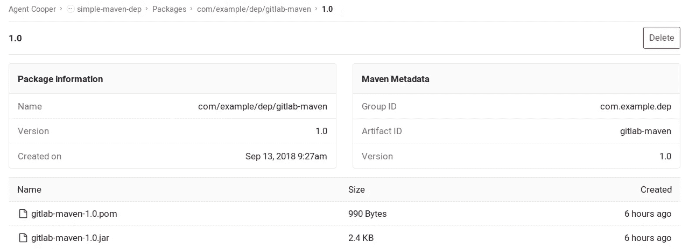

# 我发布 AAR 工件的经历

> 原文：<https://medium.com/hackernoon/my-experience-in-publishing-an-aar-artifact-f7d554138230>


source:unsplash.com

几个月前，我开始开发一个 SDK，它基本上是一个 AAR(Android 存档文件)。该 SDK 包含 java 和 kotlin 文件中的业务逻辑以及资源文件，如清单、布局等。这个 SDK 将被另一个想要使用我们服务的应用程序使用。所以我们需要提供一种方便的方法来共享这个 AAR 文件。

在初始状态，我们考虑共享模块本身，这是 SDK 的源代码，但这将增加实施它的项目的编译时间，当然，我们不想公开我们的代码，即使使用代码的团队在我们公司。因此，我们转向提供 aar 文件的其他选项，这一选项显然比第一个选项好，但它仍然有缺陷，这将使手动导入 aar 文件到项目的大量工作，更不用说如果有新版本的 SDK，您将需要手动下载和删除以前的版本并导入新版本，这至少对我来说很麻烦。

我可以使用 jitpack 或任何其他工件托管平台，这非常容易实现，如果 SDK 有公共代码，因为我的项目是私有的，那么我需要支付在 jitpack 中托管它的费用，我不想这样做。

我们确实有自托管的 jfrog artifactory，我可以用它来托管工件，但不幸的是 artifactory 仅用于一个专用服务，所以我仍然不能在那里托管它。

显然，gitlab 有一个 maven 资源库包[支持](https://about.gitlab.com/2018/09/22/gitlab-11-3-released/)(如果你使用高级版本的话)。所以没有进一步考虑，我找到了合适的地方来存放我的艺术品。

一开始，我试图遵循官方文档，但我发现没有运气，说明太笼统，对我来说一点帮助都没有。经过反复试验，我放弃了跟随官方文档(官方文档也可以是无用的 xD)。所以我去了谷歌，发现我们可以使用 [maven-publish](https://docs.gradle.org/current/userguide/publishing_maven.html) gradle 插件直接从 gradle 文件中发布工件，或者简单地创建一个任务来完成这项工作。

使用 maven-publish gradle 插件对我来说真是救命稻草。这真的很简单，也很容易实现。

要发布您的工件，您只需遵循以下步骤:

1.  在 build.gradle 文件中应用 maven-publish 插件

```
apply plugin: 'maven-publish'
```

2.给你的神器一个信息

你可以简单地只提供必要的信息，就像我在这里做的那样，要了解更多关于元数据或信息，你可以去这个[链接](http://maven.apache.org/ref/3.6.1/maven-repository-metadata/project-info.html)

```
def libraryGroupId = 'io.rahmatt.artifact'
def libraryArtifactId = 'coollib'
def libraryVersion = '0.0.1'
```

3.为发布做准备

在上面的要点中，请注意，我指定了将发布到 maven 的唯一发布版本。这也是棘手的部分，起初我没有 **pom.withXml** 配置，工件仍然被发布，但当我试图构建实现我的 SDK 的项目时，它给了我一个错误，它说一些依赖项丢失了，这是因为我的 SDK 也有一个不包括在项目中的第三方库的依赖项。因此，我需要指定使用我的 SDK 所需的依赖项，一旦项目实现了 SDK，它现在将自动下载所有所需的依赖项，这里**POM . with XML**configuration 来拯救我们，基本上，它创建一个 pom.xml 文件(项目对象模型)来提供我们需要的解决方案，该解决方案提供所需依赖项的信息，以便使用我们的 SDK。

最后，我们设置了存储库配置，其中我们指定了发布工件/SDK 所需的 URL 和凭证(上面是伪 URL)。这里的私有令牌是 gitlab 访问[令牌](https://docs.gitlab.com/ee/user/profile/personal_access_tokens.html)。

现在，我们可以通过简单地调用任务来发布工件，如下所示:

```
./gradlew assembleRelease publish
```

但在此之前，我建议你先清理项目，以防有一些生成的文件，或者只是我们想在发布之前清理项目。

这样，我就可以用这个来下载我的工件了:

```
//build.gradle project level
...
repositories {
....
maven { url "[https://rahmatt.io/coollib](https://rahmatt.io/coollib)" }
...
}//build.gradle module level
implementation "io.rahmat.artifact:coollib:0.0.1"
```

还有一个用例，如果您的项目有内部或私有的可见性来下载您的工件，您也需要像这样放置认证过程的凭证

```
//build.gradle project level
...
repositories {
....
maven { url "[https://rahmatt.io/coollib](https://rahmatt.io/coollib)" 
  credentials(HttpHeaderCredentials) {
       name = "Private-Token"
       value = "${private_token}"
    }
   authentication {
       header(HttpHeaderAuthentication)
  }
}
...
}
```

那就是，神器现在是活的，你可以分享它！



the information will be displayed like this once you enter the tab package in your gitlab project

感谢你阅读这篇文章，我希望我的经历和发现可以帮助你不要像我以前一样挣扎。如果你觉得这个帖子有帮助，请鼓掌并分享到你的圈子。祝您愉快！