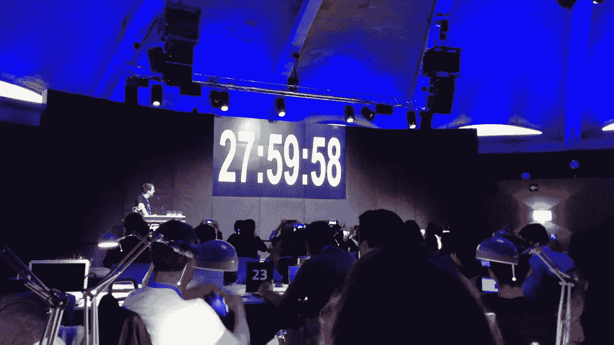
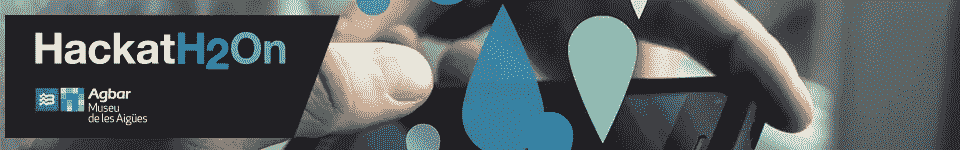
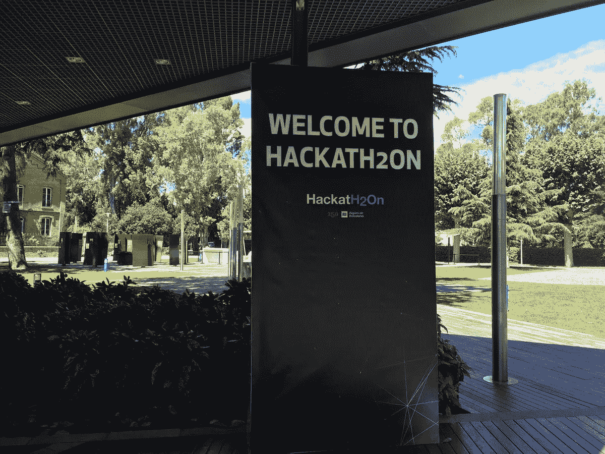
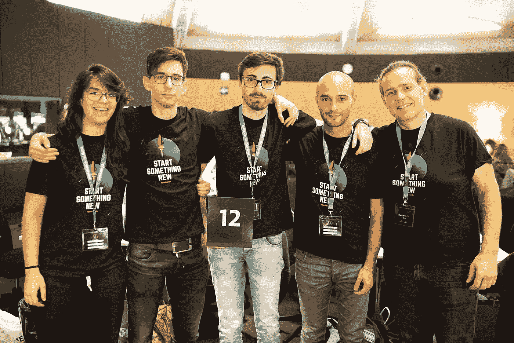
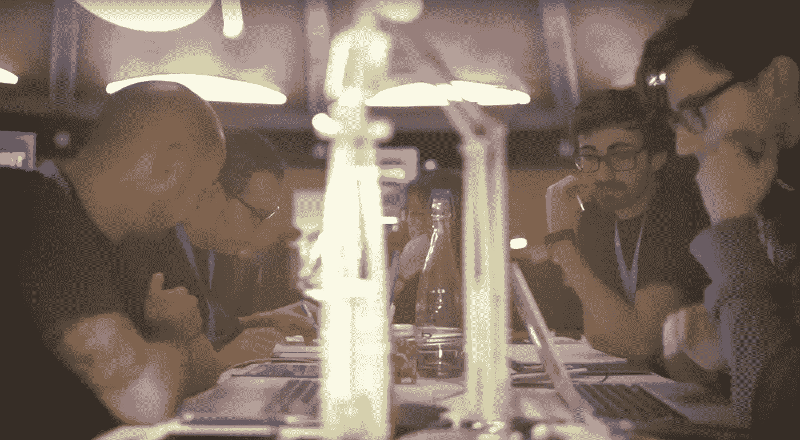
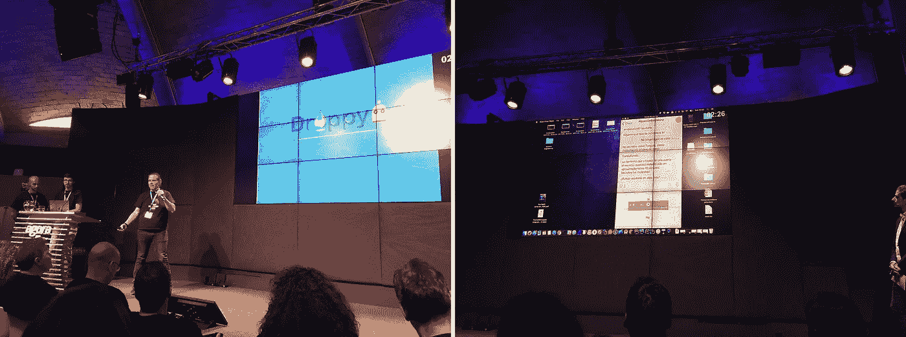

# 我的第一次黑客马拉松经历

> 原文：<https://medium.com/hackernoon/my-first-hackathon-experience-4bb9a77c03d5>

The hackathon countdown has begun

在 2017 年的[黑客马拉松 2 的 28 小时中发现我的黑客经历。虽然这个事件是几年前的事了。我想分享我的经验和一些如何组织这类活动的细节。](http://www.hackath2on.es/)

Agbar de las Aigües 博物馆在一个周末接待了 30 个由 2 到 6 人组成的团队，在 HackatH2On 上连续工作 28 小时。目标是什么？创新市民与供水服务之间的关系。为了实现这一目标，每个团队都应该克服思考、开发和展示技术解决方案的挑战，以提供良好的用户体验，提升水的社会价值，并为管理部门提供新的服务。€5000 英镑、€3000 英镑和€2000 英镑的三个奖项正等待着获胜者。

你如何面对这样的挑战？你如何得到最终的提案？在这场代码马拉松中，你是如何管理时间的？我们以 [Madalin Valceleanu](https://www.linkedin.com/in/vmadalin/) 、移动程序员分析师和 [Opentrends](https://www.opentrends.net/en) 黑客的第一人称体验找出所有答案。

Time-lapse of event

# Madalin Valceleanu 的黑客马拉松日记

与 Opentrends 的开发人员一起，我们主动参与了 2017 年的[黑客马拉松 2。我发现这是一个有趣的挑战，我接受了这个提议。参加这类活动考验我们的技能。此外，竞赛给了我三重动力:为公民问题提供解决方案，开发并实施它们。](https://hackernoon.com/tagged/hackath2on)

我与以下 Opentrends 开发人员合作:[大卫·托尔盖](http://www.linkedin.com/in/dtorguet)(iOS)[朱迪思·戈麦斯](https://www.linkedin.com/in/judithgomezlorenzo/)(Android)[马克·卡贝萨斯](https://www.linkedin.com/in/marccabezasguzman/)(Android)[达尼·马丁内斯](https://www.linkedin.com/in/danymg/) (iOS)。

The members of our OTeam

我们只有两个工作日来设计 HackatH2On 项目，指令非常明确:28 小时来定义一个与供水服务和公民身份相关的技术解决方案。哦！在这个时候，我们还必须准备一个演示文稿，以说服陪审团。

秒表开始计时。团队的第一步是决定展示我们项目的平台。我们为聊天机器人打赌。原因？我们意识到这是一项时髦的技术，这给了我们分数。但是，我们也知道，我们不会是唯一押注这一选择的人。

下一个挑战是找到一种创新的技术解决方案，为用户提供与水管理有关的新服务。

我们想用一个颠覆性的项目给大家一个惊喜。考虑到这一点，我们决定将“机器人”作为一个 24 小时可用的虚拟助手，目的是承担 Aigües de Barcelona 客户服务部的职能。这样，任何类型的事件(泄漏、发票、服务、怀疑等。)可以通过简单的聊天信息进行管理，无需打电话或发电子邮件。最重要的是:无论何时都可以处理它。

Working all together on squads

为了发展这个想法，我们根据要实现的技术领域组织了团队:iOS、Android 和 chatbot。在最初的几个小时里，速度相当缓慢。所以我们决定设定完成小目标的最后期限。只有当我们发现一些共同的问题而无法继续前进时，我们才会见面。

引起我注意的 HackatH2On 的一个奇怪之处是现有的竞争力，它随着时间的推移而增加。我们甚至在团队成员中竞争，以在最短的时间内达到目标。

夜晚来临了。这一点是黑客马拉松最难的部分。改变我通常的时间表并没有让我休息，这个事实是对我自己真正的心理斗争。幸运的是，在日出的时候，我们设法完成了这个项目。我们只需要准备演示文稿来完成整个项目。

The OTeam presents the DroppyBot in front of juries

在工作了 28 小时后，很难在 3 分钟内解释完你所有的工作。毫无疑问，一个新的挑战。在 30 个参赛团队完成他们的陈述后，我们等待审议…

不幸的是，我们不是赢家。当然，我意识到真正的竞争一直在与我作对:与时间、组织混乱和技术困难作斗争。毫无疑问，我赢了这场比赛。

毫无疑问，从各方面来看，这都是一次难忘的经历。我建议每个人都去实践它。基本上，你把你的决心、分析、解决问题的能力以及你的头脑发挥到了极限，因为随着时间的流逝，疲劳会占据你的头脑，但是把一个简单的想法变成现实的感觉是驱使我们继续前进的动力。

Support me as a writer

感谢您的阅读和时间

动词 （verb 的缩写）马达林