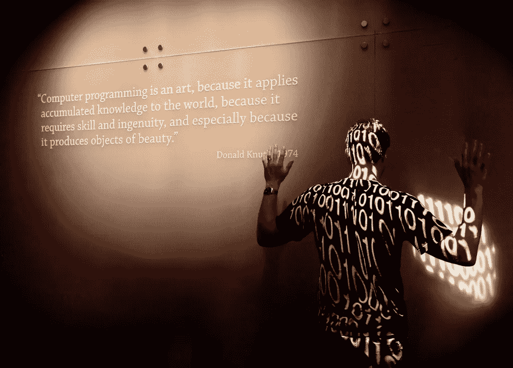

# 我奶奶和小鲍比的桌子

> 原文：<https://medium.com/hackernoon/my-grandma-and-little-bobby-tables-9911ddfb88bf>

[What is art by Steve Jurvetson on Flickr](https://www.flickr.com/photos/jurvetson/5872448596)

小时候放学回家，奶奶照顾我。我告诉她我在学校的冒险经历，我如何交换我的宝贝，我给了五个凝胶球，却得到了一个塑料字母。什么塑料字母，我奶奶问。她炸了通常的鸡肉作为午餐，这是爸爸的一天，他会在下午早些时候来。就像一个小印刷机，里面有所有的字母。你把一张纸塞进它的两面，按下一个字母，它会在纸上留下一个标记，它几乎要把它打穿。

十年后，我和大学里的朋友创办了一本文学杂志。里面有当时流行的所有关于后现代的高雅文章。我们喝着冰酒，就一些我们还不太了解的话题进行了长时间的讨论。并且被过度分析了两倍多。我们发表诗歌、评论、文章、照片和其他任何介于两者之间的灰色地带的东西。论文属于我的领域，我引入了祖母规则。我不赞成任何我奶奶看不懂的文章。并不是说她喜欢后现代。我没有给她任何东西读，这只是一个想象的测试。作者们明白了，他们也有祖母。

毕业后，我加入了一家软件公司，这是我第一次接触到现实生活，而不是为一本将由大学出版社出版 500 册的书临时翻译哲学文本。而不是给我讲师表弟的儿子教数学。相比之下，其他一些临时的工作，比如穿着我的毕业礼服在一个派对上做主持人。我认为这些活动是不在场证明。我假装赚钱付房租。这不是真正的钱，因为它很小，不规则，与我一生中想做的事情完全无关。做程序员不是我想做的事情(当时我并不知道)，但这是一份不错的固定工资。

如果有编程的面包，面包一定是数据库。数据库使用一种共同的语言。并不是所有的人都说同样的话，有不同的方言。即使有标准，也不能规定每一种情况。众所周知，微软不遵守任何标准，它的特殊癖好只适用于自己的产品。就像西班牙语或者英语。在墨西哥使用的一些短语对马德里人来说听起来很荒谬，有些他们甚至不懂。但是如果你在阿根廷学习西班牙语，你在西班牙表达自己是没有问题的。数据库说的是 SQL，它代表结构化查询语言，但你发音为“sequel”。那些程序员，他们喜欢双关语，他们痴迷于双关语。

现在我该如何告诉我奶奶关于数据库的事情呢？前一段只是设置场景的介绍。它定义了庞大的编程词汇表中的一个单词。它不会教你 SQL 的基础知识。这将是第一句话，这将是“你好，我的名字是以实玛利，叫我以实玛利”，这是我一生数据库之旅的开场白。我想告诉奶奶我在工作中的冒险经历。关于 SQL 字母的事情。她会问什么字母。我要教她数据库、表和查询、索引和外键吗？(这些话你不用懂。我把它们放在这里炫耀。)为了什么？只是在她煎她永远的鸡的二十分钟里给她讲个故事。

它们大多是小的、一次性的故事，即使对新手来说，它们的娱乐价值也微乎其微。这就像是连续剧狂欢观众的闲聊。《纸牌屋*最后一集看了吗？那个叫迈克尔·凯利的家伙撕毁合同的时候很恶心。但是我的日常生活就是建立在这些琐碎的事情上，建立在小小的胜利和失败上。我学习这种语言及其微妙之处。我知道上述语句的意思是“返回‘person’数据库表中的所有数据”。我明白了这个查询的意思:`SELECT name FROM person WHERE name LIKE "A%" ORDER BY name`。返回所有以“A”开头的名字，并按字母顺序排序。*

这里需要做一点技术上的解释，但是不要害怕。数据库是表的集合。一个表就是一堆统一的数据。你可以有一个有名字，生日，性别，地址的人的表格。这是我在前面的例子中使用的。你可以在学校里有一个学生表，一个教师表，还有一个他们教的班级表。有一种机制来连接这些表并定义它们之间的关系。所以你可以问一些涉及多张桌子的问题，比如“哪些学生参加了粗面包老师教的历史课？”不，我不是在这里写 SQL 查询。

有在桌子上执行操作的魔法单词。它们是这种语言的助动词。您遇到了返回表数据的 SELECT。您可以更新内容或向其中插入新数据。您甚至可以使用 CREATE TABLE 创建一个新表，或者使用 DROP TABLE 删除一个现有的表。如果你跟了这么远，我会给你看些东西。如果我丢了几段给你，请再读一遍，你会得到回报的。可以窥见一个程序员的心思。我将向你展示一个在这个教派之外没有人理解的编程笑话。你会明白的。开始了。

[xkcd: Exploits of a Mom](https://xkcd.com/327/)

这在现实生活中可能从未发生过。但理论上是可能的。如果您向数据库中输入一些数据，并且意外地执行了这些数据，您可能会丢失所有的学生记录。`DROP TABLE Students`确实如此。

我奶奶去世的时候没有学过 SQL，也不了解我的日常工作。这么多人对编程知之甚少。他们只知道程序员告诉计算机做什么。故事结束。祖母的命运是不理解他们的孙子做什么。我觉得这很痛苦，我想和她，我的妻子，和那些不是邪教成员的朋友们分享我生命中这重要的一面。

我不想让他们写代码。我只想让他们理解我的故事。这可能看起来很自私，但对双方都有好处。我们的关系会加深，当我们想交谈时，菜单上又多了一个我们可以选择的项目。虽然有点干，但营养丰富。知识分子对相对论进行了激烈的争论，它如何影响了牛顿的世界观，它如何对我们的互动方式、我们观看的电视节目(甚至可能是我们观看电视节目的事实)以及我们使用的化妆品产生了深远的影响。可能是一个门外汉的对话，话题远超他们的理解，一群文科专业的学生对现代物理学的浅薄理解。但是他们玩得很开心。离掌握这个巨大的世界又近了一步。

为孩子编写代码和编写海龟程序在今天很流行。我们认为每个人都应该说那种语言。我不确定。我不希望我的家人和朋友学习写实际的代码。如果他们基本理解就够了。然后他们可以自己决定。

这是硬币的一面。如果我想为它做一个口号，它会像“教诗人一点编程”。另一方面是基于我对程序员的经验，他们被认为介于轻度自闭症和社交无能的内向者之间。这是非常非常严重的偏见。酪程序员不读诗。(社会其他人呢？)程序员不去剧院，不要在各种情况下肚子里有一种模糊的感觉。他们不会走更远的路去朋友家，路过一棵老栗子树，它在风中呻吟，好像住着一个迷失的灵魂。

我知道也有例外。告诉我任何没有例外的规则或陈述。这又是小心眼的程序员思维方式。当然，如果你正在读这篇文章，你是一个例外，你是一个程序员，你不仅仅是在这篇文章上用一些非常刻薄的短语写评论。有些程序员不仅读诗，还写诗。有些人不仅去剧院，还在戏剧中表演。他们有各种模糊的感觉，并不害怕分享。或者他们害怕分享，这增加了模糊的感觉，但他们还是分享了。我希望有更多这样的人。我希望有更多的程序员可以和我的奶奶，我的妻子，我的朋友聊天。我希望和我共度一生的两组人在集合论意义上有更大的交集。我希望他们能说话。

工程师，其中的软件工程师，是一种奇怪的野兽。大多数人可能会获得德国古典哲学或文学理论学位。他们阅读触及灵魂的书籍。他们看的电影会把你的思想拆开，然后以一种令人惊讶的方式组合起来。但是他们很少分享这种经历。坚持数据库的抽象世界感觉更安全。

这是我的偏见。我站在两个世界，诗意的世界，程序员的世界。我会两种语言，我可以和两个国家的居民交流。哪一个是我的母语？恐怕再也没有了。我说话带有轻微的口音。两个人都能立刻发现我不是他们中的一员。我可以，几乎在那里，但不是。我的偏见是，程序员天生比一般人的心脏小，他们用自己的大脑来弥补。

但问题不是程序员不写诗。有些是。像一些木匠和公司律师写诗。不太多，可能百分之一。问题是他们不写日常生活。没有关于数据库的诗歌，没有关于正确查询的诗歌。程序员似乎无法告诉他们的祖母和配偶他们是如何度过一天的。

曾有几次尝试拆除它周围的墙，向公众开放。书籍讲述了 Twitter 和微软的秘密生活。我见过用编程语言写的诗。但是他们很肤浅，因为他们没有给你额外的知识。观看四季《IT 人群》,并不能让你更进一步了解程序员的想法。

有*医生之家*和*夜班*以及十几个其他系列，供那些对医学和医院日常生活感兴趣的人观看。编剧们找到或发明了一种语言来和外行观众谈论它。我不能做一个简单的旁路手术，但是看了几集后，我想我明白了它的要点。这并不能让我成为一名外科医生，但我认为我可以与一名外科医生进行有教育意义的对话，我可以提出有意义的问题并保持好奇。

当我在下午 6 点关上笔记本电脑，从办公桌前站起来时，我会反思我的一天。小失败和小胜利的记录。本质上都是技术性的。然后就觉得空虚。在我的笔记本电脑上花了 9 个小时，我没有什么可展示的。在我的团队之外，在这个程序员团体之外，没有什么可以分享的。对于我写的 SQL 查询，哪首诗能表达这种空虚和满足的混合呢？我需要那首诗，有人吗，请为我写一首。