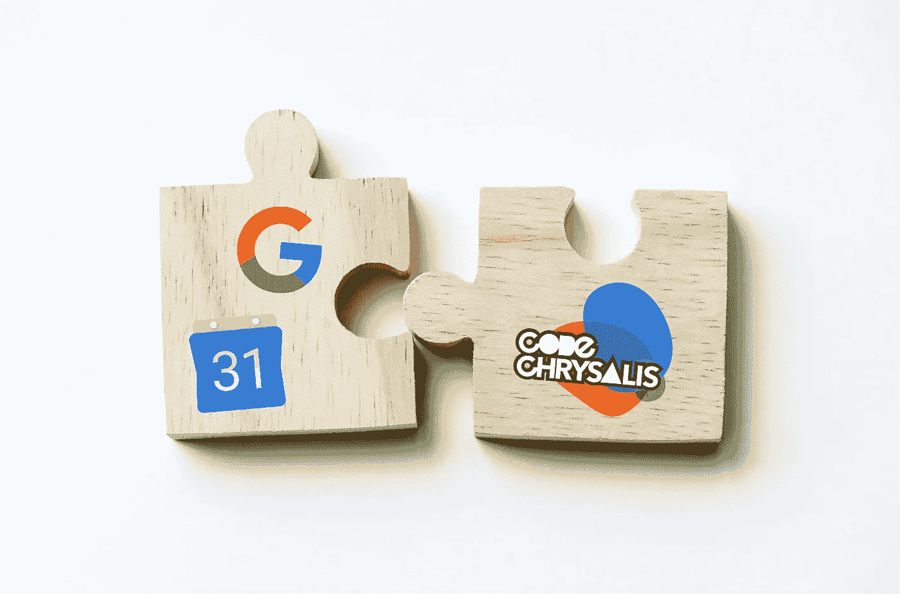

# 我在 Node 中集成 Google 日历(G-suite)的旅程

> 原文：<https://medium.com/hackernoon/my-journey-integrating-google-calendar-g-suite-in-node-62fbc8596455>

Bridging Google Calendar with Our Internal Platform

在本文中，我将带您经历在没有文档的 Node 中使用 Google Calendar API 的痛苦。特别是使用具有域范围权限的服务帐户访问数据。

如果你没有使用过 Google APIs，或者至少没有使用过 Node。你可能会惊讶于他们的文档是多么的不完整。整合会有多麻烦…