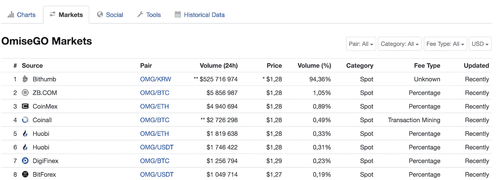
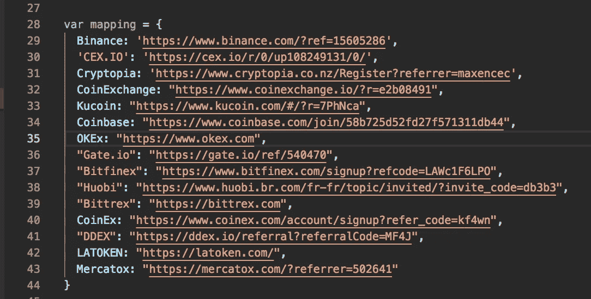
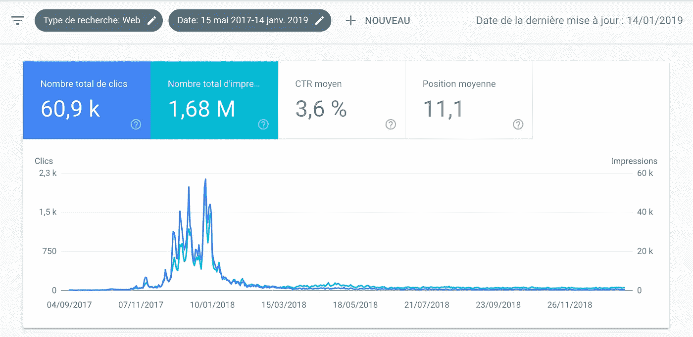
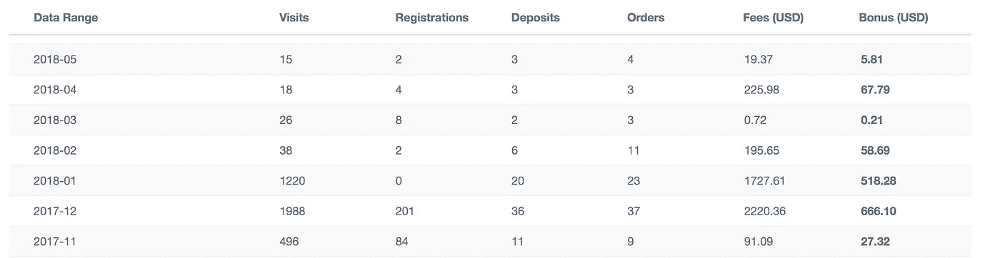
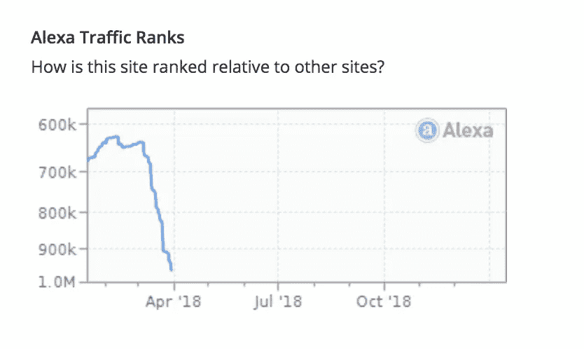

# 我的数字游牧生活:关于加密货币、Javascript 和联盟营销的故事

> 原文：<https://medium.com/hackernoon/my-life-as-a-digital-nomad-a-story-about-cryptocurrencies-javascript-and-affiliate-marketing-f97cef8ee1e4>

这个故事与 2017 年的加密货币牛市高度相关，当时大量资金流向市场。现在构建完全相同的附带项目不会如此有效。

但是让我们从头开始，故事开始于 2017 年 5 月，我刚刚离开我作为 Node.js 开发人员工作的公司，并试图建立一个项目，这个项目将赚足够的钱让我作为一个数字流浪者生活，就像 [Pieter Levels](https://twitter.com/levelsio) 或[Adam**@**surfcodeprepeat](https://twitter.com/surfcoderepeat)(我每天都在阅读的 Twitter feed*)。当时我对数字游牧生活方式很着迷)。*

*当时，我正忙于研究加密货币，有一天，当我试图找出在哪个平台上可以买到 OMG (omisego)代币时，我发现了 [CoinMarketCap](https://coinmarketcap.com/) (cmc)上的“市场”标签。*

**

*The market tab on [Coinmarketcap](https://coinmarketcap.com/)*

*基本上，对于任何加密货币，你可以去 cmc 上的“市场”标签，你会找到一个可以购买硬币/令牌的平台列表。*

*此时，我对自己说:*

**“如果我在寻找购买 OMG 代币的地方，我很确定其他人也是，所以我可以根据 CoinMarketCap 的结果写一个指南”**

***现在，这些平台中的大多数都有一个推荐项目**(这意味着如果我推荐一个用户给他们，我可以得到销售额的%)。**这些是我的推荐链接:***

*   *[币安](https://www.binance.com/en/register?ref=15605286)*
*   *[CEX。IO](https://cex.io/r/0/up108249131/0/)*
*   *[库科恩](https://www.kucoin.com/#/?r=7PhNca)*
*   *[比特币基地](https://www.coinbase.com/join/58b725d52fd27f571311db44)*
*   *[Gate.io](https://gate.io/ref/540470)*
*   *[Bitfinex](https://www.bitfinex.com/signup?refcode=LAWc1F6LPO)*
*   *[火币](https://www.huobi.br.com/fr-fr/topic/invited/?invite_code=db3b3)*
*   *[CoinEx](https://www.coinex.com/account/signup?refer_code=kf4wn)*
*   *[市场毒理](https://mercatox.com/?referrer=502641)*

*所以我在每个平台上创建一个账号，在 vscode studio 上写一个平台和我的 referral 链接之间的映射文件。*

**

*The mapping file used in my code*

*然后，我买了一个域名，并推出了一个网站，让我们称之为 example-website.com。*

*我编写了一个 Node.js scrapper 来获取 cmc 上排名前 1000 位的加密货币(它们的 markets 选项卡),并使用以下模板为每种加密货币自动生成一个 HTML 页面:*

*https://example-website.com/guides/where-to-buy-X*

*在 OMG 令牌案例中:
https://example-website.com/guides/where-to-buy-omisego-OMG*

*HTML 页面本身显示了一些描述文本，然后是可以购买代币/硬币的平台列表，**当然还有我的推荐代码。***

*那是怎么回事？**好得吓人的***

*   ***168 万的浏览量***
*   ***61k 点击量***

**

*Google search console traffic since the launch of the website*

*原来很多人在谷歌搜索“我在哪里可以买到 OMG”，“如何购买 ETH”，我的网站在这些关键词上排名很好。*

*上面的截图显示了加密货币泡沫高峰期(2017 年 12 月至 2018 年 1 月)的流量有多疯狂。*

*那时候，仅谷歌搜索一项，我每天就收到超过 2300 次点击，每一个在上面列表中的平台上注册的用户，我都会得到一份收入。*

**

*Affiliate revenue for [Cex.io](https://cex.io/r/0/up108249131/0/) alone*

*这个小副业项目的收入足够支付我几个月的费用，它让我在柬埔寨、泰国、越南、巴厘岛、印度和斯里兰卡以数字游牧者的身份生活，基本上开启了我的数字游牧生涯！*

*不幸的是，所有的好事都必须结束，随着 2017 年加密货币泡沫的破裂，流量迅速下降。*

**

*As the bubble pop, the traffic collapsed T_T*

*我后来发现我不是唯一一个有同样想法的人，我的同事 indie hacker Scott Lewis 建了一个非常相似的 wheretobuycrypto.co 网站。我想知道他的结果如何？*

*作为结论:当建立一个成功的副业项目时，你不能假设它会永远持续下去，市场会变化，你的收入会在一夜之间消失*

*如果您有任何意见或问题，请随时联系 Twitter。*

*编辑:2022 年 6 月，我决定用我的新副业 [crypto101.club](https://crypto101.club/en) 和具体的[加密货币如何购买指南](https://crypto101.club/en/guides)再试一次*

*这次来看看效果如何！*