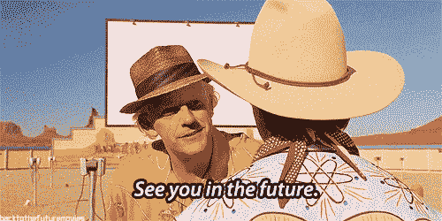

# 我对 2019 年的预测——科技、投资和其他一切

> 原文：<https://medium.com/hackernoon/my-predictions-for-2019-tech-investing-and-everything-else-af081726edb8>

2018 年在科技界相当忙碌

我回顾了我对 2018 年的预测，其中一些非常接近，但也有一些非常错误。

 [## 2018 年风险投资的 12 个预测

### 那是有趣的一年！因此，让我们以时尚的方式结束它，并开始对将要发生的事情做一些预测…

hackernoon.com](https://hackernoon.com/2017-is-over-but-2018-is-here-to-keep-it-going-6caf688c366b) 

今年，我想把我想到的、我读到的或从朋友那里听到的一些事情列出来。如果你感兴趣，我很乐意深入任何话题，但我认为随着我们的注意力持续收缩，快速射击可能会更好。排名不分先后:

*   我们在 2018 年有一个非常好的 IPO 窗口，我预计这将持续到 2019 年，一些更大、更高价值的独角兽最终将上市。
*   假设其中一些将在 H1 上市，禁售期将在年底到期，这意味着将有大量流动性。这将导致第 4 季度的前期/种子投资增加，并将持续到 2020 年。
*   有了这么多新的资金，pre/seed 标准将有所放松，转而投资于风险更高的风险企业，否则这些企业可能不会获得资金。这对创业者来说是好事，我认为对整个环境来说也是好事，因为我们需要更疯狂、更天马行空、难以自圆其说的想法。
*   在后期阶段，我仍然期待 1 亿多美元的后期投资，令人瞠目结舌。这将继续下去，因为一些顶级风投最近筹集了需要部署的 1B+资金，软银仍有一半的资金，M&A 也在继续扩大规模。
*   在超级炒作的 Magic Leap 发射失败后，VR/AR 还需要一年时间。我预测 2018 年有人会在上市前购买它们，但幸运的是没有人这样做，所以它们要么再融资数亿美元，要么被 acq 聘用。诚然我还没试过(谁有！？)但我所有说过它很棒的朋友都没有买过……我家里有一台 HTV Vive Pro，我最喜欢的两个应用程序是谷歌地图，因为你基本上是超人，是娱乐室里对付孩子的激光标签。
*   媒体整合将会继续，随着大玩家变得更大、更绝望，整合不会变得更容易。Buzzfeed 刚刚裁掉了 15%的员工，并表示他们将对与 T2 的合并持开放态度，以便与脸书、谷歌等竞争。威瑞森[基本上写下了价值 46 亿美元的誓言，并解雇了 7%的媒体员工。什么商业模式会对数字新闻有帮助？](http://fortune.com/2018/12/11/verizon-is-basically-writing-off-oath/)
*   随着传统电视的竞争和 OTT 的升温，流媒体服务的数量将继续增加。维亚康姆刚刚宣布以 3 . 4 亿美元收购布鲁托电视，迪斯尼将很快推出一个，尽管由于 Hulu 等的原因已经损失了 1B 的美元，梅格·惠特曼可能在今年年底推出 1B 支持的 Quibi(快速点餐)服务。
*   我认为这将导致媒体在今年年底前超载，有太多的选择，太多的内容，没有足够的时间，最终，人们将开始支付与有线电视一样多的费用，因此成本节约方面将受到侵蚀。今年我们不会找到这个问题的答案。
*   踏板车……上亿投资，数十亿估值，和城市打架。这种情况将持续到今年余下的时间，随着竞争的加剧、法规的通过和获胜者的加冕，这种情况只会变得更加激烈。传闻优步/Lyft 有可能收购伯德/莱姆(他们的投资者)，但在 IPO 前，我认为这不会发生。我真的希望伯德/莱姆等，也许优步/Lyft 收购一个海外(美国以外)的全球扩张
*   自动驾驶汽车……它们是未来，但我们还需要 3-5 年才能得到它们。目前来看，这有点言过其实，但这并不是一件坏事，因为新闻报道的是更大的融资轮和合作伙伴关系，需要数年时间才能成熟。不过，自动卡车将在未来一两年内开始出现，这是非常需要的，因为我们有一个[卡车司机短缺](https://www.freightwaves.com/news/driver-shortage-ata-estimates)
*   D2C/CPG 现在仍然很热，今年也不会停止。我们刚刚开始从传统零售向网上购物转型。我不是订阅盒的真正粉丝，但不是大企业集团的新品牌和创新品牌将不断蚕食现有品牌。预计将有超过 1 亿美元的收购，因为品牌需要购买>建造。
*   我直言不讳地说，我不会投资任何秘密的东西，但我很高兴大多数价格暴跌，因为这将推动很多创新，因为贪婪基本上已经消失了。基于此，我希望今年年底会出现一些真正的消费者用例。这将是不性感的，后端的东西，但希望它像每个人认为的那样好。许多顶级风投、银行和我跟踪的人已经投资了数百万——我知道他们比我聪明得多，但仍然不确定进入这个游戏是一个赌注/对冲还是真实的。
*   随着我们对手机越来越上瘾，政治将我们分开，工作变得更加苛刻，健康、健康和心理健康应用/创业公司将继续增长。我真的希望每个人都能通过瑜伽、冥想、与朋友交谈等方式找到自己的解决方法。如果你想聊天，我的邮箱是 t@nyvp.com。

因此，基于以上所有因素，我认为 2019 年将是又一个伟大的一年！

我们最近的一些投资:[peelawaylabs.com](https://peelawaylabs.com)/[stickerpop.co](https://stickerpop.co/)/[journeymeditation.com](http://www.journeymeditation.com/)(招聘！)/ [uizard.io](https://uizard.io) / [Fi](https://angel.co/tryfi/jobs) (招人！)

*☞以后想听更多我的想法:* [*在 Twitter 上关注我*](https://twitter.com/Trace_Cohen)

*☞如果你喜欢这篇文章，* ***请“鼓掌”*** *帮助向他人推广这篇文章，或者在评论中告诉我你的想法*