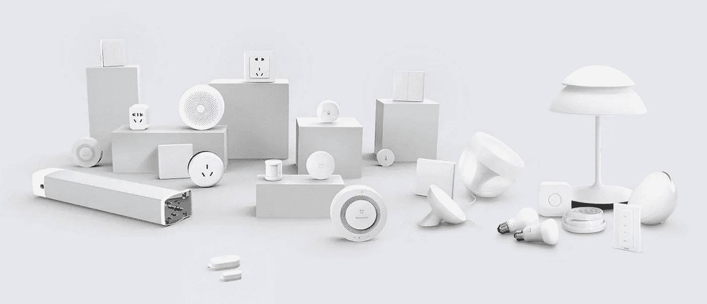
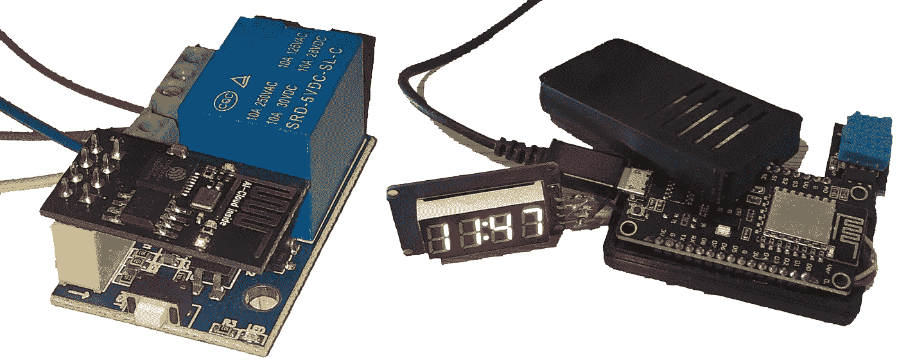
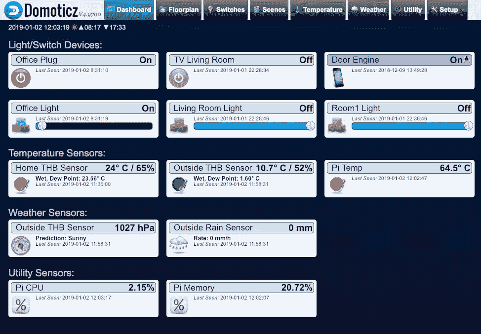
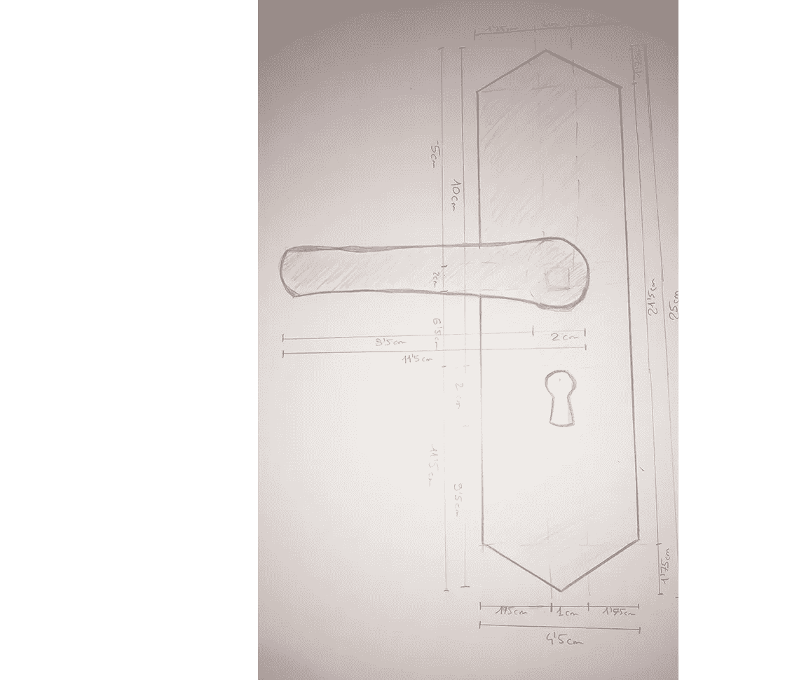
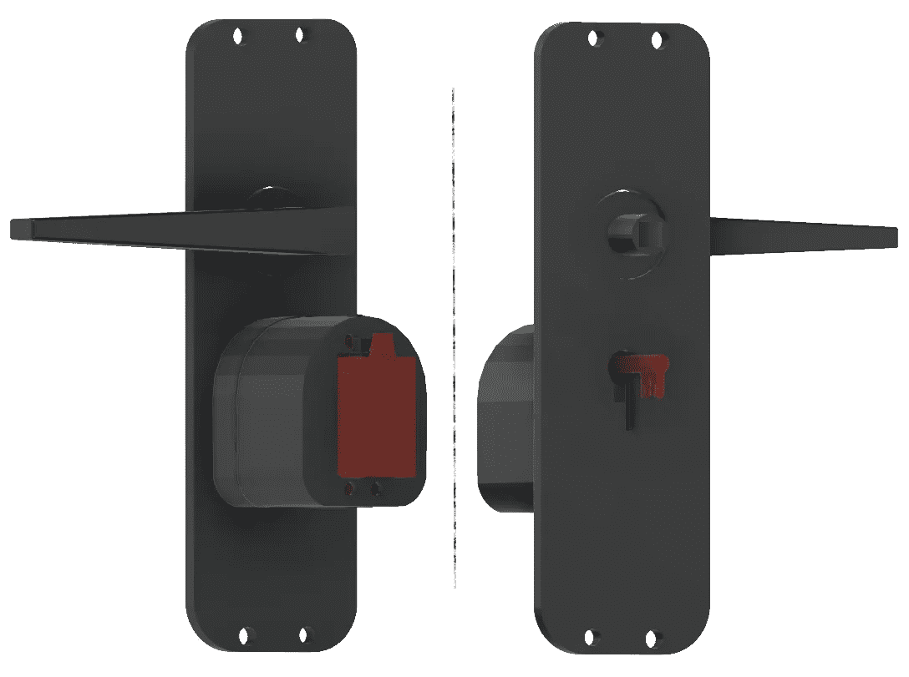
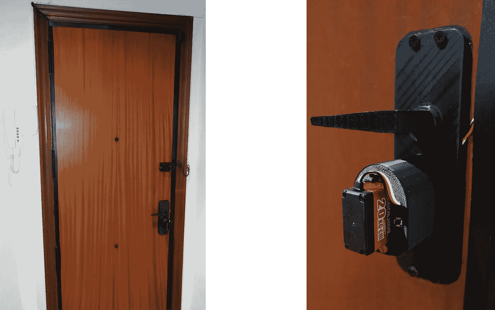
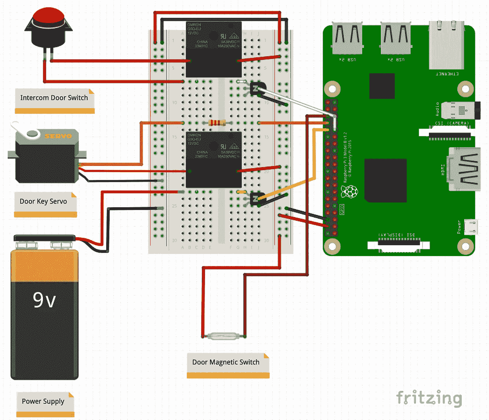
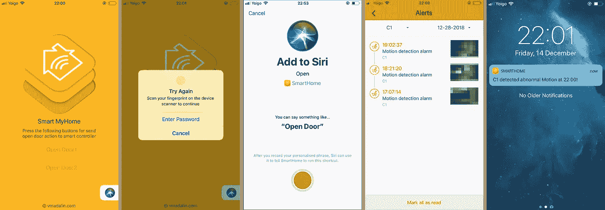
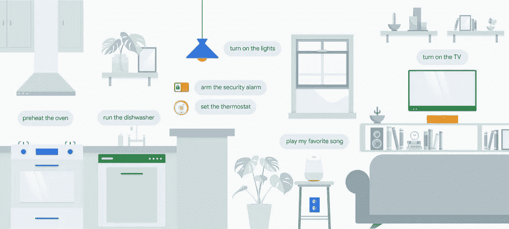

# 建设我的智能家居

> 原文：<https://medium.com/hackernoon/my-smart-home-2bfc9da635c1>

The mobile application and electronic circuit controlled by Raspberry Pi

在这篇面向大众的文章中，我将解释我如何将我的家变成[智能](https://hackernoon.com/tagged/smart)的个人项目的经历和趣闻，以及我如何控制不同的电子设备，用简单的手势通过电话进入家中，或使用 Siri 语音命令打开大楼的门。

基本上这个想法是从我购买的 Arduino 套件开始的，我开始摆弄不同的模块操纵杆、继电器、马达、显示器等..所以我决定把家里变成智能的，从手机控制。虽然它也可以与谷歌主页/ HomePod 整合，但目前我推迟了另一个阶段。

这些是我在开始之前设定的项目目标:

*   打开/关闭电源，控制亮度，对室内灯和插头进行编程。
*   测量室内和室外温度来调节它。
*   通过 Siri 用语音命令打开大楼的门。
*   通过指纹打开家门并检测其关闭。另外加一个按钮，方便从里面打开。
*   所有门活动的通知系统和历史记录
*   安装多项安全措施，保证家居的完整性。

从移动设备打开家门的优点除了提供进入和控制谁进入和离开之外，还增加了安全性，因为许多家庭通常不锁门，而只是用插销关门。所以这让小偷的工作变得更容易，我们不希望这样。

为此，我使用了 Rasberry Pi，这是一台小型单板电脑，你可以通过 [Domoticz](https://www.domoticz.com/) 自动化系统连接和控制家中所有你想添加的设备。

在市场上，当我们谈到许多品牌和所有口袋的智能设备时，有几种选择。从灯泡到照相机、恒温器、冰箱等等。最终，任何可以连接到 WiFi/蓝牙的东西，无论多小，都被称为物联网设备。

IoT device types

但是，除了获取一些并安装它们之外，还可以根据我们的需求自己创建它们。在我的例子中，我使用 ESP8266 芯片和 5V 供电的继电器模块来打开/关闭迷你饮水机的电路。

此外，对于所有的控制家庭温度，节点 MCU 芯片已经用于每 X 个时间间隔进行测量，将数据更新到 Domoticz，如果需要，其将能够启动加热系统。我还决定增加一个显示器来显示温度和时间。

On the left the module ESP8266 and on the right the Node MCU

# 仪表盘

一旦所有设备都配置好了，这就是 Domoticz 界面，也可以从手机上访问。基本上从这里我们可以控制所有连接的设备，添加，删除等等。当然，只能从本地网络访问。

此外，我们可以对每个设备进行编程，并添加额外的逻辑，例如，它应该在什么时候以特定的强度打开、关闭。取决于我们的情况，我们可能对某个州感兴趣。

Desktop dashboard

如你所见，在我的例子中，我有树莓皮的相关信息，屋内外的温度。还有一些插头，不同房间或房间的灯。

还有启用/禁用门机制的可能性，以及一些其他选项。

# 3D 建模和打印

要打开家门，一个到达的信号是不够的。该信号必须启动一个动作，在这种情况下，转动钥匙，一个我们每天都在执行的动作。虽然我看到了一些“[智能锁](https://august.com/)机制，但没有一个适合我的门的类型。

此外，谁想要一个基于电池的系统？我们不希望他在户外和我们一起耗尽电池。因此，该系统应直接连接到电源，只有在紧急情况下才由蓄电池供电。

为了做到这一点，有必要开始采取措施，从零开始建造一些东西，使之有可能转动钥匙，考虑到这是一个加固的门。

做好塑料结构和车把之后，我开始设计伺服电机的寄托。我的主要意图是分裂的关键在 2 部分，使所有的支持更紧凑，但当我不能做到这一点，我决定离开这个想法。也有可能做一个齿轮系统，但考虑到这需要的耐用性和转向力，我决定选择更简单的东西。我开始设计 3D 作品，然后打印出来，经过一些调整，这是最终的结果。

Assembly of all the components, in red it would be other parts like the servo and the key

这些组件可以从 thingiverse.com[网站](https://www.thingiverse.com/thing:3326691)(专门分享用户创建的数字设计文件的网站)访问和下载。

# 装配

组装可能需要很长时间，但我们不希望看到电缆悬挂，因为除了不美观还会导致更大的后果，如短路。为了确保这种情况不会发生，我们必须使用一个财产电缆控股。

这将是我的情况下的结果，试图让电缆几乎注意不到，即使他们穿过门框，直到他们到达锁。

On the left we can see the intercom that is connected to the Raspberry Pi. And on the right the servo motor hold by the piece printed in 3D.

同时，在门的中间可以看到一个按钮，它是 [DashButton](https://www.amazon.com/Dash-Buttons/b?ie=UTF8&node=10667898011) 他有责任用一种非常简单的方式从里面开门。

# 电路

Diagram of connection of the different components

一旦看到组装部分，我将解释组成它的组件，以及与树莓派的联系。为了能够构建它，我在小范围内进行了不同的概念验证，在进行最终组装之前测试了不同的配置。

该电路完全可以代替试验板进行焊接，不过也可以在另一个步骤完成。

这些是用于其构造的不同组件:

*   *1x 伺服电机:*其作用是转动钥匙开关门。
*   *1x 电源:* 9V DC 电流供给伺服电机正常运行。
*   *1x 磁控开关:*检测门何时关闭，并向伺服机构发出指令转动钥匙。
*   *2x 继电器:*一个负责关闭对讲机按钮，另一个仅在需要时给伺服系统供电。
*   *2x 晶体管 NPN* :解决常见的 Raspberry Pi 问题，将 3.3 GPIO 升压至 5V，为继电器供电。

这个草图是可访问的，可以从 fritzing.com 网站下载(开源硬件倡议，使电子产品成为任何人的创作材料)。

# 移动应用程序

The different parts of the application.

为了最大化整个引擎的安全性，我决定创建一个应用程序，其中所有信息都通过我自己的服务器传递，以便注册和控制所有流量以及访问，而不是使用 Domoticz 来处理这个关键部分。我使用 React-Native 框架进行开发。

该应用程序不是公开的，完全供内部使用，包括以下功能:

*   尝试启动操作时的指纹扫描仪
*   添加 Siri 快捷命令仅适用于大楼门
*   通知和警报系统

# 演示

开门引擎在从 alpha 版本到当前版本的整个开发过程中经历了几个阶段，特别关注安全性并提供稳定性以正常工作。因为我们不希望引擎停止响应或失败。所以今天，随着所有家庭成员的日常使用，发动机已经正常工作了一个多月。

这是它如何工作的演示:

Demo prototype door engine

基本上，对讲系统在接收到 Siri 命令发送的动作后，会保持建筑门打开几秒钟，足以从外面进入。这个动作被 Raspberry Pi 接收，它通过继电器关闭内部通信系统按钮电路，执行与我们按下它相同的逻辑。

另一方面，打开加固门的动作只能通过指纹来释放，并且门将保持打开，直到磁开关检测到门的关闭，如图所示。

# 技术和库

就项目中使用的技术而言，服务器和运行在 nodeJS 中的 Raspberry Pi。使用 [SSE](https://developer.mozilla.org/en-US/docs/Web/API/Server-sent_events/Using_server-sent_events) (服务器发送事件)进行这种通信，以及[AWSλs](https://aws.amazon.com/lambda/)来执行不同的动作。

不要忘记 [PM2](https://www.npmjs.com/package/pm2) (流程管理器 2)生产运行时和流程管理器，允许应用程序永远保持活力，在不停机的情况下重新加载它们，并促进常见的开发运维任务。

为了控制 [GPIO](https://www.raspberrypi.org/documentation/usage/gpio/) (通用输入输出)已经使用了节点库 [pigpio](https://www.npmjs.com/package/pigpio) ，一个 [pigpio C 库](https://github.com/joan2937/pigpio)的包装器。虽然其他替代方案如 [johnny-five](https://www.npmjs.com/package/johnny-five) 用于物联网和机器人编程。

移动应用程序使用特定的 [npm](https://www.npmjs.com/) 库来实现以下功能:

> 指纹扫描仪功能:[https://www . npmjs . com/package/react-native-fingerprint-scanner](https://www.npmjs.com/package/react-native-fingerprint-scanner)
> 
> Siri 命令功能:[https://www.npmjs.com/package/react-native-siri-shortcut](https://www.npmjs.com/package/react-native-siri-shortcut)

组件中用于 ESP8266 和节点 MCU 的不同微芯片的驱动控制，以及连接到它们的不同设备模块，例如温度和湿度传感器(DTH11)、4 位显示器(TM1637)、继电器模块等，已经使用了制造商推荐的特定库，其中一些库可以在[此处](https://www.arduinolibraries.info/)找到。

# 软件

为了构建项目的不同部分，如监控系统和设备控制器、3D 建模和打印、电路设计和编程，我使用了不同的第三方软件，如:

> **自动化系统** : [Domoticz](https://www.domoticz.com/)
> 
> **电子样机** : [Arduino](https://www.arduino.cc/) ，[烧结](http://fritzing.org/home/)
> 
> **3D 打印** : [Ultimaker Cura](https://ultimaker.com/en/products/ultimaker-cura-software) ， [Simplify3D](https://www.simplify3d.com/)
> 
> **3D 建模** : [Fusion360](https://www.autodesk.com/campaigns/fusion-360-for-hobbyists) ， [SketchUp](https://www.sketchup.com/)

# 摘要

如今，越来越多的人谈论智能家居，公司正在努力征服一个不断增长的市场，让人们的生活更加轻松。为此，他们设计并销售多种设备和套件，如传感器、控制器、灯、开关等..因此，每个人都可以制作自己的智能家居，并通过手机、声音和手势进行控制。

想想在到家之前设定温度的可能性，能够通过安装的安全摄像头监控你的家，通过语音命令控制不同的电子设备，早上自动拉起百叶窗，为什么不，不用钥匙只通过手机进入你的家。

尽管可能性是无限的。科技可以用来方便我们的生活。

Support me as a writer

感谢您的时间和阅读。

动词 （verb 的缩写）马达林