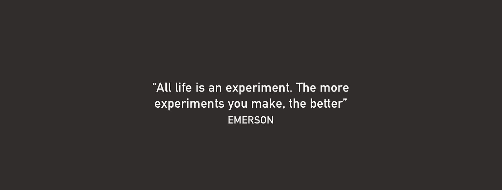
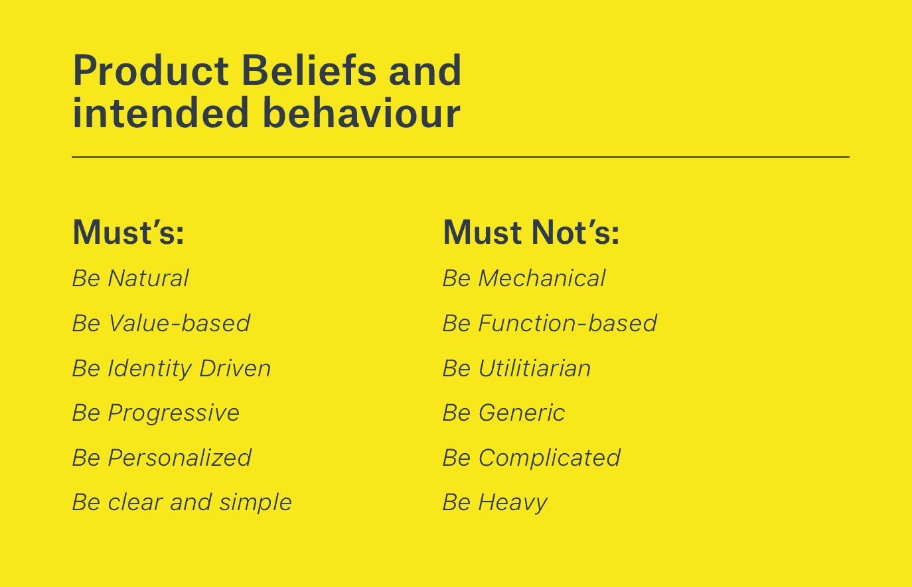
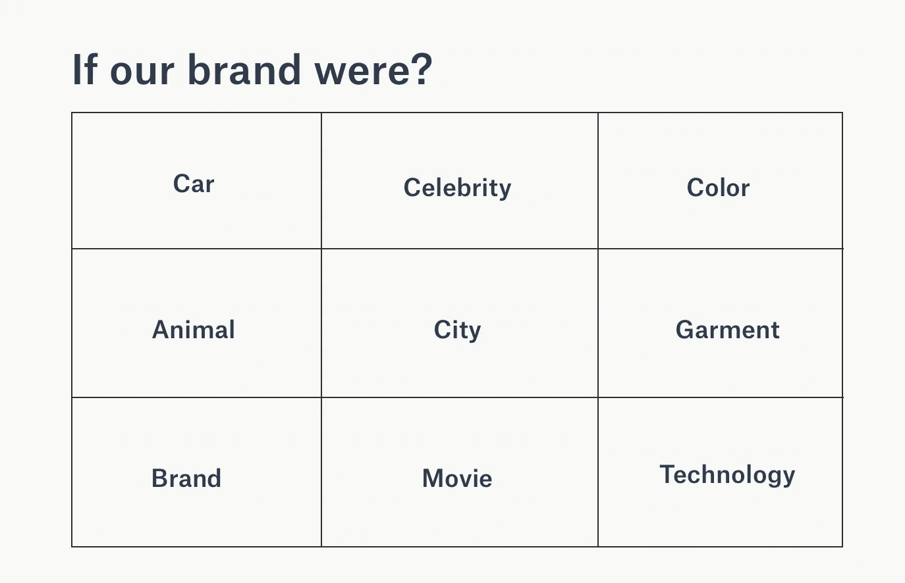
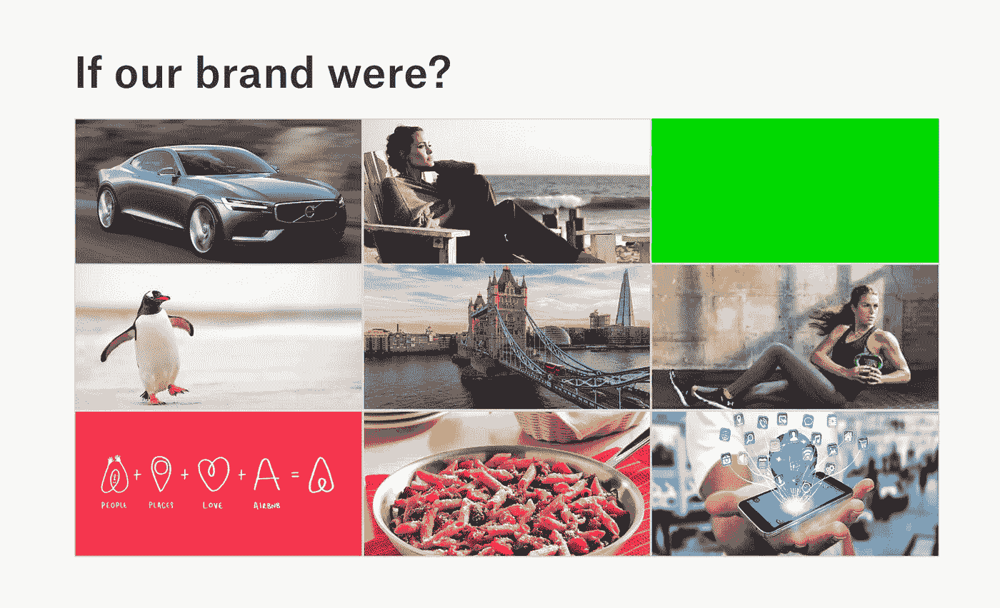

# 旅游保险试验第一阶段

> 原文：<https://medium.com/hackernoon/my-travel-insurance-concept-product-design-stage-1-ebcce06a21e7>

自从我写下上一篇文章，尝试为现代旅行者创造一种新时代的[旅游](https://hackernoon.com/tagged/travel)保险产品以来，已经过去了 6 个多星期。我必须说，到目前为止，这是一次发现和反思的旅程。许多基础工作是我通常在创业加速器中经历的，能有所改变，成为发现的一方是很好的。

这是我试图解决的一些问题。

1.  我们代表什么？
2.  **产品会是什么样的？**
3.  **我们向谁销售？**
4.  **人们愿意为该产品付费吗？客户价值是什么？**
5.  **保险公司如何运营？**
6.  **用户目前面临的旅游保险痛点有哪些？**

*注意:旅游保险是一种非常普通的保险，有特定的用途。因为我们正在重新想象旅游保险是什么，而不是它是什么。从这一点上，我做出了协调一致的努力，以确保我们从正确的角度出发，考虑简单性、客户价值，并发现利用当今技术的可能性。我很早就发现很容易把事情复杂化。所以，我给自己写了一份备忘录，引用了一些我在品牌和产品早期开发时相信的话。*

> “简单是最复杂的”——莱昂纳多·达芬奇
> 
> “把简单的东西变得简单需要很多努力——史蒂夫·乔布斯

记住这一点:让我们开始吧。

# 1.我们代表什么？

这是我所帮助的初创公司经历的最重要的步骤之一。通常，一个创始人会有一个有效的想法，概念，甚至在市场上，然而当他们开始建立/扩展它时，他们经常会错过关键的基本面；最重要的是… *我们代表什么？*

看待这个问题的一个简单方法是在设计或产品流程开始之前做一些练习。其中包括:

*   产品信念——我们必须拥有什么，我们想要避免什么。
*   品牌叙事和形象——我们希望它变成什么样？

## 产品信念

首先是**我们代表什么？从产品的角度来看。**

My Product Beliefs

以上几点代表了产品应该封装的内容。虽然这些看起来很普通，但是把它们作为平台的一部分写下来总是好的。

## 品牌叙事和形象

对于品牌叙事和形象，我通常会试图去理解品牌应该让用户产生怎样的感受，我们想成为什么样的人。下面是这方面的一个简单练习。如果我们的品牌是 x，我们会是什么？为什么呢？

If I were a x exercise

我的回答:

Brand Complete Picture

我不会一一介绍，但一些重点包括:

> 如果我们是一辆**汽车**，我们就会是一辆**沃尔沃**。为什么？沃尔沃历来以安全可靠著称。然而，该品牌最近的演变正变得更加进步、运动和创新。安全可靠是保险公司的支柱。
> 
> 如果我们是**名人**，我们就会是**安吉丽娜·朱莉**。为什么？她既是一名演员，也是一名人道主义者。她代表着人们能够认同并对人们产生持久影响的东西。我们希望成为可持续发展的旅游保险公司，回馈用户到访的地方。

其余的都很普通，基于相似的原则。

从这两个练习中，很明显我们主张的是 ***自然******无缝******安全******安全******进步*** 最重要的是，给用户的出行行为增加了*不容置疑的价值*

# *2.产品会是什么样子？*

*今天的旅游保险产品并不复杂…我们已经知道这一点。通过研究，我发现如今的旅游保险是:*

*   ***保险界的红发继子；***
*   ***主要以纸/人为中心；&***
*   ***构建于 80 年代末 90 年代初的大型机技术堆栈。***

*如果在它之前没有任何东西被创造出来，那会是什么呢？以下是一些想法:*

***为产品考虑:***

*   *我们应该包括什么？今天人们如何旅行？在过去的十年里有什么变化吗？*
*   *保险通常是用户不信任的产品。我们如何建立信任？*
*   *如今的旅游保险依赖于对用户去向的了解。我们能使用地理定位技术来实现无缝连接吗？地理围栏…可以用吗？*
*   *[产品并更改品牌名称。这将是一个漫长的过程，但对于实现预期的客户价值至关重要。](https://medium.com/u/25aae929dbb1#2 是大多数新保险公司的目标，然而，如果你希望你的产品真正以客户为中心，并符合上述原则，你需要与保险公司谈判。因此，我开始与一家保险公司进行对话，目的是共同打造一款满足当今旅行者需求的产品。通常情况下，大多数保险公司会采用现成的<em class=)*

# [**6。用户目前面临的旅游保险痛点有哪些？**](https://medium.com/u/25aae929dbb1#2 是大多数新保险公司的目标，然而，如果你希望你的产品真正以客户为中心，并符合上述原则，你需要与保险公司谈判。因此，我开始与一家保险公司进行对话，目的是共同打造一款满足当今旅行者需求的产品。通常情况下，大多数保险公司会采用现成的<em class=)

[在为期 6 周的旅程中，我与 32 名购买了旅行保险并提出索赔的用户进行了交谈。在 32 个中:](https://medium.com/u/25aae929dbb1#2 是大多数新保险公司的目标，然而，如果你希望你的产品真正以客户为中心，并符合上述原则，你需要与保险公司谈判。因此，我开始与一家保险公司进行对话，目的是共同打造一款满足当今旅行者需求的产品。通常情况下，大多数保险公司会采用现成的<em class=)

*   [**12 人对旅游保险有过积极的体验**。评论包括不需要保险，索赔过程处理迅速，在可接受的时间范围内。](https://medium.com/u/25aae929dbb1#2 是大多数新保险公司的目标，然而，如果你希望你的产品真正以客户为中心，并符合上述原则，你需要与保险公司谈判。因此，我开始与一家保险公司进行对话，目的是共同打造一款满足当今旅行者需求的产品。通常情况下，大多数保险公司会采用现成的<em class=)
*   [**8 人对旅游保险有一定的体验**。评论包括冗长但令人满意的索赔经历。](https://medium.com/u/25aae929dbb1#2 是大多数新保险公司的目标，然而，如果你希望你的产品真正以客户为中心，并符合上述原则，你需要与保险公司谈判。因此，我开始与一家保险公司进行对话，目的是共同打造一款满足当今旅行者需求的产品。通常情况下，大多数保险公司会采用现成的<em class=)
*   [10 有一次不太愉快的旅行保险经历。意见包括索赔没有得到全额支付，必须提供一系列文件，这在他们的旅行中是困难的。](https://medium.com/u/25aae929dbb1#2 是大多数新保险公司的目标，然而，如果你希望你的产品真正以客户为中心，并符合上述原则，你需要与保险公司谈判。因此，我开始与一家保险公司进行对话，目的是共同打造一款满足当今旅行者需求的产品。通常情况下，大多数保险公司会采用现成的<em class=)
*   [**2 名用户与他们的旅游保险提供商有过可怕的经历**。](https://medium.com/u/25aae929dbb1#2 是大多数新保险公司的目标，然而，如果你希望你的产品真正以客户为中心，并符合上述原则，你需要与保险公司谈判。因此，我开始与一家保险公司进行对话，目的是共同打造一款满足当今旅行者需求的产品。通常情况下，大多数保险公司会采用现成的<em class=)

[总体而言，91%的澳大利亚人在旅行时购买了旅行保险。这是一个很大的统计数据，说明旅游保险是有价值的，然而大多数人认为它是一种必要的邪恶！](https://medium.com/u/25aae929dbb1#2 是大多数新保险公司的目标，然而，如果你希望你的产品真正以客户为中心，并符合上述原则，你需要与保险公司谈判。因此，我开始与一家保险公司进行对话，目的是共同打造一款满足当今旅行者需求的产品。通常情况下，大多数保险公司会采用现成的<em class=)

[真正让我震惊的是，在预订有旅游保险的航班时，一些反馈。在预订航班时，由于免费保险，用户通常希望使用他们的白金信用卡(每年 150 美元)来购买航班。当他们使用信用卡预订时，他们因使用信用卡而被额外收取 4.0%的费用。我真的试过了，并试图预订一张去阿姆斯特丹的机票。两个人回来，一共是 3788 美元(没有旅游保险)。我选择了信用卡，它额外增加了 4.0%或 151.52 美元，使总数达到 3939 美元。](https://medium.com/u/25aae929dbb1#2 是大多数新保险公司的目标，然而，如果你希望你的产品真正以客户为中心，并符合上述原则，你需要与保险公司谈判。因此，我开始与一家保险公司进行对话，目的是共同打造一款满足当今旅行者需求的产品。通常情况下，大多数保险公司会采用现成的<em class=)

[如果我用我的借记卡预订并通过安联或 Covermore (avg)购买了综合保险。150 美元作为保险费)，我将得到同样数额的 3939 美元。这将是常见的用户行为，将需要一些教育，以改变这种已知的旅行保险路径。](https://medium.com/u/25aae929dbb1#2 是大多数新保险公司的目标，然而，如果你希望你的产品真正以客户为中心，并符合上述原则，你需要与保险公司谈判。因此，我开始与一家保险公司进行对话，目的是共同打造一款满足当今旅行者需求的产品。通常情况下，大多数保险公司会采用现成的<em class=)

[*注意:我要说的是，由于我希望捕捉的实时数据的绝对重要性，这些数据将推动风险模型和业务规则，我的预期是保费将比现有产品低 30%……使我们的产品在定价上更具竞争力，而且数据也有力量。新的收入流可以将每个客户的收入提高到很高的终身价值。*](https://medium.com/u/25aae929dbb1#2 是大多数新保险公司的目标，然而，如果你希望你的产品真正以客户为中心，并符合上述原则，你需要与保险公司谈判。因此，我开始与一家保险公司进行对话，目的是共同打造一款满足当今旅行者需求的产品。通常情况下，大多数保险公司会采用现成的<em class=)

[下一章，我将进入实际的产品开发，我已经设计了什么，交付了什么，以及在开发中将会有什么。感谢阅读。！](https://medium.com/u/25aae929dbb1#2 是大多数新保险公司的目标，然而，如果你希望你的产品真正以客户为中心，并符合上述原则，你需要与保险公司谈判。因此，我开始与一家保险公司进行对话，目的是共同打造一款满足当今旅行者需求的产品。通常情况下，大多数保险公司会采用现成的<em class=)

[推特:](https://medium.com/u/25aae929dbb1#2 是大多数新保险公司的目标，然而，如果你希望你的产品真正以客户为中心，并符合上述原则，你需要与保险公司谈判。因此，我开始与一家保险公司进行对话，目的是共同打造一款满足当今旅行者需求的产品。通常情况下，大多数保险公司会采用现成的<em class=)[@ mrbrethales](https://twitter.com/MrBrettHales)