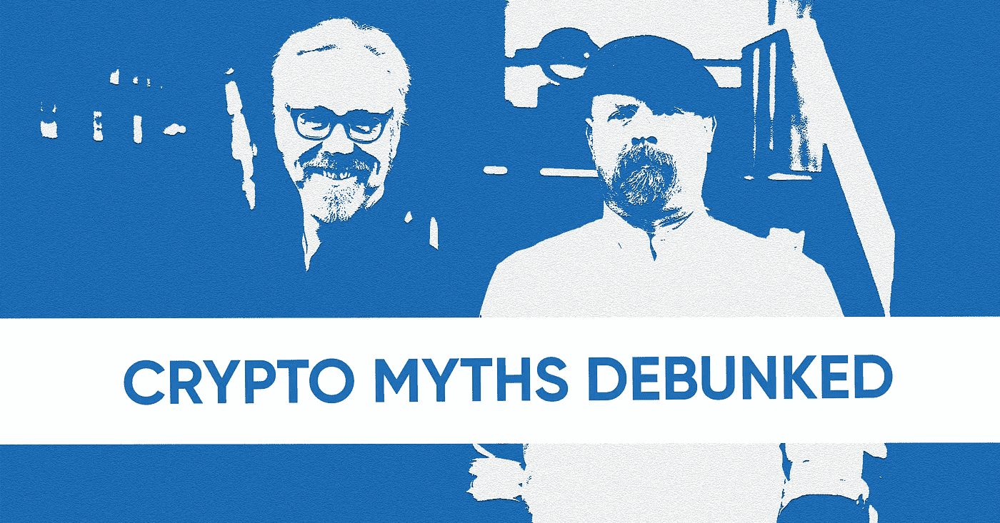
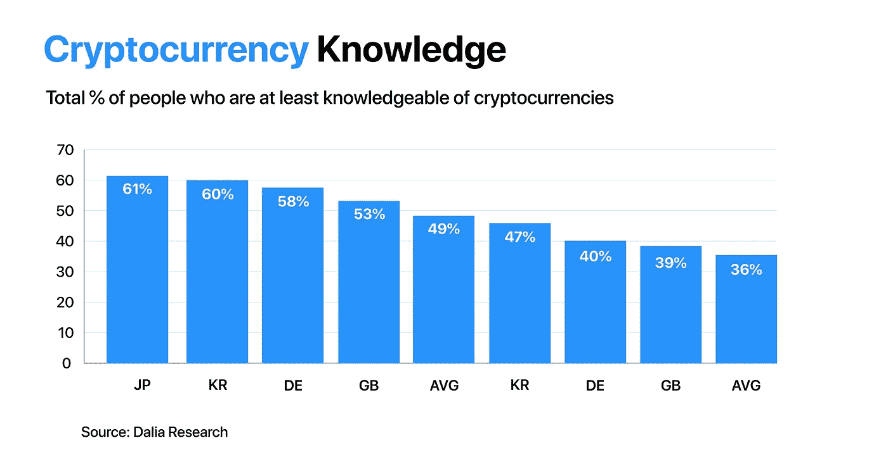

# 关于比特币的神话和误解(最终)被揭穿

> 原文：<https://medium.com/hackernoon/myths-misconceptions-about-bitcoin-finally-debunked-8eb33a90be9>

## 《流言终结者》的粉丝？你会喜欢这个的…

加密货币已经在市场上存在了十年，它的引入使它们加入了法定货币的行列，成为一种可行的支付手段。然而，尽管与传统货币相比，加密技术有诸多优势，但没有多少人对此感兴趣。为什么？虽然这个问题没有单一的答案，但原因之一可能是围绕加密货币及其底层技术区块链的错误信念。

最近的一项研究表明，目前超过 60%的互联网用户熟悉加密货币。由于熟悉会滋生蔑视，大量的“熟悉”和不够的信息滋生了一些关于加密货币的误解。

出于这个原因，我们花时间揭穿了关于比特币和其他加密货币的最常见的神话和误解。准备好了吗？我们开始吧！

# 加密是法定货币的替代品

曾经有一段时间，人们认为电视会扼杀广播；美元曾被认为会取代黄金。现在，据说加密货币将取代法定货币。不要让我们误会。我们全力以赴希望这一切发生，但事实是，法定货币不会很快走向任何地方。

如今，使用加密货币支付是一种真正无缝的体验。你可以将它们存入预付费加密卡，如[加密卡](https://preorder.crypterium.com/)，或者使用即时支付服务直接提取现金到普通银行卡。

然而，世界上许多人仍然依赖传统的纸币。巴西是强烈依赖现金的一个很好的例子。就在去年，巴西央行公布的一份报告显示，该国近一半的劳动力继续以现金支付。这还不是全部。巴西支持微型和小型企业服务机构的另一项研究表明，60%的当地企业没有 POS 终端来实现卡支付。

# 比特币是匿名的

比特币通常被称为“匿名的”，因为它可以在不提供任何个人信息的情况下转移资金。但这并不完全正确。事实上，你应该认为比特币是“假名”。每笔交易都登记在区块链的一个钱包地址下。如果这个地址与你的真实身份有关联，那么你就暴露了！

此外，政府和金融实体使用复杂的工具来跟踪身份，并为非法活动提供区块链取证。

例如，Monero 和 Dash 被认为是最好的隐私硬币，因为它们为持有者提供了更高的“匿名性”。在 Monero 的情况下，交易被分成随机的金额，并混合在秘密地址之间，因此无法追踪真正的来源。

# 加密货币没有“内在价值”

全球最具影响力的投资者之一沃伦巴菲特(Warren Buffett)表示:“(比特币)具有巨大内在价值的想法，在我看来只是一个笑话。”。你猜怎么着？他是对的。

现在，你认为法定货币有“内在价值”吗？在交易和金钱的世界里，几乎没有什么是这样的。各国发行的法定货币的价值很大程度上取决于政府固定的支持。与美元或欧元不同，比特币的供应量有限，这当然是其优势之一，因为它不容易被操纵。

让我们暂时停下来，看看比特币和加密是否真的符合货币的属性:

*   **可接受性**:钱需要被大多数人接受。感谢像 Crypterium 卡这样的解决方案，你可以在世界各地使用加密货币。
*   **稀缺性**:一种货币要有价值，就应该受到限制。只有 2100 万个比特币会被开采，这意味着供应量确实有限。
*   **可互换**:你可以交易其他加密货币，以及美元、欧元、英镑等。
*   **可转移性**:区块链技术让加密货币成为最简单、最快捷、最便宜的[国际间收发货币的方式](https://crypterium.com/news/open/freelancers-cryptocurrency-payments)。
*   **持久性**:加密货币存储在分散的网络上，只要这些网络保持活跃，就能保证长寿。
*   **可分性**:可以方便地购买加密货币的零头。比如可以买 0.001 比特币。

# 加密货币是不征税的

尽管列支敦士登、荷兰和韩国等一些国家没有对加密货币征税，但西班牙等其他国家已经提醒纳税人需要向与其加密活动相关的政府 arc 缴款。

加密货币的税收因国家如何看待数字资产而异。例如，在英国、美国和澳大利亚，它被作为资本收益征税。另一方面，在德国，税收取决于你是买还是卖。

# 加密货币是非法的

早在 20 世纪 70 年代，麦德林卡特尔——历史上最大的有组织毒品卡特尔之一——每天赚取 6000 万美元的毒品利润。这是否使美元成为“非法”货币？

罪犯使用某种货币并不意味着它是非法的。的确，加密与非法交易有着密切的联系。例如，在澳大利亚进行的一项研究显示，46%的比特币交易涉及非法活动。但这并不意味着它只用于非法交易。任何其他货币也可以用于非法交易。

# 政府可以关闭加密货币

由于加密货币托管在分散的网络中，因此没有特定的人需要“拿下”或逮捕。发生这种情况的唯一途径是整个互联网基础设施被关闭。

# 比特币是区块链

好的。我们不要把所有的东西都放在一个袋子里。比特币是一种加密货币，就像任何其他加密货币一样，在区块链上运行。区块链和比特币不是一回事。区块链是一种分布式账本技术，用于许多不同的行业，而不仅仅是金融。

如果我们假设比特币是一列火车，那么，在这种情况下，区块链将是火车的铁轨。如上所述，区块链允许信息存储在一个分散的数据库中。

加密货币是区块链向开发网络的矿工提供的奖励。迄今为止，有超过 1500 种硬币可供选择，每种硬币背后都有一个区块链。也就是说，我们可以得出结论，区块链可以存在于除了密码以外的其他环境中；但是，加密不能存在于区块链之外。

# 密码市场是一个泡沫

我们明白了。当你看到一项资产在几天内贬值一半时，你首先想到的是泡沫。但是泡沫并不总是坏事。事实上，当泡沫有能力推动大众采纳时。就像 90 年代的网络泡沫一样。

一旦泡沫破裂，它有助于市场摆脱某些参与者，尤其是那些没有强大价值主张的参与者。加密市场经历了投机泡沫，但正如 Crypterium 分析师[在 12 月预测的那样，市场正在持续复苏。](https://special.crypterium.com/cryptocurrency_predictions_for_2019_what_to_expect_from_digital_assets/)

## 关于[地穴](https://medium.com/u/3c3059b00067?source=post_page-----8eb33a90be9--------------------------------)

根据毕马威和 H2Ventures 的说法，Crypterium 是最有前途的金融科技公司之一。我们正在打造一款移动应用，以满足数字资产时代的银行需求。

我们的目标很明确:有了 Crypterium，无论你用传统货币做什么，你都可以用数字资产来做。这个想法得到了 TechCrunch 联合创始人 Keith Teare 和超过 40 万注册用户的支持，而且这个数字还在与日俱增。

该团队由 Visa 中欧和东欧前总经理 Steven Parker 和来自全球金融机构的高管领导，如复兴保险、伦敦衍生品交易所、美国运通等。

加入我们的[电报新闻频道](https://t.me/crypterium_en)或其他社交媒体，保持更新！

[网站](http://crypterium.com/) ๏ [电报](https://t.me/crypterium) ๏ [脸书](https://www.facebook.com/pg/crypterium.org) ๏ [推特](https://twitter.com/crypterium)๏[Reddit](https://www.reddit.com/r/crypterium_com/)๏[YouTube](https://www.youtube.com/channel/UChl-t3ilQK9mKj0jgXCdaxA)๏[LinkedIn](https://www.linkedin.com/company/crypterium/)