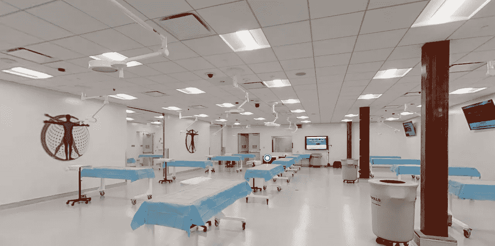
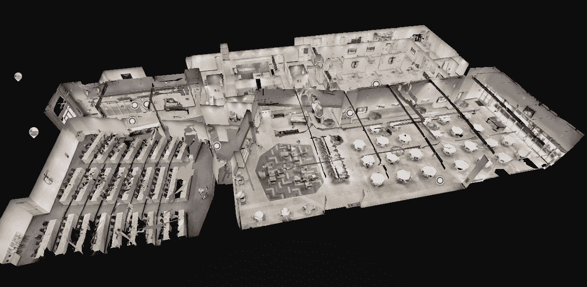
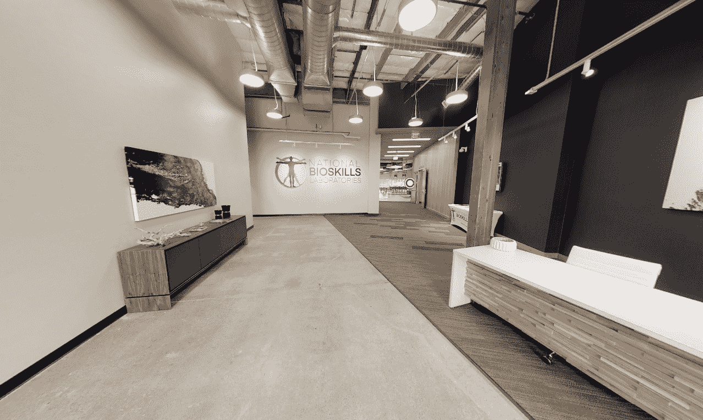
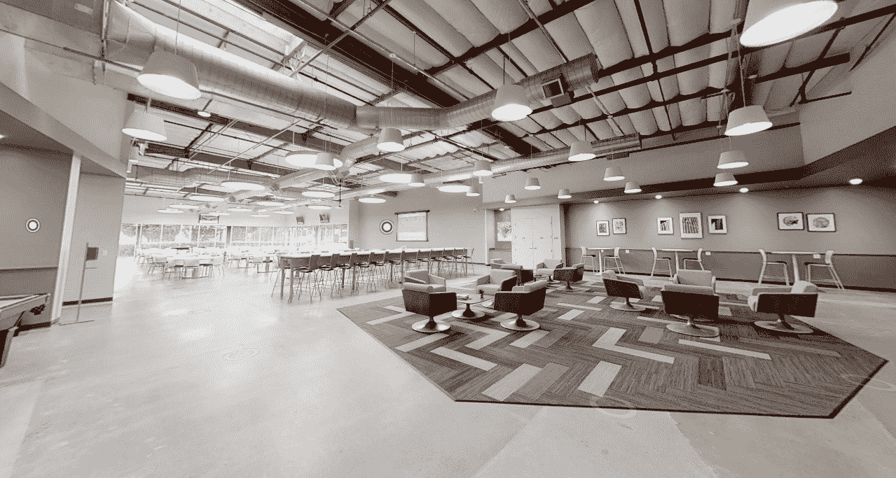
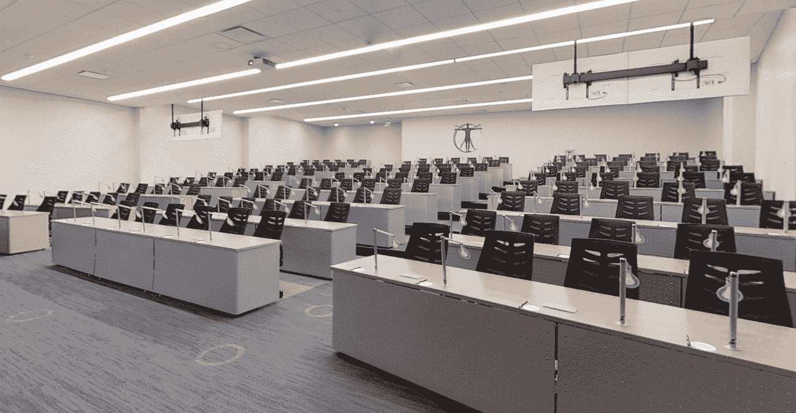
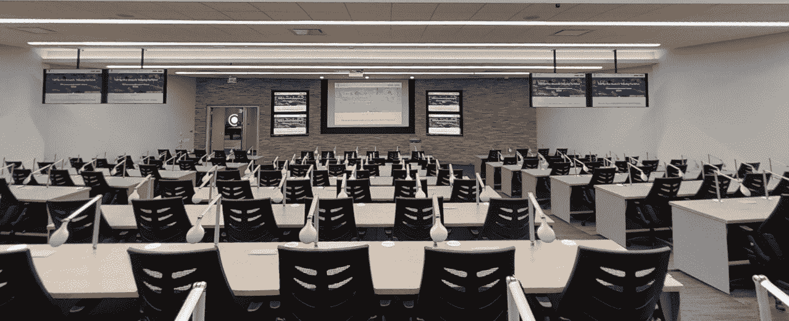

# 国家生物技术实验室从这个 100 多项专利发明人的最新 AR 技术中获得了推动

> 原文：<https://medium.com/hackernoon/national-bioskills-laboratories-gets-a-boost-from-this-100-patent-inventors-latest-ar-tech-be7ccb22c878>

今年 2 月，我们采访了增强现实技术公司 CrowdOptic 的首席执行官兼联合创始人乔恩·费舍尔(Jon Fisher)。费希尔对发明并不陌生。他在全球拥有 100 多项专利，其中 45 项已获授权，60 多项正在申请中。

现在，他的公司已经将其直播技术的唯一独家许可授予了*国家生物技能实验室* (NBL)，这是一家外科培训公司，去年 7 月在三藩市开设了第三家分店。

现在，NBL 在西海岸运营着一家工厂，建立了一个全服务生物技能培训机构的全国网络，为医疗器械公司和医生提供实践培训活动的全服务规划和执行。

其创始人 Douglas A. Hampers 博士和 Yeshvant Navalgund 博士是经过委员会认证的医生和经验丰富的点对点(P2P)教育者，在医疗设备教育领域工作了 20 多年，并掌握了设备和技术的实际知识。

这个新实验室，以及它在得克萨斯州达拉斯和宾夕法尼亚州匹兹堡的其他地点，通过使用实时双向 [CrowdOptic 直播技术](https://www.crowdoptic.com/)，为医生提供动手操作、手术培训和医学教育。

Hackernoon 先睹为快，参观了这座价值数百万美元的训练设施。在该设施中，您会发现遍布培训实验室和礼堂的嵌入式摄像机和 20 个 LED 屏幕，以及超过 25，000 平方英尺的灵活学习空间。

到目前为止，互联网很喜欢它。

# 在幕后

Source: [https://my.matterport.com/show/?m=iyi7x9xzQg6](https://my.matterport.com/show/?m=iyi7x9xzQg6)

2014 年 6 月，CrowdOptic 宣布与加州大学旧金山分校合作，由 UCSF 大学整形外科学院提供流式手术。事实上，该公司是谷歌眼镜的创始认证合作伙伴，索尼、HPE 和 Avaya 也采用了这项技术。

这包括在其救护车上安装*谷歌眼镜*技术，谷歌眼镜将使用 CrowdOptic 的软件从救护车向目的地医院发送实时视频。

不久之后，该公司宣布与斯坦福大学医学院合作，该软件也将用于向佩戴谷歌眼镜的医生和医学院学生直播手术。

将该公司的最新投资投入到其设施中，它有机会为医疗专业人员和学生改善专业学习环境，或者至少让他们惊叹不已

**入口**

## 礼堂入口

走进去，我们走近高科技的礼堂和报告厅，配备了双向数字直播技术和高清数字屏幕。这个大厅大约能容纳 150 人。

Auditorium / Dining Hall

**讲堂**

*Lecture hall seats 150 people*

## 大众智能直播

截至 2019 年 5 月 22 日，大约有 99520 行代码与国家生物技能实验室实施的 *CrowdOptic* 技术有关——一种通过中央服务器支持“n”个位置的混合架构。

那么这项技术由什么组成呢？

18–65 英寸触摸屏显示器(由 NUCs 提供支持),配有超过 24 个平板镜面显示器

*   1–85 英寸触摸屏显示器
*   4–4K PTZ IP 摄像机
*   8–1080 p PTZ IP 摄像机
*   46 — CrowdOptic 眼睛摄像头(Wi-Fi 和硬连线)
*   6 — CrowdOptic Encoder 盒子(正在开发中)
*   在三个位置与 AV 系统完全集成

**CrowdOptic Intersect**—通过人工智能和接合几何算法实现智能摄像机控制

**crowd optic Halo**—环绕瞄准摄像机阵列

医学的未来肯定在这里，为大学提供必要的工具和技术来了解和执行必要的程序。