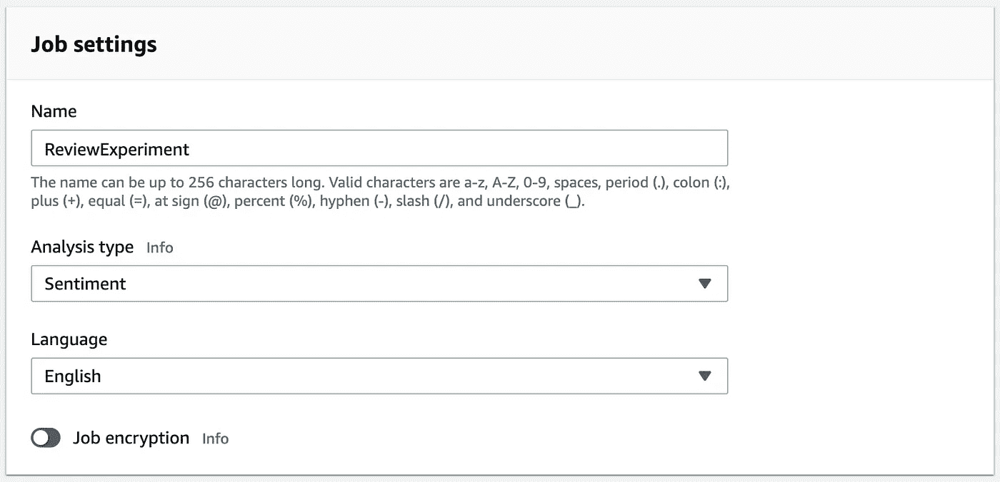
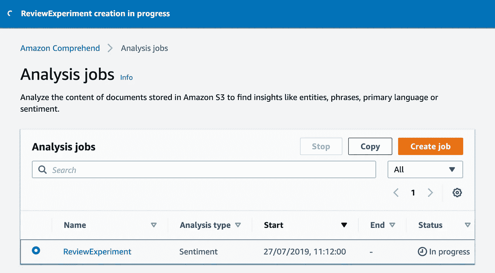

# 顾客评论的自然语言处理

> 原文：<https://medium.com/hackernoon/natural-language-processing-of-customer-reviews-49dff6fd9e57>

## 利用机器学习理解非结构化评论数据


Photo by [Amador Loureiro](https://unsplash.com/@amadorloureiroblanco?utm_source=medium&utm_medium=referral) on [Unsplash](https://unsplash.com?utm_source=medium&utm_medium=referral)

最近，我偶然发现哈佛商业评论网站上发表了一篇关于五星评级系统问题的文章。这篇文章指出了一些紧迫的问题，但最重要的是让我对给定评级和评论本身的内容之间的相关性感到好奇。

我决定做一个实验，看看**的评论文本情感**如何映射到给定的的**点，以及在这些情况下是否有任何与我们通常预期的偏差。**

# 工具

为了能够判断一篇评论文章的主要观点，我决定使用**自然语言处理**。本质上，自然语言处理(NLP)是用于帮助计算机理解人类自然语言的技术。

我们的非结构化数据蕴藏着巨大的潜力。客户电子邮件、支持票、产品评论、社交媒体…所有这些都可以提供对客户情绪的洞察，从而为我们的业务带来好处。事实证明，**机器学习**特别擅长在大量文本中准确识别感兴趣的特定项目。

我们有许多不良贷款框架。可能最突出的是谷歌的 Tensorflow。TensorFlow 的 NLP 最知名的应用是谷歌翻译。

为了让事情变得简单快捷，我选择了 AWS 提供的托管服务:[AWS understand](https://aws.amazon.com/comprehend/)。

> 亚马逊理解是一种自然语言处理(NLP)服务，它使用机器学习来寻找文本中的见解和关系。不需要机器学习经验。

# 查找数据

为了进行实验，我们需要访问评论数据。幸运的是，我发现 TrustRuby Reviews 提供免费的 API 访问。

通过几个简单 GET 请求，我就可以获得数百个不同企业的评论以及它们的分数(为了简洁，我不打算展示如何做，但应该非常简单)。

我已经将 review JSON 数据转换成一个简单的 CSV 文件。

Analysis input data (excerpt)

接下来，我已经上传 CSV 文件到先前创建的 S3 桶。

# 设置

通过控制台设置 AWS 理解非常简单。我们必须选择名称、分析类型和文本语言。



Specifying the name and type of analysis

# 输入－输出

下一部分只是定义数据源和输出位置。


Setting up input and output locations



Sentiment analysis job creation in progress

# 结果出来了

情绪分析工作执行得相对较快，结果存储在输出目录内的 S3 存储桶中。

Sentiment analysis results (excerpt)

正如你从结果摘录中看到的，AWS 理解服务给每一行都贴上了主导情感的标签。

在将分析结果与我们的原始评论内容合并以比较情绪和给出的分数之前，我们需要建立预期。假设一个和两个点应该映射到**负**，三个映射到**中性或混合**，四个和五个映射到**正**情绪。

所以事不宜迟，我向你们展示结果！

我对一些边缘情况感到有点惊讶，比如 3.23%给了 **5 颗星评价**的人留下了被 AWS 服务视为**负面**的评价。

我还发现有趣的是**三点评论**大多带有被识别为**负面**的文字。

同样值得注意的是，在这个分析中，我们使用了占主导地位的情感分类，尽管其中一些还处于边缘。AWS 领悟服务为每一种情绪给出信心分数。

```
## request{
    "Text": "Cool online shop for super food 'shrooms. Really like the design and how easy it is to navigate. Just ordered lion's mane mushrooms elixir",
    "LanguageCode": "en"
}## response{
    "Sentiment": {
        "Sentiment": "POSITIVE",
        "SentimentScore": {
            "Positive": 0.9549707174301147,
            "Negative": 0.00012400609557516873,
            "Neutral": 0.0373263917863369,
            "Mixed": 0.0075788735412061214
        }
    }
}
```

不考虑边缘情况，非常清楚的是负面情绪评论之后会有一两个开始评级。

就是这样！

谢谢你留下来。欢迎在评论中分享你对 NLP 和顾客评论的看法。干杯！