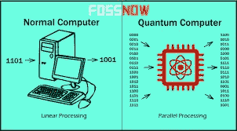

# 内文定律:量子计算机的范式转变

> 原文：<https://medium.com/hackernoon/nevens-law-paradigm-shift-in-quantum-computers-e6c429ccd1fc>

## 旧的淘汰了，新的开始了，就像马蒂·小飞侠和他的悬浮滑板一样。世界在变化，而且变化很快。量子计算机，新的悬浮滑板或赛格威，淘汰了滑板，经典计算机，一项新的法律正在告诉我们这一切

> 如果你能不晕头转向地理解量子力学，那你就没有理解它。
> 
> ― **尼尔斯·玻尔**

# 贝多芬的替代品

世界在量子信息系统方面取得的进步是前所未有的。摩尔定律是由美国工程师、商人和英特尔公司的联合创始人戈登·摩尔提出的理论，该理论指出，高密度集成电路中的晶体管数量大约每两年翻一番。

那是过去，但现在是现在。

> 过去点，贝多芬。

去年年底，在谷歌工作的计算机科学家对该公司最先进的量子处理器进行了一些计算。奇怪的是，他们设法在普通笔记本电脑上实现了相同的计算。大约一个月后，2019 年初，他们在一个更好的量子芯片上进行了前述测试。不出所料，他们被迫在一台更先进、更强大的计算机上进行测试，以获得与之前相同的结果。几周后，他们再次进行了实验，但无法在手边任何形式的计算机上模拟结果，即使是最强大的计算机。为了彻底完成测试，他们不得不使用谷歌的服务器来完成。

> 称之为孤注一掷。

# 进入哈特穆特内文

科技像海啸一样向前发展，我们最好做好准备。近来量子建筑系统的指数增长令许多人感到惊讶。

Hartmut Neven. Source: cio.com

量子人工智能实验室主任哈特穆特·内文(Hartmut Neven)是这一切的始作俑者，他的努力甚至让一条新定律以他的名字命名:*内文定律*，这基本上是对量子计算机如何快速超越其经典兄弟的推测。

这是摩尔定律 2.0，是技术进步的巨大进步，只会随着量子芯片变得更好、更快而增长。

注意这个空间。

内文说:

> “看起来什么也没发生，什么也没发生，然后哎呀，突然你就在一个不同的世界里了。这就是我们正在经历的。”

与摩尔定律以年为单位计算指数增长不同，每两年一次，事实上，内文定律的增长速度令人费解。性能的提高是[‘双指数](https://interestingengineering.com/googles-quantum-processor-may-achieve-quantum-supremacy-in-months)’，意味着它们以 2 的幂增加。量子处理能力的升级起初看起来很轻微，在性能上并非察觉不到，但后来的升级在计算速度上明显可见，从而增强了量子执行。

**量子计算机相对于经典模型的能力可以归结为两个因素:第一个因素是，一个量子位的计算能力是普通位的四倍，普通位是基于二进制或以 2 为基数的数字系统的二进制信息，因为量子模型上的电路有四个量子位，所以在经典计算机上需要 16 个“普通位”才能达到相同的计算结果，或者类似的效果。**

其次，量子计算机的处理能力正在以闪电般的速度提高。随着时间的推移，处理器中的芯片正以指数级的速度变得越来越好，超过了经典计算机时代的处理器。这见证了量子计算机性能和错误率的巨大升级，错误率是早期量子信息系统模型中的一个大问题。减少量子误差对维持量子位叠加和纠缠态非常重要，是推动技术发展、将建筑系统从大学和研究实验室带入真正的实用应用领域的关键技术难题，这些应用可以改善我们的生活，帮助人类。

# 经典计算机万岁！

然而，有相当多的人认为经典计算机模型仍然有其用途，并不像那些支持量子计算机的计算机科学家和物理学家所说的那样多余。支持者认为，根据摩尔定律的冗余性，经典计算机芯片和更连贯、更有效的算法也在改进，这只会延长经典计算机的寿命。

研究人员和开发人员正在努力实现的目标是“量子优势”。这个术语，这个技术位置或思想状态，如果你愿意，迄今为止还没有被我们发现。

Source: the statedtruth.com

要实现这一目标是有问题的，但如果有人要实现这一目标，那么 IBM、谷歌或任何其他有兴趣向前迈进的公司，应该以正确的态度和正确的人员，更接近这一目标。

很明显，随着芯片变得更好，量子计算机将变得越来越快，毫无疑问，将能够解决即使是地球上最强大的超级计算机也没有机会解决的问题。这仅仅是可用量子位的数量的问题，以及在量子架构系统的范围内建立的相对于操作的操作流动性的错误率降低。

那么，至少在目前，让我们鼓掌祝贺哈特穆特·内文先生的成就:并不是每天都有一个城镇、一条街道、甚至一部法律像内文的情况那样以你的名字命名。沉浸在这样的奉承中可能会冲昏一些人的头脑，但我要对这位躺在荣誉上的德国学者打个问号。

我敢肯定，这对他来说没什么，发现量子计算机难题的实际解决方案更是他追求科学真理的动力，而不是任何基本的荣誉或傲慢的成就。