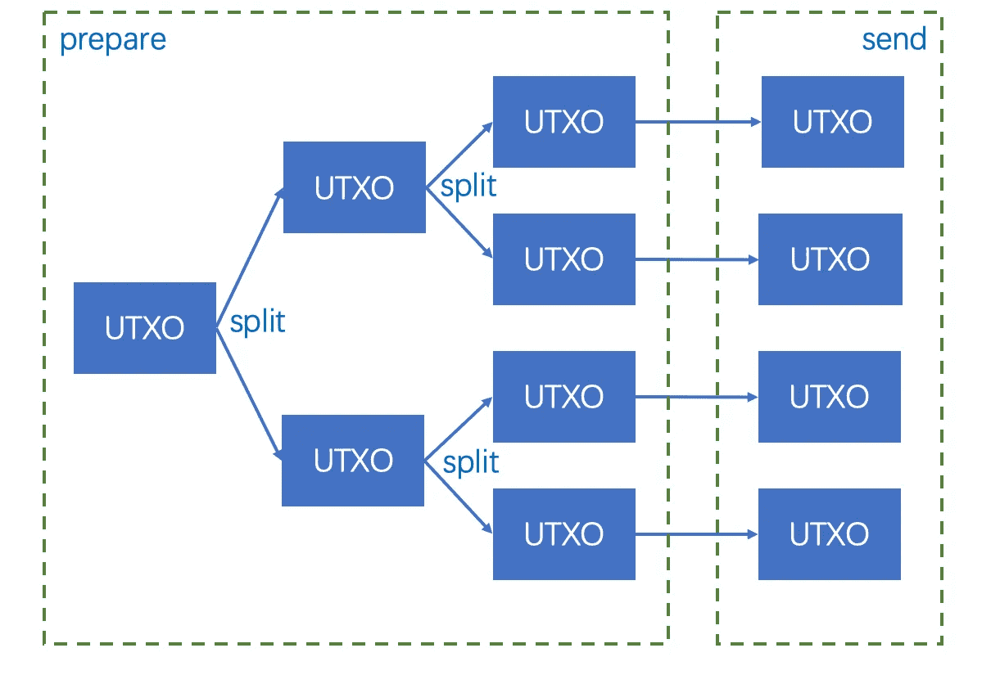
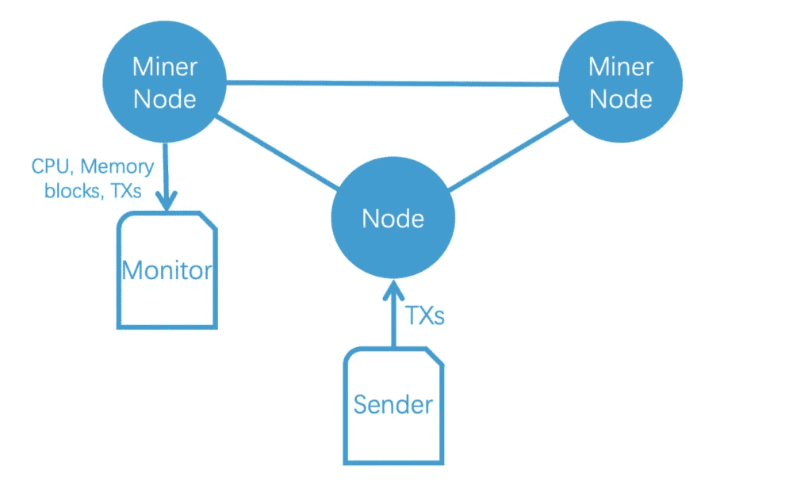
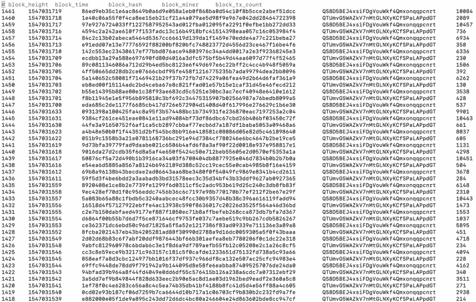
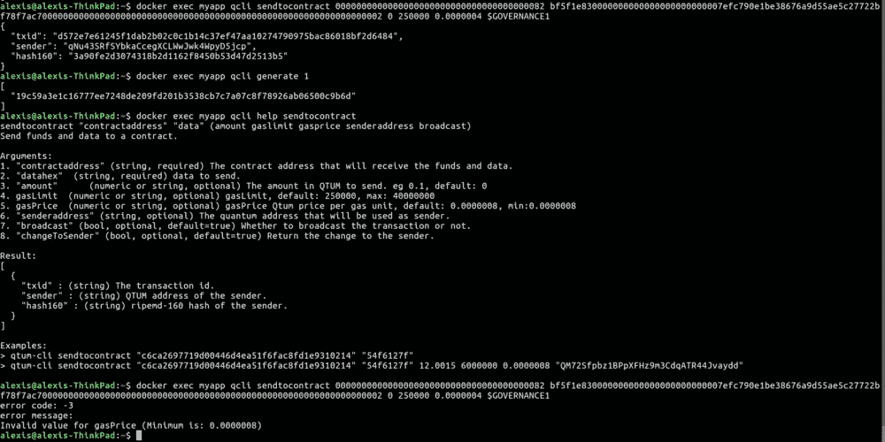

# 新基准支持“10，000 TPS”区块链的主张

> 原文：<https://medium.com/hackernoon/new-benchmark-supports-claims-of-10-000-tps-blockchain-2bc8db0b98b4>

Graphical illustration the two stages which comprise the Qtum benchmarking tool… #1: Prepare: Generate enough UTXOs for benchmarking — #2: Send: Send prepared UTXOs to the node - Sourced via [Github](https://github.com/qtumproject)

在争夺加密媒体和社区的关注时，项目吹嘘与量化指标相关的竞争性成就以制造头条新闻是非常常见的。

每秒交易量(TPS)只是其中之一，它处于一场正在进行的技术军备竞赛的中心，这场竞赛的目的是为区块链交易速度创造最快的引擎。

虽然竞争对手提出了许多虚假的或令人难以置信的说法，但 QtumX 区块链实现的每秒交易量(如果基准是可信的)使其远远领先于“顶级”连锁店。

(郑重声明:据估计，比特币只能处理 7 个 TPS，而 Ripple 目前可以处理大约 1000 个 TPS。)

# Qtum 速度的需求

“Three nodes are launched to form a blockchain network. Two of them are miners for generating new blocks. The other is to accept transactions from RPC and relay them to miners.” — Sourced via [QtumX Medium](https://blog.qtum.org/qtumx-reaches-10-000-tps-in-benchmark-tests-cee6452166fd)

最近一家在“TPS 竞赛”中推销其股份的公司是一家名为 [QtumX](https://github.com/qtumproject/qtum-enterprise) 的企业级区块链，该公司在[媒体发布的](https://blog.qtum.org/qtumx-reaches-10-000-tps-in-benchmark-tests-cee6452166fd)和昨天发布的新闻稿中提供了大量证据，共同吹嘘该团队(同名名称为“Qtum”)如何创建了一个可以处理 10，000 TPS 的区块链。

对于 Qtum 团队来说，他们记录的 10，000 TPS 的结果代表着“QtumX 具有高性能”，其功能结果包括在发送到网络时立即确认交易，“具有低存储和网络消耗”

区块链将另外实现一种新的共识机制，即权威证明，以及一种专有的“可扩展共识算法”(缩写为“ [SCAR](https://blog.qtum.org/scar-a-new-scalable-consensus-algorithm-2ea064f4d8ee) ”)。该团队建议的主要用例是 DApps(区块链兼容分散式应用):

> "*特别是在商业场景中，它将具有巨大的优势。"*

“Generated blocks and transactions are shown as follows. You can see that there are 5 blocks containing more than 10,000 transactions: height 1461, 1459, 1445, 1439, and 1433.” — Sourced via [QtumX Medium](https://blog.qtum.org/qtumx-reaches-10-000-tps-in-benchmark-tests-cee6452166fd)

# 为什么贸易点很重要

直截了当地说:交易速度对大多数基于区块链的项目很重要，尤其是那些打算在全球/企业层面运作的项目。

“TPS 竞赛”源于低 TPS 区块链(如比特币)引发的可扩展性争论。然而，当 SegWit 和随后的[闪电网络](https://hacked.com/crypto-markets-search-for-catalysts-as-bitcoin-lightning-network-sees-a-surge-in-capacity/)部署后，它的许多问题都消失了。这让人们对[产生了疑问，TPS](https://hacked.com/filtering-through-the-nonsense-in-the-blockchain-world/) 究竟能在多大程度上体现出一个区块链必须履行其职责的潜力，无论其受众有多大且要求多高。

对于支付提供商来说，这一点对业务至关重要，因为理想的服务模式依赖于银行间和银行内交易的即时性。

电子商务也有类似的需求，而物流非常需要即时性:无论是仓库管理，还是医疗保健和化工行业重要无菌材料的储存和运输。

无论如何，在将区块链与非区块链和集中化企业巨头(如主要的全球支付处理器 Visa)进行比较时，“每秒交易量”是一个重要的指标(据报道，Visa 仍以 24，000 TPS 的速度击败所有区块链解决方案)。

# 平行线

‘Decentralized Governance Protocol’ is another unique feature. Captured from the [Qtum DGP demo video](https://www.youtube.com/watch?v=UhHzJcRkl6s).

我们联系了 Qtum 团队寻求意见，并收到了首席信息官(CIO) [Mike Palencia](https://www.linkedin.com/in/miguel-palencia-bab47413b/?lipi=urn:li:page:d_flagship3_messaging;196+/ISKTG2bYiCL1JvY9A==) 关于测试程序以及他们如何完成记录速度的以下声明:

> *“该方法旨在模拟真实的用例场景。用 QtumX 节点设置了三个节点，其中一个节点是“发送者”。*
> 
> *该节点将大量事务发送到区块链，这些事务被并行发送以优化资源。*
> 
> *在一个真实的用例场景中，您会看到一个类似的实施，因为一个或多个节点可以充当发送方，并且可以通过与移动或 web 应用程序链接的 API 来访问这些节点。*
> 
> *基准工具是开源的，可以从我们的*[*GitHub*](https://github.com/qtumproject/qtumx-benchmark-script)*下载。任何人都可以测试和比较结果。”*

QtumX 将与比特币 UTXO 结构以及以太坊 Solidity 智能合约兼容。