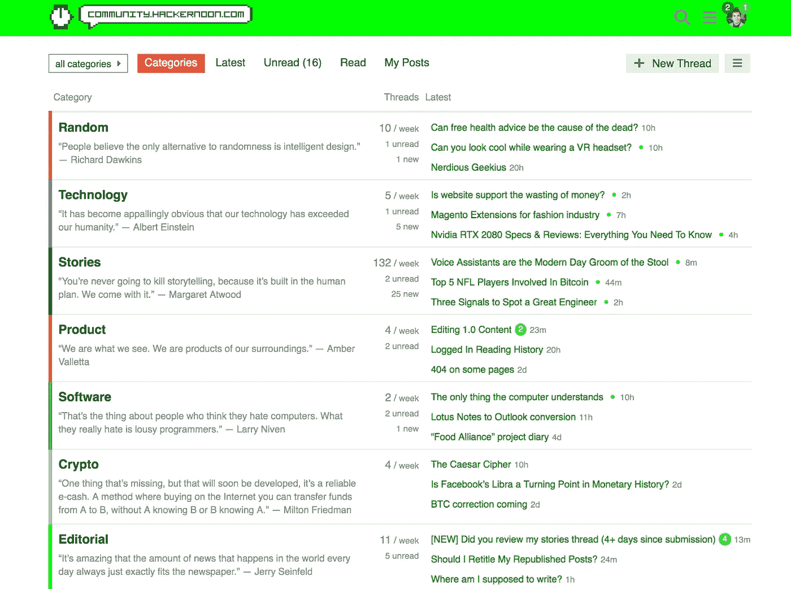

# 新社区主页🙌

> 原文：<https://medium.com/hackernoon/new-community-homepage-c4bd16c2cbca>

## [社区。HackerNoon.com:](http://Community.HackerNoon.com) 科技专业人士的清谈俱乐部

嘿黑客们——我们已经做了一些改变，使得在我们的社区论坛中访问各种 [**线程变得更加容易。**](https://community.hackernoon.com/) 主页现在显示所有类别，每个类别中的三个最新线索，以及一个引语来框定读者可能会进入的内容。 [**查看一下**](https://community.hackernoon.com/) :

# 引用来构建[社区类别](https://community.hackernoon.com/categories):

**“人们相信唯一能替代随机性的是智能设计。”—理查德·道金斯**

****“很明显，我们的科技已经超越了我们的人性。”——阿尔伯特·爱因斯坦****

****[**故事**](https://community.hackernoon.com/c/stories) “你永远不会扼杀讲故事，因为它建立在人类的计划之中。我们与它同在。”—玛格丽特·阿特伍德****

****[**产品**](https://community.hackernoon.com/c/product) “我们就是我们看到的样子。我们是周围环境的产物。”—艾姆博·瓦莱塔****

****[**软件**](https://community.hackernoon.com/c/Software-Development) “认为自己讨厌电脑的人就是这样。他们真正讨厌的是糟糕的程序员。”―拉里·尼文****

****[**Crypto**](https://community.hackernoon.com/c/Crypto) “有一样东西是缺失的，但很快就会被开发出来，那就是可靠的电子现金。一种在网上购物的方法，你可以把资金从 A 转移到 B，而 A 不知道 B，B 也不知道 A****

****[**通用**](https://community.hackernoon.com/c/general) “最简短的回答就是把事情做好。”—海明威****

****[**Code Pong**](https://community.hackernoon.com/c/code-pong) “当我在中国加入全美乒乓球队时，我就是喜欢用我的 Flexolite 乒乓球拍打乒乓球。”——《阿甘正传》****

****[**赞助商**](https://community.hackernoon.com/c/sponsors) “我相信创新，你获得创新的方式是你资助研究，你了解基本事实。”—比尔·盖茨****

****[**黑客正午 AMA**](https://community.hackernoon.com/c/ama) “没人傻谁好奇。不问问题的人一生都一无所知。”―尼尔·德格拉斯·泰森****

****[**播客**](https://community.hackernoon.com/c/podcast) “在其最糟糕的一天，播客比我们最好的电影还要好。因为他们更有想象力，没有技巧，而且更真实。”―凯宾·史密斯****

******“我们可以一起改变世界，只是一次一个随意的善举。”―罗恩·霍尔******

******回到网上！
[**大卫·斯莫克**](https://hackernoon.com/@David) 出自 [**黑客正午**](https://hackernoon.com/)******