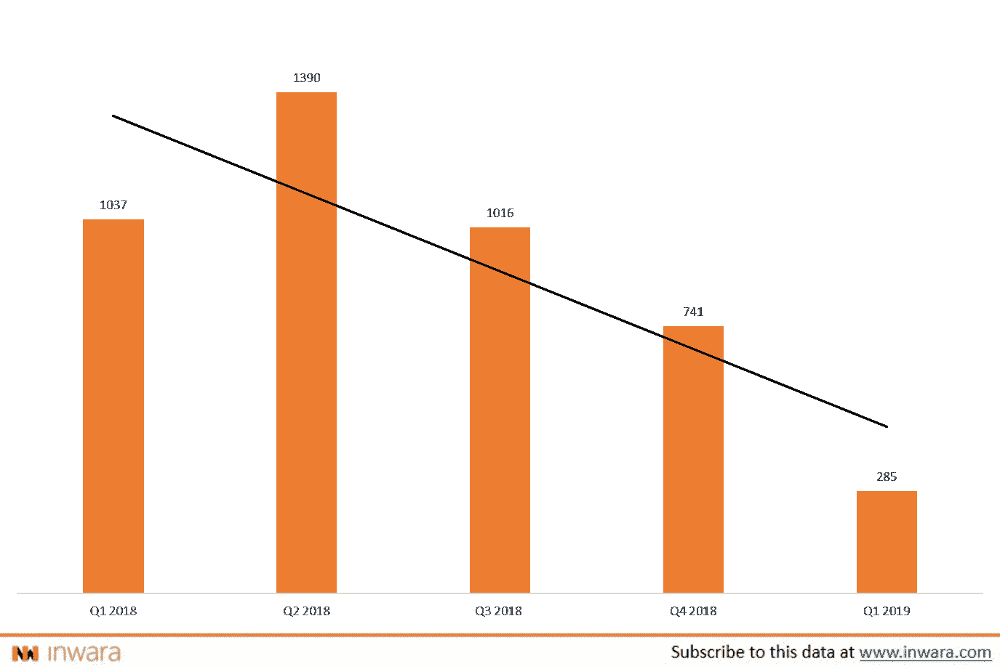
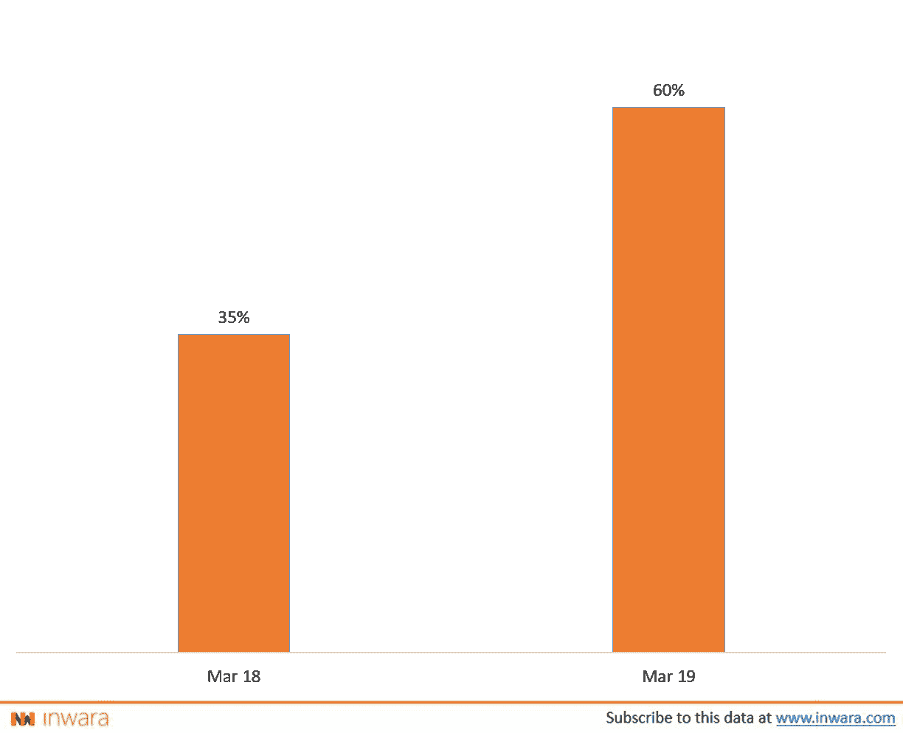

# 新的数据表明 ICOs 并不是一个注定要失败的事业…

> 原文：<https://medium.com/hackernoon/new-data-suggests-icos-just-may-not-be-a-lost-cause-3755052a2f93>

Image by [Aaron Olson](https://pixabay.com/users/AaronJOlson-4628445/?utm_source=link-attribution&utm_medium=referral&utm_campaign=image&utm_content=3126802) from [Pixabay](https://pixabay.com/?utm_source=link-attribution&utm_medium=referral&utm_campaign=image&utm_content=3126802)

ico 并不是一个注定失败的事业，相反，它甚至还有被救赎的机会。难以置信？好吧，这就是数据所显示的。但在我开始之前，让我非常清楚地说明一点。

> ICO 数量正在减少。这是有数据支持的事实。根据 InWara 的 Q1 2019 [报告](https://www.inwara.com/report/q1-2019-report)，ICO 数量同比下降超过 72%。

另一方面，根据 InWara 的[安全令牌发售报告](https://www.inwara.com/report/security-token-offerings)，sto 的数量在 2019 年 Q1 期间激增了 130%。但这并不意味着 ico 注定要失败。

[source](https://www.inwara.com/report/q1-2019-report)

**为什么 ico 不会失败**

诚然，自 2018 年 Q2 奥运会以来，ICO 的数量一直在下降，但这并不意味着 ICO 是一个失败的事业，也不意味着 ICO 筹款方法将很快消失。那么什么是更好的统计数据呢？

> “在一段时间内推出的所有 ico 中，成功筹集到资金的占多大比例？”

这可能令人惊讶，但不是每个 ICO 项目都筹集资金，事实上通常大多数 ICO 不筹集资金。

**募集资金的 ICO 百分比**

[source](https://www.inwara.com/report/monthly-report-april-2019)

> 回到 2018 年 3 月，**只有 35%的 ico**成功筹集到资金，尽管不是他们寻求的全部金额。但在 2019 年 3 月，这一数字跃升**至 60%左右。**增长了 71%。从大多数 ico 没有筹集资金到大多数 ico 筹集了一些资金。进展一清二楚。

除此之外，在 Q1 2019 期间，来自全球各地的 ICO 项目筹集了高达 7.9 亿美元的资金([来源](https://www.inwara.com/report/q1-2019-report))。尽管他们的数字在下降。

因此，ICO 的数量正在减少，但幸存下来的已经设法筹集资金。那么，为什么会出现这种情况呢？

一个可能的原因是，监管监督的加强和投资者对 ICO 项目的冷淡热情已经将欺诈性项目从市场中剔除。让更有能力、更认真的项目走上舞台。这对投资者有利，因为参与 ICO 的风险大大降低。