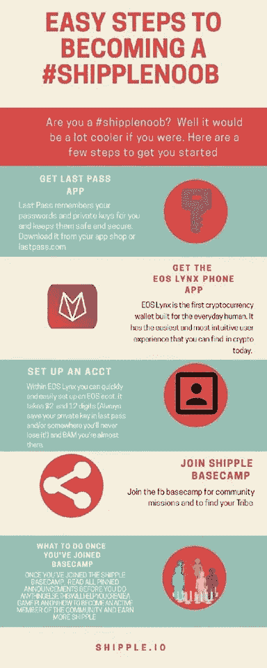
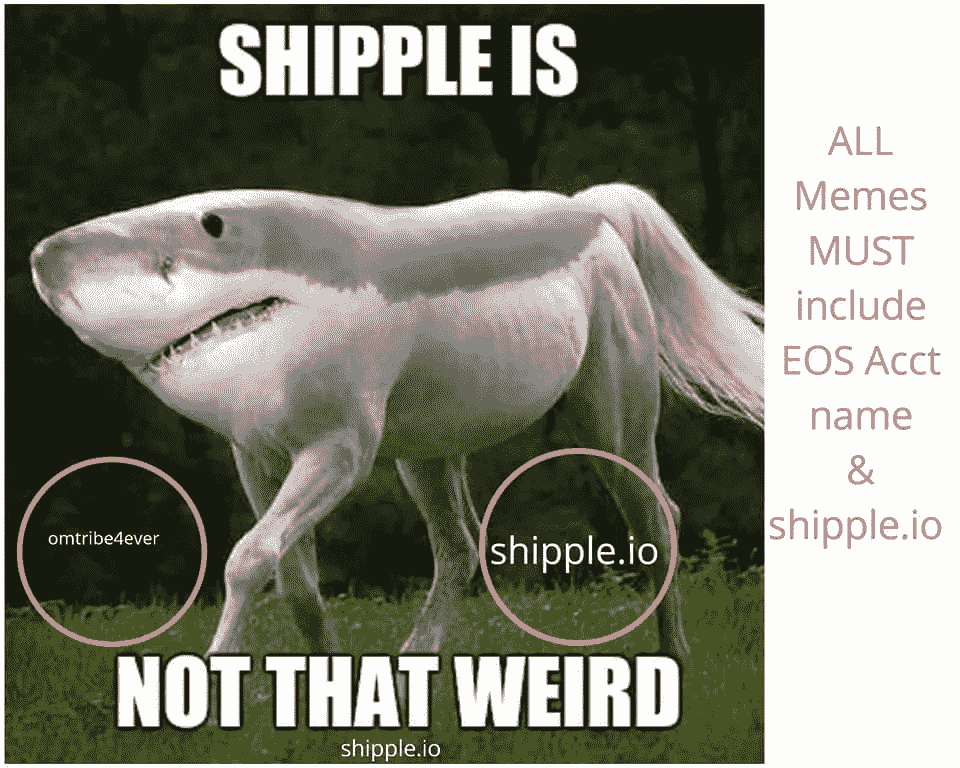

# 通向 EOS 的新门户药物:Meme 社区 Shipple

> 原文：<https://medium.com/hackernoon/new-gateway-drug-to-eos-meme-community-shipple-6341a267686a>

cover image by bullshipples

## 对于普通人来说，迷因比任何白皮书都要强大得多，在未来，最广泛采用的技术可能不是最好的技术。它很可能是普通人最容易使用的技术。历史一次又一次地向我们展示了这一教训。

一种新的治疗 EOS 的入门药物最近出现了，并且发展非常迅速。它叫做[shippel](/@coreycottrell/what-is-shipple-4aa3bc8f76f7)。在短短几周内，[七宝大本营脸书页面](https://www.facebook.com/groups/440993556684878)从 0 增加到 1000。它最初是作为一个玩笑令牌推出的，或 joken，取笑 Ripple，但它很快演变成比这多得多的东西。
shippel 社区主要存在于脸书，它的社区开发了一个基于 EOS 的 meme coin，叫做 SHIL。

目前你不能在任何交易所买卖 SHIL，但似乎有一些场外交易正在进行。绝大多数人通过制作迷因、在脸书上分享东西、制作荒谬的视频和完成 Shil 任务来获得 SHIL。我和 shippel 的创始人 Corey C .谈到让 SHIL 上市的计划，他说，“在 Shipple Basecamp 达到 10，000 名会员之前，我们甚至不会考虑让 SHIL 上市。”

看看他们是如何帮助新手快速进入 EOS 的:

这给了他们如何制作一个 Shipple meme 的明确方向:

## 关于这个社区最奇怪的事情是，大多数成员都是完全的加密新手，从来没有发送或拥有任何比特币或任何其他加密。

这是一个奇怪的现象，因为任何熟悉加密领域的人都知道，noobs 通常不会占成员的大多数。另一件奇怪的事情是，大多数成员都在脸书，因为那里是七宝大本营的所在地。

我联系了 Shipple 社区中一些从未接触过比特币或任何其他加密货币的人，以了解 EOS 采用的现实，并了解他们的经历以及他们为什么决定进入加密领域，特别是 EOS。这里不是给出我对此的看法，而是一些未经编辑的回答。有两个人接受了采访，他们被称为 A 和 b。
我从这两位成员身上学到的最有启发性的东西是:

“社区是赋予一件事物(任何事物)价值的东西。”

问题 1:$ SHIL 是你发送的第一个密码吗？

答:是的！大约在 Shipple 推出前三周，Corey 教我如何建立一个 EOS 帐户，并赠送了我一些 MOM 和一些其他免费令牌(我不懂这些东西)，并为我做的一些音频工作支付 EOS。然后，当 SHipple 发布的时候，我已经知道了如何导航和分享它。

乙:SHIL 是我交换的第一个密码。除了在新闻中听说过比特币，我对密码、交易所以及它们的运作方式一无所知。Corey Cottrell 通过 SHipple Basecamp 向我介绍了加密技术。

**问题二:你第一次用什么钱包？**

答:唯一的钱包！我的 EOS Lynx 是我的第一个钱包。

b:我在 Basecamp 上看到的第一个帖子是关于如何通过学习加密货币、区块链、交易所等教程在 EOS 中赚取 10 美元。所以比特币基地是我注册的第一个钱包。然后 Basecamp 提供了如何申请 EOS Lynx 钱包的说明——因为$SHIL 将通过 Lynx 空投和兑换。

**问题 3:创建你的 EOS 账户有多容易？**

我需要一点帮助。对我来说，问题是所有的账户命名和密码管理，以及记住我用什么应用程序/网站做什么。现在，我用的都是 EOS Lynx、BOID、Scatter，当然还有 SHIPPLE BASECAMP。

申请 EOS Lynx 钱包相当简单。我知道需要遵循一些非常具体的步骤——我担心会出错——但在大多数情况下，这并不太难。驾照照片很有趣；起初我想“哦，哇，这很严重，现在”他们“有我所有的个人信息”。令人困惑的部分是恢复密码和过程；除了您的常规登录信息。这让我有点紧张。但是我挺过来了。

**问题 4:创建 EOS 账户最困难的是什么？**

答:如果没有一个值得信任的朋友的指导，它会担心被骗或被黑。老实说，互联网生活的这个领域让我想起了文件共享的早期，那时很容易被黑客攻击和伤害。但科里让我们参与进来、与我们会面、向我们保证风险和安全的方式帮了大忙。

b:由于缺乏更好的术语，SHipple 就像是加密的“入门药物”,它为我提供了我需要的关于加密基础知识的信息；在一个轻松、开放和鼓励的环境中。它就像是“傻瓜的密码”,简单却没有“傻瓜”的部分。没有什么问题是太小的，我有一个论坛，在那里我可以问这些问题，而不会被认为是不合格或愚蠢的。我们很多人都不是新手，我们一起了解了交易所，如何创建交易(互相发送 SHIL 美元)，并了解了交易所的其他机会。

**问题 EOS 最让你困惑的是什么？**

答:我以为唯一有实际现金价值的加密货币是比特币！我花了一分钟的时间“弄清楚”EOS 到底是什么…我还在学习它。我喜欢类比，也在努力给比特币/EOS 找类比。我得出的结论是:EOS 之于比特币，就像 Netscape Navigator & Email 之于 Microsoft Explorer & Exchange 一样:更加开放，更加面向用户，并且开放用于许多事情。现在，我看到了应用程序、邮件、游戏……一大堆东西……都是用户和创新者创造的。好东西！

b:令人困惑的部分是恢复密码和过程；除了您的常规登录信息。这让我有点紧张。但是我挺过来了。

**问题 6:shippel 在让你轻松学习加密技术的过程中扮演了什么角色？如果 shippel 没有诞生，你使用 EOS 的可能性有多大？**

答:对我来说，这是整个故事:Shipple 让我想起了《大富翁》或《生活的游戏》……在那里，你用游戏币/财产契约/保险单来学习真实世界的经济概念。它让我学会了如何导航、跟踪、估价和交易，而不用拿实际的钱(我的钱很少)冒险。我可能不会使用 EOS，或者，就此而言，做任何加密的东西。如我所说，我对试图学习如此复杂的东西的安全性持怀疑态度。

b:老实说，如果我从一开始就没有被邀请成为 SHipple Basecamp 的一员，如果我们没有 Corey 和 Dino 作为创建这个平台作为学习场所的概念和想法的驱动力，我根本不会参与 EOS。

**问题 8:关于成为一名密码爱好者的体验，你还有什么其他的想法想分享吗？**

甲:加入吧！找一群有耐心、比你懂得多的人，学习新东西！这个时候让我想起了早期的互联网时代。我开车经过我的城镇，看到一个公园长椅上有一个 www.whatever.com 的地址，我突然想到:这是下一个大事件。我开始明白加密有改变世界的潜力。最近的创新，如南亚的小额贷款，以及 Twitter 成为绿色之春抗议者向世界传递信息的场所，告诉我“旧”经济和国家制度下的土地正在发生变化。我也确定会很乱，会有问题。我真的很兴奋你对 Shipple 和我们的想法感兴趣:社区是赋予事物(任何东西)价值的东西。

b:因为科里和迪诺，现在还有格雷格所建造的；正在建立——可能性是无限的。我们的感觉是，我们正在创建一个平台，在这个平台上，志同道合的个人可以作为一个社区聚集在一起，使用 crypto 和 exchange 作为一种手段，让世界变得更美好；通过分享知识，促进慈善，开发有目的的想法来推动事情的发展。无论是环境、社会还是经济。这是一次令人难以置信的经历，我期待着与它一起成长，并成为它的贡献者……最后，SHipple 让我对 crypto 感到兴奋；消除了它的大部分神秘性，并扩展了我自己的想法，我们可以用它做什么。

非常感谢 Shipple 社区和这份问卷的回复者。如果你是一个 EOS OG(原始黑帮)，这里面有很多教训。让人觉得舒服，给他们玩钱，超级重要。根据我的观察和研究，大多数人仍然害怕加密，尤其是如果他们没有太多的钱可以损失的话。给玩家钱是让他们对 EOS 生态系统感到舒服的好方法。如果你有兴趣了解什么是七宝，请观看七宝创造者的视频:

或者在社交媒体上查看 Shipple:

https://www.facebook.com/groups/440993556684878 脸书的七宝大本营

七宝推特:[https://twitter.com/Shippleio](https://twitter.com/Shippleio)

七宝电报:[https://t.me/shippleio](https://t.me/shippleio)

干杯！

斯特拉