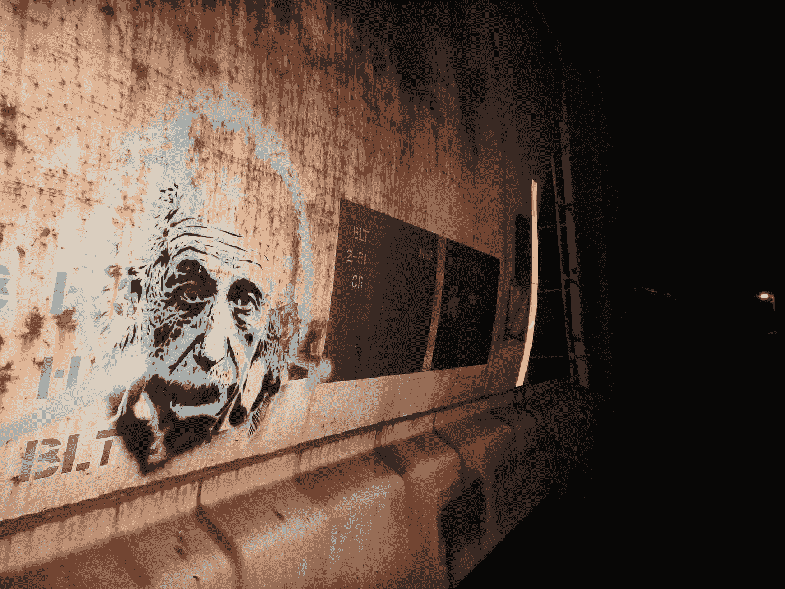
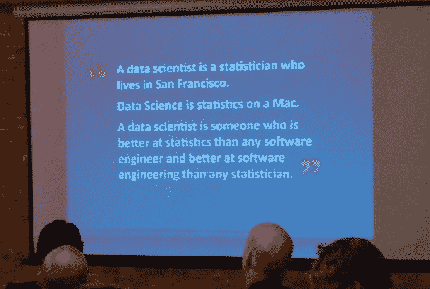
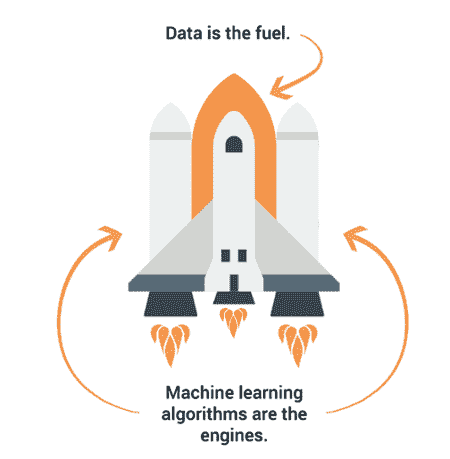
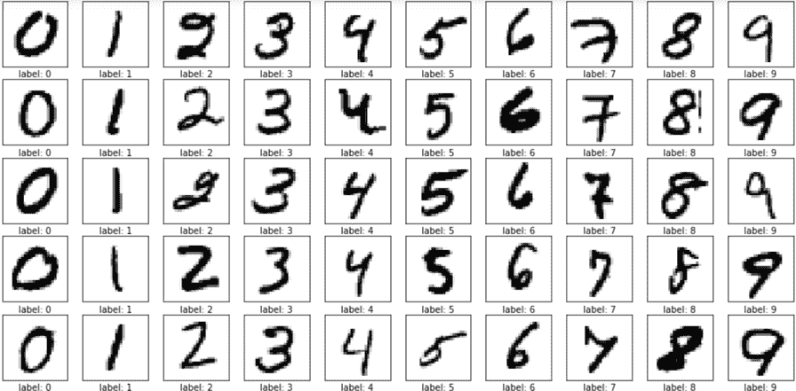
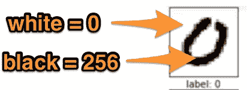
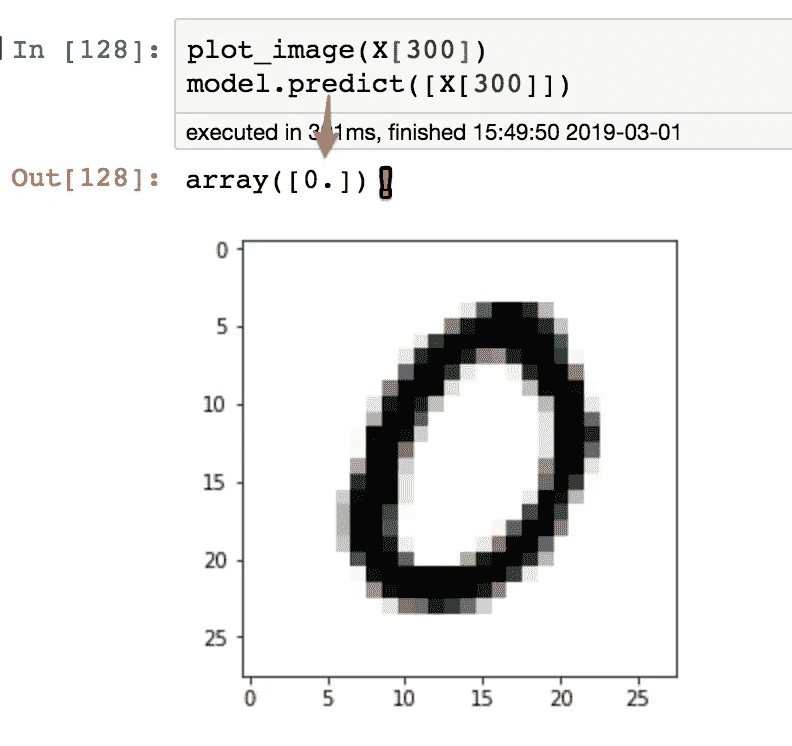
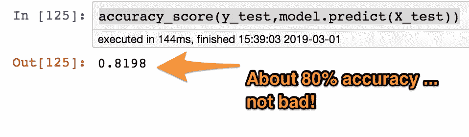
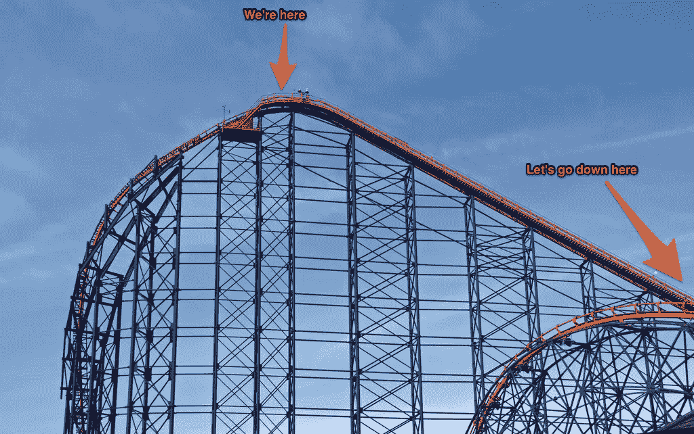

# 没有博士学位？没问题！我们其他人的机器学习

> 原文：<https://medium.com/hackernoon/no-phd-no-problem-machine-learning-for-the-rest-of-us-b3de5fbbc23c>

[Via](https://www.flickr.com/photos/v-neck/7678084524/in/photolist-cGuc2E-4nrNGi-dQH68H-mLCNQT-8bnuag-NuQV7-5yNMD1-5iF7U3-52gDu1-2twtfQ-94E8SB-aaGuL-66QFP-3eF2KX-4ytPuH-jmCeKL-jmzLJU-SGz8sF-9jqzaN-26RN5R-c2v3vJ-eErJB5-4ktjVP-CxAPx-FMpu2-zrCjW-5KgNbV-4CRBwS-9rWvhD-pdCRw-kYmGWK-9rWvMz-65ZS9y-9rWupp-8uYtUE-7qC47Q-6xRbQ-FSeCMt-F7cXTp-fJ4P7X-FiKr-bqaXb4-a1C6wG-557UzD-4hL5GK-72Qajd-pNmkAk-an2WL-u8gLr-4LAb49) [FunGi_ (Trading)](https://www.flickr.com/photos/v-neck/)

从我还是一个笨拙的中学生时，我就开始写代码了。我永远不会忘记创建我的 AOL 主页，它有一个引起痉挛的[重复背景](https://www.youtube.com/watch?v=6befMTTTTRQ)、[正在建设的 gif](https://gifcities.org/?q=construction) 和[虚假访客计数器](https://gifcities.org/?q=counter)。我恳求爸爸第二天早点把我送到学校，这样我就可以试着从图书馆的电脑上访问这个页面。

现在我是一个笨拙的成年人了，在电脑屏幕前有了几个更神奇的时刻。我最近的？一年前，我解决了我的第一个(琐碎的)机器学习问题。我被将如此人性化的东西与比特和字节联系起来的能力惊呆了。

自从那次机器学习觉醒后，我就一直埋头苦干。我不是专家，但我很乐意给你一个比我自己的更流畅的。

我希望留给你们三样东西

1.  在对话中轻松谈论机器学习。
2.  看看用代码解决一个机器学习问题是什么样子。
3.  一些精挑细选的资源可以帮助你继续前进。

# 定义机器学习生态系统就像定义爱情一样复杂

爱对不同的人来说意味着很多事情。许多聪明人已经用许多伟大的方式定义了它。围绕机器学习的生态系统也会产生同样的困惑。谢天谢地，我认为如果你只掌握了五个话题，你将处于对话式 ML 的第 90 百分位:

1.  机器学习
2.  数据科学
3.  人工智能
4.  软件 2.0
5.  应用机器学习

我先从最具体的定义说起:机器学习。

## 机器学习

> 机器学习是对通过经验自动改进的计算机算法的研究。

*卡内基梅隆大学机器学习系教授兼前系主任汤姆·m·米切尔*

输入机器学习算法的数据越多，算法的表现就越好。我们不是在修改机器学习算法来改善我们的结果:我们是在修改数据。

[机器学习并不新鲜](http://Arthur Samuel wrote the first computer learning program):1952 年，亚瑟·塞缪尔编写了第一个计算机学习程序。它玩跳棋。那么，为什么今天会听到这么多关于机器学习的内容呢？

这要追溯到数据。今天，我们能够非常便宜地存储大量数据。我们的计算机可以非常有效地处理这些数据。这使得我们的 ML 模型更好，更广泛。

## 数据科学

数据科学家是从大量信息中提取知识的专家。而且，他们可以很快做到这一点。

数据科学家会使用机器学习，但这只是他们工具集中的工具之一。

## 人工智能

和爱情一样，聪明人对人工智能(AI)的定义也不一样。

- via Andrew Ng, Co-Founder Google Brain

> 人工智能类似于建造一艘火箭船。你需要一个巨大的引擎和大量的燃料。

[*吴恩达*](https://www.wired.com/brandlab/2015/05/andrew-ng-deep-learning-mandate-humans-not-just-machines/) *，谷歌大脑联合创始人*

一些人将人工智能与机器学习紧密联系在一起。在今天的环境下，这是可以理解的:人工智能的许多创新都是由我们更强大的机器学习模型推动的。事实上，听到人们交替使用 AI 和 ML 并不罕见。

然后还有一个更宽泛的定义:

> 人工智能是让计算机以我们认为需要人类智能的方式运行的科学和工程。

卡内基梅隆大学计算机科学学院院长安德鲁·摩尔

AI?

按照这个定义，计算器在推出的时候不就是 AI 吗？我们认为将数字相加肯定需要人类的智慧。

今天，计算器不会被认为是人工智能，但自动驾驶汽车是。三十年后，无人驾驶汽车可能会像袖珍计算器一样司空见惯。

**哪个定义是正确的？**

我不知道！请注意，一些人会走得更远，而另一些人会将人工智能与今天由人工智能推动的人工智能热潮更紧密地结合起来。

## 软件 2.0

> 软件 1.0 是我们写的代码。软件 2.0 是基于评估标准(例如“正确分类该训练数据”)由优化编写的代码。

[*安德烈·卡帕西*](/@karpathy/software-2-0-a64152b37c35) *艾@特斯拉主任*

我的背景是一个软件 1.0 类型的人。艰难的工作是维护不断增长的算法。在软件 2.0 中，工作从算法(不是我们创造的)转移到我们输入的用于训练和评估的数据。

虽然我同意这两种风格的软件之间的差异，但我发现软件 2.0 的命名很不幸。软件 2.0 正被应用于新的问题——检测癌症、驾驶卡片、识别情绪——而不是取代旧的工作。

## 应用与研究机器学习

Are you baking bread or building ovens? — Photo Credit: [lazy fri13th](https://www.flickr.com/photos/fri13th/45960579555/in/photolist-2d2nZ4r-2d2nXQe-6R67p-2d2nYPt-2d2nYjF-2d2nYy8-z1RAa-hfxKo-W2uWfw-256pdyj-2ewkyaM-2eqvDTg-9kWox-dunax-54tUoo-be8KFx-MJQL-5uaAq1-2BHmQt-omqy5z-966RLu-5uaAAJ-cNLMQ3-dX3JUV-QE4gkP-ck23VS-26oarE4-QDRhZp-hfDmh-2d3iudi-21q4VaP-23NGWzi-8DEA9i-5ojWVM-b9WV1-d3tMKN-2eW4M-c1sfJ3-mBwaPJ-uHctA-73j2vf-d3tQcQ-e3bE87-262WnAt-TvyrxH-phkKLz-RV66s4-5TsY8M-QE4gcT-24PGvwa)

> 想象一下，雇一个厨师给你造一个烤箱，或者雇一个电气工程师给你烤面包……这就是我看到的那种错误……一遍又一遍。

[*Cassie Kozyrkov*](https://hackernoon.com/why-businesses-fail-at-machine-learning-fbff41c4d5db)*，谷歌首席决策情报工程师*

多年来，公司更喜欢雇佣拥有机器学习相关领域博士学位的人来解决机器学习的问题。今天，许多问题都可以通过开源的 ML 算法来解决。在 ML 中，挑战总是来自于数据。

拥有 ML 相关领域的研究生学位仍然是一个巨大的财富。然而，如果你对应用 ML 比学习模型如何工作更感兴趣，你可能不需要回到学校。

# Hello World —分类手写数字

A sample of the dataset

[分类手写数字](https://www.kaggle.com/c/digit-recognizer)是机器学习中最著名的“hello world”问题之一。有了坚实的准确性，您可以只用几行代码就解决这个问题。太神奇了。

有很多[Kaggle](https://www.kaggle.com/c/digit-recognizer/kernels)内核可以解决这个问题。我将跳过管道(导入库)，直接进入问题的实质。

## 数据集

我们得到了 70k 个手写数字及其相关标签的集合。每个数字实际上是一个由 728 个整数组成的数组。每个整数的灰度范围是从 0 到 256。数字越大，像素越暗。该阵列可以排列成宽 28 像素、高 28 像素的网格:

Each instance of our dataset is an array of 728 values. The higher the value, the darker the pixel in the image.

## 将数据集拆分为训练集和测试集

每个 ML 问题的第一步是将整个数据集分成训练集和测试集。我们*只*在训练台上训练模特。

当一个 ML 模型随着更多的数据变得更好时，我们为什么要排除数据呢？

如果我们用所有 70k 个手写数字训练我们的模型，我们仍然需要一种方法来评估它在它没有见过的数据上的准确性。想想将手写数字数字化需要多少工作(和多少时间)!通过使我们的模型不适合测试集，我们可以立即看到它在虚拟真实世界数据中的表现。

## 挑选模特

现在我们已经将数据正确分割，是时候训练一个模型了！一个好的开始模型是随机森林分类器。这是一个相当简单的模型，几乎不需要调整就能产生可靠的结果。

> 随机森林建立多个决策树，并将它们合并在一起，以获得更准确和稳定的预测。

*尼克拉斯* [*中的随机森林算法*](https://towardsdatascience.com/the-random-forest-algorithm-d457d499ffcd) *。*

## 训练随机森林分类器

我们可以用两行代码初始化和训练我们的模型:

…它成功了:

## 准确(性)

我们可以通过测量模型的准确性(模型将 a 3 正确分类为 a 3、将 a 4 正确分类为 4 的时间百分比等)来了解模型相对于测试集的表现。):

对于两行代码，我们大约有 80%的准确率。如果我写一个软件 1.0 风格的算法来做这件事，我怀疑我会达到这种精度，它会花费我更多的时间！但是，我们可以做得更好！

精明的你可能已经注意到，我只在训练集的 1000 个实例上训练了模型。还记得 ML 算法是如何随着数据增多而变得更好的吗？让我们使用所有 60，000 个训练实例，并获得新的准确度分数:

## ML 炒作过山车

现在，我们在这篇文章中达到了顶峰:两行代码，95%的准确率！

为什么这么容易？任何事 ML 通常的答案是什么？**数据！**如果我让你在没有数据集的情况下解决这个问题，你将需要大量时间来整合数据集。你可能从 5k 图像开始，然后注意到模型没有很好地分类 3s，然后增加图像并遇到新的问题，等等。**如今，训练、拟合和评估 ML 模型的结果相当容易。数据是繁琐而辛苦的。**

# ML 跳水板

如果我没有吓到你，我向你推荐几个资源来帮助你:

*   [**用 Scikit-Learn 和 TensorFlow**](http://shop.oreilly.com/product/0636920052289.do) 动手做机器学习——这是一本很好的应用 ML 的书。你几乎会立刻开始解决问题。
*   **数据科学会议** —有很多这样的会议。在柯林斯堡这里，有一个每周聚会的优秀团体。
*   [**面向所有人的机器学习**](https://vas3k.com/blog/machine_learning/?ref=hn)**——一篇出色而有趣的博文，比这篇文章更详细地描述了人工智能的前景。**
*   **[**Kaggle**](https://www.kaggle.com/) —数据科学家社区。参加比赛，查看他人的内核，查找数据集，等等。**

# **最后**

**机器学习的用例范围如此之广，以至于很难选择从哪里开始。希望以上足以帮助你专注，入门！**

**哦——这都是关于数据的。**