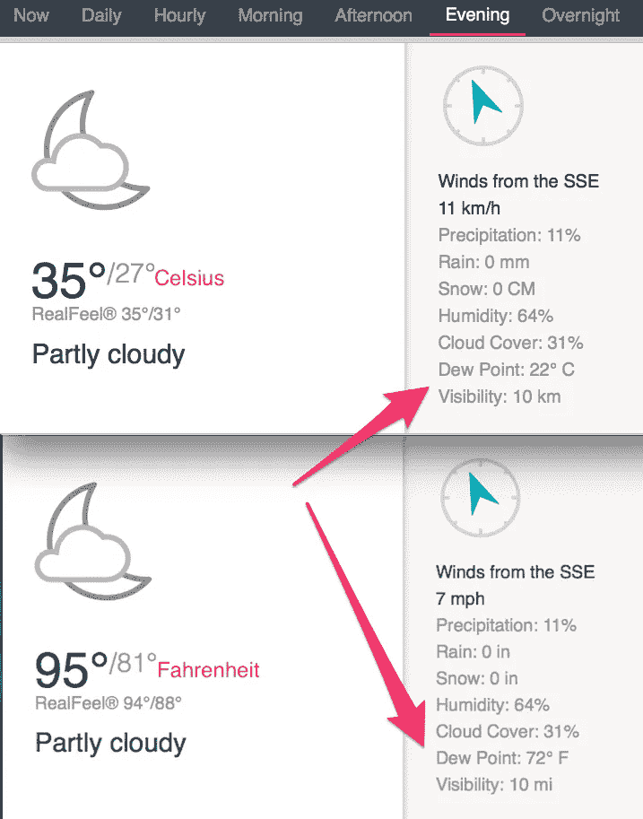

# “没问题”,我的耳机在淹死之前说

> 原文：<https://medium.com/hackernoon/no-sweat-said-my-earpods-just-before-they-drowned-5ab3719a3fa5>

## 为不同的条件制造相同的产品是一个坏主意

Touchscreens and wet fingers don’t gel (Photo by [Vanderlei Longo](https://www.pexels.com/@derlei?utm_content=attributionCopyText&utm_medium=referral&utm_source=pexels) from [Pexels](https://www.pexels.com/photo/photo-of-person-holding-wet-smartphone-1826060/?utm_content=attributionCopyText&utm_medium=referral&utm_source=pexels))

我在印度买到的大多数电子产品似乎都是为气候凉爽的国家设计的，那里的湿度不是问题。从这个角度来看，如果手机制造商专注于为不同市场定制手机，那么停滞不前的手机行业仍有增长空间。在印度，我认为价格敏感度是影响销售的一个关键因素。事实上，苹果最近已经承认，其高定价策略不会在印度取得任何进展，并开始考虑在印度组装 iPhones，以避免高额进口税。

然而，天气状况似乎没有得到太多关注。最近的 iPhones 型号可能是防水的，但触摸屏对出汗的手指来说不太好用。至于耳机等捆绑配件，它们甚至不防水，这是一个问题。

## 露点和闷热天气

在印度，你不会期待印度的夏天。现在还不是盛夏，我住在一个海拔 400 米左右的城市。但是气温已经逼近 40 摄氏度(100 华氏度)。然而，真正让我恼火的是令人窒息的湿度，它让我浑身湿透，并严重损坏了我的小玩意。

Source: [Accuweather](https://www.accuweather.com)

这是我家今晚的天气情况。关键数字是[露点](https://www.mnn.com/earth-matters/climate-weather/stories/difference-dew-point-relative-humidity-heat-index)正如链接网站所解释的，我在下面引用。22 摄氏度(72 华氏度)让人们了解到印度的天气有多闷热。

> ……一旦露点达到 55°F 到 65°F 之间， [NWS 说户外会感觉](https://www.weather.gov/arx/why_dewpoint_vs_humidity)“闷热潮湿的夜晚”任何高于 65 华氏度的温度都意味着空气中有大量的水分，大多数人会开始感到不舒服。一旦露点温度达到 70 华氏度(21 摄氏度)，事情就会变得难以忍受，如果不是完全危险的话。高露点让人不舒服，因为空气中的水分降低了我们的汗水从身体上蒸发的速度。这是我们降温的方式。所以，如果你在一个温度很高，露点很低的地方，你的身体会出汗，汗水会蒸发。在这种情况下也很容易脱水。

## 黑仔汗

通常，我在室内使用我的小工具，空调和风扇可以让我不流汗。然而，当我几年前开始慢跑时，这种情况发生了变化。像许多业余慢跑者一样，我耳机里的音乐是我坚持晨跑 5 公里的动力。虽然没有麦克风的简单耳机可以完成这项工作，但带遥控器的耳机让我可以轻松控制音量，并跳过曲目，直到我找到一首与我踩在路面上的脚步声相匹配的歌曲。当我缺乏能量时，这是我的救命稻草，因为节拍激励我保持速度并完成跑步。

iPhones 附带的 Apple Earpods 非常适合这项任务。它们允许我控制音乐和音量，甚至在慢跑时接电话。可惜苹果的 Earpods 不防水。当它的按钮在大汗淋漓的跑步中停止工作时，我发现了这一点。当我笨手笨脚地用遥控器换首歌时，声音中断了。一回到家，我就试着尽我所能清洗耳机来修复它们，但是没有用。我猜汗水一定进入了遥控器，腐蚀了里面的电路。我甚至试着把耳机埋在一袋大米里，因为这是吸收水分的有效方法。运气不好。在耐心等待了几个月后，我悲伤地把耳机扔进了垃圾箱。

在那之后，我换回了我的旧 iPod 的 EarPods，它没有遥控器。耳机也不是防水的，但它们一直在工作，可能是因为人类耳朵里没有太多的汗腺。但是我错过了我的遥控器。每当我需要换首歌或者调高/调低音量时，慢跑时从口袋里掏出手机是一件痛苦的事情。

大约在这个时候，蓝牙耳机开始变得实惠。我用亚马逊的一个便宜的中国品牌试水。它持续了大约一年才停止工作，我认为这是因为它的质量太差。事后看来，可能又是汗水。过了一会儿，我发现了一套售价低于₹2000(29 美元)的 JBL 套装，我屈服于诱惑，给自己买了一双，顺便忽略了它没有提到防汗甚至防水的事实。那是 2017 年 12 月。

在我居住的南印度，冬天和夏天的主要区别是温度和湿度略有下降。基本上冬天出汗少。然而，湿气对我的新蓝牙耳机来说似乎不是问题。我享受着再次无线上网的自由，尽管 JBL 的遥控器只能控制音量。也许是运气，也许是 2018 年的夏天没有那么潮湿，JBL 经历了一年的奔跑。

正当我开始认为流汗不再是问题时，我的无线世界崩溃了。准确地说，是向上。它发生在一周前一次大汗淋漓的跑步中途。我的 JBL 耳机的音量突然变得震耳欲聋。我想可能是某个地方不小心按下了音量键。但是我手机和耳机遥控器上的按键好像都没按。然而，按下 JBL 遥控器上的按钮，我没有任何反应。于是我掏出手机，用手机侧面的物理音量键。成功了。但就在我准备把手机放回去的时候，音量又开始升高了，我可以看到手机锁屏上的音量滑块又开始向右移动，好像被什么看不见的手拉着一样。所以我拔掉了耳朵，关掉了蓝牙，听天由命地去跑步。第二天，我回到了我的无麦克风耳机，但它很笨重，因为我习惯了无线。

然而，我差点因为出汗丢了三个耳机。有些事情必须改变。

我说“几乎”是因为有些令人惊讶的是，JBL 耳机在几天后恢复了全部功能，所有按钮都正常工作。然而，我不想再冒险带它出去慢跑了。

## 一个认错人的例子

不仅仅是耳机会出汗。以苹果的触控 ID 为例。这是一个很棒的创新，但当天气潮湿，你的手指出汗时，它也不太好用。事情不像湿手指，出汗的手指不会通过擦拭完全变干，因为汗水不断产生。这可能会导致一种令人抓狂的体验，我的手机顽固地拒绝相信我就是我。如果我幸运的话，我的手机有时会变得宽容，让我选择输入密码解锁。如果这是糟糕的一天，我将不得不继续在主屏幕按钮和屏幕按钮上戳一会儿，直到你得到密码选项，然后希望你可以用你出汗的手指打出你的密码。

事实上，我的一个悲伤的记忆是有一天我以 28 分钟的成绩打破了 5 公里跑的个人最好成绩。但我的时钟显示我超过了 28 分钟，只是因为手机拒绝识别我出汗的手指拼命地在我的跑步应用程序上的“停止”按钮上滑动。

当然，也有变通办法。总是有的。

保存湿指纹有时会奏效。但是‘有时候’并不是一个好的解决办法。

升级到 Face ID 手机是另一种选择。这可以让你通过锁屏，即使你的手指出汗。但是你仍然不得不处理令人恼火的“刷了就不刷”的问题，这种问题会发生在出汗的手指上。此外，印度的税收使得 iPhones 比世界上任何地方都贵。比如 64GB 的 iPhone XS Max 在₹106,999 的售价为 1547 美元，这还是在₹4000.最近降价之后还有一个事实是，除了这个出汗的问题，我的 iPhone 6S+很好。几个月前我换了电池，它应该还能再用几年。升级我的 iPhone 是没有意义的，这样我就可以在手指出汗的时候通过锁屏。

AirPods 是另一个选择，因为你可以通过 Siri 使用语音控制来绕过触摸功能。但是 AirPods 仍然是一个昂贵的解决方案，因为新的 AirPods 2 带有标准(有线充电)外壳，价格为₹14,900(215 美元)。

当前的需要是一个经济的解决方案。

## 运动耳机

今年早些时候，我下了一个[决心](https://hackernoon.com/can-a-gadget-addict-go-green-66675aa4a5d1)通过减少我的消费主义来避免增加世界上不断增长的电子垃圾。但这是真正的需要。所以我从小米订购了一个运动耳机，价格是₹1499 ai rpods 的十分之一(22 美元)。Mi 成为运动耳机的原因是它的 IPX4 防溅和防汗功能。

小米是一家中国公司，以生产 mi、Redmi 和 Poco 品牌的质量相对较好、物有所值的手机和配件而闻名。我短暂的个人经历支持了这一点。我已经用了我的防汗蓝牙耳机三天了，我对它印象颇深。

Mi 比 JBL 更适合慢跑，这不仅仅是 IPX4 评级。JBL 有两个组件，一个是电池，另一个是连接在耳机上的遥控器。当我慢跑时，这些东西在我的脖子上不舒服地反弹，它们从我脖子上反弹的声音与音乐冲突。消除这种干扰需要一些练习。

另一方面，Mi 的短电缆和轻型遥控装置(结合了电池和遥控器)意味着它不会像 JBL 一样在我的脖子上跳来跳去，干扰音乐。小米还通过长按音量按钮实现了曲目跳跃，这通常不会发生在更便宜的非苹果设备上。

小米还声称电池将持续 9 个小时。我对此表示怀疑，但我认为，由于 Mi 已经完成了一件简单的事情，因此将会节省大量功耗。与 JBL 和大多数其他蓝牙品牌不同，它们有一个明亮的“常亮”灯作为设备开启的指示器，Mi 有一个低功耗的“开启”灯，每十秒钟左右闪烁一次。

## 让事情变得更好

从这个意义上说，小米在防汗耳机上做的很多事情只是常识。但我喜欢他们根据慢跑者的需求微调这个小工具的思考过程。

我必须补充一点，Mi 产品确实有其缺点。小米不得不偷工减料，压低产品价格。比如我有一个 Mi 乐队，是我在 2016 年 9 月为₹2000 买的(29 美元)。我用它来记录时间，计算步数，当我的手机处于静音模式并且有人来电时，它会振动提醒我。两年半以来，它在这方面做得很好。但是几周前屏幕开始变暗，我不得不更换整个设备。相比之下，我的苹果产品似乎永远用不完，甚至我的老式 clickwheel iPod 也能正常工作。但在我看来，一个每月只需充电一次，却能提供 30 个月不间断服务的产品，29 美元是非常物有所值的。

回到蓝牙耳机，小米的线缆没有 JBL 那种扁平、无缠绕的线缆结实。JBL 的耳机里也有磁铁，可以把耳机固定在脖子上，不像小米用的小夹子。事实上，JBL 的整体建造质量感觉更好。但事实是，轻薄的 Mi 实际上更适合作为慢跑者的耳机。

从这个意义上来说，小米已经从苹果的剧本中吸取了一页，即利用现有产品，创造一个更好的版本。但小米比苹果有优势，因为它成功做到了这一点，同时保持价格低于竞争对手，而不是高于竞争对手。这解释了为什么苹果在印度手机市场只有 1%的份额，而小米是 28.9%的市场领导者。

总而言之，如果苹果和其他手机制造商应用小米的简单原则，解决不同地区客户的具体需求，我认为他们没有理由不能扭转当前全球手机销量下降的趋势。