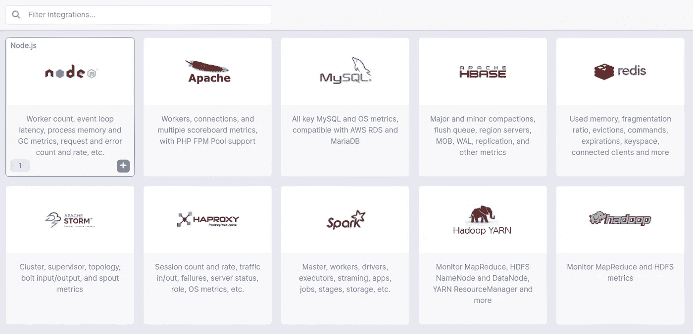
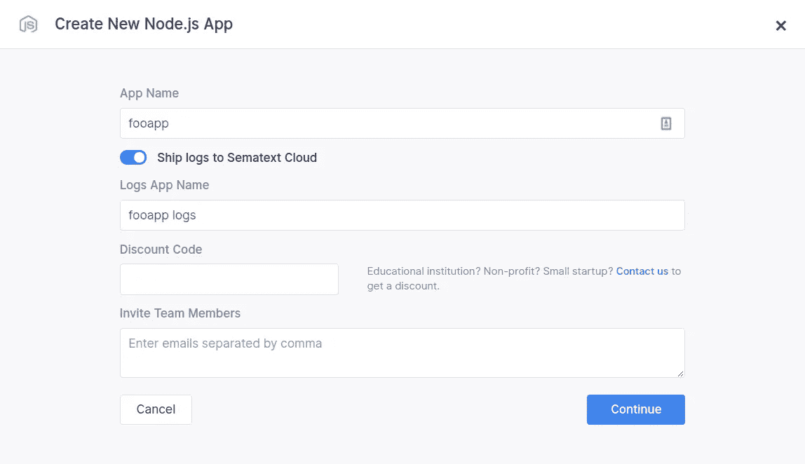
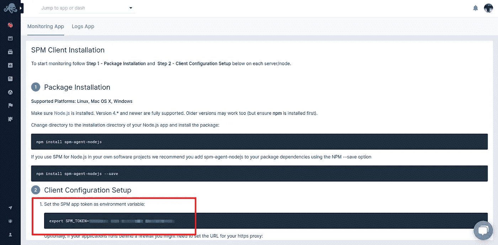
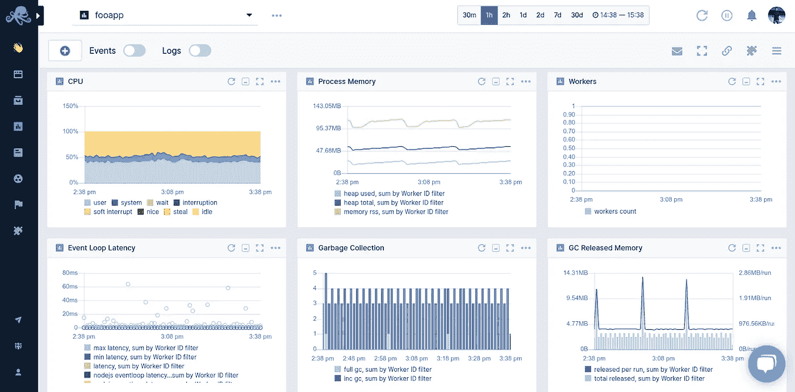
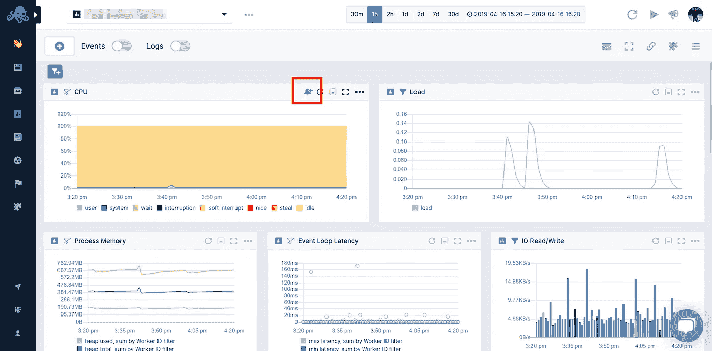
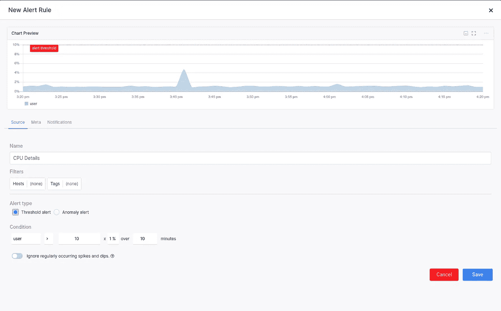
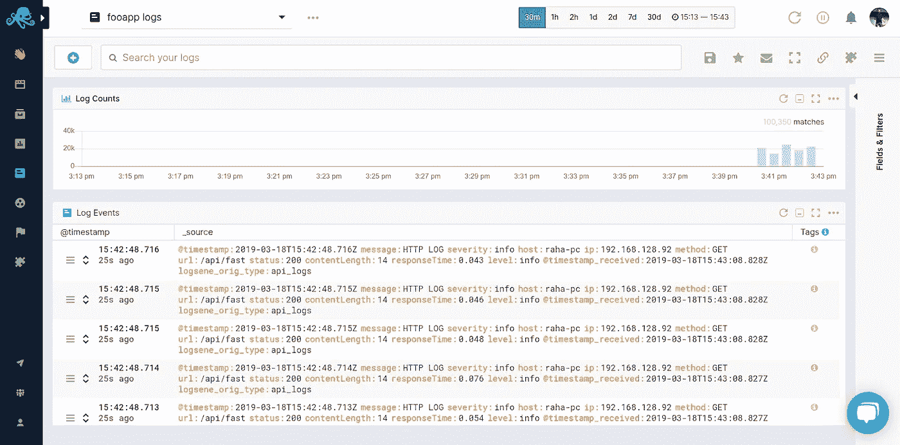
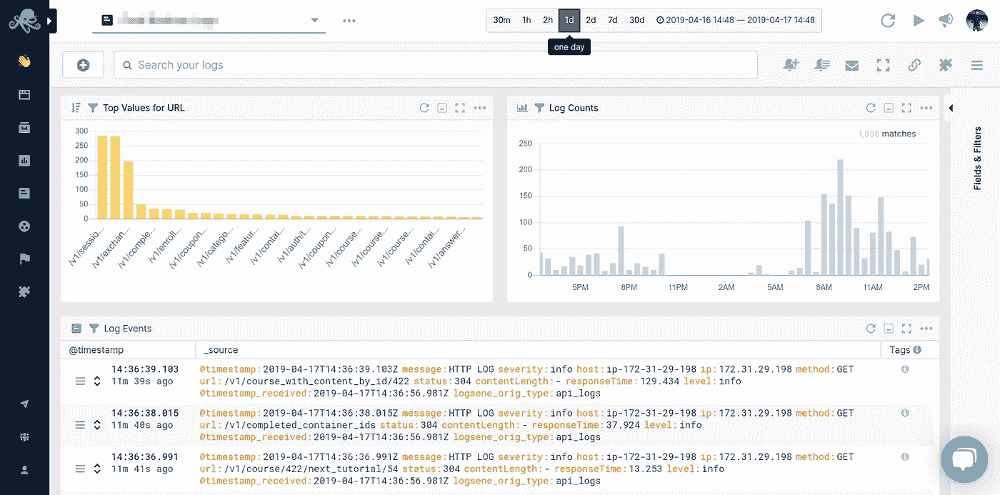
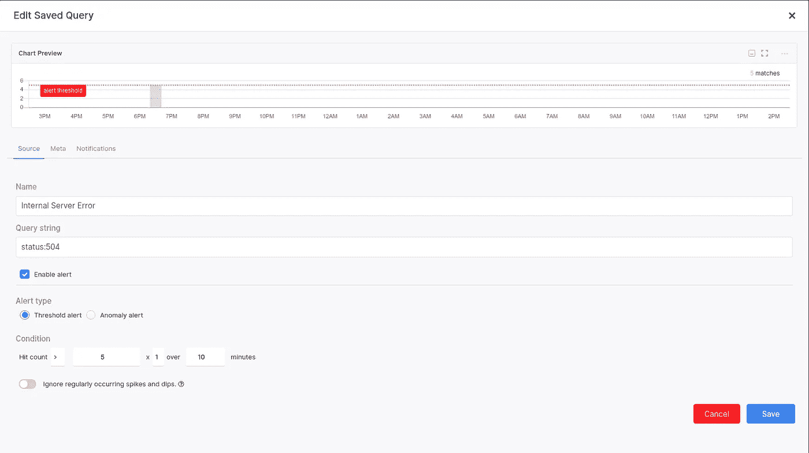
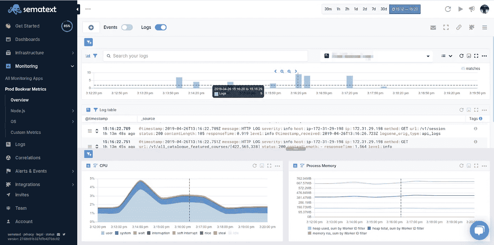

# Node.js 监控变得简单

> 原文：<https://medium.com/hackernoon/node-js-monitoring-made-easy-4d84cd229ab2>


A piece of cake. Get it?

Node.js 监控是一项棘手的任务。有一些特定的挑战需要注意。因为 Node.js 是一种动态类型的编程语言，并且是单线程的，所以你给了解释器和运行时很大的自由来做决定。这很容易导致内存泄漏和高 CPU 负载。Node.js 中通过使用函数的异步执行来模拟并行执行。但是，如果一个函数阻塞了线程或事件队列，应用程序的性能将会受到严重影响。

本文将深入探讨如何监控您的应用程序，并确保这些问题不会发生。我将介绍[应用程序性能管理(APM)](https://en.wikipedia.org/wiki/Application_performance_management) 及其重要性，还将介绍[日志管理](https://en.wikipedia.org/wiki/Log_management)以及如何创建结构化日志来帮助您调试、排除故障和跟踪应用程序中的错误。

准备好了吗？让我们跳进来。

# 什么是应用程序性能管理？

监控你的软件围绕着确保每件事都按照它应该的方式工作。你希望你的用户在使用你的软件时有愉快的体验。根据字典，监控的正确定义应该是这样的。

> *观察并检查一段时间内(某事)的进展或质量；保持系统的审查。*

听起来相当模糊。因此，让我们跳过形式，直接进入一些真实世界的用例。监控提供了一种防止客户流失的方法，最重要的是，阻止你浪费时间。时间就是金钱，从长远来看，防止停机、资源损失和从性能问题中拯救您的产品将为您省钱；这是也应该是每个企业的核心焦点——赚钱。

应用程序性能管理(APM)定义了一种监控软件应用程序性能和可用性的方法。它通过显示图表来实现标准化，这些图表包含请求计数、响应时间、CPU 使用率和内存利用率等性能指标。这些图表向您显示平均值、百分位数和您可能想要定义的任何自定义分组。在本教程接下来的几节中，我将带您了解这一点。通过 [Sematext 对 Node.js 的集成](https://sematext.com/integrations/nodejs-monitoring/)，您可以轻松地将 APM 添加到 Node.js 应用程序中。

# 要监控哪些 Node.js 指标？

在监控您的应用程序时，您需要考虑几个主要因素。从关于系统健康的一般信息，一直到您的服务器如何利用内存和 CPU 周期。我在本系列的第 1 部分“监控的 [Top Node.js 指标”中对此做了更详细的介绍。在继续之前，让我们快速回顾一下。](https://sematext.com/blog/top-nodejs-metrics-to-watch/)

# 系统运行状况和停机时间

如果你的应用不工作，你的客户就不能花钱。你可以想象，这很糟糕。更糟糕的是，这会导致他们对你失去信任。如果他们对你和你的产品失去信任，他们回来的可能性很小。您的目标是建立一个监控解决方案来监控您的系统的行为。它应该会立即通知您可能出现的停机、高延迟或任何服务问题。

# 资源利用

优化不佳的服务使用更多的资源，花费更多的钱，并且具有更高的延迟。发现性能问题并提供一种简单的方法来解决它们，这就是为什么您需要谨慎选择 APM 工具的原因。它应该为您提供一种改进应用程序的方法，这样您就不会因为糟糕的编码技能而在不必要的基础设施上花费金钱、时间和资源。

消除性能瓶颈可确保您在流量突然激增时无需扩展基础架构。这就是为什么监控 CPU 利用率和内存是至关重要的一步。

# Node.js API 延迟

事实上，用户不想呆在那里等你的应用程序加载。平均等待时间约为 2 秒。这就是你必须确保不会永远失去那个客户的时间。众所周知，你的产品越快，你的顾客就越多。更重要的是，用户满意度会更高。

要注意慢速服务，您可以做的是收集服务级别的数据。如果您有几个 API，请确保分析每个 API 的延迟。这将让您更深入地了解您的服务速度缓慢的真正原因。

# Node.js 错误率和错误处理

功能可能会很快变成 bug。如果您没有办法了解失败的代码，它们可能会在很长一段时间内被忽视。你不能指望你的用户告诉你。如果他们偶然发现一个问题，他们更有可能离开你的网站，而不是告诉你。

为了发现问题，您需要监控应用程序产生的错误的数量和类型。这包括 4xx/5xx 状态代码、运行时错误和应用程序崩溃。如果你有大量的错误，很可能你的代码质量有问题。

为了保持低错误率，确保优先考虑代码质量、 [TDD](https://technologyconversations.com/2013/12/20/test-driven-development-tdd-example-walkthrough/) 和一个好的 [CI/CD 管道](https://www.atlassian.com/continuous-delivery/principles/continuous-integration-vs-delivery-vs-deployment)。这将在您的团队中创建一种责任感，并为您的开发人员减轻许多压力，因为测试和部署过程是自动化的。

如果您的 APM 工具也在收集错误数据，您将有办法找到类似的错误模式。这对于节省时间和提高应用程序的稳定性和性能非常方便。

我还建议将您的监控工具与一个[日志发送器](https://sematext.com/blog/top-5-most-popular-log-shippers/)配对。使用日志作为 APM 指标的支持将为您提供关于服务级别性能的更细粒度的信息。下一节将详细介绍这一点。

# 什么是日志管理？

日志管理是正确了解应用程序的重要支柱。从使用基础架构级别的日志支持 APM，到使用服务级别的日志告诉您有关应用程序生命周期的更多信息，日志在整个过程中为您提供支持。从解决现有问题到规划新功能，日志记录是实现任何新代码或修复旧错误的关键步骤。

日志描绘了一幅更大的画面，为您的 APM 提供了支持信息，这些信息往往是至关重要的。理想情况下，您应该总是将所有日志发送到同一个中心位置，不管它们来自哪里。即使它们可能完全不同，如基础架构日志、数据库日志或应用程序日志，您也应该将它们视为一个整体，因为它们都会影响您的客户。您可以使用 [Sematext Logagent](https://sematext.com/logagent/) 捕获服务器日志。

# Node.js 登录什么？

也许你应该记录的原因很清楚，但是为了结束这个循环，让我们列出主要的原因。

## Node.js 性能日志

APM 工具已经显示了您的应用程序的性能。日志记录对性能很重要的原因是为了更详细地了解哪些 API、服务或函数具有高延迟。

## 调试 Node.js 日志

当出现问题时，您需要一种故障诊断和发现问题的方法。通过分析日志进行调试并找出问题的根源是您最有可能做的第一件事。事情发生了。它为您提供了一种查看错误发生位置和显示堆栈跟踪的方法。

## 使用 Node.js 日志跟踪错误

要调试错误，您需要知道它们到底发生了什么。知道它们何时发生，多久重复一次，它们是否已经被修复，或者它们是否会再次出现是至关重要的。

## 分析 Node.js 日志

日志是丰富的信息来源。您可以分析日志以发现使用模式，从而指导决策。

您可以通过日志获得服务级别信息，日志显示了每个 API 请求的具体信息。这将有助于故障排除、调试和错误跟踪。

# Node.js 的监控

让我向您展示一种向现有的 [Express.js](https://expressjs.com/) 应用程序添加监控的简单而又好的方法。我们将从一个带有几个 API 端点的简单服务器开始。首先，创建一个新目录，并将其命名为 **nodejs-monitoring** 。打开一个终端窗口，初始化 NPM，并安装一些模块。

```
$ npm init -y
$ npm i express dotenv spm-agent-nodejs
```

这是让 APM 工具运行并监控您的应用程序所需要的一切。现在，创建两个文件，一个`app.js`和一个`.env`。将这段代码添加到`app.js`中。

```
require('dotenv').config()
require('spm-agent-nodejs')
const express = require('express')
const app = express()

app.get('/api', (req, res, next) => {
 res.status(200).send('Api Works.')
})
app.get('/api/fast', (req, res, next) => {
 res.status(200).send('Fast response!')
})
app.get('/api/slow', (req, res, next) => {
 setTimeout(() => {
   res.status(200).send('Slow response...')
 }, 1000)
})
app.get('/api/error', (req, res, next) => {
 try {
   throw new Error('Something broke...')
 } catch (error) {
   res.status(500).send(error)
 }
})
app.listen(3000, () => 
 console.log('Server is running on port 3000'))
```

Node.js 的 [Sematext 代理需要一个特定的`SPM_TOKEN`环境变量才能正常工作。这就是为什么我们要求`app.js`顶部有`dotenv`。为了获得令牌，也就是 Node.js 应用程序将发送指标的位置，您需要创建一个](https://github.com/sematext/spm-agent-nodejs) [Sematext 监控应用程序](https://sematext.com/integrations/nodejs-monitoring/)。打开你的浏览器，[注册 Sematext Cloud](https://apps.sematext.com/ui/login/) 如果你还没有，点击蓝色的**创建监控应用**按钮。这将带您进入一个屏幕，在这里您必须选择要监控的应用程序类型。



给你的应用起个名字，同时打开**日志**开关。



点击创建，你就完成了！现在唯一的事情就是复制`SPM_TOKEN`。



一旦你复制了它，回到代码编辑器。打开`.env`文件并添加令牌。

```
SPM_TOKEN=some-value-for-your-token
```

就是这样！运行应用程序并测试端点。过一会儿，您会看到指标显示在 Sematext 中。



在 Sematext Node.js 监控应用程序中，您将看到一组预定义的仪表板，这些仪表板在预定义的图表中显示了 70 多种不同的 Node.js APM 和基础架构指标，这些图表分组到一组直观组织的监控仪表板中。

# Node.js 指标警报

为了节省您的时间，Sematext 会自动创建一组默认的警报规则，例如磁盘空间不足警报。您可以针对任何指标创建附加警报。有关更多详细信息，请查看 Sematext Cloud 中的警报。

创建监控应用程序时，Sematext 会自动创建一组默认警报，让您了解心跳和磁盘空间不足的情况。您可以创建[三种类型的警报](https://sematext.com/docs/alerts/)。

*   **心跳警报**在您的服务器停机时通知您。
*   **基于阈值的警报**在指标值超过预定义的阈值时通知您。
*   **基于统计异常检测的警报**在指标值突然改变并偏离基线时通知您。

要创建警报，请将鼠标悬停在指标上，然后按下小铃铛图标。



警报规则应用当前视图中的过滤器，您可以选择各种通知选项，如电子邮件或配置的[通知挂钩](https://sematext.com/docs/alerts/#alert-integrations)，如 Slack、Pusher 等。通过异常检测、观察给定时间窗口内的指标变化或使用传统的基于阈值的警报来触发警报。



通过添加一个模块[sema text Agent for node . js](https://github.com/sematext/spm-agent-nodejs)，您就可以通过三种不同类型的警报和通知挂钩获得完整的系统洞察力。您还可以查看 Node.js 应用程序的详细性能指标。您所没有的是关于哪些请求失败以及如何解决它们的 API 和服务级别信息。这就是日志记录发挥作用的地方。让我们添加一种方法来构造和发送日志到 Sematext。

# Node.js 的日志管理

添加日志管理有点复杂，但是没有什么是您不能处理的。打开你在[监控应用](https://sematext.com/spm/)旁边创建的 [Sematext Logs 应用](https://sematext.com/logsene/)。很容易在**日志**下的左侧导航中找到。打开集成指南并找到 Node.js 集成。复制令牌并将其添加到您的`.env`文件中，就在`SPM_TOKEN`下面。


```
SPM_TOKEN=some-value-for-your-token
LOGS_TOKEN=some-value-for-your-token
```

现在你需要安装更多的模块。有几个，准确地说是四个。

```
$ npm install morgan morgan-json winston winston-logsene
```

**Winston** 是您将使用的日志记录器，而 **Winston-logsene** 模块是 Sematext 日志发送器的一个实现，可以与 Winston 无缝协作。Morgan 是一个 HTTP 记录器，记录所有访问你的 API 的 HTTP 请求。Morgan JSON 模块是 Morgan 注销消息的简单格式化程序。

代码编辑很小，下面是你的`app.js`应该是什么样子。

```
require('dotenv').config()
require('spm-agent-nodejs')
const express = require('express')
const app = express()
// add this part
//////////////////////////////////
const winston = require('winston')
const morgan = require('morgan')
const json = require('morgan-json')
const format = json({
 method: ':method',
 url: ':url',
 status: ':status',
 contentLength: ':res[content-length]',
 responseTime: ':response-time'
})
const Logsene = require('winston-logsene')
const logger = winston.createLogger({
 transports: [new Logsene({
   token: process.env.LOGS_TOKEN, // token
   level: 'info',
   type: 'api_logs',
   url: 'https://logsene-receiver.sematext.com/_bulk'
 })]
})
const httpLogger = morgan(format, {
 stream: {
   write: (message) => logger.info('HTTP LOG', JSON.parse(message))
 }
})
app.use(httpLogger)
/////////////////////////////////
app.get('/api', (req, res, next) => {
 logger.info('Api Works.') // added logger
 res.status(200).send('Api Works.')
})
app.get('/api/fast', (req, res, next) => {
 res.status(200).send('Fast response!')
})
app.get('/api/slow', (req, res, next) => {
 setTimeout(() => {
   res.status(200).send('Slow response...')
 }, 1000)
})
app.get('/api/error', (req, res, next) => {
 try {
   throw new Error('Something broke...')
 } catch (error) {
   logger.error(error) // added logger
   res.status(500).send(error)
 }
})
app.listen(3000, () => 
 console.log('Server is running on port 3000'))
```

有了这个设置，每个命中 API 的 HTTP 请求都将被记录并存储在 Sematext 日志中。Winston 还允许您定义自定义的调试、错误和信息日志，以便对应用程序进行故障排除。



通过增加 25 行代码，您已经为 Node.js 应用程序添加了日志管理。相当酷。

# Node.js 日志搜索和仪表板

一旦 Sematext 中有了日志，您就可以在故障排除时搜索它们，保存您经常运行的查询或创建自定义日志仪表板。



搜索日志是很自然的事情，就像你用谷歌搜索一样。

*   使用 **AND、OR、NOT** 运算符:(错误或警告)NOT exception
*   **分组** AND、OR、NOT 子句**带括号**:消息:(异常或错误或超时)和严重程度:(错误或警告)
*   使用 **+和** — to **include** 和**exclude**:+message:error-message:time out-host:db1 . example . com
*   使用**字段引用**:信息:超时
*   使用**引号**搜索短语:消息:“致命错误”

挖掘日志可能是一个重复的过程。你会一遍又一遍地使用相同的搜索。为了避免这种情况，您可以保存查询并立即再次运行它们，而无需键入任何内容。查看使用[日志进行故障排除指南](https://sematext.com/docs/guide/logs-guide/)以及它如何让您的生活更轻松。

# Node.js 日志警报

要创建日志警报，请运行与您希望获得警报的日志事件相匹配的查询。在搜索框中输入查询，然后点击小铃铛图标。


类似于度量的警报规则的设置，我们可以根据警报查询返回的匹配日志事件的数量来定义基于阈值的**或异常检测警报**。



查看文档中的警报指南，了解关于[为日志和指标创建警报](https://sematext.com/docs/guide/alerts-and-events-guide/)的更多信息。

# Node.js 指标和日志关联

如何对 Node.js 应用程序进行故障排除？我倾向于检查我的度量标准中的峰值，然后向下挖掘以找到问题的根本原因。在大多数情况下，我在日志中搜索导致峰值的细粒度信息。Sematext 使它变得简单。日志和指标是链接在一起的，您可以在同一时间线中看到哪个日志与指标中的哪个峰值相关。

日志也是集中的。搜索和过滤它们的速度非常快，我上面展示的过滤语法非常简单。将指标、日志和事件显示在同一个屏幕上，并与同一条时间线相关联，这让我非常满意，也让我在排除故障时更加轻松。



# 您应该注意哪些 Node.js 指标？

Node.js 基于 Google Chrome V8 JavaScript 引擎。与任何现代编程语言一样，它具有垃圾收集功能，可以回收不再需要的变量所使用的内存。这种垃圾收集的问题是它会停止程序的执行。

这里的关键要点是延迟与吞吐量相关。Node.js 是单线程的，但由于其异步特性，它具有非阻塞 I/O 交互，这意味着在加载期间并发性会增加。高延迟和并发性会增加内存使用。当内存使用量达到峰值时，还会增加垃圾收集活动，消耗宝贵的 CPU 周期。

关于垃圾收集指标，您应该首先测量花费在垃圾收集上的所有时间。如果垃圾收集活动有增长的趋势，那么 CPU 和内存的使用也会很快达到峰值。

# 结论

在本文中，您了解了通过使用应用程序性能管理和日志管理工具来监控和记录 Node.js 应用程序的概念。我们已经讨论了在保持系统健康的同时尽可能降低延迟的关键问题。通过使用 APM 为您提供正在发生的事情的概述，并使用日志管理深入了解有关服务级别信息的细节，您可以获得对系统性能的正确洞察。

您还学习了如何将 Sematext APM 和日志管理添加到现有的 Express.js 应用程序中。你所需要的只是添加 26 行代码和一些 NPM 模块。

我们使用现成的和定制的仪表板、指标和日志关联、异常检测和警报。借助 MongoDB 或 Nginx 等其他[开源集成](https://sematext.com/integrations/)，您可以轻松监控 Node.js 以及基础设施中的所有其他技术。选择监控应用程序的工具时，请确保选择一个能够让您完全观察的工具。查看 Node.js 应用程序周围所有系统的指标非常重要。

如果你需要软件栈的可观察性解决方案，请查看 [Sematext](https://sematext.com/) 。我们正在推动[开源我们的产品](https://github.com/sematext)并产生影响。如果您想试用我们并监控您的 Node.js 应用程序，[注册](https://apps.sematext.com/ui/registration)获得 30 天的专业试用，或者立即选择免费等级。

希望你们喜欢读这篇文章，就像我喜欢写这篇文章一样。如果你喜欢，点击那个小小的分享按钮，那么更多的人会看到这个教程。下次见，保持好奇，玩得开心。

*原载于 2019 年 5 月 6 日*[*【https://sematext.com】*](https://sematext.com/blog/nodejs-monitoring-made-easy-with-sematext/)*。*