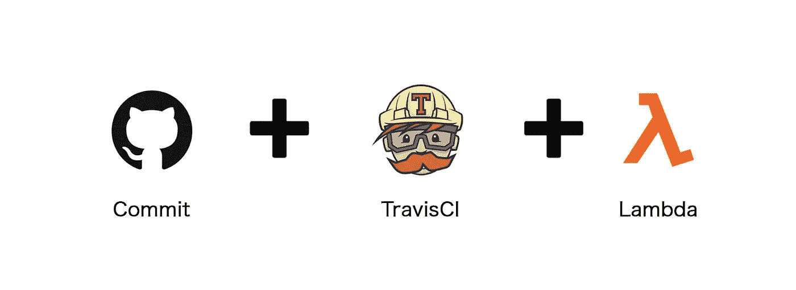
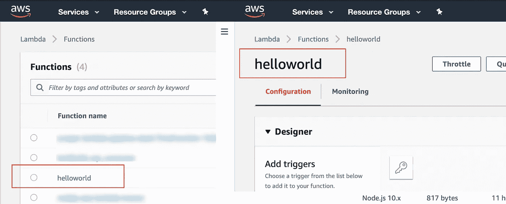
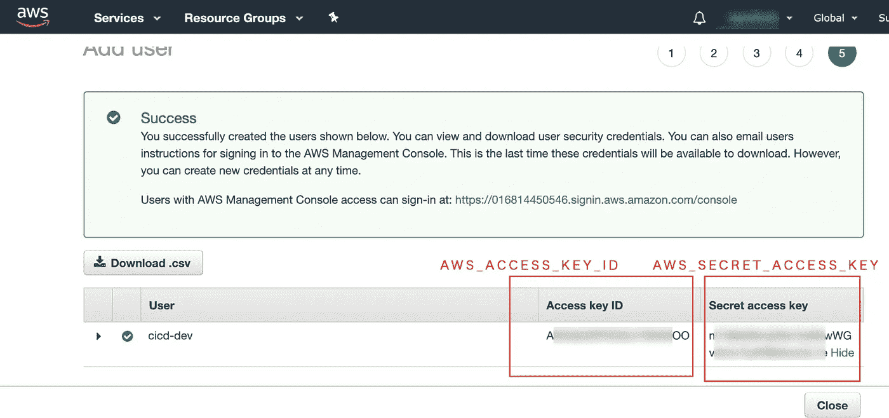
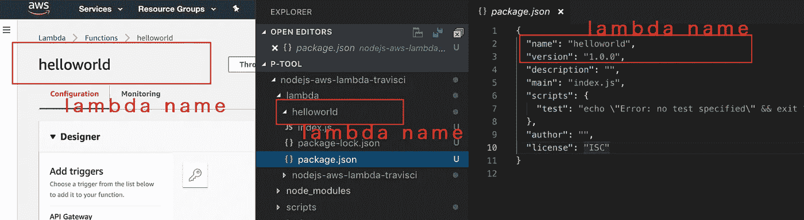
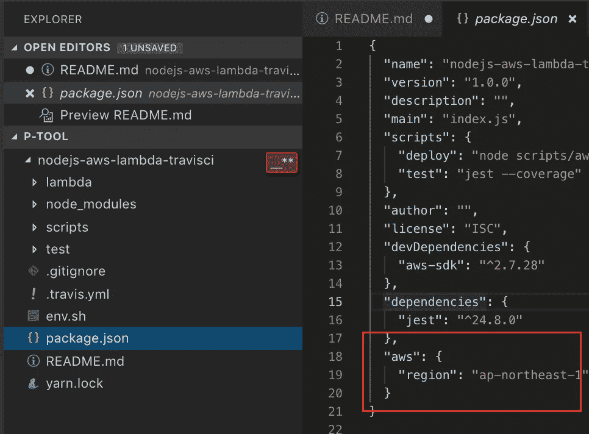

# [Nodejs]4 使用 githiub 和 travisCI 设置 AWS Lambda 的步骤

> 原文：<https://medium.com/hackernoon/nodejs-4steps-set-up-aws-lambda-with-githiub-and-travisci-tutorial-example-sample-repository-repo-help-cdci-6e55d539f04>



[Nodejs] Set up AWS Lambda with githiub and travisCI

这是一个`Node.js`样板/startKit，它使用 Travis CI 为 Github 中的 AWS Lambda 配置连续部署流程。流程:`github`->-`travisCI`->-`aws lambda`

C 哈兰格斯，在我钻研这个过程的时间里，有一些困难，你必须花时间阅读`AWS`和`TravisCI:`的文件

1.  **IAM 配置**，了解`AWS_ACCESS_KEY_ID` 和`AWS_SECRET_ACCESS_KEY` 如何在 Node.js 上工作，以及如何影响 AWS 的服务。
2.  **TravisCI 生命周期**，需要阅读它的 doc，使流程清晰一个项目是如何`build`、`run`、`test`、`deploy`的。
3.  **AWS Lambda 部署**，Lambda 功能的部署方式有几种，像`zip`、`serverless`、`codepipeline`、`aws cli` 或者`Nodejs SDK.`每种方式都有很小的不同，需要不同的凭证。 *(* `*zip*` *是我挑的)*

# 步骤 1 —创建 lambda 函数

创建 lambda 函数，`helloworld`



# 步骤 2-创建和设置部署用户

使用策略`lambda full access`创建用户，从`IAM`获取访问 id 和密码



并设置环境变量

```
$ export AWS_ACCESS_KEY_ID="yourkey"
$ export AWS_SECRET_ACCESS_KEY="yoursecret"
```

# 步骤 3 —本地配置

# 步骤 3.1 —设置 lambda 名称

在上设置 lambda 函数名

*   `./lambda/yourname`
*   在此设定您的姓名:`./lambda/yourname/package.json`



# 步骤 3.2-设置 lambda 区域

和设置区域



# 步骤 3.3 —设置 TravisCI

和设置区域


# 第四步——跑步

克隆这个项目[https://github.com/p-tool/nodejs-aws-lambda-travisci](https://github.com/p-tool/nodejs-aws-lambda-travisci)并运行

```
$ npm run deploy
// or yarn deploy
```

# 结论

样本 travisCI[https://travis-ci.org/p-tool/nodejs-aws-lambda-travisci](https://travis-ci.org/p-tool/nodejs-aws-lambda-travisci)，连接到样本 Github Repo【https://github.com/p-tool/nodejs-aws-lambda-travisci 的

# 参考

*   【https://github.com/marcenacp/hello-world-lambda 
*   [https://github.com/p-tool/nodejs-aws-lambda-travisci](https://github.com/p-tool/nodejs-aws-lambda-travisci)
*   [https://docs.travis-ci.com/user/deployment/lambda/](https://docs.travis-ci.com/user/deployment/lambda/)
*   [https://travis-ci.org/p-tool/nodejs-aws-lambda-travisci](https://travis-ci.org/p-tool/nodejs-aws-lambda-travisci)