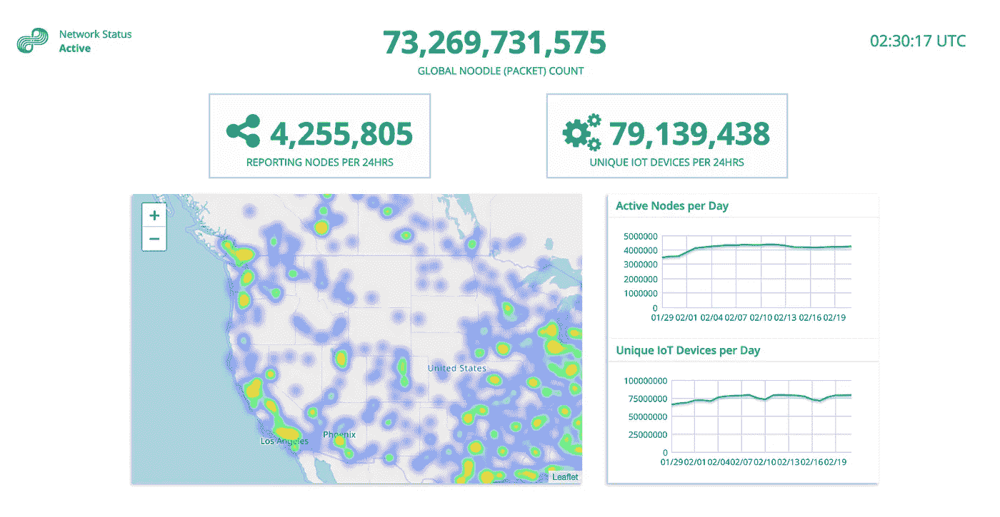
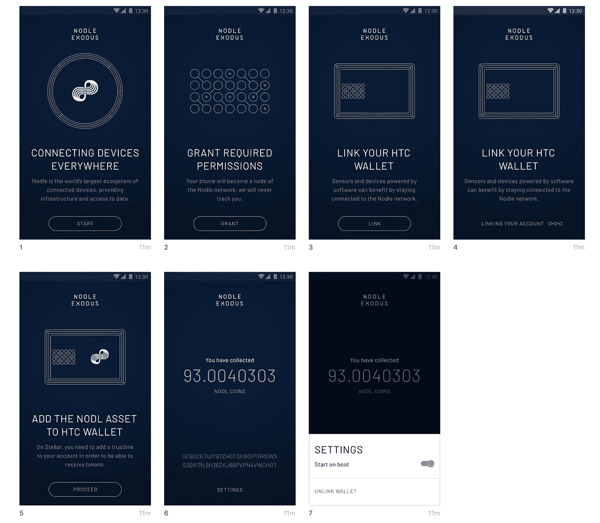
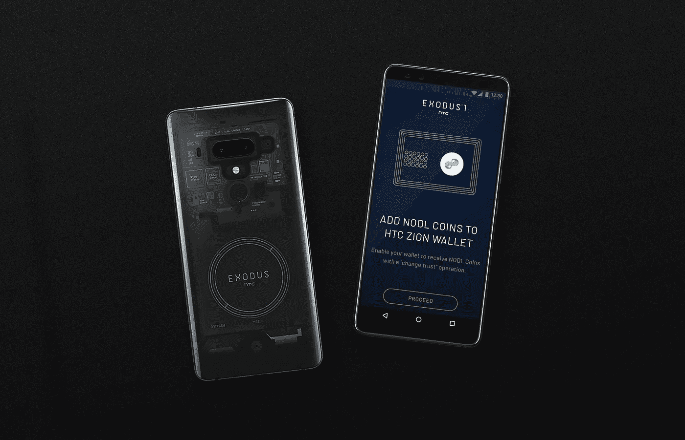

# Nodle 应用程序在 HTC Exodus 区块链手机上发布

> 原文：<https://medium.com/hackernoon/nodle-app-launches-on-the-htc-exodus-blockchain-phone-8e1544c62fe8>

Nodle Network Overview | February 21st 2019

## 智能手机 Exodus 用户现在可以因参与 Nodle 网络而获得奖励

物联网连接提供商 Nodle 刚刚宣布推出其移动应用程序 ***Nodle*** ，现在专为 HTC Exodus 用户提供。一旦用户启动该应用，他们将直接获得参与 Nodle 网络的奖励。

Nodle 应用程序连接并收集来自环境传感器、BLE 标签、汽车、自行车和踏板车等物联网设备的数据。该公司已经建立了一个强大的蓝牙低能耗网络，以帮助公司和城市连接并收集来自他们的设备，传感器和标签的数据。

> [Nodle 的联合创始人 Micha Benoliel](https://medium.com/u/29e3a84161a0?source=post_page-----8e1544c62fe8--------------------------------) 提到“任何人都可以因为使用他们的智能手机资源完成工作而直接获得奖励。这是通过使用手机和锡安钱包上的恒星区块链和 HTC Exodus 安全硬件模块实现的。”

***Nodle 网络的建立是为了赋予个人*** 权力，创造 ***原子竞争*** 。每个智能手机用户都有机会参与其中。只需要一部智能手机和一个移动应用程序。不需要特殊的投资、知识或技能。

一旦用户加入了社区，并且他们的移动应用程序已经启动，他们就可以自动加入 Nodle 网络。这个参与被称为 ***“连通性证明”。*** 每一枚奖励硬币都已经铸造完毕。工作证明的摘要存储在星际文件系统(IPFS)上，并通过链接附在区块链的硬币上。

> HTC Exodus 的分散首席执行官陈谦之表示，“Nodle 向 Exodus 用户提供加密货币，以换取移动物联网和传感器数据。市场上没有其他应用程序可以让用户轻松赚取加密货币来换取连接。在 HTC Exodus 设备上提供 Nodle，Get Crypto 应用程序最终会增强个人的能力，并使我们更接近实现我们的愿景，以重建有利于最终用户的互联网。”

Nodle 应用程序将预装在 HTC Exodus 手机上。用户可以在启动应用程序的几分钟内开始赚取 NODL 硬币。

NODL 硬币建立在恒星区块链的顶部。Nodle 团队和 Exodus 团队紧密合作，将恒星区块链的支持添加到锡安硬件钱包。

> 关于 Stellar 区块链和生态系统，Nodle 联合创始人 Micha Benoliel 提到,“Stellar 使我们能够通过简单的原子操作部署复杂的智能合同，提供一个与传统菲亚特世界互操作的高效支付平台。这使得它非常适合 Nodle。”

Nodle Exodus app on the HTC Exodus 1