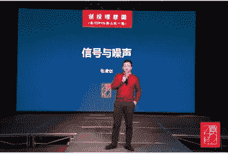
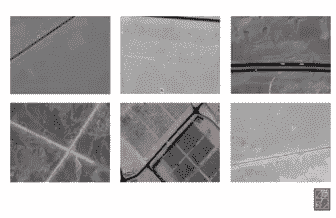
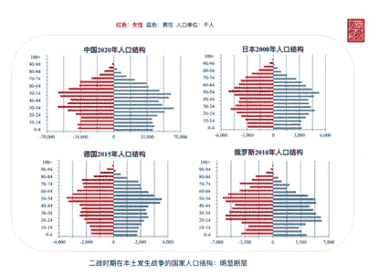
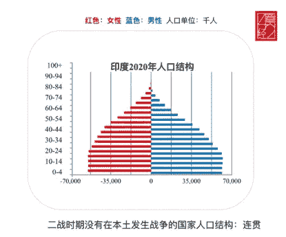
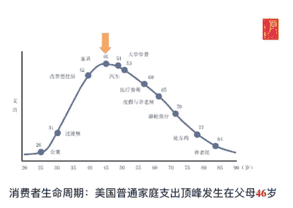
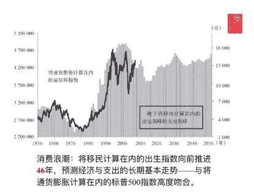
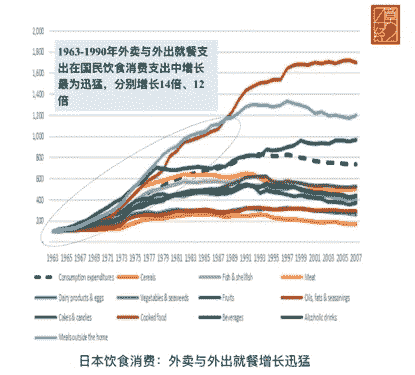
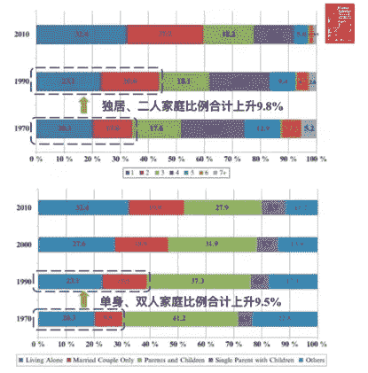

# 科技投资中的噪声与信号

> 原文：<https://medium.com/hackernoon/noise-vs-signal-in-tech-investments-f7ac0cec43e3>

每个投资者都有不同的风格。有的是宏观思考，研究商业周期，有的是产品驱动，专注创始团队。在这两种截然相反的风格之间， **Trustbridge Partners** 的 **Jinjian Zhang** 创造了一个精致而独特的个人签名。作为一名社会学和人口统计学方面的聪明学者，以及一个非常善于读懂人的人，他的确是我多年来见过的最令人印象深刻的投资者和系统思考者之一。

更重要的是，他很有可能在未来 20 年成为中国领先的风险投资者之一。Trustbridge 的投资公司包括**美团**和 **360** 等知名公司，金鉴领投的两笔投资——**LAIX**和 **NEW** 已于 2018 年在纽交所上市。在这里，我想和你分享金健最近的一次演讲，这次演讲很好地展示了他的投资哲学。

我们生活在一个信息爆炸的时代。人们越来越难快速有效地提取必要的信息。但是如果你着眼于一个更长的时期，比如说 5 年，你会清楚地看到许多事物生命周期的全貌。

人类能够取得越来越多的成就，并不是因为我们消耗了所有的海量和嘈杂的信息。在合同上，这是因为我们可以发现什么是最关键的信息。

在我本科和研究生学习期间，我分析了 7 年的卫星图像。基本上，这一切都归结为一件事——什么是信号，什么是噪声？更具体地说，我的工作是建立一个机器学习模型，以过滤噪音并捕捉真实的信号。在我生命的后期，我发现这个方法惊人地适用于投资。

一.信号和噪声

研究生期间，我在中科院下属的杂志上发表了一篇论文。我的项目是通过分析卫星图像来识别沙漠中的滞留车辆，以便营救被困在里面的人。这是我报纸上的一张照片。

你可以在每张图片上看到的黄色小框是机器学习模型识别的车辆。例如，第一张图片中的帧是沙漠公路上的一辆小车。真正的挑战是，所有的照片都是高清的，有数百万像素，但每辆车只有几个像素或不超过 20 个像素。基本上，我是在大海捞针。

它启发了我，现实生活也是如此——我们生活在一个充斥着冗余信息的沙漠中，我们不顾一切地寻找自己的绿洲。而且，说到投资，我也有同感，反复。

到 2012 年，我加入了 Trustdridge，开始了我的投资生涯。我埋头于众多的卖方研究报告，开始设置供应链、需求力量、分销渠道等参数。来评估公司。然而我的参数逐渐从 5 到十几到 50 多！

我意识到，我对一个行业了解得越多，就会出现越多的参数。我决定放慢速度来思考我的方法。最后，七年的科研经验让我灵光一现——**只有噪音需要很多不同的参数来描述，但对于信号，你应该寻找共同的模式。**

当你学习新的东西，发现它更难，更细分，恭喜你，你已经发现了噪音！随着你不断前进，你能够从所有的差异中发现共同的模式。这是你达到目标的时候。

我的顾问曾经说过，噪声总是以不同的形式变化，但信号提取相似性。诸如白噪声的典型噪声在每个信号点上都是随机的。然而，当你把所有的点收集在一起时，就会有一个高斯分布。

你永远不应该只从一个单一的角度研究任何事情，因为你会迷失方向，淹没在一大堆参数中。

这里有一个我舍友的故事。

我的室友 A 暗恋一个女孩。幸运的是，那个女孩也偷偷地喜欢他。一天球赛后，那个女孩向他发出爱的信号:“你饿了吗？我给你买了些薯片。”

突然，我的室友 B 打断了我们的谈话:“那些薯片正在打折。我也想买一些。”因此，不幸的是，我天真的室友 A 认为这个女孩只是因为薯条打折才买的，而不是因为她喜欢他。

那一刻，信号和噪音混在一起了。用工程术语来说，室友 A 除了一个毫无意义的“波段”外一无所有。

这是一个可悲的教训。我们经常听到抱怨说我们怎么能错过世界的变化呢？我们怎么没意识到新公司是独角兽？根据我的故事，你知道信号就在那里，你只是被室友 B 的噪音分散了注意力，他不断地给你输入高斯噪音。

你必须不断地保持观察和意识，才能不错过你的真爱。关键一步是把你的室友 B(噪音)踢出去，和你的女生(信号)住在一起。

二。投资中的信号和噪音

话说回来，投资中的信号和噪音是什么？

一些人认为 5 年是一个商业周期。那么，在此期间，什么在不断变化，什么保持不变？每 5 年需要重新考虑什么？什么声音最小？

我在投资中发现的第一个信号是**人口统计**。

2012 年至 2014 年，我花了整整两年时间研究不同时期许多不同国家的人口统计数据。彻底的研究启发了我，我以前所有的投资研究只不过是噪音。

让我们从这四个国家开始——中国、日本、德国和俄罗斯。我发现一个共同点——**人口结构差距**。

这四个国家都出现了两次人口激增。为什么？因为这些国家都是二战期间的主要交战国。原因是战争造成一代人的损失，国家为了备战，鼓励人们多生孩子。此外，遭受失败和经济衰退，人们没有工作或娱乐，所以他们生了更多的孩子…

看看日本吧。这个国家 2000 年的人口结构和 2020 年的中国很像。在 20 年的时间跨度内，为什么两个不同国家的人口结构几乎相同？这两个国家难道不应该同时面对同一个问题吗，因为它们都是二战中的交战国？

那是因为日本，当他们发动战争时，严重高估了他们主宰世界的力量。当他们以迅雷不及掩耳之势占领中国东北三省时，他们被早期的成功冲昏了头脑，于 1939 年提出了一亿人口计划。他们认为，如果他们想殖民整个中国，他们目前的人口远远不够。因此，日本天皇以一种极具侵略性的方式鼓励他的人民繁衍后代。因此，在二战结束前，日本团结在一场声势浩大的“人类创造运动”中。

另一方面，中国直到二战后 10 年才发起类似的“英雄母亲”运动，这使得中国的第一次人口繁荣推迟了差不多 20 年。

第二次世界大战以不同的方式和阶段对世界和各个国家造成了巨大的影响。大多数时候我们看不到直接的联系。但是一只蝴蝶在某个地方扇动翅膀可能最终会让你陷入龙卷风。

“计划生育”是婴儿潮的直接结果。它于 1978 年被写入中国宪法，并于 1982 年成为国家政策。它创造了世界上独一无二的一代，被称为“独生子女”。几乎每个 1983 年以后出生的孩子都是独生子女。在成长过程中，他们没有兄弟姐妹一起战斗，所以他们没有多少机会在对抗中协调和妥协。这意味着独生子女往往有很强的自我意识。

想象一下，自我中心的一代人第一次和他们的同龄人一起进入职业世界。他们会震惊地意识到他们不再是“唯一的一个”。他们离开了自己的舒适区。他们发现很难适应与他人一起工作的环境。2005 年后，22 左右出现了一系列个体小商户的繁荣，受益于阿里巴巴旗下淘宝的腾飞。

与此同时，另一个有趣的数据点弹出来了——从 2015 年到 2017 年，中国的离婚率增长了两倍。

2005 年之前，离婚率保持稳定水平，甚至在 2000 年至 2005 年期间出现下降。2005 年后，独生子女一代正在结婚。然而，他们中的许多人发现他们不能接受与拥有不同个性的人一起生活，最重要的是，他们没有能力妥协。

从表面上看，独生子女政策只不过是一项生育控制措施。然而，它在社会层面上有着深刻的含义。

作为投资者，我们驾驭着这个时代的宏观浪潮。我们看到单个的点，然后把它们连成线，形成趋势。我们看透了时间，以及时间背后的过程和逻辑。

下一站:印度。

如果你仔细看看印度的人口结构——这是令人震惊的。从这张图表中，你会发现印度从未成为全球化的一部分。无论两次世界大战，全球化，还是 WTO，结构都是那么的平稳增长，没有任何缝隙。

当我们看着印度市场时，我们总是想知道:我们在投资什么？？你真的了解你的客户吗？他们是哪一年出生的？那些年发生了什么？他们的成长经历是怎样的？会在他们身上成长出什么样的性格？

当然，没有人是一样的。但是，同一代人会有很多共同点。谈到投资，我们应该回到我在开头提到的:**我们寻找的是相似之处，而不是不同之处。我们追逐信号，但过滤掉噪音。**

你可能想知道人口结构和经济之间有什么联系。这些异同在社会科学领域真的有推断价值吗？毕竟，它们能帮你创造投资回报吗？

为了回答这些问题，我通过阅读大量书籍，开始进一步挖掘人口统计学。在此，我向大家推荐由著名人口学者哈里·s·登特先生撰写的《T4:人口悬崖》。他对美国人口结构进行了全面的研究，发现尽管每个家庭不同，但在某些方面他们有相似的支出模式。他把相似之处放在一起，组成了下面的图表。

图表告诉你，来自普通美国家庭的孩子希望在 26 岁时买第一套公寓，31 岁时买过渡房，42 岁时买更好的房子。当他们 46 岁时，他们想要更好的家具，应该为他们的孩子存下大学学费。

登特发现，在美国人口结构中，46 岁是家庭平均支出的顶峰。因此，如果我们将生育指数向前推 46 年，考虑移民因素，我们可以预测一个普通美国家庭的支出峰值。

另外，让我们回顾一下婴儿潮一代的趋势:从 1934 年开始，出生率在 1937 年开始加速，并在 1961 年达到顶峰。根据 46 岁的数字，支出高峰将是 1937-1961 年出生高峰年之后的 46 年。

因此，从 1983 年到 2007 年，强劲的经济繁荣是可以预期的。有了这个预测，登特去查看道琼斯指数，发现数据几乎完全符合他的预测。谁会想象出生率可以用来预测股票指数？

人口趋势和经济活动之间的关联比我们在这里所能详述的还要多。请记住，如果你查看世界各国的经济数据，研究他们的人口结构、出生率、结婚率和离婚率。你一定会发现它们与你的人生轨迹息息相关。

艾伦·v·奥本海姆在《信号与系统》一书中提到了傅立叶变换。傅立叶变换定义为任何波都可以分解成不同周期函数的叠加。简而言之，人生是由多个循环组成的。有小有大，了解大周期很重要。

如今在全球范围内，美团、DoorDash 等送餐平台正在快速扩张。人们试图弄清楚为什么食品配送一直在蓬勃发展。普通的解释可以从微支付的兴起到智能手机的普及。最终，他们都只是在技术层面寻找原因。

除此之外，人口和社会结构的原因是什么？更具体地说:如果没有科技发展，如果没有智能手机、微信和支付宝，还会有网上送餐业务吗？有更大的趋势吗？让我们看看一些更发达的国家，看看他们是否经历了同样的情况。

我想再次以日本为例，因为那里有更好的数据完整性和更长的数据时间跨度。

上图显示了从 1963 年到 2007 年日本餐饮相关产业的增长趋势。其中，有两个品系在 1963-1990 年间表现出超高的增长速度，分别增长了 14 倍和 12 倍。一个是“熟食”，也就是今天的盒饭文化；另一种是“家外用餐”，也就是在饭店外面用餐。

那么，在没有智能手机的年代，增长最快的两个类别是外卖和外出就餐？为什么？那是因为科技的影响吗？还是因为送货员的生意水涨船高？我们来看看那个时期日本的社会结构发生了什么变化。

根据上面的数据，在 1970-1990 年的 20 年间，日本“独居(1 人)”和“仅已婚夫妇(2 人)”人口的比率增加了 9.8%。现在你知道你点了一份外卖，因为你是一个人(1 名成员)，或者你只和你的女朋友/男朋友或伴侣住在一起(2 名成员)。有孩子和老人的大家庭(3 人以上)不太可能点外卖。

大多数时候，我们相信科技引发革命。事实上，这场革命是社会结构转型的结果，并伴随着离婚和单身率的激增而发展。由于单身家庭和丁克家庭的快速扩张，基于外卖和外出就餐的需求非常强劲。仅在日本的 20 年间，这一需求就增长了 14 倍和 12 倍。而在同一时期，日本的整体消费指数仅增长了 7 倍。

投资者倾向于更多地考虑科技会带来什么样的革命。然而，我们应该追溯到信号的来源:人口和社会结构发生了什么变化？社会上越来越多的单身人士意味着什么？你在寻找的真正信号是什么？所有的答案都根植于那个信号。从来都不是噪音的问题。

三。如何应对动态噪音的世界

又来了一个问题。在这个由人口和社会结构驱动的社会中，我们如何利用信号和噪声呢？我们究竟怎样才能运用这个理论呢？

我肯定不是第一个把人口统计和投资联系起来的人。肯定还有其他人也在使用这个理论。许多专业产品经理和企业家也在用它来创造产品和商业模式。

我试图在经济领域找到支持的证据，并找到了费希尔·布莱克。布莱克是华尔街的传奇，著名的布莱克-斯科尔斯-默顿期权定价模型就是以他的名字命名的。他去世一年后，诺贝尔经济学奖授予了另外两位在世的合著者。

在他的一生中，布莱克发明了许多定量定价模型，这些模型是现代金融的基础。他在 1986 年发表了一篇名为*噪音*的论文，用了整整 8 页详细阐述了什么是金融界的噪音。

他在论文中写道，由于各种噪音，价值投资者无法在短期内证明自己的能力。噪音促使噪音交易者进行交易，但他们的行为反过来变成了噪音，噪音传播并进一步影响更多的噪音交易者。于是社会变成了价值交易者和噪音交易者的冲突。

大多数时候，噪音交易者比价值交易者多得多。因此，股票价格在短期内波动，并且波动可以与内在价值的方向完全相反。布莱克在论文最后问了一个问题——这些噪音交易者是不是一点价值都没有？正如他自己回答的那样——不。

正是噪音交易者提供了流动性，从而提供了一个有效的市场。如果我们都是价值交易者，谁会卖？我们卖的时候谁会买呢？

因此，不要抱怨噪音。当人们告诉你“你的竞争对手创业公司在 3 个月内筹集了新一轮资金”或“当你还在整理时，你的同行风投投资了另外 3 笔交易”时，忘掉它吧

外面是一片丛林。噪音在你的生活和事业中无处不在。我只希望你不要被他们打扰，因为他们最终只不过是噪音。

按照布莱克的理论，**你会发现，一个系统中的流动性越强，噪音就越大。每一次科技革命都会提升世界的流动性水平。**

**我们过去认为，工业革命已经将流动性水平提高到足够高的水平，但在我们看到信息和互联网革命之后，流动性水平可以忽略不计。**

也许在未来，区块链革命将再次扩展我们对流动性和噪音水平的认知，那时你可以将任何东西转换成可交易的资产。

在这样一个喧嚣的世界里，如何投资创业？我说，如果我们不能避免噪音，我们拥抱它。我有三个原则:

首先，永远保持开放的心态。敏感点！不管有多大的噪音，也不管你的位置是什么。升级你的雷达以捕捉信号。雷达接收器变得越来越平越来越宽，因为这样的设计允许它捕捉甚至很小的振动。

其次，从长远考虑。信号不会凭空出现。还记得我的室友 A 吗？因为我的室友 b 的噪音，这位王子差点错过了他的灰姑娘。直到晚上 12 点以后，所有的魔法都消失了，他才找到那只水晶鞋。他只是没有从长远考虑。你必须有长远的思维去观察和理解抓住你的灰姑娘的信号。

最后但同样重要的是，对变化保持警惕。在任何一点上，噪声都是随机的和不同的。当扩展到足够长的距离时，噪声平衡并回复到零。捕捉核心信号的唯一方法是找到那些变化。

我近年来从这个理论中受益匪浅，我希望它也能帮助你们所有人成为这个嘈杂世界中的一个杰出的过滤器，以找到你的一生信号。