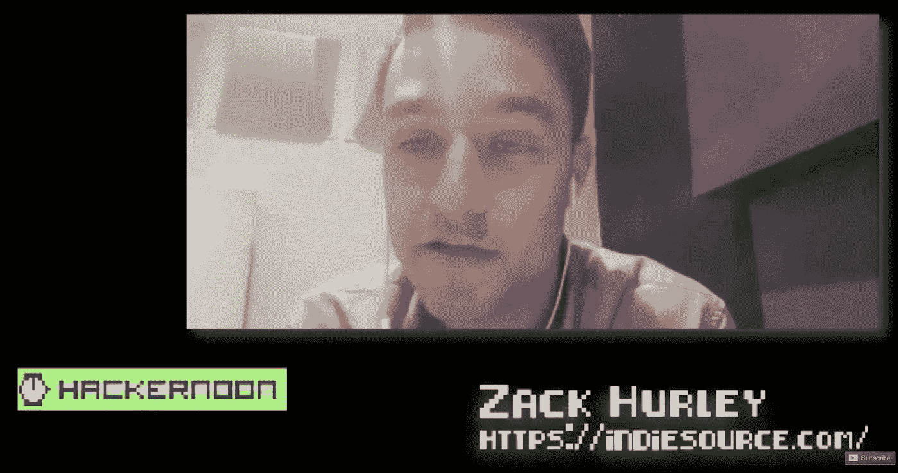

# 非技术型创始人访谈:与扎克·赫尔利一起克服冒名顶替综合症

> 原文：<https://medium.com/hackernoon/non-technical-founder-interview-overcoming-imposter-syndrome-with-zack-hurley-356d0b71785>

# [黑客午间播客](https://podcast.hackernoon.com/)第 54 集:采访扎克·赫尔利[独立资源](https://indiesource.com/)的联合创始人兼首席执行官，企业家，拥有在私营和公共部门工作的经验，涉及商业咨询、销售、营销战略和运营物流等领域。

## 在 [iTunes](https://podcasts.apple.com/us/podcast/hacker-noon-podcast/id1436233955) 或[谷歌播客](https://play.google.com/music/m/Dfuna5a4pzsmjr76bxabkxdrhim?t=Product_Iteration_with_Hacker_Noon_Interim_CTO_Dane_Lyons-Hacker_Noon_Podcast)上听采访，或在 [YouTube 上看。](https://www.youtube.com/watch?v=WVmOhq3pSY8)

在这一集[中，帕特里克·默里](https://hackernoon.com/@pmm621)采访了来自[独立来源](https://indiesource.com/)的[扎克·赫尔利](https://indiesource.com/portfolio/2-zach-hurley/)。你会发现如何成为一名成功的企业家，以及如何克服骗子综合症，同时建立一个新的企业。

"阅读《每周工作 4 小时》令我兴奋不已。"

“我终于明白，你不需要在一家公司呆上 10 年或 20 年，就能成为一名企业家，开创自己的事业。你刚刚颠覆了我所知道的关于科技的一切。我不用等了。” *—扎克·赫尔利*

 [## E54 -非技术性创始人访谈:与扎克·赫尔利一起克服冒名顶替综合症

### 黑客正午播客第 54 集:采访扎克·赫尔利独立资源的联合创始人兼首席执行官，企业家…

www.podbean.com](https://www.podbean.com/eu/pb-2gdep-b5c6bf) 

制作和音乐德里克·伯纳德—[https://haberdasherband.com/production](https://haberdasherband.com/production)

主持人:帕特里克·默里

*附:如果你喜欢新的* [*黑客午间播客*](http://podcast.hackernoon.com/) *，可以考虑在 iTunes 上给我们一个 5 星评价。*

## 还可以查看六月的[头条](https://hackernoon.com/archive/2019/06)、[最新报道](https://hackernoon.com/latest-tech-stories/home)、[今日首页](http://hackernoon.com/)。