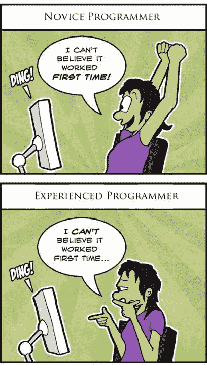

# NPM 包装验证。2

> 原文：<https://medium.com/hackernoon/npm-package-verification-ep-2-2b2ec66eb610>

## 最低可行包验证即服务(MVPVaaS)

# TL；速度三角形定位法(dead reckoning)

我构建了一个运行在云中的超级预 alpha 版本的 PVaaS(包验证即服务)。有一个 JSON 路由显示包的验证数据，还有一个 badge 路由给你一个 badge。

包裹可以验证吗？[https://api.verifynpm.com/v0/packages/tbv](https://api.verifynpm.com/v0/packages/tbv)

以前的版本？【https://api.verifynpm.com/v0/packages/tbv@0.3.0 号

徽章怎么样:【https://api.verifynpm.com/v0/packages/tbv/badge】T4

我怎么强调这一切的实验性都不为过！我不会对零版本 API 做任何突破性的改动，但是，我不能保证这个 API 是永久的。请随意修改它。所有的源代码都可以在 GitHub 上找到:[github.com/verifynpm](https://github.com/verifynpm)。

Photo by [Linh Nguyen](https://unsplash.com/photos/dTp7Kw51g0o?utm_source=unsplash&utm_medium=referral&utm_content=creditCopyText) on [Unsplash](https://unsplash.com/search/photos/neon-green?utm_source=unsplash&utm_medium=referral&utm_content=creditCopyText)

回溯一下，我今年的第一个轻率的项目是[验证 NPM 包的概念验证](https://hackernoon.com/what-if-we-could-verify-npm-packages-c2a319cff758)。我构建了一个名为 [TBV](https://www.npmjs.com/package/tbv) ( [信任但验证](https://en.wikipedia.org/wiki/Trust,_but_verify))的可全球安装的 NPM 包，让您检查包的内容是否可以从 GitHub 上的源代码一致地复制。

干净利落。

我收到了大量积极的反馈(耶社区！)绝大多数的回答都倾向于将验证结果以各种形式在网上公布，从回购徽章到 npmjs.com 的实际可见性。因此，为了追求“验证即服务”，我决定第一步是构建一个在云中运行 TBV 的 API。

算了吧。第一步是购买另一个域名。很明显。

因此，带着闪亮的新域名，为了追求“验证即服务”，我决定第二步是构建一个 API，在云中运行 TBV。

在我出发之前，我想为自己制定一些基本规则，这样我就可以在一个周末内让一些东西在云中运行。我没有完全达到那个目标(好吧，好吧，惨败)，但以下是我给自己定下的规则:

## CI/CD:

我个人的理念是，对于任何应用程序，你应该做的第一件事就是部署它。构建它是后来的事。这似乎违反直觉，但这种思维方式在两个方面节省了时间。首先，为“空应用程序”配置构建管道非常容易。我倾向于使用 TravisCI 和一个基本配置来构建一个“hello world”节点应用程序，并运行类似于 YAML 的 5 行代码的测试。随着应用程序的增长，您的构建配置也会随之增长。这比在应用程序进入叛逆期后试图强行加入构建过程要有效得多。第二，自动化节省时间，这是一点。我没有很多空闲时间，所以我需要所有我能得到的帮助。从一开始就实现自动化意味着我要对云进行更改所要做的就是将更改推送到 master。

## 无服务器

对于这个项目，Kubernetes 出局了。我真的认为容器化是 PaaS 的未来，但我也有亲身经历，知道 k8s 可以花一分钟来实现积极的 ROI。我曾经想过在数字海洋上建立一个小型的虚拟机，但是为部署建立一个 CI 系统以及配置一个数据库和某种类型的消息队列本身就像是一个周末项目。我可以利用的任何开箱即用的基础架构都将是一个福音。我看了一下 TravisCI，发现他们有 AWS Lambda 的部署配置。AWS DynamoDB 是一个东西，它有一个内置的流，用于修改更多的 Lambda 函数。售出。

## 规格优先 API

在构建基于网络的系统之前进行设计具有巨大的价值。Swagger(又名 OpenAPI Spec 2.0)是定义 API 的极好的 DSL。当满足规范时，我的 API 函数将被认为是“完成”的。

## 没有牦牛毛

尽可能地，我想[忽略那些有趣的干扰，专注于重要的事情](https://hackernoon.com/ignore-nifty-distractions-and-work-on-the-important-things-eed7df8755cb)。这意味着集中精力使核查路线尽快发挥作用。我知道让 TBV 图书馆在云中工作会有挑战，但我不知道挑战在哪里。用精益创业的话说，我想尽快开始验证假设。别给那头牦牛剃毛。

如果你还没有弄乱它，AWS 的无服务器应用模型(SAM)是相当光滑的。Lambda 非常直观，我能够非常快速地(大概几十分钟)获得一个内置在 Typescript 中的函数，并在云中运行。我面对的是用 Swagger 配置的 AWS API 网关。API 被配置为使用 Lambda 函数作为其实现。

我首先用 Swagger 设计了一条路线，定义了基本的验证响应、设计的标准错误、内容类型和其他基本的 API 样板文件。

接下来，我用一个“什么都不做”的 Lambda 函数实现了单个 API 路由。从一开始，我就设置 TravisCI 在我按下`master`时部署该功能。我推的第一个东西是一个简单的 hello world 函数。花了不到 30 分钟的时间就弄清楚了 AWS IAM 权限的事情，看了一眼 TravisCI 文档，然后让构建工作起来。自动化带来的速度是惊人的。我再重复一遍也不为过:先部署，后构建。

到周六午餐时，我已经定义了我的 API，配置了 API 网关，设置了用于部署 Lambda 函数的 CI/CD 管道，构建了一个“hello world”函数，并将 API 网关连接到我闪亮的新域名。我可以点击`https://api.verifynpm.com/v0/package/tbv`并得到一个实际的响应。

干净利落。

下午，我自学了一些 DynamoDB。TBV 可能需要一分钟左右时间来运行，尤其是在有准备或预打包脚本的情况下。等待 API 响应的时间太长了。为了支持更高的 API SLAs，我想使用一个主要的请求处理 Lambda 函数来删除队列上的验证，该验证将由另一个实际运行 TBV 的 Lambda 函数读取。

一旦包被验证一次，所有的消费者可以看到结果，这将直接从数据库中提取。有了这个队列，即使第一次调用也会返回亚秒级的响应时间。后续通话将揭示核查进展情况。

事实证明，DynamoDB 有一个内置的流来观察变化。我所要做的就是向数据库中写入一个带有包名/版本和“未知”状态的条目，然后另一个 Lambda 函数将被推入这个变更事件。

目标是有一个函数响应 API 流量，并确保为传入的请求编写 DDB 项，另一个函数在新的包从 DDB 流传入时运行 TBV。

这是第一天的结束。我有一个精心安排一切的计划，我有信心在周一早上工作之前我会有一个可用的 API 和一篇博客文章。

爱达荷（Idaho 的缩写）

曾经是。

不对。

第二天是“有趣”的开始。事实证明，AWS Lambda 非常擅长开箱即用地运行基本的节点功能。但是 TBV 必须同时执行`git`和`npm`才能工作。`git`用于从源代码控制中获取包源代码，`npm`用于安装依赖项并生成一个包来与发布的版本进行比较。

我的假设是运行`npm`将是微不足道的，因为 Lambda Node 8.10 运行时已经包含了它，并且运行`git`将是困难的，如果不是不可能的话。竞相验证假设的好处之一是我完全错了。

事实证明，在去年年底，AWS 推出了 Lambda 层，允许开发人员“从您的功能代码中单独打包和部署库、自定义运行时和其他依赖项。”你知道其他的依赖，比如 git。在这个功能上线 50 天左右的时间里，有人已经创建了我所需要的东西。谢谢，互联网！

 [## λ/git-λ层

### AWS Lambda 的一个层，允许您的函数使用“git”和“ssh”二进制文件

github.com](https://github.com/lambci/git-lambda-layer) 

此时，我以为我真的躲过了一劫。我开始在系统中运行像`express`这样非常流行的包的实时数据，我知道 verify。而且成功了。我干这行已经够久了，知道这么早就成功是可疑的。

[From somewhere online](https://www.google.com/search?q=novice+programmer+vs+experienced+programmer)

所以我开始尝试其他图书馆，比如，哦，TBV。

失败了。

这就是我开始走上牦牛剃毛第一条路的地方。TBV 的输出最初是为了便于阅读而优化的。然而，这意味着在 AWS 中查看日志输出是非常无用的。我在自己的机器上运行了与 Lambda 相同版本的 TBV，它在我的机器上运行正常。

我向 TBV 添加了详细日志记录，这样我就可以看到正在运行的命令的原始输出。

就这样，我开始了一系列不光彩的行为。

一旦我有了更好的日志可视性，我注意到`npm ci`失败了，因为命令不受支持。是的，AWS Lambda 上的 Node 8.10 运行`npm@5.6.x`，我至少需要`npm@5.7.0`才能运行`npm ci`。我差一个小版本就能运行分布式系统了。

首先，我尝试在 Lambda 上运行`npm install --global npm@latest`，但是失败了，因为 Lambda 函数对文件系统上除了`/tmp`之外的所有内容都是只读的。我预料到了，但是，嘿，试试也无妨。

接下来，我尝试安装`npm`作为我的函数的生产依赖项。让$PATH 包含 Node，我的 NPM 版本，但不包含正常安装的 NPM 版本被证明是困难的。无论如何，将`npm`作为生产依赖项安装似乎是错误的。

接下来，我开始钻研 NPM 的源代码，看看`ci`命令是如何工作的。如果实现起来很简单，那么也许我可以只克隆那些代码。开源，诸如此类，麻省理工学院许可证，诸如此类。我认为这将是超级复杂的，因此是一个徒劳的练习。没有。它只是使用了另一个名为`cipm`的库。(作为这个过程的一部分，我了解到 [NPM 经常通过引入外部库](https://github.com/zkat/cipm/issues/34)来引入新功能。)

部分成功？

接下来，我尝试安装`cipm`作为一个生产依赖。老实说，我忘了为什么这个尝试没有成功。我也觉得用不同的方法安装和建造比在野外使用的方法脏。讽刺的是，我被我试图保护的图书馆打败了，这让我很沮丧。

接下来，我试着看网飞。但是这不起作用，因为看电视不是编写有效软件的好方法。

星期天来了又走了。我很沮丧。无论如何，我从 TBV 得到的结果都是劣质的。我已经获得了一些有效的知识，但还没有交付我想要的产品。叹气。

因为我已经错过了我自己设定的最后期限，所以我决定撤退并疗伤。做一些治疗性的事情怎么样。就像创造另一个 NPM 套餐。

我采用了我目前拼凑的一些函数和运行时，为 yeoman 构建了银河系最棒的 Typescript AWS Lambda 生成器。

 [## 发电机-λ-ts

### 银河系最好的打字稿 AWS Lambda 生成器

www.npmjs.com](https://www.npmjs.com/package/generator-lambda-ts) 

这个项目成为我为这个项目构建的大多数 Lambda 函数的脚手架。我有点偏离“不刮牦牛毛”，但我认为这为我节省了一些时间。

接下来的几个晚上花在重建现在 TBV 处理包装比较。我学到了很多关于 tarballs 和 GZip 以及相关流的东西，我将在另一篇文章中阐述。最大的收获是，我最终没有像我在上一篇帖子中谈到的那样查看 shasum 包。相反，我计算了包中每个文件的 sha256，然后进行了比较

最终的结果是，我能够更好地了解*为什么*一个包没有通过验证，因为我现在可以看到在比较包时添加、修改和删除了什么文件。

我还开始尝试一个新的工作流/管道模型来运行验证子任务。它最终非常有前途，但我现在正在努力让它可靠地运行`npm ci`，所以它还没有推出。

最后，我确保 TBV 现在删除它创建的任何临时目录。事实证明，即使在两次调用之间，Lambda 函数也可能会耗尽磁盘空间。也许以后我会讲到这个。

我还意识到 Lambda 层也可以用来创建定制的运行时。我想详细介绍一下这是如何工作的，以及为什么你想尝试一下。不过，现在，让我们来看看我为用 Node 10.15 和 npm@6.7.0 构建自定义 AWS Lambda 运行时而想到的 repo:

 [## skonves/node-custom-runtime

### AWS Lambda 的自定义节点/NPM 运行时。通过在……上创建帐户，为 skonves/node-custom-runtime 开发做出贡献

github.com](https://github.com/skonves/node-custom-runtime) 

我在 [rrainn](https://rrainn.com/) 找到了另一个类似的定制运行时。然而，我可以让`npm`在他们的机器上运行。我利用他们的 javascript 位来让我的工作。

 [## rrainn/AWS-lambda-自定义节点-运行时

### 📦NPM 包-创建自定义节点. js AWS Lambda 运行时-rrainn/AWS-Lambda-custom-node-Runtime

github.com](https://github.com/rrainn/aws-lambda-custom-node-runtime) 

这是理解 Lambda 函数内部如何工作的一次奇妙的练习。这也是我第一次真正使用 docker 来实现构建过程。

又一个周末来了又走了，但我终于能够在 Lambda 跑 TBV 了。最后一步是构建最后一个服务徽章的函数。在这一点上，我只是从 [https://shields.io](https://shields.io) 返回自定义徽章。

老实说，在花了这么多时间学习香肠是如何制作的之后，我发现仅仅构建一个在标准运行时上运行的普通函数而不在幕后添加任何异国情调是非常令人耳目一新的。

我简单看了一下用 Gatsby 搭建一个基本的网站。那被证明是一座太远的桥。我最终会完成的。现在，我想把重点放在 API 上。

# 我需要你的帮助！

我认为下一步是让社区开始将 TBV 作为一个库和一个 API。我很有兴趣看看是什么打破了。(哦耶，要破了！)

如果有些事情看起来不对劲，请在 TBV 回购上打开一个问题:

 [## 验证 npm/tbv

### npm 的包装验证。在 GitHub 上创建一个帐户，为 verifynpm/tbv 开发做出贡献。

github.com](https://github.com/verifynpm/tbv) 

打开问题时，请使用`--verbose`选项在本地运行 TBV，并将输出包含在问题中。另外，请注意，您还可以在 docker 容器中运行 TBV。有关说明，请参见 repo 自述文件。

有想法或者评论？随意打开一个问题。

此外，如果你想卷起袖子，帮助编写代码，我将不胜荣幸！真的！要贡献，分叉回购并提交拉请求。

# 等等，还有更多！

这个项目我还没做完呢！我可能会休息几周，但我正在开发新的功能和博客文章。如果你不想错过更新，请点击“关注”

给这个帖子都一些👏如果你认为这是我应得的，别忘了去 GitHub 上验证 npm 和 [⭐明星⭐每个⭐单曲⭐回购⭐](https://github.com/verifynpm)