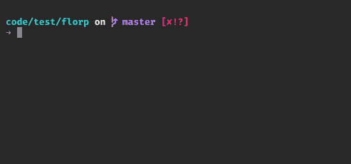
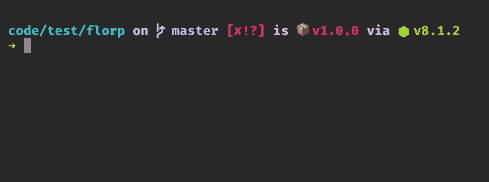

# npm 包运行程序 npx 简介

> 原文：<https://medium.com/hackernoon/npx-npm-package-runner-7f6683e4304a>


npm — package runner

如果您可以与节点模块交互并运行它们，而不需要将它们下载到本地，那会怎么样？如果你能直接运行 GitHub gist 的代码会怎么样？听起来不太可能？事实上是的。

在本文中，我们将讨论**npx(**package runner)——它是什么，我们为什么需要它，以及从命令行运行节点包时该工具有用的用例。

# 背景

**npm** (节点包管理器)这些年来有了很大的改进，为[开发者](https://www.microverse.org/)提供了一种全局和本地安装包的方式。有时候你需要检查一个包并尝试命令，或者你甚至想去掉`devDependencies`。从 **npm@5.2.0** 开始，npm 开始安装一个新的二进制文件，与通常的 npm 一起被称为 **npx。**

> `*npx*` *:* ***一个 npm 包运行程序——帮助执行包，而无需显式安装。***

`$ which npx`

如果由于某种原因它不可用，请按如下方式安装或更新它:

`$ npm install -g npx`

`npx`使安装和管理托管在 npm 注册表中的依赖关系变得容易。它简化了过程，并为可执行文件提供了更好的。

`$ npx <command> //command: package to be installed`

# 使用案例:

*   执行一次性命令
*   使用基于`gist`的脚本
*   使用不同版本的 npm 模块
*   如果您没有全局安装它的权限。

## 执行一次性命令:



Uses create-react-app execution to create a new app without installing in global

有时候你想尝试一些 CLI 工具，但如果只是运行一次就把它安装在全局(或本地)就很烦人了。npx 是解决这个问题的好方法。使用`npx <command>`启动包的执行。如果 **<命令>** 不在您的 **$PATH 中，npx** 将从 npm 注册表安装软件包并调用它。 **npx** 不会在全局中维护包，所以你不用担心污染你的全局。

像`create-react-app`这样的工具只是偶尔调用一次。如果你已经在你的全局中安装了这些，当你使用的时候，你可能已经过时了。您可能不得不在每次想要使用时运行 install。 **npx** 是解决这个问题的好办法。

## 执行基于要点的脚本:



gist execution

您可以使用[gist.github.com](https://gist.github.com/)来共享任何实用程序脚本，而不是创建 git 存储库。npx 可以考虑执行 npm 执行的任何说明符。您可以使用 npx 直接调用 gist。

> **确保在执行时通读 gists，因为如果脚本有一些恶意进程，它们可能会导致严重的问题。**

## 外壳自动回退:

当您在命令行中键入带有`@`的内容，但没有找到该命令时，您可以将 npx 配置为默认的回退命令。这包括安装在本地前缀中也找不到的软件包。

> 默认情况下，Mac OS X 运行 bash 版本< 4。因为 OS X 没有更新到 GPLV3 许可的 bash 的最新版本。这里是原因 [**为什么**](https://www.gnu.org/licenses/gpl-faq.html#Tivoization)

Zsh 是 bash 的替代品，可以和 OS X 一起使用。[**bash vs Zsh**](https://stackabuse.com/zsh-vs-bash/)**&**安装并制作 [**zsh**](https://rick.cogley.info/post/use-homebrew-zsh-instead-of-the-osx-default/) 作为你的默认 shell

安装后重新启动外壳。因为这是外壳更新后的第一次。， **zsh** 会要求几个初始设置。现在，您可以设置自动回退。

允许当前 shell 会话进行回退

`$ source <(npx --shell-auto-fallback <shell>)`

要永久安装，根据需要将`npx --shell-aut-fallback <shell>`添加到您的`~/.bashrc`、`~/.zshrc`、`~/.config/fish/config.fish`

`<shell>`:可以是 **zsh，bash (≥4)(或)fish**

```
$ mocha@4.1.0 --version
mocha@4.1.0 is not found. Trying with npx ...
npx: installed 24 in 2.243s
4.1.0
```

现在，你可以尝试安装任何像`$ npm run mocha@3.2`这样的包，它会尝试在项目级别找到 webpack，如果没有，它会自动退回到使用 **npx。**

egghead.io 里有[**npx**](https://egghead.io/courses/execute-npm-package-binaries-with-the-npx-package-runner)**的课程(有兴趣的话)**

## **结论**

**npx 帮助解决安装不必要的软件包只是为了浏览的问题。这是避免版本问题和依赖性问题的简单方法。就像我常说的，会有更多有趣的话题回来。干杯！**

**`**code** = **co**ffee + **de**veloper`**

**[](https://www.microverse.org)**